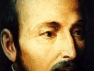

  
[Intangible Textual Heritage](../../index)  [Christianity](../index.md) 
[Index](index)  [Previous](seil76)  [Next](seil78.md) 

------------------------------------------------------------------------

[Buy this Book at
Amazon.com](https://www.amazon.com/exec/obidos/ASIN/B002B561B4/internetsacredte.md)

------------------------------------------------------------------------

  
*The Spiritual Exercises of St. Ignatius of Loyola*, \[1914\], at
Intangible Textual Heritage

------------------------------------------------------------------------

### OF THE ASCENSION OF CHRIST OUR LORD

Acts 1 \[1-12\].

**First Point.** First: After He appeared for the space of forty days to
the Apostles, giving many arguments and doing many signs, and speaking
of the kingdom of God, He bade them await in Jerusalem the Holy Ghost
promised.

**Second Point.** Second: He brought them out to Mt. Olivet, and in
their presence He was raised up and a cloud made Him disappear from
their eyes.

**Third Point.** Third: They looking to heaven, the Angels say to them:
"\`Men of Galilee, why stand you looking to heaven? This Jesus, Who is
taken from your eyes to heaven, shall so come as you saw Him go into
heaven.'"

------------------------------------------------------------------------

[Next: Rules for Perceiving the Movements Cause in the Soul](seil78.md)
