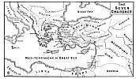

  
[Intangible Textual Heritage](../../index)  [Christianity](../index.md) 
[Revelation](../../bib/kjv/rev)  [Index](index)  [Previous](tbr006.md) 
[Next](tbr008.md) 

------------------------------------------------------------------------

# The Salutation.

Chap. 1:4-6.

"**JOHN** to the **Seven Churches which are in Asia**: Grace be unto
you, and peace, from **Him** which **Is**, and which **Was**, and which
**IS TO COME**; and from the '**Seven Spirits**' which are before **HIS
Throne**; and from **Jesus Christ** who is the **FAITHFUL WITNESS**, and
the **FIRST BEGOTTEN OF THE DEAD**, and the **PRINCE OF THE KINGS OF THE
EARTH**. Unto Him that **LOVED US** and **WASHED (Loosed) US** from our
sins in His own blood. And hath made us **KINGS** and **PRIESTS** unto
God and His Father; to Him be **glory** and **dominion** for ever and
ever. Amen."

The Salutation is addressed to the "**Seven Churches Which Are In
Asia**." By Asia is not meant the great Continent of Asia, or even the
whole of Asia Minor, but only the western end of Asia Minor bordering on
the Aegean and Mediterranean Seas, and about the size of the State of
Pennsylvania. Neither do these Seven Churches mean that there were only
seven churches in that district, for there were at least **three** other
churches, that of Colosse, Col. 1:2; Hierapolis, Col. 4:13; and Troas,
Acts 20:6-7. These seven Churches then must be representative or typical
churches, chosen for certain characteristics typical of the character of
the Church of Christ, not only in that day, but on down the centuries
until the Church shall be removed from the earth, and represent **seven
church periods** clearly defined in Church History. This we shall see,
in our study of chapters two and three, to be the case.

p. 5

 

[  
Click to enlarge](img/00500.jpg.md)  
Map: The Seven Churches  

 

p. 6

In the Benediction--"Grace be unto you, and peace, from Him which
**is**, and which **was**, and which **is to come**; and from the Seven
Spirits which are before His Throne; and from Jesus Christ, who is the
Faithful Witness, etc.," we behold the Trinity. Here Jesus is
distinguished from--"**HIM** (the Father) which **Is**, and which
**Was**, and which **Is To Come**," but in verse 8, He claims the same
Title, which only proves that Jesus was God manifest in the flesh, and
that He and the Father are **one**.

It is also worthy of note that the "Threefold Office" of Jesus, as
**PROPHET**, **PRIEST**, and **KING** is brought out in the Salutation.
He is called the "**Faithful Witness**," as such he is a **PROPHET**. As
the "**First Begotten From The Dead**," He carried His own blood into
the Heavenly Tabernacle, and thus performed the work of a **PRIEST**. As
the "**Prince Of The Kings Of The Earth**," as He will be when He takes
the Throne, He will be a **KING**. As **Prophet** Jesus is God's
**WORD**, as **Priest** He is God's **LAMB**, and as **King** He is
God's **LION**.

John also emphasizes the fact that Jesus **LOVED** us **before** He
**WASHED** (Loosed) us from our sins in His own blood, and that He has
made us "Kings" and "Priests" unto God, and that we need no human Priest
to stand between us and God.

------------------------------------------------------------------------

[Next: The Announcement](tbr008.md)
