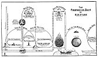

  
[Intangible Textual Heritage](../../index)  [Christianity](../index.md) 
[Revelation](../../bib/kjv/rev)  [Index](index)  [Previous](tbr008.md) 
[Next](tbr010.md) 

------------------------------------------------------------------------

p. 7 p. 8

# I. The Things Which Thou Hast Seen

### THE VISION.

"I John, who also am your **brother**, and **companion in tribulation**,
and in the Kingdom and patience of Jesus Christ, was in the Isle that is
called Patmos, for the word of God, and for the testimony of Jesus
Christ. I was **in the SPIRIT** on the **LORD'S DAY**, and heard behind
me a **great voice**, as of a **Trumpet**, saying, I am **ALPHA** and
**OMEGA**, the **FIRST** and the **LAST**: and, What thou **SEEST, write
in a book**, and send it unto the Seven Churches which are in Asia; unto
Ephesus, and unto Smyrna, and unto Pergamos, and unto Thyatira, and unto
Sardis, and unto Philadelphia, and unto Laodicea. And I turned
[to](errata.htm#0.md) see the voice that spake with me. And being turned, I
saw

**SEVEN GOLDEN CANDLESTICKS**;

and in the midst of the Seven Candlesticks one like unto the

**SON OF MAN**,

clothed with a garment down to the foot, and girt about the paps
(breast) with a **golden girdle**. His **Head** and his **Hairs** were
**white like wool**, as **white as snow**; and His **Eyes** were as a
**flame of fire**; and His **Feet like unto fine brass, as if they
burned in a furnace**; and His **Voice** as the **sound of many
waters**. And He had in His **Right Hand** "**Seven Stars**"; and out of
His **Mouth** went a **sharp two edged Sword**; and His **Countenance**
was as the **sun shineth in his strength**. And when I saw Him, I fell
at His feet as dead. And He **laid His Right Hand upon me**, saying unto
me, "Fear not; I am the **FIRST** and the **LAST**: I am He that
**LIVETH**, and **WAS DEAD**; and behold, I am **ALIVE FOR EVERMORE,
AMEN**; and have the **KEYS** of **HELL** (Hades, the Underworld), and
of **DEATH** (the Grave). Write the things which thou hast **SEEN**, and
the things which **ARE**, and the things which shall be **HEREAFTER**
(after these); the **Mystery** of the '**Seven Stars**' which thou
sawest in my right hand, and the '**Seven Golden Candlesticks**.' The
'**Seven Stars**' are the **ANGELS** (Messengers) of the 'Seven
Churches': and the '**Seven Candlesticks**' which thou sawest are the
**SEVEN CHURCHES**."

Rev. 1:9-20.

 

The Apostle John addresses the Churches as their **brother** and
**companion** in **TRIBULATION**. This does not mean "**The Great
Tribulation**," for that is not for the Church but for Israel, and is
still **future**. When John wrote the Book of Revelation in A. D. 95-96
the Christians were undergoing a persecution under the Roman Emperor
Domitian, and as a result of this persecution John had been banished to
the Isle of Patmos, a small, rocky island in the Aegean Sea 30 miles off
the west coast of Asia Minor, and opposite the city of Ephesus. John was
pastor of the Church at Ephesus at the time of his banishment, and it
was to that Church that the first Message to the Seven Churches was
addressed. John was banished for "the Word of God, and his testimony to
Jesus Christ."

He tells us that he was "in the **Spirit** on the **LORD'S DAY**." There
has been much confusion as to what is meant here by the "**Lord's
Day**." Some hold that the "First Day of the Week" or the Christian
Sabbath is meant, others that John meant the "**Day of the Lord**."

Both the Old and the New Testament speak of the "**Day of the Lord**."
Isa. 2:12, Joel 1:15, 2:1, 3:14, Ezek. 13:5, Malachi 4:5, Acts 2:20, 2.
Cor. 1:14, 1. Thess. 5:2, 2. Pet. 3:10. The term applies

p. 9

to the "Day of the Lord's Return" and includes both the Tribulation and
the Millennium. See the Chart on the Prophetic Days of Scripture. The
Christian Sabbath was never called the "**LORD'S DAY**" until **after**
the Book of Revelation was written and got its name from that source. It
is always called in the Gospels and Epistles the "**First Day of the
Week**."

It is hardly likely that John could have been caught up as Paul was into
the Third Heaven and seen and heard all that he describes in the Book of
Revelation on **one** Sabbath Day, and as the Book from chapter 5 is a
description of the things that are to come to pass in the "**DAY OF THE
LORD**," what better understanding of the "**LORD'S DAY**" can we have
than that John was projected by the Holy Spirit across the centuries
into the "**DAY OF THE LORD**" and had **visualized** to him the things
that shall come to pass in that day. This is the rational solution of
the question. See the Chart, John's Patmos Vision.

When John thus found himself in the "Day of the Lord" he heard behind
him a great voice, as of a **trumpet**, which said--"I am **Alpha** and
**Omega**, the **First** and the **Last**," and the repetition of the
statement in verses 17 and 18, with the added words--"I am He that
**Liveth**, and **WAS DEAD**; and behold, I am **ALIVE FOR EVERMORE,
AMEN**; and have the keys of Hell (Hades, the Underworld), and of Death
(the Grave)," identifies the speaker as the Lord Jesus Christ Himself.
John had his back turned to the speaker, and when he turned around he
saw one like unto the

**SON OF MAN**

standing in the midst of "**Seven Candlesticks**." "**LAMPSTANDS**" is a
better translation and is so given in the margin of our Bibles. A
candlestick requires a light such as a candle, which is self-consuming,
while a "**Lampstand**" is for the support of a lamp whose wick instead
of burning away is fed from the oil within. In the Scriptures oil is
emblematic of the Holy Spirit, and as Jesus Himself interprets the
"**Lampstands**" as meaning the Seven Churches to whom He was about to
send messages, we see that Jesus looks upon the churches as not the
**LIGHT**, but simply the "**LIGHT HOLDER**." From the fact that Jesus
speaks of "**Stars**" and "**Lampstands**" it is clear that we are
living in the NIGHT of this Dispensation, for "stars" and "lampstands"
belong to the night.

**THE VISION OF THE GLORIFIED SON OF MAN**.

The Vision that John saw was that of the **GLORIFIED "SON OF MAN."**
When Jesus ascended He took up with Him His **HUMANITY**, and we now
have in the Glory the **MAN Christ Jesus**. 1. Tim. 2:5. When Jesus was
on the earth He was, as the "**Son of Man**," a **PROPHET**, now as the
"**Son of Man**" in Glory He is a Priest, and when He comes again it
will be as the "**Son of Man**" to reign as **KING**.

While Jesus is now a High Priest in heaven, John did not see Him engaged
in any High Priestly work. While He was clothed in a High Priestly robe,
there was no mitre upon His head, nor

p. 10

 

[  
Click to enlarge](img/01000.jpg.md)  
The Prophetic Days of Scripture  

 

p. 11

\[paragraph continues\] Kingly Crown. The description of Him is more
that of a **JUDGE**. This is confirmatory evidence that John was
transported into the "Day of the Lord," and that his vision of Christ is
as Christ shall appear after His High Priestly work is finished and
before He assumes His Kingly Office. This is seen in that He was girded
about the breasts, and not around the waist. The High Priest was girded
around the waist, signifying service, but a girdle or sash over the
shoulder and around the breasts is an insignia of the Magisterial
Office. This is still further revealed when we study the

**SEVENFOLD GLORY OF HIS PERSON**.

### 1. HIS "HEAD AND HIS HAIR."

His "**Head**" and "**Hair**" were "**WHITE LIKE WOOL**," as "**WHITE AS
SNOW**." Here there is a correspondence to the "Snow White Wig" worn by
English judges. This description of Christ reminds us of Daniel's vision
of the "**ANCIENT OF DAYS**," "whose garment was white as snow, and the
**hair of his head** like the **PURE WOOL**." Dan. 7:9. Daniel refers
three times to the "Ancient Of Days." In Chap. 7:13, he distinguishes
between the "Son of Man" and the "Ancient of Days," but in verses 9 and
22 he associates the "Ancient of Days" with a "Throne of Judgment," and
as God the Father has committed all judgment to the Son (John 5:22), and
the Father and the Son are one, the title "Ancient Of Days" is used
interchangeably. And as the title "Ancient of Days" is applied to the
"Son of Man" (Christ) at the time He assumes the Judgeship (Dan.
7:9-10), which is not until after the Rapture of the Church, we have
here additional corroborative proof that John's Vision belongs to the
"Day of the Lord." The "White Hair" of the Son of Man refers to His
**ANTIQUITY**, to His patriarchal dignity, not that His hair was made
white by age, for the Eternal never grows old, but it bespeaks wisdom
and experience, and the venerableness of His character.

### 2. HIS EYES.

'"His **Eyes** were a **FLAME OF FIRE**." Those eyes that had often been
dimmed with human tears, and that wept at the grave of Lazarus, are here
pictured as burning with an "**OMNISCIENT FLAME**." How often when on
the earth those eyes read the inner-most thoughts of men, and even
soldiers quailed before His soul penetrating gaze, so when He sits as
the Judge of men all things will be **NAKED** and **OPEN** before Him.

### 3. HIS FEET.

"His **Feet** like unto fine **BRASS**, as if they **BURNED IN A
FURNACE**." In that day those feet that trod the Via Dolorosa of
suffering will be like unto **INCANDESCENT BRASS**, that shall tread and
crush Antichrist and Satan when He comes to "Tread the **WINE-PRESS** of
the **fierceness** and **wrath** of Almighty God." Rev. 19:15.

### 4. HIS VOICE.

"His **Voice** as the **SOUND OF MANY WATERS**." There is nothing more
melodious or musical than the babbling brook, or more

p. 12

thunderous than the rush of the cataract over the falls, and there is
nothing more fearful to the criminal than the words of the Judge as he
passes sentence; but how terrifying will be the sentence when with a
strong voice the Son of Man shall say in the Judgment Day, "Depart from
me, ye cursed, into everlasting fire, prepared for the Devil and his
angels." Matt. 25:41.

### 5. HIS HAND.

"In His **Right Hand SEVEN STARS**."

We are told in verse 20, that the "**Seven Stars**" stand for the
"**ANGELS**" of the "Seven Churches." These "Angels" are not angelic
beings but the Messengers or Ministers of the churches. What a beautiful
and solemn lesson is taught here. It is that the ministers of Christ
derive their power and office from Him, and that He holds them in His
hand. If they are false to Him, no one can deliver them from His power,
and if they are true and loyal, no one can touch or molest, or do them
harm.

### 6. HIS MOUTH.

"Out of His **Mouth** went a **SHARP TWO-EDGED SWORD**." While the
"Sword of the Spirit" is the "Word of God" (Eph. 6:17), and the "Word of
God" is quick, and powerful, and sharper than any **TWO-EDGED SWORD**,
piercing even to the dividing asunder of soul and spirit, and of the
joints and marrow (the body), (Heb. 4:12), that is not the sword meant
here.

The "Sword of the Spirit" is the **Holy Spirit's SWORD**, and He alone
wields it. The sword meant here is the **Sword** of the Son of Man
(Christ), and it is the "**SWORD OF JUSTICE**," for the Son of Man, out
of whose mouth this sword comes, is the "White Horse Rider" of Rev.
19:11-15, "out of whose mouth goeth a **SHARP SWORD**, that with it He
should smite the nations." And that sword, like the "Sword of the
Spirit" will be **TWO-EDGED** also, for the protection of His people,
and the destruction of His enemies. This is still further proof that
John's vision of Christ was as He shall appear in the "**DAY OF THE
LORD**."

### 7. HIS COUNTENANCE.

"His Countenance was as the **SUN SHINETH IN HIS STRENGTH**." This
recalls to our memory His appearance on the Mount of Transfiguration
when "His **Face** did shine **AS THE SUN**," Matt. 17:2. And we read of
the New Jerusalem that the inhabitants thereof have no need of the
**SUN**, for the **LAMB is the Light thereof**. Rev. 21:23. And when we
recall that the Prophet Malachi tells us that when Jesus comes back He
will be the **SUN OF RIGHTEOUSNESS** (Malachi 4:2), we see that John's
vision of the Son of Man was as He shall appear at the Second Stage of
His Return, the "Revelation." Thus we have in John's "Seven-Fold"
description of the **person** of the "Glorified Son of Man"
circumstantial or indirect evidence that John saw his vision of the Son
of Man, not on a Sabbath Day (or the "Lord's Day" as we now call it),
but was projected by the Holy Spirit forward into the "**Day of the
Lord**" and saw Him as He will appear then as the **Judge**, and the
coming "**SUN OF RIGHTEOUSNESS**."

------------------------------------------------------------------------

[Next: The ''Key'' to the Book](tbr010.md)
