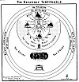
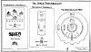

  
[Intangible Textual Heritage](../../index)  [Christianity](../index.md) 
[Revelation](../../bib/kjv/rev)  [Index](index)  [Previous](tbr020.md) 
[Next](tbr022.md) 

------------------------------------------------------------------------

### 2. THE HEAVENLY THRONE.

Rev. 4:2-3, 5-6.

"And immediately I was in the **SPIRIT**: and, behold, a **THRONE** was
set in Heaven, and **ONE** sat on the **THRONE**. And **HE** that sat
was to look upon like a **Jasper** and a **Sardius** stone: and there
was a **Rainbow** round about the **THRONE**, in sight like unto an
**Emerald**. . . . And out of the **THRONE** proceeded **Lightnings**
and **Thunderings** and **Voices**; and there were **Seven Lamps of
Fire** burning before the **THRONE**, which are the **SEVEN SPIRITS OF
GOD**. And before the **THRONE** there was a **Sea of Glass** like unto
**crystal**."

The first thing John saw in Heaven was a **THRONE**. The **Throne** was
not vacant, but **One** sat upon it, upon whom to look was like looking
at glistening gems, such as Jasper and Sardius. The occupant of the
**Throne** was no other than God Himself. In Rev. 21:10-11, John in
describing the New Jerusalem says, that its light is the "**GLORY OF
GOD**." A light like unto a stone most precious, even like a **JASPER**
stone, clear as crystal. This corresponds with John's declaration in 1.
John 1:5, that "**GOD IS LIGHT**."

Ezekiel in describing his vision of the "Throne of God" says--"Above the
Firmament that was over their heads was the **likeness of a Throne**, as
the appearance of a **Sapphire Stone**: and upon the **likeness of the
Throne** was the likeness as the appearance of a **MAN** above upon it.
And I saw as the **color of Amber**, as the appearance of **fire** round
about within it, from the appearance of His loins even upward, and from
the appearance of His loins even downward, I saw as it were the
appearance of **fire**, and it had **brightness round about**. As the
appearance of the **Bow that is in the cloud in the day of rain**, so
was the appearance of the brightness round about. This was the
appearance of the **likeness** of the **GLORY OF THE LORD**." Ez.
1:26-28.

Now there are two things in Ezekiel's Vision that correspond with John's
Vision of the "**THRONE OF GOD**." First that the form of the one who
sat on the Throne could not be clearly distinguished or described, but
that it was **RESPLENDENT WITH LIGHT**, which veiled the form or person;
and secondly, that there was a **RAINBOW ROUND ABOUT THE THRONE**. The
person of God then, as He sits upon His Throne, is veiled in a Glory
that can only be compared to the shining of some beautiful gem. But one
of the remarkable things about the Throne of. God is, that it is
surrounded

p. 35

by a "**RAINBOW**" that is **emerald** in color. The first mention we
have in the Bible of a Rainbow is in Gen. 9:13-17. "I do set My **BOW**
in the cloud, and it shall be for a **token of a COVENANT** between
**Me** and the **Earth**." A Covenant that God would not destroy this
earth again by a Flood. But that Rainbow was only **SEMI-CIRCULAR**,
such as we see in the heavens in summer after a shower; but the Rainbow
Ezekiel and John saw around the Throne of God was **CIRCULAR**. In this
world we only see half a Rainbow, or the **half of things**, in Heaven
we shall see the **whole** of things. The Rainbow is the sign of a
Covenant based on an accepted Sacrifice, the Sacrifice of Noah (Gen.
8:20-22), and the Rainbow about the Throne of God is the sign of a
Covenant based on the accepted Sacrifice of Christ on the Cross. The
difference between Noah's Rainbow and the one around the Throne of God
is, that Noah's is composed of the seven primary colors, Red, Orange,
Yellow, Green, Blue, Indigo, and Violet, while the one around the Throne
of God is **EMERALD**. What does this "**CIRCULAR GREEN RAINBOW**" about
the Throne of God signify? It signifies that God is a Covenant keeping
God, that His promises as to this earth shall be fulfilled. Even though
He is about to bring great judgments upon it, He will not destroy it,
but it shall pass through those judgments safely. He will redeem it, and
bless it, until its hills, and valleys, and plains, shall teem with the
green verdure, fruitful orchards, and bountiful vineyards of the long
Millennial Day that is to follow those judgments. If the Rainbow did not
encircle the Throne as a "Halo," it might by its reflection in the "Sea
of Glass" appear to John to be round.

The "Throne" was not the "Throne of Grace" for out of it proceeded
**lightnings** and **thunderings** and **voices**, that remind us of Mt.
Sinai, and proclaim it to be the

"**THRONE OF JUDGMENT**."

Before the Throne was a "**SEA OF GLASS**." This "Sea of Glass" was
unoccupied, but later is seen mixed with **fire** (Rev. 15:2-3), and
occupied by martyrs of the Tribulation Period who get the victory over
the **Beast**, and who have **harps**, and sing the Song of **MOSES AND
THE LAMB**. This "Glassy Sea" reminds us of the "Brazen Sea" that stood
before Solomon's Temple (1. Kings 7:23-45), and thus was in front of the
Ark of the Covenant, the "Mercy Seat" of which was the earthly Throne of
God in Old Testament days.

Right here it might be well for us to remember that the earthly
Tabernacle erected by Moses, with all its vessels and instruments of
service and mode of worship, was **patterned** after the "Heavenly
Tabernacle." Heb. 9:23.

A knowledge then of the Tabernacle and its various parts and vessels of
service, will help us to understand John's Vision of the "Heavenly
Tabernacle." Like John, Paul was "caught up" into Heaven, and saw the
"Heavenly Tabernacle," and he most beautifully and clearly makes a
comparison between it and the "Mosaic Tabernacle" in his Letter to the
Hebrews.

The "Throne" that John saw in Heaven corresponds with the "Mercy Seat"
of the Ark of the Covenant. The "Four Beasts (Living

p. 36

\[paragraph continues\] Ones)" with the "Cherubim" that guarded the
"Mercy Seat." The "Four and Twenty Elders" with the "Priestly Courses"
that officiated in the Tabernacle. The "Seven Lamps (Spirits)" before
the "Throne," with the "Seven Branched Candlestick" of the Holy Place of
the Tabernacle. The "Sea of Glass" with the "Brazen Laver" for
cleansing, that stood in front of the Tabernacle. The "Altar" under
which John saw the "soul of Martyrs" with the "Altar of Burnt Offering."
If the "Throne" section of the "Heavenly Tabernacle" corresponds with
the "Most Holy Place" of the "Mosaic Tabernacle," and the "Four and
Twenty Elder" section with the "Altar of Incense" and "Seven Lamps of
Fire" corresponds with the "Holy Place," then the "Sea of Glass" and the
"Altar" should correspond with the "Court" of the Tabernacle. This will
help us to relatively locate what John saw in the Heavenly Tabernacle.

It is also profitable and instructive to compare the "Heavenly" and
"Earthly" Tabernacles with the "Tabernacle of Man." See the Chart of
"The Three Tabernacles." Here we see that the "Spirit"

 

[  
Click to enlarge](img/03600.jpg.md)  
The Heavenly Tabernacle  

 

p. 37

 

[  
Click to enlarge](img/03700.jpg.md)  
The Three Tabernacles  

 

p. 38

part of man corresponds to the "Most Holy Place" of the Tabernacle, the
"Soulish" part to the "Holy Place," and the "Body" part to the "Outer
Court." As the only entrance from the "Holy Place" into the "Most Holy
Place" of the Tabernacle was through the "Veil," so the only entrance
from the "Soulish" part of man into the "Spirit" part is through the
"Gate of the Will." And it is only when the "Will" surrenders to the
Holy Spirit that God can take up His abode in the "Spirit" part of man,
as He took up His residence in the "Most Holy Place" of the Tabernacle
on the "Mercy Seat," and man become a regenerated soul.

------------------------------------------------------------------------

[Next: 3. The Four and Twenty Elders](tbr022.md)
