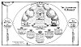

  
[Intangible Textual Heritage](../../index)  [Christianity](../index.md) 
[Revelation](../../bib/kjv/rev)  [Index](index)  [Previous](tbr021.md) 
[Next](tbr023.md) 

------------------------------------------------------------------------

### 3. THE FOUR AND TWENTY ELDERS.

Rev. 4:4.

"And round about the Throne were **Four and Twenty Seats** (Thrones):
and upon the Seats I saw **Four and Twenty Elders** sitting, **clothed
in white raiment**; and they had on their heads **Crowns of Gold**."

Who are these "**Elders**" and what do they represent? They are not a
heavenly and unfallen order of beings, like the angels or "Living
Creatures" that surround the Throne, they are the representatives of
**redeemed mankind**. The name Elder is never applied to angels, neither
do angels have "**crowns**" and sit on "**thrones**." Only **redeemed
MEN** are promised "**Thrones**" and **Crowns**." Matt. 19:28. Rev.
3:21. Rev. 20:4. Rev. 2.10. 1. Pet. 5:2-4. 2. Tim. 4:8. These "Elders"
then must be representatives of the Old and New Testament Saints, that
have been redeemed by the **BLOOD OF CHRIST**. This will be made more
clear as we consider their **position**, **dress**, and **song**.

They are seated on "**thrones**," not ordinary seats, and remind us of
Daniel's Vision of the Judgment.

"I beheld till **THRONES** were placed and **ONE** that was **ANCIENT OF
DAYS** did sit; His raiment was **white as snow**, and the hair of His
head like **pure wool**; His Throne was **fiery flames**, the wheels
thereof **burning fire**. A **fiery stream** issued and came forth from
before Him, thousand thousands ministered unto Him, and **10,000** times
**10,000** stood before Him; the **JUDGMENT** was set, and the
'**Books**' were opened." Dan. 7:9-10 R. V.

This is Daniel's foreview of the

"**JUDGMENT SEAT OF CHRIST**."

While the "Thrones" were **placed** (ready for those who should be found
worthy to occupy them) they were as yet unoccupied. Their occupancy
awaited the outcome of the Judgment. Now as the "Thrones" that John saw
were occupied by **crowned** Elders. Then those Elders must have passed
the "**fiery test**" of the Judgment of Reward (2. Cor. 5:10, 1. Cor.
3:11-15), and received their **crowns**. Those Crowns are five in
number. The "Incorruptible Crown." 1. Cor. 9:25-27. The "Crown of Life."
Rev. 2:10. The "Crown of Glory." 1. Pet. 5:2-4. The "Crown of
Righteousness." 2. Tim. 4:8. The "Crown of Rejoicing." 1. Thess.
2:19-20. See the Chart--"Judgment of Reward."

That these "Elders" were **REDEEMED MEN** is further evidenced by the
"**Song**" they sung.

p. 39

 

[  
Click to enlarge](img/03900.jpg.md)  
The Judgment of ''Reward''  

 

p. 40

"And they sung a **NEW SONG**, Saying, Thou art worthy to take the Book,
and to open the Seals thereof, for thou wast slain, and hast **REDEEMED
US TO GOD BY THY BLOOD**, out of every **kindred**, and **tongue**, and
**people**, and nation; and hast made us unto our God **KINGS** and
**PRIESTS**; and we shall **reign on the earth**." Rev. 5:9-10.

Now this could not be said of angels, or any other created heavenly
beings, for they have not been redeemed by the Blood of the Lamb, nor
are they to be "Kings" and "Priests" on the earth.

While the "Elders" sit on Thrones and wear Crowns, they are not dressed
in royal robes but in "white raiment," the garment of a Priest. They are
the members of a "**ROYAL PRIESTHOOD**." 1. Pet. 2:9. That the time has
not yet come for them to reign is clear, for they are engaged in
Priestly duties, having "Golden Vials full of odors, which are the
**prayers of saints**," in their hands. Rev. 5:8. These saints are not
the saints of the Church, but the Jewish saints on earth during the
"Tribulation Period," whose prayers are so beautifully prewritten in the
Psalms.

That the "Elders" will be given the right of Judgment is clear. Writing
to the Corinthians Paul says--"Do ye not know that the **Saints** shall
**JUDGE THE WORLD**. . . . Know ye not that **We** shall **JUDGE
ANGELS**." (The Fallen Angels.) 1. Cor. 6:2-3. The time when this right
of Judgment is conferred on the "Elders" (Saints) is given by John as
after the binding of Satan, and just before the Millennium--"I saw
**THRONES**, and they (the First Resurrection Saints--**THE ELDERS**)
sat upon them, and **JUDGMENT** was given unto them." Rev. 20:4.

The word "Elder" in the majority of places where it is used in the
Scriptures means the **representative head** of a city, family, tribe or
nation, so the "Four and Twenty Elders" are representative of the
redeemed human race. But why **24 Elders**? Twenty-four is the number of
the Priestly Courses as given in 1. Chron. 24:1-19. When David
distributed the Priests into "Courses" he found there were **24 Heads**
of the Priestly families, and these 24 Heads he made **representative**
of the **WHOLE PRIESTHOOD**. As the "Elders" are representative of both
the Old and New Testament Saints, and the Old Testament Saints are
represented by the Twelve Tribes of Israel, and the New Testament
Saints' by the Twelve Apostles of the Lamb, they together make up 24
representative characters. This distinction is clearly brought out in
the description of the New Jerusalem, where the 12 Foundation Stones are
named after the Twelve Apostles of the Lamb, and the 12 Gates after the
Twelve Tribes of Israel. Rev. 21:10-14.

While the Four and Twenty Elders are representative of the Old and New
Testament Saints, they do not, as a whole, represent the Church, for the
Church is composed only of New Testament Saints. The Old Testament
saints are merely the Friends of the Bridegroom. But the fact that the
New Testament Saints, as represented by the Twelve Apostles, are
required to make up the 24 representative characters (Elders), is
additional evidence that the Rapture of the Church takes place before
the Tribulation.

------------------------------------------------------------------------

[Next: 4. The Four Beasts](tbr023.md)
