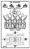

  
[Intangible Textual Heritage](../../index)  [Christianity](../index) 
[Revelation](../../bib/kjv/rev)  [Index](index)  [Previous](tbr022) 
[Next](tbr024) 

------------------------------------------------------------------------

p. 41

### 4. THE FOUR BEASTS.

Rev. 4:6-11.

"In the midst of the Throne, and round about the Throne, were **FOUR
BEASTS full of eyes before and behind**. And the **First Beast** was
like a **LION**, and the **Second Beast** like a **CALF**, and the
**Third Beast** had a face as a **MAN**, and the **Fourth Beast** was
like a **FLYING EAGLE**. And the four Beasts had each of them **six
wings** about him; and they were full of **eyes within**; and they rest
not day or night, saying, **HOLY, HOLY, HOLY, LORD GOD ALMIGHTY, WHICH
WAS, AND IS, AND IS TO COME**."

The word translated "Beasts" should be translated "**LIVING
CREATURES**," as in the Revised Version. The word here translated
"beast" (**Zoon**), is not the same as the one translated "beast"
(Therion) in chapters eleven, thirteen, and seventeen. The word here
used means a "living being" or "creature," while the word used in
chapters eleven, thirteen, and seventeen, means a **wild, untamed
animal**. They are not angelic beings, for they are distinguished from
the angels, who are mentioned as a class by themselves in Rev. 5:11.
Neither are they representative of redeemed human beings, for they do
not join in the Redemption Song. Rev. 5:8-10. The word "they" in this
passage does not refer to the "Four Living Creatures," but to the "Four
and Twenty Elders."

The "Four Living Creatures" are not in the same class with the "Elders,"
for they have no "thrones" or "crowns" or "harps" or "golden vials."
They are the "Guardians" of the Throne of God, and accompany it wherever
it goes. Ez. 1:24-28. They are **four in number**, which is the "**earth
number**," and therefore have something to do with the earth. That is,
they are interested in the "**re-genesis**" of the earth to its former
glory before the Fall. They have eyes **before** and **behind** and
**within**, which reveals their intelligence and spiritual insight of
things past, present, and to come, and they are tireless in their
service, for they rest not day nor night, saying, "**Holy, Holy, Holy,
Lord God Almighty, which was, and is, and is to come**."

The first time these "Living Creatures" are mentioned in the Bible is in
Gen. 3:24, where they are called "**CHERUBIM**," but are not described.
They were placed at the entrance to the "Garden of Eden" to prevent the
re-entrance of Adam and Eve, and to keep the way of the "Tree of Life."
It would appear as if at the place where they were stationed there was a
Tabernacle, a place of worship to which Cain and Abel resorted to make
their offerings, and that it was from there that Cain went out from the
"**PRESENCE OF THE LORD**." Gen. 4:16.

When Moses was given on the Holy Mount the pattern of the Tabernacle, he
was instructed to make the "Ark of the Covenant" with two Cherubim upon
it. Ex. 25:10-22. These Cherubim were guardians of the "Mercy Seat," or
the place of God's **PRESENCE** when He in His "Shekinah Glory" visited
the Tabernacle. But it is not until Ezekiel had his vision of the
Cherubim (Ez. 1:1-28; 10:1-22), that we have a description of what they
are like. See the the next page.

p. 42

 

[  
Click to enlarge](img/04200.jpg)  
The Cherubim  

 

p. 43

Ezekiel describes them as having the likeness of a man, with 4
**faces**, and 4 **wings**, and feet like a **calf's foot**, and hands
like a **man's hand** under their wings on their 4 sides. Their 4 faces
were different. The front face was that of a **MAN**, the right side
face was that of a **LION**, the left side face was that of an **OX**,
and the rear face was that of an **EAGLE**, and their whole body, back,
hands, and wings, were full of eyes round about. Ez. 10:12. In John's
Vision of the "Cherubim" or "Living Creatures" they are described as
like animals, the first was like a **LION**, the second like a **CALF**,
or a young Ox, the third had the **face** of a **MAN**, and the fourth
was like a **FLYING EAGLE**. John's "Living Creatures" had **6** wings,
while Ezekiel's "Cherubim" had only 4. In Ezekiel's vision, the
"Cherubim," or "Living Creatures," were accompanied by the Holy Spirit
(Ez. 1:12) and traveled on wheels, which shows that they were on some
tour or mission, attended by the Lord, who sat on His Throne over their
heads (Ez. 1:25-28), but the **wheels** are absent in John's vision, for
the scene is in Heaven, the permanent home of the Throne of God.

In the camping and marching order of Israel in the Wilderness, there was
a fixed relation of the Twelve Tribes to the Tabernacle. In camp the
Tabernacle rested in the middle. The Camp of Judah, composed of 3
Tribes, rested on the East, with its Standard bearing the figure of a
**LION**. The Camp of Ephraim, composed of 3 Tribes, rested on the West,
with its Standard bearing the figure of an **OX**. The Camp of Reuben,
composed of 3 Tribes, rested on the South, with its Standard bearing the
figure of a **MAN**. The Camp of Dan, composed of 3 Tribes, rested on
the North, with its Standard bearing the figure of an **EAGLE**. Thus
the Tabernacle in the centre of the Camp, the place of God's Presence,
was surrounded and protected by Standards that bore the figures of
Ezekiel's and John's "Living Creatures."

The dissimilarity between Ezekiel's "Living Creatures," and John's
"Living Creatures" can only be explained on the supposition that there
are different orders of "Living Creatures" or "Cherubim," each adapted
to the service he is created to perform. In Isaiah's Vision in the
Temple of the Lord seated on His Throne, he saw a heavenly order of
beings that he called the "Seraphim." They had 6 wings, like John's
"Living Creatures," and cried "Holy, Holy, Holy, is the Lord of Hosts:
the whole earth is full of His Glory" (Isa. 6:1-4), but they stood
**above** the Throne, while Ezekiel's Cherubim **supported** the Throne,
and John's "Living Creatures" were in the **midst** or **around** the
Throne. Whatever significances there may be in the different forms the
"Cherubim" or "Living Creatures" took, it is clear that they do not
represent the Church, but are attendants or officials attached to the
Throne of God, for they summon the four Horsemen to appear (Rev. 6:1-8),
and one of them hands to the "Seven Vial Angels," the "Golden Vials"
filled with the "Wrath of God." Rev. 15:7. And when they give **glory**
and **honor** and **thanks** to Him that sits upon the Throne, who
liveth forever and ever, the "Four and Twenty Elders" fall down before
Him that sits upon the Throne, and worship Him . . . and cast their
crowns before the Throne, saying, "Thou art worthy, O Lord, to receive
**glory** and **honor** and **power**; for Thou hast c**reated all
things**, and for Thy pleasure they are and **were created**." Rev.
4:9-11.

------------------------------------------------------------------------

[Next: 5. The Seven-Sealed Book](tbr024)
