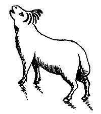

  
[Intangible Textual Heritage](../../index)  [Christianity](../index.md) 
[Revelation](../../bib/kjv/rev)  [Index](index)  [Previous](tbr023.md) 
[Next](tbr025.md) 

------------------------------------------------------------------------

p. 44

### 5. THE SEVEN-SEALED BOOK.

Rev. 5:1-14.

 

"And I saw in the right hand of Him that sat on the Throne a Book
written **within** and on the **back, sealed with SEVEN SEALS**. And I
saw a strong angel proclaiming with a loud voice, Who is worthy to open
the Book, and to loose the **SEALS** thereof? And no **man** in heaven,
nor in earth, neither under the earth, was able to open the Book,
neither to look thereon. And one of the Elders saith unto me, Weep not:
behold, the **LION OF THE TRIBE OF JUDA**, the **ROOT OF DAVID**, hath
prevailed to open the Book, and to loose the **SEVEN SEALS** thereof.
And I beheld, and, lo, in the **midst** of the Throne, and of the Four
Beasts, and in the **midst** of the Elders, stood a **LAMB as it had
been slain**, having **SEVEN HORNS** and **SEVEN EYES**, which are the
**SEVEN [SPIRITS](errata.htm#1.md) OF GOD** sent forth into all the earth.
And **HE** came and took the Book out of the right hand of Him that sat
upon the Throne."

What is this "**SEVEN SEALED BOOK**"? Writing to the Ephesians (Eph.
1:13-14), Paul said--"Ye were **SEALED** with the Holy Spirit of
promise, which is the **earnest** of our inheritance until the
**REDEMPTION** of the **PURCHASED POSSESSION**." Then there is a
**POSSESSION** that is to be **REDEEMED**. What this is, Paul tells us
in Rom. 8:22-23. "We know that the **WHOLE CREATION GROANETH AND
TRAVAILETH IN PAIN TOGETHER UNTIL NOW**. And not only they (all earthly
created things), but ourselves also, which have the "First fruits of the
Spirit," even we ourselves groan within ourselves, waiting for the
**adoption**, to wit, the **REDEMPTION OF, OUR BODY**." (This will take
place at the First Resurrection).

We see from these references that there is something that was lost to
mankind and the earth that is to be redeemed, and we do not have to go
far to find out what it was. It is the inheritance of the **earth** and
of **immortal life** given to Adam and Eve, and that was lost in the
Fall of Eden. When Adam sinned he lost his inheritance of the earth, and
it passed out of his hands into the possession of Satan, to the
disinheritance of all of Adam's seed. The forfeited Title Deed is now in
God's hands and is awaiting redemption. Its redemption means the **legal
repossession** of all that Adam lost by the Fall. Adam was impotent to
redeem the lost possession, but the law provides (Lev. 25:23-34) that a
**kinsman** may redeem a lost possession. That **KINSMAN** has been
provided in the person of **JESUS CHRIST**.

p. 45

\[paragraph continues\] To become a **kinsman** He had to be born into
the human race. This the Virgin Birth accomplished. Jesus paid the
**REDEMPTIVE PRICE**, which was His own **BLOOD**, on the Cross (1. Pet.
1:18-20), but He has not as yet claimed that which He then purchased.
When the time comes for the **Redemption** of the **PURCHASED
POSSESSION** Jesus will do so. That time and the act is described in the
scripture we are now considering. The "**SEVEN SEALED BOOK**" is the
"**TITLE DEED**" to the redeemed inheritance. In Old Testament days when
a kinsman desired to redeem a property he took his position, with ten
men (Elders) as witnesses, in the gate of the city and advertised his
purpose. This is beautifully illustrated in the story of Boaz and Ruth.
Ruth 4:1-12. The kinsman who redeemed the property was called the "Goel"
or **REDEEMER**.

When the "strong angel" proclaimed with a loud voice--"**WHO** is worthy
to open the Book, and to loose the **Seals** thereof?" that was the
**advertisement** for the "**KINSMAN REDEEMER**" to appear. But, said
John, there was no **MAN** (redeemed man) in Heaven; nor in Earth,
neither under the Earth, who was able to open the Book, neither to look
thereon. It was not a question of the worthiness of some angelic being,
as Michael or Gabriel, to open the Book, but of a **MAN**. When John saw
that there was no one worthy to open the Book he wept. Some say he wept
because he was disappointed that he could not satisfy his curiosity as
to the contents of the Book, but such a statement is puerile. A man
under the influence of the Holy Spirit would not be so foolish. John
wept because he knew what the Book was, and that if there was no one to
open that "**BOOK OF REDEMPTION**," that all hope of the redemption of
the earth and of man was gone. But John's sorrow was of short duration,
for one of the Elders said--"Weep not: behold, the **LION OF THE TRIBE
OF JUDAH**, the **ROOT OF DAVID**, hath prevailed to open the Book, and
to loose the 'Seven Seals' thereof." And John saw, what he had not
noticed before a **LAMB, as it had been slain**, standing in the midst
of the Throne, and of the "Four Living Creatures." John had not seen the
Lamb before, because it (He) had been seated on the Throne with the
Father, and advanced out of the Glory of the Throne as the Elder spoke.

John looked for a "**Lion**" and saw a **LAMB**. But the Elder was right
in calling it a "**Lion**," for Jesus was about to assume His Title as
the **LION OF THE TRIBE OF JUDAH**, and reign and rule with **KINGLY
POWER**. That the Lamb was not an animal is clear from verse seven,
where it says--"And **HE** (the Lamb) came and took the Book out of the
right hand of Him that sat upon the Throne." This is the sublimest
individual act recorded in the Scriptures. On it the redemption of the
whole creation of God depends. It is still future and takes place after
the Church has been "caught out" and Judged, and before the Tribulation
Period begins, and you and I, if we are redeemed by the Blood of the
Lamb, will witness the scene, and take part in the "Song of Redemption"
that follows. Rev. 5:8-10.

p. 46

**THE "SEVEN-HORNED" LAMB.**

 

This is the "**DUE TIME**," when the "**MAN**" **CHRIST JESUS**, who
gave Himself as a "**RANSOM**" (on the Cross) for the redemption of the
lost inheritance, will be **TESTIFIED TO** before the Throne of God, by
redeemed mankind, angels, and every creature in Heaven and Earth, and
under the Earth. 1. Tim. 2:5-6; Rev. 5:8-14.

When the Lamb leaves the Throne to take the Book, His Mediatorial Work
ceases, and His **REDEMPTIVE WORK** begins. When our "**KINSMAN
REDEEMER**" is handed the "**Book**," the "**TITLE DEED**" to the
"Purchased Possession," He has the right to break its **SEALS**, and
claim the "**Inheritance**," and **DISPOSSESS** the present claimant
**SATAN**. This He will immediately proceed to do, as He breaks the
**SEALS**. Satan is not evicted at once. He contests the claim and it is
only after a prolonged conflict that he is finally dispossessed and cast
into the Lake of Fire.

In the Gospels four titles are given to Jesus. He is the Son of David;
the Son of Abraham; the Son of Man; and the Son of God.

1\. As the Son of David, He has title to the Throne of David.

2\. As the Son of Abraham, He has title to the Land of Palestine, and
all included in the Royal Grant to Abraham. See Map of The Royal Grant.

3\. As the Son of Man, He has title to the Earth and the World.

4\. As the Son of God, He is the Heir of All Things.

The manner of redemption of a lost inheritance is beautifully set forth
in the Old Testament. A property could not be alienated from the
original owner or his heirs for a longer period than 50 years, at which
time it reverted to the original owner. If however for some reason the
owner was forced to sell it, it could be redeemed by the next of kin on
the payment of the proportionate amount of its value due until the next
"Year of Jubilee." Lev. 25:8-17. Two illustrations of this method of
redeeming a forfeited possession are given in the Old Testament; one in
Ruth 4:1-12, where Boaz redeems the possession of Elimelech, the other
in Jer. 32:6-12, where the Prophet Jeremiah purchased the possession of
his cousin Hanameel. The "Deed" was written on a parchment roll, and
when the inside was filled, the outside was used, but enough space was
left to not show the writing when the parchment was rolled up and
sealed, and on the outside of the roll that showed, the Title of the
Deed, and the names

p. 47

 

[  
Click to enlarge](img/04700.jpg.md)  
Map :The Royal Grant to Abraham  

 

p. 48

of the subscribing witnesses were written. Two copies of the "Deed" were
made. One was sealed, and the other left unsealed for the purpose of
reference. These deeds were handed to the purchaser in the presence of
witnesses, and either kept by him, or intrusted to a custodian, or
placed, as in the case of Jeremiah, in an earthen vessel, that would
neither rot nor rust, to be preserved until the end of the Seventy Years
of Captivity that the Prophet had foretold was to be. This method of
taking title, explains the meaning and purpose of the "Seven Sealed
Book" that John saw written **within** and on the **back**. The "Seals"
were not in a row along the edge of the Book or Roll, but a Seal was
broken and the parchment unrolled until the next seal was reached, and
so on until all the "**Seals**" had been broken. We are not told that
what happened as the "**Seals**" were broken was read out of the Book.
The contents of the "Book" are not disclosed. We are simply told, as the
"**Seals**" are broken, that certain things happened. They doubtless
were preliminary to the Lamb's taking possession of the Purchased
Possession. It is not until chapter 10:1-6, that Christ, as the
"**MIGHTY ANGEL**," puts His right foot upon the sea, and His left foot
on the earth, and cries--"There shall be time no longer," that is "**NO
LONGER DELAY**," that He takes formal possession, but as the claim is
disputed further steps, as we shall see, are necessary to secure
possession.

------------------------------------------------------------------------

[Next: Daniel's Seventieth Week](tbr025.md)
