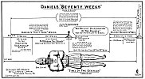

  
[Intangible Textual Heritage](../../index)  [Christianity](../index.md) 
[Revelation](../../bib/kjv/rev)  [Index](index)  [Previous](tbr024.md) 
[Next](tbr026.md) 

------------------------------------------------------------------------

### Daniel's Seventieth Week

Daniel 9:1-27.

As the events recorded in Rev. 6:1 to Rev. 19:21, are connected with the
last, or "**Seventieth Week**," of Daniel's "**SEVENTY WEEKS**," it is
necessary that we stop here and explain what is meant by Daniel's
"**Seventieth Week**."

The Prophet Daniel had been 68 years (B. C. 538) in Babylon, and by a
study of the Prophecy of Jeremiah (Jer. 25:11), he discovered that the
"Seventy Years" Captivity of his people was nearing its end, and so he
set his face unto the Lord, to seek by prayer and supplication (Dan.
9:3) to know the exact time of its ending, and while he was praying the
Angel Gabriel appeared to enlighten him. (Dan. 9:20-23.) Daniel was
concerned about the expiration of the "Seventy Years" of the Captivity,
and the restoration of his people to Palestine, and the rebuilding of
the City of Jerusalem and of the Temple. But the Angel Gabriel came to
disclose to him something more important than that. While he doubtless
informed Daniel that God would fulfil His promise as to the "Seventy
Years" of the Captivity, which, as we know, He did, he also made known
to Daniel that that would **not end** the troubles of Israel. That while
the Jews were to return to Jerusalem at the end of the "Seventy Years"
of Captivity, there was a **longer period** to elapse before the Kingdom
would be restored to them, a period of

"**SEVENTY WEEKS**."

 

[  
Click to enlarge](img/04800.jpg.md)  
The Tribulation Period, or Daniel's ''Seventieth Week'', the Reign of
Antichrist  

 

p. 49

"**SEVENTY WEEKS** are determined upon **Thy People** (Daniel's people
the Jews) and upon the **Holy City** (Jerusalem), to **finish the
transgression**, and to make an **end of sins**, and to make
**reconciliation for iniquity**, and to **bring in everlasting
righteousness**, and to **seal up the vision and prophecy**, and to
**anoint the most Holy**. Know therefore and understand, that from the
going forth of the commandment to **restore and to build Jerusalem**
unto the '**MESSIAH THE PRINCE**' shall be **SEVEN WEEKS**, and
**THREESCORE AND TWO WEEKS**: the street shall be built again, and the
wall, even in **troublous times**. And after **THREESCORE AND TWO
WEEKS** shall **MESSIAH BE CUT OFF**, but not for Himself: and the
**people** (Roman) of the **PRINCE THAT SHALL COME** (**Antichrist**)
shall destroy the City and the Sanctuary; and the end thereof shall be
**with a flood**, and unto the end of the war desolations are
determined. And he (Antichrist) shall confirm the Covenant with many for
**ONE WEEK** (the last or Seventieth Week): and in the midst of **THE
WEEK** he (Antichrist) shall cause the Sacrifice and the oblations to
cease, and for the **overspreading of abominations** (the Abomination of
Desolation spoken of by Christ. Matt. 24:15) he shall make it
**desolate**, even until the **consummation**, and that determined shall
be poured upon the desolate." Dan. 9:24-27.

This Vision of the "**SEVENTY WEEKS**" is the most important revelation,
in many ways, made in the Scriptures. We are here told that this Period
of "**SEVENTY WEEKS**" was determined upon Daniel's **PEOPLE** (the
Jews), and upon the **HOLY CITY** (Jerusalem). This is **very
important**. It discloses the fact that the "**SEVENTY WEEKS**" have
nothing to do with the **Gentiles**, or the **Church**, but only with
the **JEWS** and **JERUSALEM**. It also discloses another important fact
that the "**SEVENTY WEEKS**" only cover the period when the Jews are
**DWELLING IN THEIR OWN LAND**, and does not cover the present period of
their Dispersion. We are told in verse 24 that these "**SEVENTY WEEKS**"
were determined for a **SIX-FOLD** purpose.

1\. **TO FINISH THE TRANSGRESSION**.

It is the **transgression** of **ISRAEL** that is here referred to, and
the **finishing** of it will be the turning away of **UNGODLINESS FROM
JACOB**. Rom. 11:26-27. The transgression of Israel has not yet come to
an end, and will not until they as a Nation shall be converted.

2\. **TO MAKE AN END OF SINS**.

The margin reads to "seal up" sins. The sins of **ISRAEL**. This may
refer to the author of Israel's sins--Satan, who shall at that time be
"sealed up" in the Pit. Rev. 20:1-3.

3\. **TO MAKE RECONCILIATION FOR INIQUITY**.

This refers to **ISRAEL'S** iniquity in the rejection of their Messiah.
While atonement was made for their sin on the Cross, its application to
**Israel** as a Nation awaits the day when they shall look on Him whom
they pierced (Zech. 12:10), and a fountain shall be opened to the "House
of David," and the inhabitants of Jerusalem

p. 50

for sin and uncleanliness, Zech. 13:1, and a nation, the Jewish Nation,
shall be "born again" in a day. Isa. 66:8.

4\. **TO BRING IN EVERLASTING RIGHTEOUSNESS**.

When the "Transgression of **ISRAEL**" has come to an end, and her sins
are "sealed up," then everlasting righteousness shall be brought in. The
King will come, and the Kingdom be restored to Israel, and the
Millennium will be here, and the "Knowledge of the Lord" shall cover the
earth, as the waters cover the sea. Hab. 2:14.

5\. T**O SEAL UP THE VISION AND PROPHECY**.

When the "Transgression of **ISRAEL**" has ceased and they have
uninterrupted communion with God, there will no longer be any need for
"Vision" or "Prophet." It is a noteworthy fact that "Vision" and
"Prophecy" has been confined to the Jewish race.

6\. **TO ANOINT THE MOST HOLY**.

This probably refers to the anointing of the "**Most Holy Place**," or
the "Holy of Holies" of the **MILLENNIAL TEMPLE**, described by Ezekiel.
Ezek. 41. There is great significance in this announcement; for,
although the Tabernacle of Moses was anointed (Lev. 8:10), there is no
mention of such a ceremony in the Consecration of either Solomon's
Temple, or the Temple of Zerubbabel, for those buildings were considered
merely as continuations of the Mosaic Tabernacle. But when the King
comes back and sits upon the Throne of His father David, there is to be
a magnificent Temple erected, the like of which has never as yet been
seen on this planet of ours. There will be no "Ark of the Covenant" with
its "Mercy Seat," in the "**Most Holy Place**" of the Millennial Temple
(Jer. 3:16), but in its place will stand the **ROYAL THRONE** on which
the "**BRANCH**," the Messiah shall sit as a **KING-PRIEST** (Zech.
6:12-13), and whose anointing is here referred to.

Now as the fulfilment of this "**Six-Fold**" purpose of the "**SEVENTY
WEEKS**" synchronizes with the things that shall happen at the close of
this Dispensation, and that are described in Rev. 6:1; 19:21, it is
clear that the last, or "**SEVENTIETH WEEK**" of Daniel's "**Seventy
Weeks**," covers the "**TIME PERIOD**" of Rev. 6:1; 19:21, and confirms
the claim that that "Period" is Jewish and has nothing to do with the
Church. To prove this it is only necessary to outline Daniel's "Seventy
Weeks."

The "Seventy Weeks" are divided into "**THREE PERIODS**" of **7 Weeks**,
and **62 Weeks**, and **1 Week**. They cover the time from the going
forth of the commandment to restore and to build Jerusalem, which was
the 14th day of the month Nisan (March) B. C. 445, to the Second Stage
(The Revelation) of the Second Coming of Christ. The "First Period," **7
WEEKS**, refers to the time required to rebuild the walls of Jerusalem,
which was **49 years**, thus giving us the "Key" to the meaning of the
word "**WEEK**," for if **7 WEEKS** are equal to **49 YEARS**, then **1
WEEK** is equal to **7 YEARS**. Now we are told that from the going
forth of the commandment to restore and rebuild Jerusalem (B. C. 445)
unto the "**MESSIAH THE** 

p. 51

 

[  
Click to enlarge](img/05100.jpg.md)  
Daniel's ''Seventy Weeks''  

 

p. 52

\[paragraph continues\] **PRINCE**," shall be **7 WEEKS**, and
**THREESCORE AND TWO WEEKS**, or **69 WEEKS**, or, if **1 WEEK** is
equal to **7 YEARS**, 7 x 69 or **483 YEARS**. Now Jesus, as "**MESSIAH
THE PRINCE**," rode in triumph into Jerusalem on Palm Sunday, April 2,
A. D. 30. The difference in time between B. C. 445 and A. D. 30 is 475
years, but, as we have seen, **69 WEEKS** equal 483 years, a difference
of 8 years. How are we to explain this difference?

The 475 years between B. C. 445 and A. D. 30, are Julian or Astronomical
years of 365¼ days each, but when we reduce them to Calendar years of
360 days each, the year used in the Scriptures, we find that we have
exactly 483 years of 360 days each. This proves that there was no break
between the "First" and "Second" Periods of the "Seventy Weeks," and
that the prophecy that there should be **69 WEEKS** to the coming of
"**MESSIAH THE PRINCE**" was literally fulfilled. Now as **69 WEEKS** of
Daniel's "**SEVENTY WEEKS**" have already expired, and all that was
prophesied to occur during those "**SEVENTY WEEKS**" has not yet been
fulfilled, it stands to reason that the things unfulfilled are still
future, and must be fulfilled in the remaining "**ONE WEEK**," and that
that "**ONE WEEK**" shall be "**SEVEN YEARS**" long, for it must be of
the same length as the other "**WEEKS**." This then gives us the
**length of time** of the reign of the "**PRINCE THAT SHALL COME**"
(Antichrist), who we are told in verse 27 (Dan. 9:27) shall make a
Covenant with the Jews for "**ONE WEEK**" (7 years), the last or
"**SEVENTIETH WEEK**," and that in the "**Middle**" of the **WEEK** he
shall break the Covenant and cause the "sacrifice and oblation" that the
Jews will have restored, to cease, and then the "overspreading of
abominations that maketh desolate," shall continue until the **end** of
the **WEEK**. As this is just what is foretold will occur during the
reign of Antichrist (2. Thess. 2:3-4) we see that the "Period" between
Rev. 6:1 and Rev. 19:21, that we are now about to study, is the "Third
Period" of **ONE WEEK**, of Daniel's "**SEVENTY WEEKS**" and that it is
to last **SEVEN YEARS**. From this we see that while there was no "Time
Space" between the "First" and "Second" Periods of the "Seventy Weeks,"
there is a "Time Space" between the "Second" and "Third" Periods or the
69th and 70th Week, of already (A. D. 1919) 1889 years, or the present
Church Age. This was hidden so the Church should not fail to watch. See
the "Chart", "[05100](#img_05100.md)."

------------------------------------------------------------------------

[Next: First Seal (A White Horse)](tbr026.md)
