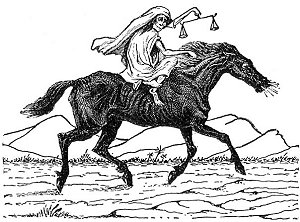

  
[Intangible Textual Heritage](../../index)  [Christianity](../index.md) 
[Revelation](../../bib/kjv/rev)  [Index](index)  [Previous](tbr027.md) 
[Next](tbr029.md) 

------------------------------------------------------------------------

p. 56

### THIRD SEAL.

### (A Black Horse.)

Rev. 6:5-6.

 

"And when He opened the '**THIRD SEAL**,' I heard the 'Third Beast' say,
**Come**. And I beheld, and lo a **BLACK HORSE**: and he that sat on him
had a **pair of balances in his hand**. And I heard a voice in the midst
of the Four Beasts say, A **measure of wheat for a penny**, and **three
measures of barley for a penny**: and see thou **hurt not** the **oil**
and the **wine**."

When the "**THIRD SEAL**" was broken John heard the third or "Man-like
Living Creature" say--"**Come**," and a "**BLACK HORSE**" appeared and
went forth, whose Rider held in his hand a "**pair of balances**," and
John heard the voice of an invisible person in the midst of the "Four
Living Creatures" say--"**A measure of wheat for a penny**, and **three
measures of barley for a penny**, and see thou **hurt not** the **oil**
and the **wine**." The "**BLACK HORSE**" signifies **famine**, and the
Rider the "**Conserver of Food**." When all able bodied men are drafted
for war, and no one left to sow and harvest the crops, then famine is
sure to follow. So great will be the famine, that it will take a
"denarius" a day's wages, to buy a "choenix" (2 pints) of wheat," the
daily ration of a slave. What is meant by not hurting the **oil** and
**wine**, may be, that as the Olive tree and grapevine do not bear their
fruit until some months after the wheat and barley harvest, and grow
without much attention, their crops would not be so much affected by
war, and therefore the Olive trees and grapevines were not to be
ruthlessly destroyed by invaders for they were needed for medicinal
purposes.

------------------------------------------------------------------------

[Next: Fourth Seal (A Pale Horse)](tbr029.md)
