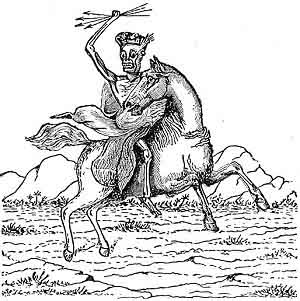

  
[Intangible Textual Heritage](../../index)  [Christianity](../index) 
[Revelation](../../bib/kjv/rev)  [Index](index)  [Previous](tbr028) 
[Next](tbr030) 

------------------------------------------------------------------------

p. 57

### FOURTH SEAL.

### (A Pale Horse.)

Rev. 6:7-8.

 

"And when He had opened the '**FOURTH SEAL**,' I heard the voice of the
'Fourth Beast' say, **Come**. And I looked, and behold a **PALE HORSE**:
and his name that sat on him was **DEATH**, and **HELL** (**Hades**)
followed with him. And power was given unto them over the **fourth part
of the earth**, to kill with **SWORD**, and with **HUNGER**, and with
**DEATH**, and with the **BEASTS OF THE EARTH**."

When the "**FOURTH SEAL**" was broken John heard the fourth, or
"Eagle-like Living Creature" say--"**Come**," and a "**PALE HORSE**"
appeared and went forth. Note the "**corpse-like**" color of the Horse.
We are not surprised then when the Rider upon the "**PALE HORSE**" is
called "**DEATH**," and that "**HADES**," the "**Grave**," not
"**Hell**," follows after "**Death**" like a great "Voracious Monster"
to swallow up the victims of "**DEATH**." It is worthy of note that the
Riders of the first three Horses are not named, but it will be very
clear when the events they chronicle occur, who and what is meant. Here
however the Rider is **personified** and called "**DEATH**," and his
consort is called "**HADES**," they are inseparable companions. The
reference here is clearly to some great **PESTILENCE** that shall come
upon the earth. After a devastating war, followed by famine, during
which the dead are left unburied, a **PESTILENCE** is sure to follow.
The "fourth part of the earth" over which the Pestilence shall sweep
will probably be that part of the Eastern Hemisphere covered by the
revived Roman Empire. See [Map of the Old Roman
Empire](tbr080.htm#img_15800). So great will be the destruction of human
life in the days of the "Fourth Seal" that **HADES** will have to
**enlarge herself** and **open her mouth** without measure, as foretold
in Isa. 5:13-16. The means of destruction mentioned--the **SWORD**,
**HUNGER**, **DEATH**, and the **BEASTS OF THE EARTH**,

p. 58

are the "**FOUR SORE JUDGMENTS**" of Ez. 14:21, that are to fall upon
**JERUSALEM**--"For thus saith the Lord God: How much more when I send
my '**FOUR SORE JUDGMENTS**' upon **JERUSALEM**, the **SWORD**, and the
**FAMINE**, and the **NOISOME BEAST**, and the **PESTILENCE**, to cut
off from it man and beast." Those will be awful times to those who must
pass through them. But the Church will not be in them having been
"caught out" before as promised. But awful as those days will be, they
will be only the "**BEGINNING OF SORROWS**" for those who are left.
Matt. 24:6-8. And the worst thing about them will be that they are
"**Hardening Judgments**," and instead of the people repenting and
calling upon God, they will call on the **mountains** and **rocks** to
hide them from the face of Him that sitteth on the Throne. Rev. 6:15-17.

------------------------------------------------------------------------

[Next: Fifth Seal (The Souls of Martyrs)](tbr030)
