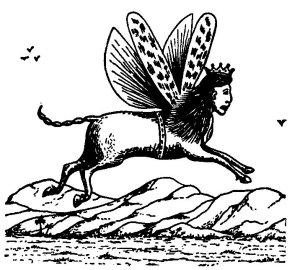

  
[Intangible Textual Heritage](../../index)  [Christianity](../index.md) 
[Revelation](../../bib/kjv/rev)  [Index](index)  [Previous](tbr041.md) 
[Next](tbr043.md) 

------------------------------------------------------------------------

p. 73

### FIFTH TRUMPET.

### FIRST WOE.

### (The Plague Of Locusts.)

Rev. 9:1-12.

 

"And the **FIFTH ANGEL** sounded, and I saw a '**STAR**' fall from
Heaven unto the earth: and to **HIM** was given the 'Key' of the
'**BOTTOMLESS PIT**.' And he opened the '**BOTTOMLESS PIT**,' and there
arose a **smoke out of the 'Pit,'** as the smoke of a furnace; and the
**Sun** and the **air** were **darkened** by reason of the smoke of the
'Pit.' And there came out of the smoke **LOCUSTS** upon the earth: and
unto them was given power, as the **Scorpions** of the earth have power.
And it was commanded them that they should **not hurt the grass of the
earth, neither any green thing, neither any tree**; but **only those men
which have not the 'SEAL OF GOD' in their foreheads**. And to them it
was given that they should **not kill them**, but that they should be
**TORMENTED FIVE MONTHS**: and their torment was as the **TORMENT OF A
SCORPION**, when he striketh a man. And in those days shall men **seek
death**, and **shall not find it**: and shall **desire to die**, and
**death shall flee from them**. And the **shape of the LOCUSTS** were
like unto **HORSES PREPARED UNTO BATTLE**: and on their heads were as it
were **crowns of gold**, and their faces were as the **faces of men**.
And they had hair as the **hair of women**, and their teeth were as the
**teeth of lions**. And they had '**Breastplates**,' as it were
**Breast-plates of iron**; and the **sound of their wings** was as the
**sound of chariots of many horses running to battle**. And they had
**tails** like unto **SCORPIONS**, and there were **stings** in their
tails: and their power was to hurt men **FIVE MONTHS**. And they had a
King over them, which is the **ANGEL** of the 'Bottomless Pit,' whose
name in the Hebrew tongue is **ABADDON**, but in the Greek tongue hath
his name **APOLLYON**. One '**WOE**' is **past**; and, behold, there
come '**TWO WOES**' more **hereafter**."

At the sounding of the Fifth Trumpet John saw a **"STAR" fall**, or as
the Revised Version has it, "**fallen** from Heaven." That it was not a
**literal star** is clear, for in the next verse the "**STAR**" is
spoken of as a **PERSON (He)**, and in the Old Testament angels were
called "**Stars**." Job 38:7. Because the "**STAR**" was "**fallen
from** 

p. 74

\[paragraph continues\] **Heaven**" does not imply that the "**ANGEL**,"
for that is what it was, was a "**FALLEN ANGEL**," or **SATAN** himself,
as some have supposed. John simply meant that he saw the **descent** of
the "**STAR**," or Angel, and so rapidly did it descend that it
**appeared to be falling**. This is the **same "STAR ANGEL"** that in
Rev. 20:1-3 comes down from Heaven, having the "**Key**" of the
"**BOTTOMLESS PIT**," and a **great chain in his hand**, and **binds
SATAN**, and casts him into the "**PIT**." This makes it clear that the
"**STAR ANGEL**" is not **SATAN**. The work of both Angels is the same,
to **unlock** and **lock** the "Bottomless Pit." It does not look
reasonable that God would entrust the "Key" of the "Prison House" of the
"Demons" to a "Fallen Angel," or even Satan himself.

------------------------------------------------------------------------

[Next: The Bottomless Pit](tbr043.md)
