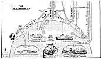

  
[Intangible Textual Heritage](../../index)  [Christianity](../index.md) 
[Revelation](../../bib/kjv/rev)  [Index](index)  [Previous](tbr042.md) 
[Next](tbr044.md) 

------------------------------------------------------------------------

### THE BOTTOMLESS PIT.

The "**BOTTOMLESS PIT**" is not Hell, or Hades, the place of abode of
the "Spirits" of wicked men and women until the resurrection of the
"Wicked Dead." See the Chart of "The Underworld." Neither is it
"Tartarus" the "Prison House" of the "Fallen Angels" (Jude 6-7), nor the
"Lake of Fire," the "Final Hell" (Gehenna), Matt. 25:41, but it is the
place of confinement of the **DEMONS**, who are not Satan's Angels but a
class of "**disembodied Spirits**," supposed by many to be the
"**disembodied spirits**" of the inhabitants of the Pre-Adamite Earth,
who, as they have liberty and opportunity, as in the days of Christ, try
to **re-embody** themselves again in human bodies. They are **wicked**,
**unclean**, **vicious**, and have power to derange both mind and body.
Matt. 12:22; 15:22. Luke 4:35; 8:26-36; 9:42. They are the "Familiar
Spirits" of the Old Testament and the "Seducing Spirits" of which Paul
warned Timothy. I. Tim. 4:1. They wander about in desolate places.
Christ used them to illustrate the condition of the Jewish people in the
"last days" when "Demoniacal Power" shall be increased over them
**SEVENFOLD**. He said, "When the '**UNCLEAN SPIRIT**' (or Demon) is
gone out of a man, he (the Demon) walketh through dry places, seeking
rest, and findeth none. Then he saith, I will return into my house from
whence I came out: and when he is come, he findeth it **empty**,
**swept**, and **garnished**. Then goeth he, and taketh with himself
**SEVEN OTHER SPIRITS more wicked than himself**, and they **enter in**
and **dwell there**: and the last state of that man is worse than the
first. Even so shall it be also unto this **WICKED GENERATION**." Matt.
12:43-45. The word "**Generation**," means not simply the life-time of
an individual, but it means a "**race**," and by this "**WICKED
GENERATION**," Christ meant those He was addressing, and they were the
Jews. So we see that the Jews, as a "race," when Jesus comes back, will
be **SEVENFOLD DEMONIACALLY POSSESSED**. This will account for their
making a "Covenant" with Antichrist which the Prophet Isaiah calls a
"Covenant with **DEATH** and **HELL**." Isa. 28:18. When Christ cast the
"Legion" of devils (Demons) out of the Gadarene Demoniac, they besought
Him to not cast them into the "**deep**," that is, not into the
"**ABYSS**," the "**BOTTOMLESS PIT**." Luke 8:26-36.

p. 75

 

[  
Click to enlarge](img/07500.jpg.md)  
The Underworld  

 

p. 76

When the "Star Angel" opened the "Bottomless Pit," smoke, like the smoke
of a great furnace, issued forth and darkened the sun, and there came
out of the smoke **LOCUSTS** upon the earth. These were not ordinary
locusts. Neither were the locusts of the "Eighth Egyptian Plague." Ex.
10:3-20. For we read of them that "**there were no such locusts as they,
neither after them shall be such**," that is, just like them.
Nevertheless they were **locusts**, not some "**composite creature**"
such as John saw, for they acted like locusts and ate up every green
thing. The difference must have been in their size and voraciousness.

The **LOCUSTS** that John saw come out of the "Bottomless Pit" were a
kind of "**INFERNAL CHERUBIM**." That is, they were a combination of the
**HORSE**, the **MAN**, the **WOMAN**, the **LION**, and the
**SCORPION**, and the sound of their wings in flying was as the "sound
of chariots of many horses running to battle." Their size is not given,
but they were doubtless much larger than ordinary locusts, but they were
not like them, for ordinary locusts feed on vegetation, but these
locusts were forbidden to hurt the **grass**, or the **trees**, or **any
green thing**, but were to afflict **ONLY MEN**, and they had **human
intelligence**, for they afflicted only those men who had not the
"**SEAL OF GOD**" in their foreheads. These men they were not permitted
to kill, but only **torment**, and that for only a limited
period--**FIVE MONTHS**, the time limit of ordinary locusts, which is
from May to September. The length of time is mentioned twice, and the
**character** of the torment was like that which follows the **STING OF
A SCORPION**, which causes **excruciating pain** that often causes the
afflicted person to desire to die. So fearfully excruciating will be the
anguish of those who shall be tormented by these "**SCORPION LOCUSTS**"
that they will "seek death, and shall not find it; and shall desire to
die, but death shall flee from them," the inference being that the
**LOCUST** or **DEMON** controlling them shall have power to prevent
their death.

There is a remarkable description in the prophecy of Joel, of what is
spoken of as an army of **HORSEMEN**, but which seems to refer to John's
"**SCORPION LOCUSTS**." "The appearance of them is as the appearance of
**horses**, and as **horsemen**, so shall they run. Like the noise of
**CHARIOTS** on the tops of mountains shall they leap, like the noise of
a flame of fire that devoureth the stubble, as a strong people set in
battle array. Before their face the **PEOPLE SHALL BE MUCH PAINED**: all
faces shall gather **blackness**. They shall run like mighty men; they
shall **climb the wall** like men of war; and they shall march every one
his ways, and they shall not break ranks; neither shall one thrust
another; they shall walk every one in his path; and when they **fall
upon the sword, they shall not be wounded**. They shall run to and fro
in the city; they shall run upon the wall, they shall **climb up upon
the houses**; they shall **enter in at the windows like a thief**. The
earth shall quake before them; the heavens shall tremble; **the sun and
the moon shall be dark, and the stars shall withdraw their shining**."
Joel 2:4-10. There are a number of things in this prophecy of Joel that
makes us doubt that an invasion of **literal horsemen** is meant. Horses
do not **climb walls**,

p. 77

or **climb up upon roofs**, or **enter windows like a thief**. They do
not **fly in the heavens** and in such numbers as to **darken the sun,
moon, and stars**, nor do they **fall upon the sword and escape
wounding**. This could only be said of "**spirit beings**" as
**DEMONS**. This prophecy looks more like a scourge of locusts; not
**literal** locusts, but such "**SCORPION LOCUSTS**" as John describes,
for they attack **men**, and cause them such **great pain** that their
**faces turn BLACK**. This view is confirmed when we note the **time**
of this "horsemen" invasion. Joel tells us that it will be in the "**Day
of the Lord**" (Joel 2:1, 11), that it will be accompanied with the
"**sound of a trumpet**," that it will **precede** the **pouring out of
the Holy Spirit on all flesh**, and that it will be at a time when the
Lord will "**shew wonders in the heavens and in the earth, BLOOD, and
FIRE, and PILLARS OF SMOKE**."

Now we know that the "Gift of the Holy Spirit" on the Day of Pentecost
was only the "first fruits" and **partial** fulfilment of this prophecy
of Joel, for none of these terrible things occurred at that time, and
there was no invasion of enemy "horsemen," or a "scourge of locusts,"
on, or before, or after, the Day of Pentecost such as here described. As
we have no historical record of such an invasion of "locust horsemen" as
the Prophet Joel describes, the event must still be future, and the
description in many respects corresponds with what John tells us will
happen when the Fifth Trumpet sounds.

These "**SCORPION LOCUSTS**" have a King, which ordinary locusts have
not. Prov. 30:27. This King's name in the Hebrew is "**ABADDON**," but
in the Greek is "**APOLLYON**." Now Satan is no where in the Scriptures
called by either of these names, so Satan cannot be the King of the
Demons, for their King is the King of the "Bottomless Pit," to which he
is **confined**, while Satan and his angels are at liberty and roam the
Heavenlies. The meaning then of this scourge of "**SCORPION LOCUSTS**"
seems to be, that an Angel, the custodian of the "Pit," will open the
"Bottomless Pit," and liberate a vast multitude of Demons who shall
enter into and take possession of the bodies of men, and so torment them
that they shall desire to die and shall not be able.

Those will be awful days in which to live, and especially so for those
who have the "**MARK OF THE BEAST**," who will be the special mark of
those "**SCORPION LOCUSTS**." They will be invisible to the natural eye,
being "**SPIRIT BEINGS**," but their presence will be known by the
suffering they inflict, which will be unavoidable because of their
invisibility, and the inability to provide any material means as
screens, to protect one's person from their attack. This invasion of
"Scorpion Locusts" will last for 5 months and may well be called a
"**WOE**," but it will be comparatively trifling in comparison with the
two "**WOES**" that are to follow, that of the "Plague of Infernal
Cavalry," and the "Vial Judgments," which are included under the "Third
Woe."

------------------------------------------------------------------------

[Next: The Sixth Trumpet. Second Woe (The Plague of Horsemen)](tbr044.md)
