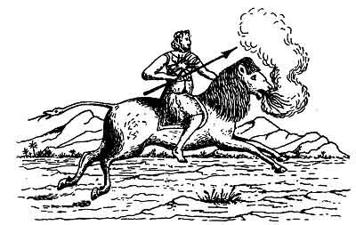

  
[Intangible Textual Heritage](../../index)  [Christianity](../index) 
[Revelation](../../bib/kjv/rev)  [Index](index)  [Previous](tbr043) 
[Next](tbr045) 

------------------------------------------------------------------------

p. 78

### THE SIXTH TRUMPET.

### SECOND WOE

### (The Plague Of Horsemen.)

 

Rev. 9:13-21.

"And the '**SIXTH ANGEL**' sounded, and I heard a voice from the 'Four
Horns' of the 'Golden Altar' which is before God, saying to the '**SIXTH
ANGEL**' which had the Trumpet, Loose the '**Four Angels**' which are
bound in the great river Euphrates, and the '**Four Angels**' were
loosed, which were prepared for an **hour**, and a **day**, and a
**month**, and a **year**, for to slay the **third part of men**. And
the number of the army of the horsemen were **two hundred
thousand thousand**: and I heard the number of them. And thus I saw the
horses in the Vision, and them that sat on them, having **breastplates
of fire**, and of **jacinth**, and **brimstone**: and the **heads** of
the horses were as the **heads of lions**: and out of their **mouth**
issued **fire and smoke and brimstone**. By these three was the third
part of men killed, by the **fire**, and by the **smoke**, and by the
**brimstone**, which issued out of their mouths. For their power is in
their **mouth**, and in their **tails**: for their **tails** were like
unto **serpents**, and had **heads**, and with them do hurt. And the
rest of the men which were not killed by these Plagues yet repented not
of the works of their hands, that they should not worship **devils**
(demons), and **idols of gold**, and **silver**, and **brass**, and
**stone**, and of **wood**; which neither can **see**, or **hear**, nor
**walk**: neither repented they of their **murders**, nor of their
**sorceries**, nor of their **fornication**, nor of their **thefts**."

That these "**Four Angels**," who were bound at the river Euphrates,
were **bad angels** is seen from the fact that they were **bound**, and
that they are the leaders or commanders of an army of **200,000,000**
"**INFERNAL CAVALRY**." This army of 200,000,000 horse-men is a
**supernatural army**. It is not composed of ordinary men and horses.
The fact that these "Four Angels" were bound at the Euphrates, where
Satan's seat was in ancient times, and where it is to be again in the
City of Babylon restored, and from whence he sallied forth to do his
diabolical work, makes it clear that this army is a part of Satan's
forces. Supernatural armies are not unknown to the Scriptures. Horses
and a **chariot of fire** separated Elijah from

p. 79

\[paragraph continues\] Elisha in the day when Elijah was taken up by a
**whirlwind** into Heaven, 2. Kings 2:11. When Dothan was besieged by
the army of Syria, God opened the eyes of Elisha's servant, and he saw
the mountains around the city full of horses and **chariots of fire**.
2. Kings 6:13-17. When the Lord Jesus Christ shall come to take "The
Kingdom," He will be attended by the "Armies of Heaven" riding on "White
Horses," and it stands to reason, if there is to be "War in Heaven"
between Michael and his angels, and Satan and his angels (Rev. 12:7),
that Satan has his armies, and among them **horsemen**, and that the
200,000,000 Horsemen mentioned here are Satan's Horse-men, for no such
army of **ordinary horsemen** ever was, or ever could be, assembled on
this earth.

Again the horses were not ordinary horses, for while their **bodies**
were like the body of a **HORSE**, their **heads** were as the head of a
**LION**, and their tails were like unto a **SERPENT**, the end of which
had the **HEAD OF A SERPENT**, and it was the **SULPHUROUS SMOKE AND
FIRE** that **issued from their mouths**, and the **SERPENT STING** of
their **tails**, that killed all that crossed their path, that reveals
the Satanic character of the horses and their riders. The "Riders" upon
these horses had "Breastplates of **FIRE**, **JACINTH**, and
**BRIMSTONE**," to match the **breath** of the horses upon which they
rode.

The wonderful thing about this invasion of "**INFERNAL CAVALRY**" was
the awful destruction they wrought. They slew the **THIRD PART OF MEN**.
If that means of the **whole world**, and the present population of the
earth is 1,700,000,000, then this army will destroy 566,666,666 persons.
It probably however refers to one-third of the men of the old Roman
world. Another remarkable thing is, that the "Four Angels" were prepared
for **THE** (R. V.) **HOUR**, **MONTH**, and **YEAR**, that is, they
were waiting for the **EXACT year**, **month**, **day**, and even
**hour**, known only to God, on which to make the invasion, and not, as
some think, to slay for **a year, month and day**, or 391 days. "Known
unto God are all His works from the beginning of the world." Acts 15:18.
This Plague of "**INFERNAL CAVALRY**" was for a twofold purpose,
retribution and reformation. To punish the **idolatry** and **demon
worship** of men, and their sins of **murder**, **sorcery**,
**fornication**, and **theft**, and to keep others from following in
their footsteps. But it appears from verses 20 and 21, that the residue
of men who were not killed, did not repent and turn from their sins, and
so were left for later judgments.

This army of "**INFERNAL CAVALRY**," being composed of "**SPIRIT
BEINGS**" like the "**SCORPION LOCUSTS**," will like them be invisible
to the natural eye, and therefore cannot be resisted, or warred against,
by carnal weapons. Those attacked will therefore be without any means of
protection, and this will account for the awful destruction of human
life, for the "**third part**" of man will be killed. The awful
destructive judgments of the "Trumpets" and "Vials" that are to come
upon the earth are doubtless for the purpose of weeding out the worst of
the human race, so that only the better class of men shall be saved for
the millennium.

------------------------------------------------------------------------

[Next: 1. The Little Book](tbr045)
