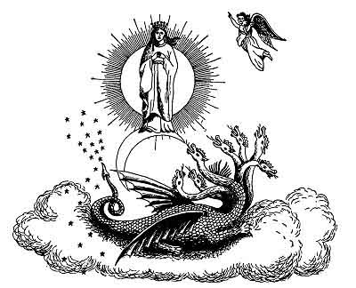

  
[Intangible Textual Heritage](../../index)  [Christianity](../index) 
[Revelation](../../bib/kjv/rev)  [Index](index)  [Previous](tbr047) 
[Next](tbr049) 

------------------------------------------------------------------------

p. 89

# The Middle of the Week

## The Seven Personages

### 1. THE SUN-CLOTHED WOMAN.

Rev. 12:1-2.

 

"And there appeared a '**GREAT WONDER**' in Heaven; a Woman **CLOTHED
WITH THE SUN**, and the **MOON UNDER HER FEET**, and upon her head a
**CROWN OF TWELVE STARS**: and she being with child cried, travailing in
birth, and pained to be delivered."

In the "Middle of the Week" two "**Wonders**" will appear in Heaven, for
John is back again in Heaven. The Revised Version calls them
"**SIGNS**," that is, they are "**SYMBOLS**" of something, and must be
thus interpreted. The first will be a "**SUN CLOTHED WOMAN**." Who does
this "Sun Clothed Woman" represent? Some would have us believe that this
"Woman" is the Virgin Mary, others that she represents the Church. Those
who say she represents the

p. 90

\[paragraph continues\] Church claim that she represents the **visible**
or outward Church, and her "Child" represents the "True Church" or those
who are to be "caught out" at the Rapture. If this be true, and the
"Child" is not caught out until the "Middle of the Week," then the
Church will have to go half way through the "Tribulation." The fact is,
the "Woman" is neither the Virgin Mary or the Church. She is **ISRAEL**.
We have only to be reminded of "**Joseph's Dream**," where he
says--"Behold, I have dreamed a dream more; and, behold, the '**SUN**'
and the **'MOON**' and the '**ELEVEN STARS**' made Obeisance to me"
(Gen. 37:9), to see the Jewish character of this "Woman." Joseph was the
"Twelfth" star.

Israel is again and again compared to a woman, and a married woman, in
the Old Testament. Isa. 54:1. And in the period of her rejection she is
spoken of as a **WIDOW** (Isa. 47:7-9. Luke 18:1-8), and a **DIVORCED**
Woman (Isa. 50:1), and an **ADULTEROUS WIFE** (Jer. 3:1-25, Hosea
2:1-23) but the Church is a **VIRGIN**, and an **ESPOUSED** Virgin at
that. 2. Cor. 11:2. Eph. 5:25-27. The "Sun Clothed Woman" is described
as being "**WITH CHILD**," and "**TRAVAILING TO BRING FORTH**." When was
the Church in such a condition? To be found in such a condition would
unfit her to be the Bride of Christ. Nowhere in the scriptures is it
intimated that the Church is ever to be a **Mother**. But it is so
prophesied of Israel. Speaking of the sevenfold privilege of Israel,
Paul says--"Who are Israelites; to whom pertaineth the **adoption**, and
the **glory**, and the **covenants**, and the **giving of the law**, and
the **service of God**, and the **promises**, whose are **the fathers**,
and of whom **AS CONCERNING THE FLESH CHRIST CAME**." Rom. 9:4-5. Here
we see that Christ was to come from **ISRAEL**. Then we know that the
"**PROMISED SEED**" was to come through **ISRAEL**, and the Prophet
Isaiah looked forward to the time when Israel could say--"**UNTO US A
CHILD IS BORN UNTO US A SON IS GIVEN**." Isa. 9:6-7. Before the promised
heir could be born Israel had to pass through many sore afflictions and
judgments. These were her "**TRAVAIL TIME**." There can be no question
but what the "Sun Clothed Woman" represents **ISRAEL**.

------------------------------------------------------------------------

[Next: 2. The Dragon](tbr049)
