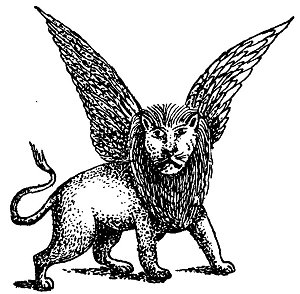
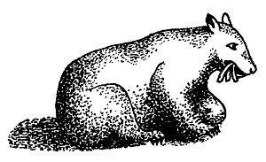
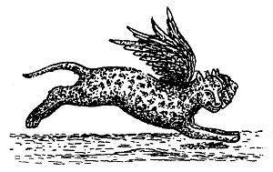

  
[Intangible Textual Heritage](../../index)  [Christianity](../index.md) 
[Revelation](../../bib/kjv/rev)  [Index](index)  [Previous](tbr056.md) 
[Next](tbr058.md) 

------------------------------------------------------------------------

### 2. The Vision of the "FOUR BEASTS."

Forty-eight years after Nebuchadnezzar had his "Dream," B. C. 555,
Daniel in vision stood upon the shore of the "Great Sea" (the
Mediterranean), and saw four "**Great Beasts**" come up out of the sea
in succession.

 

 

 

**FIRST BEAST**. The "**First Beast**" was like a **LION** and had
**Eagle's Wings**, and as the Prophet watched it, he saw it lifted up
from the earth, and made to stand upon its feet as a **Man**, and a
**Man's Heart** was given to it. Dan. 7:4. We have only to visit the
British Museum, London, and examine the Colossal Stone Lions with the
"**wings of an eagle**" and the "**head of a man**," disinterred from
the ruins of Babylon and Assyria by Sir Henry Layard between the years
1840 and 1850 A. D., to see that this "**FIRST BEAST**" stands for
Babylon and its King--Nebuchadnezzar. The peculiarity of this "**FIRST
BEAST**" was that it had "**Eagle's Wings**." This combination of the
**LION**, the "**King of Beasts**," and the **EAGLE**, the "**King of
Birds**," corresponded to the Royalty of the "**Head of Gold**" of the
"**COLOSSUS**," and typified the "Eagle-like" swiftness of the armies of
Nebuchadnezzar. The "**Plucking of the Wings**" doubtless referred to
the "**Beastly Insanity**" of Nebuchadnezzar (Dan. 4:20-27), and the
"**lifting up**," and causing to stand upon its feet "**as a MAN**," to
his restoration to sanity.

p. 109

 

 

 

**SECOND BEAST**. The "**Second Beast**" was "like to a **BEAR**, and it
raised up itself on one side, and it had "**Three Ribs**" in the mouth
of it, between the teeth of it: and they said thus unto it **Arise,
devour much flesh**." Dan. 7:5. The bear is the strongest beast after
the lion and is distinguished for its voracity, but it has none of the.
agility and majesty of the lion, is awkward in its movements, and
effects its purpose with comparative slowness, and by brute force and
sheer strength. These were the characteristics of the Medo-Persian
Empire. It was ponderous in its movements. It did not gain its victories
by bravery or skill, but overwhelmed its enemies by hurling vast masses
of troops upon them. Xerxes' expedition against Greece was undertaken
with 2,500,000 fighting men, who with the camp followers made up an army
of 5,000,000. Other Persian generals had armies running up into the
100,000's of men. It is easy to be seen that the movements of such
enormous bodies of men would "devour much flesh," not only in the
destruction of their enemies, but thousands would die of disease and
exposure and the countries through which they passed would become
famine-stricken by the loss of food seized to feed such armies. The side
of the "**BEAR**" which raised up to attack signifies Persia, in which
lay the greatest military strength, and corresponded to the "**right
shoulder and arm**" of the "**Colossus**." The "**Three Ribs**" stood
for the three Kingdoms of **Lydia**, **Babylon** and Egypt, which formed
a "**Triple Alliance**" to check the Medo-Persian power, but were all
destroyed by it.

 

 

 

p. 110

**THIRD BEAST**. The "**Third Beast**" was "like a **LEOPARD**, which
had upon the back of it **four wings of a fowl**; the '**BEAST**' had
also **four heads**; and dominion was given to it." Dan. 7:6. The
Leopard is the most agile and graceful of creatures; but its speed is
here still further assisted by "wings." Slight in its frame, but strong,
swift and fierce, its characteristics render it a fitting symbol of the
rapid conquests of the Greeks under Alexander the Great, who, followed
by small but well-equipped and splendidly brave armies, moved with great
celerity and in about 10 years overthrew the unwieldy forces of Persia,
and subdued the whole civilized world. The "four wings of a Fowl"
indicate, that, as a "fowl" does not fly high, the armies of Alexander
were fitted mainly for lowland fighting. There is an incongruity between
the number of "wings" and the number of "heads" of the **Leopard**.
"Four heads" call for "four pair of wings." Why only "four" wings we do
not know, unless they denote the four quarters of the earth into which
Alexander sought to extend his Kingdom.

The "**Four Heads**" of the **LEOPARD** represent the "**Four
Kingdoms**" into which the Empire of Alexander was divided by his
generals, namely **Thrace**, **Macedonia**, **Syria** and **Egypt**. The
"**Third Beast**" corresponds to the "**Abdomen**" and "**Hips**" of the
"**COLOSSUS**."

 

 

 

p. 111

**FOURTH BEAST**. The "**Fourth Beast**" was unlike any Beast that
Daniel had ever seen or heard about. It was "**dreadful and terrible**,
and **strong exceedingly**, and it had great **IRON TEETH**. It devoured
and brake in pieces, and **stamped the residue** (the other Beasts) with
the feet of it; and it was **diverse from all the 'BEASTS' that were
before it**, and it had '**TEN HORNS**'." Dan. 7:7. The fact that the
"**Fourth Beast**" had "**Iron Teeth**," and that there were "**Ten
Horns**" on its Head, the "**iron**" corresponding to the "**Iron
Limbs**," and the "**Ten Horns**" to the "**Ten Toes**" of the
"**COLOSSUS**," would cause Daniel to see that the "**Fourth Beast**"
stood for the Fourth World Empire, the **ROMAN**.

But as Daniel "considered" the "**Ten Horns**," he was amazed to see
another "**Horn**," a **LITTLE one**, come up among them, and before
whom there were "**three**" of the "**First Horns**" plucked up by the
roots, that is destroyed. And as he examined the "**LITTLE HORN**" more
closely he noticed that it had **Eyes** like the eyes of a **Man, and
the Mouth of a Man** speaking great things. Dan. 7:8. This mystified and
troubled Daniel. He had seen nothing corresponding to it on the "**Ten
Toes**" of the "**COLOSSUS**." It must mean some new and additional
revelation that God had not seen fit to impart to the Gentile King
Nebuchadnezzar, and that was reserved for Daniel and his people (the
Jews), for we must not forget that Daniel's own visions, in the last six
chapters' of the Book, have to do with God's dealings with the **Jewish
People** in the "**LATTER DAYS**." Dan. 10:14. So Daniel approached one
of the "Heavenly Messengers" that stood by and asked him the meaning of
what he had seen. He was told that the "**Four Beasts**" stood for
"**FOUR KINGS**" or "**KINGDOMS**" (vs. 23), that should arise out of
the earth. Then Daniel wanted to know the "truth" about the "**FOURTH
Beast**," which was so diverse from the other three, and particularly
about the "**LITTLE HORN**" that came up among the "**Ten Horns**" on
its head. In explanation Daniel was told that the "**Ten Horns**" on the
"**Fourth Beast**" represented "**TEN KINGS**" that shall arise, and
that the "**Little Horn**" was a "King" that should rise among them and
subdue three of them, and that he would be a "**PERSON**" of remarkable
intelligence and great oratorical powers, having a **mouth speaking
great things**. That he would be audacious, arrogant, imperious, and
persecuting, and change "**times and laws**," and that the "**Saints of
the Most High**" (Daniel's People) would be given into his hands for a
"**Time, and Times, and the Dividing of Time**," or 3½ years.

In this Vision of the "Four Beasts" we see "**Degeneration**" just as we
saw it in the metals of the "**COLOSSUS**." The descent is from the
**LION**, the "King of Beasts," to a **nondescript "MONSTER"** that
defies description. The reason why these "Four Kingdoms" are
rep-resented first as a "**Golden Headed Metallic Image**," and then as
a succession of "**Wild Beasts**," is to show the difference between
**Man's** view and **GOD'S** view of the World Kingdoms. **Man** sees in
them the concentration of **wealth**, **majesty** and **power**; **GOD**
sees them as a succession of **rapacious Wild Beasts devouring one
another**.

------------------------------------------------------------------------

[Next: 3. The Vision of the ''Ram'' and the ''He-Goat.''](tbr058.md)
