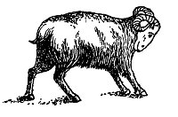
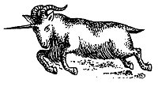

  
[Intangible Textual Heritage](../../index)  [Christianity](../index) 
[Revelation](../../bib/kjv/rev)  [Index](index)  [Previous](tbr057) 
[Next](tbr059) 

------------------------------------------------------------------------

p. 112

 

### 3. The Vision Of The "RAM" And The "HE-GOAT."

The explanation as to the meaning of the "**LITTLE HORN**" perplexed
Daniel, and he voiced it by saying "My '**cogitation**s' much troubled
me, and my **countenance changed in me** (he had a sad look); but I kept
the matter in **my heart**." Dan. 7:28. To comfort His Servant, God, two
years later, transported Daniel in vision to Shushan, the Capital of
Persia, and as he stood on the bank of the river Ulai, he saw a **RAM**
which had "**Two Horns**," one higher than the other, and the higher
came up last. He saw the **RAM** push "**Westward**," and
"**Northward**," and "**Southward**," and nothing could stand before it,
and it did according to its will. Dan. 8:4. While Daniel was
"considering" what the Vision of the **RAM** meant, he saw a **HE-GOAT**
come from the West unmolested, and he noticed it had a "**NOTABLE
HORN**" between its eyes, and when it reached the **RAM** it was moved
with "**choler**" or anger against it, and smote it with "**fury**," and
broke its. "**Two Horns**," and **knocked it down** and **stamped upon
it**. Then the **HE-GOAT** waxed great, but when it became strong its
"**GREAT HORN**" was broken off, and "**Four Notable Horns**" came up in
its place, and out of one of them sprang a "**LITTLE HORN**" which waxed
exceedingly great toward the "**South**," and toward the "**East**," and
toward the "**Pleasant Land**" (Palestine), Dan. 8; 5-9.

 

 

 

p. 113

When Daniel sought for the meaning of this Vision he heard a voice
say--"Gabriel, make this man to understand the Vision." Then Gabriel
said to Daniel the Vision belongs to the "**Time of the End**" (the End
of the Times of the Gentiles), and is to make thee know what shall come
to pass in the "**Last End of the Indignation**" (the Great
Tribulation). Dan. 8:15-19. Gabriel then informed Daniel that the
"**RAM**" stood for the "Medo-Persian Empire," with its two Kings,
Darius and his nephew Cyrus, that the "**HE-GOAT**" stood for the
"Grecian Empire," the "**GREAT HORN**" between its eyes for its first
King (Alexander the Great), and that the "**FOUR HORNS**" that took the
place of the "**GREAT HORN**," stood for "**Four Kingdoms**" into which
the "Grecian Empire" should be divided.

This explanation cleared up things considerably for Daniel. It revealed
to him that the "**TWO HORNS**" of the **RAM**, one higher than the
other, and the "**TWO SHOULDERS**" of the **BEAR**, one higher than the
other, and the "**TWO ARMS**" of the **COLOSSUS**, stood for the same
thing, the double Empire of Medo-Persia. He also saw that the "**FOUR
HORNS**" that came up in the place of the "**GREAT HORN**" corresponded
to the "**FOUR HEADS**" of the **LEOPARD**, and therefore must
correspond with the "**ABDOMEN**" and "**HIPS**" of the **COLOSSUS**,
and stand for the Grecian Empire, and its "**Fourfold Division**" among
the Generals of Alexander the Great.

But Daniel was still troubled as to the meaning of the "**LITTLE HORN**"
that he saw come out of one of the "**Four Horns**" of the **HE-GOAT**,
and Gabriel told him that it stood for a King of "**Fierce
Countenance**" who should stand up in the "**LATTER TIME**" of the
Kingdom, and who should stand up against the "**PRINCE OF PRINCES**"
(Christ). Dan. 8:23-25. The description of this "**LITTLE HORN**" so
clearly corresponded to the description of the "**LITTLE HORN**" that
Daniel saw arise amid the "**Ten Horns**" of the "Fourth Wild Beast,"
that he saw they described and stood for the **same Person**. The
revelation so overcame Daniel that he "fainted," and was sick certain
days. Dan. 8:27

------------------------------------------------------------------------

[Next: 4. The Vision of the ''Kings of the North And South.''](tbr059)
