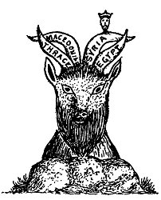

  
[Intangible Textual Heritage](../../index)  [Christianity](../index) 
[Revelation](../../bib/kjv/rev)  [Index](index)  [Previous](tbr058) 
[Next](tbr060) 

------------------------------------------------------------------------

### 4. The Vision Of The "KINGS OF THE NORTH AND SOUTH."

While Daniel had revealed to him that the "**LITTLE HORN**" should come
out of one of the "**Four Kingdoms**" into which the Empire of Alexander
the Great was divided, he was not at that time told which one, but 20
years later, in B. C. 533, the information was imparted to him in a
Fourth Vision. He saw in vision two Kings warring against each other.
One was called the "**King of the North**," the other the "**King of the
South**." This chapter (Dan. 11:1-45) is one of the most wonderfully
minute as to prophetic details of any chapter in the Bible. It
corresponds exactly with the profane history of the kings of Egypt and
Syria for over 350 years. From verse 5 to verse 31 we have an account of
what is called the "wars" of the "Kings of the North" (Syria) and of the
"Kings of the South" (Egypt). These end with the close of the reign of
Antiochus Epiphanes,

p. 114

\[paragraph continues\] B. C. 164. Verses 32-35 cover the whole period
from B. C. 164 down to the "**Time of the End**," that is, until the
"Seventieth Week" of Daniel's "Seventy Weeks." At verse 36 the "**WILFUL
KING**" appears, and from that verse down until the end of the Book of
Daniel we have an account of what is to befall Daniel's People in the
"**Latter Days**." As the description of the "**WILFUL KING**"
corresponded with the description of the "**LITTLE HORN**" of the
"**Fourth Wild Beast**" and the "**LITTLE HORN**" of the "**He-Goat**,"
and they were all to appear at the **same time**--the "**Time of the
End**." Daniel understood that they referred to one and the **same
Person**, and as the "**WILFUL KING**" would be the "**King of the
NORTH**," that is, of **Syria**, Daniel saw that the "**LITTLE HORN**"
was to rise on the "**SYRIAN HORN**" of the "**He-Goat**," in other
words that the "**LITTLE HORN**," or "**Antichrist**," shall come out of
**SYRIA**, and as **Syria** included **Assyria** that the "**LITTLE
HORN**" of Daniel is the same as the "**Assyrian**" of Isaiah. "When the
Lord hath performed His **whole work** upon Mount Zion and on Jerusalem
(which will not be until Christ comes back), I will punish the fruit of
the stout heart of the **KING OF ASSYRIA** (Antichrist) and the glory of
his **high looks**." Isa. 10:12. I will break the **ASSYRIAN**
(Antichrist) in **My Land** (Palestine), and upon My mountains **tread
him under foot**; then shall his yoke depart from off them (Israel), and
his burden from off their shoulders." Isa. 14:25. The context shows that
this prophecy is connected with the restoration of Israel to their own
land, not after the Babylonian Captivity, but a restoration that is
still future, for the Assyrian Empire had been swallowed up by the
Babylonian when the Prophet wrote and the **ASSYRIAN** King here
mentioned must be some **future** Assyrian King, for he is to be brought
to **Palestine** and **destroyed there**.

We must not allow ourselves to be confused by the different names given
the Antichrist, as the "King of Tyrus," the "King of Babylon," and the
"King of Assyria," for that section of the world will comprise one
territory in the days of the Antichrist and he will be known by all of
these titles.

From what we have thus far learned of the Antichrist, the probability is
that he will be a **SYRIAN JEW**, for it is not likely that the Jews
will accept as their Messiah one who is not a Jew, unless the claimant
by false pretense makes them believe he is one. This, however, does not
prevent the Antichrist being a **Roman citizen**, and the political head
of the revived Roman Empire, for Saul of Tarsus was both a Jew and a
Roman citizen.

Those who claim that the "**LITTLE HORN**" of Dan. 7, and the "**LITTLE
HORN**" of Dan. 8, are not the same, because the "**LITTLE HORN**" of
Dan. 7 arises amid the "**Ten Horns**" of the "**Fourth Wild Beast**,"
which represents the Roman Empire, and the "**LITTLE HORN**" of Dan. 8,
arises on one of the Horns of the "**He-Goat**" which represents the
Grecian Empire, and corresponds to the "**Third Wild Beast**," forget
that the Vision that the Apostle John had of the revived Roman Empire
(Rev. 13:1-2), the Roman Empire in its **last stage**, reveals the fact
that the "**last stage**" of the Roman Empire will include **all the
characteristics** of the whole Four Empires, Babylonian,

p. 115

 

 

 

\[paragraph continues\] Medo-Persian, Grecian and old Roman. This is
seen in the character of the "**BEAST**" John saw come up out of the
sea. It was like unto a **LEOPARD** (Greece), with the **feet** of a
**BEAR** (Medo-Persia), and the **mouth** of a **LION** (Babylon). The
fact that the **BODY** of the "**BEAST**" was like a **LEOPARD**
(Greece), reveals the fact that the preponderating feature of the
revived Roman Empire will be **GRECIAN**, and that therefore the "Ten
Federated Kingdoms," represented by the "**Ten Horns**" of the
"**Beast**," will include the **FOUR KINGDOMS** into which the **GRECIAN
Empire** was divided, viz., Egypt, Macedon, Thrace and **SYRIA**. It
follows therefore that the "**LITTLE HORN**" of the "**He-Goat**"
(Greece), will be the **LITTLE HORN** that rises among the "**Ten
Horns**" of the "**Fourth Wild Beast**" (Rome), for **Syria**, one of
the four divisions of the Grecian Empire, will be one of the component
parts of the Revived Roman Empire.

Again those who claim that Antiochus Epiphanes (B. C. 175-165), a king
of Syria, was the **LITTLE HORN**" of the "**He-Goat**," overlook the
fact, that, while Antiochus Epiphanes devastated Palestine and caused an
"**idol altar**" to be erected on the Brazen Altar of the Temple, on
which he offered swine-flesh, which was an abomination to the Jews, he
does not fulfil the description of the "**LITTLE HORN**" of the
"**He-Goat**" (Dan. 8:9-12, 23-25), for Antiochus Epiphanes, nor any
other ruler of the past, ever stood up against **JESUS**, the "**Prince
of Princes**." Neither was Antiochus Epiphanes "**broken without
hand**." He died a natural death at Tabae in B. C. 165. But the
"**LITTLE HORN**" of the "**He-Goat**" is to be "**broken without
hand**." His Kingdom is to be destroyed by a "**stone cut out of the
mountain WITHOUT HANDS**," and he himself shall be "**paralyzed**" by
the "**brightness of the Lord's Coming**" (1. Thess. 2:8), and he shall
be cast **ALIVE** into the "Lake of Fire." Rev. 19:20. There is no
intimation in Scripture that Antiochus Epiphanes is

p. 116

even to be regarded as a "**type**" of Antichrist. They are distinct
historical personages, and though they resemble each other in some
respects, yet they must not be confounded with each other. After this
prolonged exposition of Daniel's "Foreview" of the Antichrist, which has
seemed necessary to a proper understanding of the meaning of the "Beast"
which John saw come up out of the sea, we now turn to--

------------------------------------------------------------------------

[Next: III. Paul's Foreview](tbr060)
