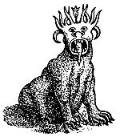
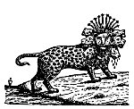
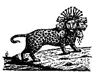
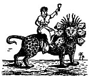
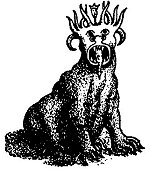
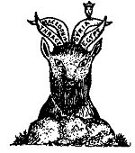
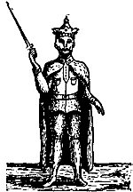
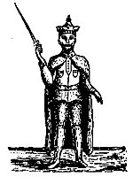
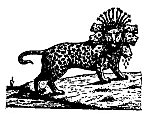

  
[Intangible Textual Heritage](../../index)  [Christianity](../index) 
[Revelation](../../bib/kjv/rev)  [Index](index)  [Previous](tbr060) 
[Next](tbr062) 

------------------------------------------------------------------------

### IV. JOHN'S FOREVIEW.

"John saw "**A 'BEAST'** rise up **out of the sea**, having '**SEVEN
HEADS**' and '**TEN HORNS**,' and upon his horns '**TEN CROWNS**,' and
upon his heads the name of **BLASPHEMY**. And the '**BEAST**' which I
saw was like a **LEOPARD**, and his **feet** were as the **feet of a
BEAR**, and his **mouth** as the **mouth of a LION**: and the
'**DRAGON**' gave him his **POWER**, and his **SEAT** (Throne), and
**GREAT AUTHORITY**. And I saw **one of his HEADS** as it were **wounded
to death**: and his deadly wound **was healed**: and **all the world
wondered after the 'BEAST.'** And they **worshipped the 'DRAGON'** which
gave power unto the '**BEAST**,' and they **worshipped the 'BEAST,'**
saying, **who is like unto the 'BEAST'**? **Who is able to make war with
him**? And there was given unto him a mouth **speaking great things and
blasphemies**; and power was given unto him to continue **forty and two
months**."

When we compare these "**Foreviews**," and note the similarity of
conduct of Daniel's "**LITTLE HORN**," Paul's "**MAN OF SIN**," and
John's "**BEAST**," and that Daniel's "**LITTLE HORN**" and John's
"**BEAST**" are to continue for the **same length of time--"Forty and
Two Months,"** or 3½ years, and that Daniel's "**LITTLE HORN**," Paul's
"**MAN OF SIN**," and John's "**BEAST**," are all to be destroyed in the
**same manner at Christ's "Second Coming,"** we see that they all
prefigure the same "**Evil Power**," which is after the "**Working of
Satan**," and which John in 1. John 2:18, calls **THE ANTICHRIST**. In
other words when we find in prophecy "**Three Symbolic Personages**"
that come upon the stage of action at the **same time**, occupy the
**same territory**, exhibit the **same character**, do the **same
work**, exist the same **length of time**, and meet the **same fate**,
they must symbolize the **SAME THING**.

Before we examine in detail John's "**BEAST**," it would be well for us
to compare it with Daniel's "**FOURTH WILD BEAST**."

p. 119

In comparing these two "**BEASTS**" we find that they both come up out
of the sea (the nations), and that they are utterly unlike

<table data-border="0" width="100%">
<colgroup>
<col style="width: 50%" />
<col style="width: 50%" />
</colgroup>
<tbody>
<tr class="odd">
<td data-valign="top" width="295">
<strong>Daniel's 
<u>Fourth Wild Beast</u></strong> 
Dan. 7:7, 8, 19, 20, 23-25.

 

"After this I saw in the night visions, and behold a <strong>FOURTH BEAST</strong>, <strong>dreadful</strong> and <strong>terrible</strong>, and <strong>strong exceedingly</strong>; and it had <strong>great iron teeth</strong>; it devoured and brake in pieces, and stamped the residue (the 3 preceding Beasts) with the feet of it; and it was <strong>diverse from</strong> all the Beasts that were before it; and it had <strong>TEN HORNS</strong>. I considered the <strong>HORNS</strong>, and, behold, there came up among them another <strong>LITTLE HORN</strong>, before whom there were <strong>THREE</strong> of the <strong>FIRST HORNS plucked up by the roots</strong>; and, behold, in <strong>THIS HORN</strong> were <strong>eyes</strong> like the <strong>eyes of a MAN</strong>, and a <strong>mouth speaking</strong> great things."

"Then I would know the truth of the <strong>FOURTH BEAST</strong>, which was diverse from all the others, exceeding dreadful, whose <strong>teeth were of iron</strong>, and his <strong>nails of brass</strong>; which devoured, brake in pieces, and stamped the residue with his feet; and of the <strong>TEN HORNS</strong> that were in his head, and of the <strong>OTHER</strong> which came up, and before whom three fell; even of <strong>THAT HORN</strong> that had <strong>eyes</strong>, and a <strong>mouth that spake very great things, whose look was more stout than his fellows</strong>."

"Thus he said, the <strong>FOURTH BEAST</strong> shall be the <strong>FOURTH KINGDOM</strong> upon earth, which shall be <strong>diverse from all kingdoms</strong>, and shall <strong>devour the whole earth</strong>, and shall <strong>tread it down</strong> and <strong>break it in pieces</strong>. And the <strong>TEN HORNS</strong> out of this Kingdom are <strong>TEN KINGS</strong> that shall arise; and another (King) shall rise after them; and he shall be <strong>diverse</strong> from the first, and he shall <strong>subdue THREE KINGS</strong>. And he shall speak great words against the Most High, and shall wear out the saints of the Most High, and think to <strong>change times and laws</strong>; and they shall be given into his hand until a <strong>TIME</strong> and <strong>TIMES</strong> and the <strong>DIVIDING OF TIME</strong>."
</td>
<td data-valign="top" width="295">
<strong>John's 
<u>Beast Out Of The Sea</u></strong> 
Rev. 13:1-7

 

"I saw a <strong>BEAST</strong> rise up out of the <strong>SEA</strong>, having <strong>SEVEN HEADS</strong> and <strong>TEN HORNS</strong>, and upon his horns <strong>TEN CROWNS</strong>, and upon his heads the <strong>NAMES OF BLASPHEMY</strong>. And the <strong>BEAST</strong> which I saw was like unto a <strong>LEOPARD</strong>, and his <strong>feet</strong> were as the feet of a <strong>BEAR</strong>, and his <strong>mouth</strong> as the mouth of a <strong>LION</strong>; and the Dragon gave him his <strong>power</strong>, and his <strong>seat</strong>, and great <strong>authority</strong>. And I saw <strong>one of his HEADS</strong> as it were <strong>wounded to death</strong>; and his <strong>deadly wound was healed</strong>; and all the world wondered after the <strong>BEAST</strong>. . . . And there was given unto him a mouth <strong>speaking great things</strong> and <strong>blasphemies</strong>; and power was given unto him to continue <strong>FORTY AND TWO MONTHS</strong>. And he opened his mouth in blasphemy against God, to blaspheme His Name, and His Tabernacle, and them that dwell in Heaven. And it was given unto him to make war with the saints, and to overcome them; and power was given him over all kindreds, and tongues, and nations."
</td>
</tr>
</tbody>
</table>

any beast we have ever heard of. Daniel's "Beast" was **dreadful** and
**terrible**, and **strong exceedingly**; and it had **great iron
teeth**, and **nails of brass**; while John's "Beast" was like a
**LEOPARD**, with the

p. 120

feet of a **BEAR**, and the mouth of a **LION**. As Daniel's "Beast"
represented the "**FOURTH KINGDOM**" upon the earth, the Roman Empire,
it is evident that its characteristics describe the **old** Roman
Empire, while the characteristics of John's Beast represent the
**revived** Roman Empire. We know that the Old Roman Empire was
"**strong exceedingly**" and its grip and power were like a beast with
"**great iron teeth**" and "**nails of brass**," and from the
description of John's "Beast" we learn that the revived Roman Empire
shall embody all the characteristics of the Four World Empires, as seen
in its **LEOPARD** like body, its feet of a **BEAR**, and its mouth of a
**LION**. That both "Beasts" have **TEN HORNS** reveals the fact that
they will be in existence at the time indicated by the **TEN TOES** of
the Colossus, with which they correspond, which will be just before the
setting up of the "Stone" or Millennial Kingdom of Christ. We are told
that the "**TEN HORNS**" of Daniel's "Beast" stand for "**TEN KINGS**,"
and the "**TEN HORNS**" of John's "Beast" stand for the same. Rev.
17:12. From this we see that both Daniel and John foresaw that the Roman
Empire was to be eventually divided into "Ten Separate but Federated
Kingdoms."

While both "Beasts" have **TEN HORNS**, they differ in that John's had
"**SEVEN HEADS**" while Daniel's had but **ONE**, and among the "**TEN
HORNS**" on Daniel's "Beast" there came up a "**LITTLE HORN**," which is
not seen amid the "**TEN HORNS**" of John's Beast. These, as we shall
see, are features that refer to the last stage of the "Beast" and show
that we cannot 'understand the last stage of the "Beast" without
carefully comparing Daniel's and John's "Beasts," for the "**LITTLE
HORN**" of Daniel's "Beast" plucks up **THREE** of the "**TEN HORNS**"
and destroys them, or takes their kingdom away, a thing that John omits
to tell us. Again the Antichristian character of Daniel's "Beast" is
seen in its "**LITTLE HORN**" whose conduct corresponds with not a part,
but the whole of John's "Beast," and that for the same length of time,
"**TIME**" and "**TIMES**" and the "**DIVIDING OF TIME**" which equals
"**FORTY AND TWO MONTHS**."

It now remains to analyze the "**Beast**" that John saw come up out of
the sea, and try to discover the meaning of its various members.

We have two descriptions of this "**Beast**."

Daniel's "Fourth Wild Beast" as we have seen, represents the Roman
Empire as it existed from B. C. 30, until as a nation it shall cease to
exist. While it was divided in A. D. 364, as the result of an
ecclesiastical schism, into its Eastern and Western Divisions, and lost
its national life as a world power, yet it has never lost its religious
existence or influence as seen in the continuance of the Greek and Roman
Churches, and Roman Law is still a controlling power in our laws. In
this sense the Roman Empire in its influence has never ceased to exist.
We are now to consider it in its last stage as out-lined in John's
"Beast."

In the two descriptions of John's Beast as given above it is very
important to see that the "Beast" has a "Dual" meaning. It represents
both the revived Roman Empire, and its Imperial Head the

p. 121

**JOHN'S TWO VISIONS  
<u>OF THE BEAST</u>**

<table data-border="0" width="100%">
<colgroup>
<col style="width: 50%" />
<col style="width: 50%" />
</colgroup>
<tbody>
<tr class="odd">
<td data-valign="top" width="295">
<strong><u>BEAST OUT OF THE SEA</u></strong> 
Rev. 13:1-7

 

"I saw a <strong>BEAST</strong> rise up out of the <strong>SEA</strong>, having <strong>SEVEN HEADS</strong> and <strong>TEN HORNS</strong>, and upon his horns <strong>TEN CROWNS</strong>, and upon his heads the <strong>NAMES OF BLASPHEMY</strong>. And the <strong>BEAST</strong> which I saw was like unto a <strong>LEOPARD</strong>, and his <strong>feet</strong> were as the feet of a <strong>BEAR</strong>, and his <strong>mouth</strong> as the mouth of a <strong>LION</strong>; and the Dragon gave him his <strong>power</strong>, and his <strong>seat</strong>, and great <strong>authority</strong>. And I saw <strong>one of his HEADS as it were wounded to death</strong>; and his <strong>deadly wound was healed</strong>; and all the world wondered after the <strong>BEAST</strong>. . . . And there was given unto him a mouth <strong>speaking great things</strong> and <strong>blasphemies</strong>; and power was given unto him to continue <strong>FORTY AND TWO, MONTHS</strong>. And he opened his mouth in blasphemy against God, to blaspheme His Name, and His Tabernacle, and them that dwell in Heaven. And it was given unto him to make war with the saints, and to overcome them; and power was given him over all kindred.,, and tongues, and nations."
</td>
<td data-valign="top" width="295">
<strong><u>SCARLET COLORED BEAST</u></strong> 
Rev. 17:3, 7-17

 

"I saw a Woman sit upon a <strong>scarlet colored BEAST</strong>, full of <strong>names of blasphemy</strong>, having <strong>SEVEN HEADS</strong> and <strong>TEN HORNS</strong>. . I will tell thee the mystery of the Woman, and of the <strong>BEAST</strong> that carried her, which hath the <strong>SEVEN HEADS</strong> and <strong>TEN HORNS</strong>. The <strong>BEAST</strong> that thou sawest <strong>WAS</strong>, and <strong>IS NOT</strong>; and shall <strong>ascend out of the BOTTOMLESS PIT</strong>, and go into <strong>perdition</strong>. The <strong>SEVEN HEADS</strong> are <strong>SEVEN MOUNTAINS</strong>, on which the Woman sitteth. And they (the <strong>Seven Heads</strong>, R. V.) are <strong>SEVEN KINGS</strong>; <strong>FIVE are fallen</strong>, and <strong>ONE is</strong>, and the <strong>OTHER</strong> is <strong>not yet come</strong>; and when he cometh, he must continue a <strong>short space</strong>. And the <strong>BEAST</strong> that <strong>WAS</strong>, and <strong>IS NOT</strong>, even he is the <strong>EIGHTH</strong>, and is of the <strong>SEVEN</strong>, and goeth into <strong>perdition</strong>. And the <strong>TEN HORNS</strong> which thou sawest are <strong>TEN KINGS</strong>, which have received no kingdom as yet; but receive power as kings one hour with the <strong>BEAST</strong>. These have <strong>one mind</strong>, and shall give their <strong>power</strong> and <strong>strength</strong> unto the <strong>BEAST</strong>. . . . And the <strong>TEN HORNS</strong> which thou sawest upon the <strong>BEAST</strong>, these shall <strong>hate</strong> the <strong>WHORE</strong>, and shall make her <strong>desolate</strong> and <strong>naked</strong>, and shall <strong>eat her flesh</strong>, and <strong>burn her with fire</strong>. For God hath put in their hearts to fulfil His will and to agree, and give their kingdom unto the <strong>BEAST</strong>, until the words of God shall be fulfilled."
</td>
</tr>
</tbody>
</table>

\[paragraph continues\] Antichrist. As the revived Roman Empire it is
seen coming up out of the sea of the nations, as the Antichrist it comes
up out of the **ABYSS**. For instance it cannot be said of the Roman
Empire of John's day, that it **WAS**, and **IS NOT**, for it was at the
height of its power in John's day. Neither can it be said of it that it
shall **ascend out of the pit** and go into **PERDITION**, that could
only be said of a **person**. Again we must distinguish between the
**body** of the "Beast" and its **heads** and **horns**. The **body**
being that of a **LEOPARD**, with the feet of a **BEAR**, and the mouth
of a **LION** is to show that the revived Roman Empire in its last stage
will include the characteristics of the first "**Three Wild Beasts**" of
Daniel, that is,

p. 122

of the **LION** (Babylon), the **BEAR** (Medo-Persia), and the
**LEOPARD** (Greece), and as the largest part of the "Beast," the
**body**, is represented by the **LEOPARD**, the prevailing
characteristic of the revived Roman Empire will be **GRECIAN**.

The "Beast" that comes up out of the sea (Chap. 13), has **SEVEN HEADS**
and **TEN HORNS**, and the "**Horns**" are **CROWNED**. This represents
the "Beast," or Empire, at the height of its power, when it will have
all its "**Heads**," and when the **TEN KINGS**, the heads of the **TEN
KINGDOMS** into which the Empire shall be divided, will have been
**crowned**. The "Beast" that comes up out of the **ABYSS** also has
**SEVEN HEADS** and **TEN HORNS**, but they are **not crowned**, for the
**TEN KINGS** represented by the **TEN HORNS**, have not **as yet**
received their kingdom. (Rev. 17:12.) This implies that the "Beast" of
Rev. 17, represents the Antichrist at the beginning of the "Week." As
confirmation of this view the "**WOMAN**" is seen at this stage riding
the "Beast." For while the "**Scarlet Clothed Woman**" is not seen until
chapter 17, it is clear that she rides the "Beast" from the
**beginning** of the "Week," for she represents the "**PAPAL CHURCH**"
that comes into power after the true Church has been caught out. During
the wars preceding the rise of Antichrist the nations that will then be
found in the geographical limits of the Old Roman Empire will form an
"Alliance" for mutual protection. Those nations will be ten in number,
represented by the "**TEN HORNS**" of the Beast. No doubt the "Papal
Church" will play a prominent part in those proceedings. She will be
rewarded by restoration to political power, and this union of Church and
State, in which the Church will have control, is shown by the **WOMAN
riding the Beast**, thus dominating it. But when the "Ten Kings" shall
receive their Kingdoms and be **CROWNED**, they "shall **hate** the
**WHORE**, and shall make her **desolate** and **naked**, and shall
**eat her flesh**, and **burn her with fire**." (Vs. 16.)

While we are told in Rev. 17:9 that the "**SEVEN HEADS**" of the "Beast"
represent "**SEVEN MOUNTAINS**" (this is to identify it with the Roman
Empire), we are told in the next verse (R. V.) that they (the "Seven
Heads") also represent "**SEVEN KINGS**" of whom "Five **are fallen**,
and one **is**, and the other is **not yet come**; and when he cometh he
must continue a **short space**." That is, in John's day "Five" of these
Kings had fallen, one was the then ruling Emperor, and the "Seventh" was
yet to come. Who are meant by the first "Five Kings" that had fallen we
do not know. The King that was on the throne in John's day was Domitian,
who had banished John to the Isle of Patmos. The last or "**SEVENTH
KING**" who is yet to come is undoubtedly the **ANTICHRIST**. We are
told in Rev. 13:3, that one of the "**SEVEN HEADS**," or "**KINGS**,"
received a **deadly wound**. Which one is not stated. The inference is
that it is the last, for the Beast has **all** of his "**HEADS**" before
one of them is wounded. In Rev. 17:11 he is called the Beast that
**WAS**, and **IS NOT**, even he is the "**EIGHTH**," and **is of the
"SEVENTH,"** and **goeth into PERDITION**. The only clear explanation of
this passage is that the "**SEVENTH HEAD**"--**THE ANTICHRIST**, is the
one who receives the "**deadly wound**," probably at the hand of an

p. 123

**<u>THE ANTICHRIST</u>**

<table data-border="1" width="100%">
<colgroup>
<col style="width: 20%" />
<col style="width: 20%" />
<col style="width: 20%" />
<col style="width: 20%" />
<col style="width: 20%" />
</colgroup>
<tbody>
<tr class="odd">
<td data-valign="top" width="164">
<strong><u>Fourth Wild Beast</u> 
</strong>Dan. 7:7, 8, 19.20, 23-25.
</td>
<td data-valign="top" width="164">
<strong><u>Daniel's Foreview</u> 
The Little Horn Of The He-Goat</strong> 
Dan. 8:8-12, 23-25.
</td>
<td data-valign="top" width="164">
<strong><u>The Wilful King</u> 
</strong>Dan. 11:36-39.
</td>
<td data-valign="top" width="164">
<strong><u>Paul's Foreview</u> 
</strong>2 Thess. 2:3.12
</td>
<td data-valign="top" width="164">
<strong><u>John's Foreview</u></strong> 
<strong>Beast Out Of The Sea</strong> 
Rev. 13:1-7
</td>
</tr>
<tr class="even">
<td data-valign="bottom" width="164">
 
</td>
<td data-valign="bottom" width="164">
 
</td>
<td data-valign="bottom" width="164">
 
</td>
<td data-valign="bottom" width="164">
 
</td>
<td data-valign="bottom" width="164">
 
</td>
</tr>
<tr class="odd">
<td data-valign="top" width="164">
"After this I saw in the night visions, and behold a <strong>FOURTH BEAST</strong>, <strong>dreadful</strong> and <strong>terrible</strong>, and s<strong>trong exceedingly</strong>; and it had greet <strong>iron teeth</strong>; it devoured and brake in pieces, and stamped the residue (the 3 preceding Beasts) with the feet of it; and it was <strong>diverse from</strong> all the Beasts that were before it; and it had <strong>TEN HORNS</strong>. I considered the <strong>HORNS</strong>, and, behold, there came up among them another <strong>LITTLE HORN</strong>, before whom there <strong>THREE</strong> of the FIRST HORNS plucked up by the roots; and, behold, in <strong>THIS HORN</strong> were <strong>eyes</strong> like the <strong>eyes of a MAN</strong>, and a mouth <strong>speaking</strong> great things."

"Then I would know the truth of the <strong>FOURTH BEAST</strong>, which was diverse from all the others, exceeding dreadful, whose <strong>teeth were of iron</strong>, and his <strong>nails of brass</strong>; which devoured, brake in pieces, and stamped the residue with his feet; and of the <strong>TEN HORNS</strong> that were in his head, and of the <strong>OTHER</strong> which came up, and before whom three fell; even of <strong>THAT HORN</strong> that had <strong>eyes</strong>, and a <strong>mouth spake very greet things, whose look was more stout then his fellows</strong>."

"Thus he said, the <strong>FOURTH BEAST</strong> shall be the <strong>FOURTH KINGDOM</strong> upon earth, which shall be <strong>diverse from all kingdoms</strong>, and shall <strong>devour the whole earth</strong>, and shall <strong>tread it down</strong> and <strong>break it in pieces</strong>. And the <strong>TEN HORNS</strong> out of this Kingdom are <strong>TEN KINGS</strong> that shall arise; and another (King) shall arise after them; and he shall be <strong>diverse</strong> from the first, and he shall <strong>subdue THREE KINGS</strong>. And he shall speak great words against the Most High, and shell wear out the saints of the Most High, and think to change <strong>times and laws</strong>; and they shall be given into his hand until a <strong>TIME</strong> and <strong>TIMES</strong> and the <strong>DIVIDING OF TIME</strong>."
</td>
<td data-valign="top" width="164">
"Therefore the He-Goat waxed very great; and when he was strong, the <strong>GREAT HORN</strong> was broken; and for it came up <strong>FOUR NOTABLE ONES</strong> toward the four winds of heaven. And out of one of them came forth a <strong>LITTLE HORN</strong>, which <strong>waxed exceeding great</strong>, toward the <strong>South</strong> and toward the <strong>East</strong>, and toward the <strong>Pleasant Land</strong> (Palestine). And it waxed great, even to the Host of Heaven; and it <strong>cast down</strong> some of the Host and of the Stars to the ground, and <strong>stamped upon them</strong>. Yea, he magnified himself even to the <strong>Prince of the Host</strong> and by him the <strong>daily sacrifice was taken away</strong>, and the place of his Sanctuary was cast down. And an host was given him against the daily sacrifice by reason of transgression, and it (he, the <strong>LITTLE HORN</strong>) cast down the truth to the ground and it (the <strong>LITTLE HORN</strong>) <strong>practised</strong> and <strong>prospered</strong>.

And in the <strong>LATTER TIME</strong> of their kingdom, when the <strong>TRANSGRESSORS ARE COME TO THE FULL</strong>, a King of <strong>FIERCE COUNTENANCE</strong>, and understanding <strong>dark sentences</strong>, shall stand up. And his power shall be mighty, but <strong>not by his own power</strong>; and he shall <strong>destroy wonderfully</strong>, and shall <strong>prosper</strong>, and <strong>practice</strong>, and shall <strong>destroy the mighty</strong> and the <strong>Holy People</strong>. And through his policy also he shall cause <strong>craft</strong> (all kinds of business) to <strong>prosper in his hand</strong>; and he shall <strong>magnify himself in his heart</strong>, and by peace shall destroy many: he shall also <strong>stand up against the PRINCE OF PRINCES</strong> (Christ) but he shall be <strong>broken without hand</strong>."
</td>
<td data-valign="top" width="164">
"And the <strong>KING</strong> shall do according to <strong>his Will</strong>; and he shall <strong>exalt himself</strong> and <strong>magnify himself above every god</strong>, and shall speak marvelous thing <strong>against the God of gods</strong>, and shall prosper till the indignation be accomplished; for that, that is determined, shall be done. Neither shall he regard the <strong>God of his fathers</strong>, or the <strong>desire of woman</strong>, nor regard <strong>any god</strong>; for he shall magnify himself above all. But in his estate shall he honor the <strong>God of forces</strong>; and a god <strong>whom his fathers knew not</strong> shall he honor with <strong>gold</strong>, and <strong>silver</strong>, and with <strong>precious stones</strong> and <strong>pleasant things</strong>. Thus shall he do in the most strong holds with a <strong>strange god</strong>, whom he shall <strong>acknowledge and increase with glory</strong>; and he shall call them to rule over many, and shall divide the land for gain"
</td>
<td data-valign="top" width="164">
'Let no man deceive you by any means; no man for '<strong>THAT DAY</strong>' (the Day of the Lord") shall not come except there come a <strong>falling away</strong> first, rod that

'<strong>MAN OF SIN</strong>'

be revealed. The

'<strong>SON OF PERDITION</strong>,'

who opposeth and exalteth himself above all, that is called God, or that is worshipped; so that he <strong>AS GOD</strong> sitteth in the Temple of God (the rebuilt Temple of Jerusalem), showing himself that he <strong>IS GOD</strong>. . . . For the

'<strong>MYSTERY OF INIQUITY</strong>'

doth already work (in Paul's day); only He (the Holy Spirit) who now letteth (restraineth, R. V.) will let (restrain), until He be taken out of the way. And then shall

'<strong>THAT WICKED</strong>'

<strong>be revealed</strong>, whom the Lord shall consume with the spirit (breath) <strong>of His Mouth</strong> and shall destroy with the <strong>brightness</strong> (manifestation, R. V.) <strong>of His Coming</strong>. Even him, whose coming is after the <strong>working of Satan</strong> with all <strong>power</strong> and <strong>signs</strong> and <strong>lying wonders</strong>, and with all <strong>deceivableness of unrighteousness in them that perish</strong>: because they received not the <strong>love of the Truth</strong> (Christ) that they might be saved. And for this cause God shall send them <strong>strong delusion</strong> that they should believe a <strong>lie</strong> (<strong>THE LIE</strong>. American Standard 1911 Bible), that they all might be <strong>damned</strong> who believed not the truth, but had pleasure in unrighteousness."
</td>
<td data-valign="top" width="164">
"I saw a <strong>BEAST</strong> rise up out of the <strong>SEA</strong>, having <strong>SEVEN HEADS</strong> and <strong>TEN HORNS</strong>, and upon his horns <strong>TEN CROWNS</strong>, and upon his heads the <strong>NAMES OF BLASPHEMY</strong>. And the <strong>BEAST</strong> which I sew war like unto a <strong>LEOPARD</strong>, and his <strong>feet</strong> were as the feet of a <strong>BEAR</strong>, and his <strong>mouth</strong> as the mouth of a <strong>LION</strong>; and the Dragon gave him his <strong>power</strong>, and his <strong>seat</strong>, and great <strong>authority</strong>. And I saw <strong>one of his HEADS</strong> as it were wounded to death; and his <strong>deadly wound was healed</strong>: and all the world wondered after the <strong>BEAST</strong>. . . . And there was given to him a mouth <strong>speaking great things</strong> and <strong>blasphemies</strong>; and power was given unto him to continue <strong>FORTY AND TWO MONTHS</strong>. And he opened his mouth in blasphemy against God, to blaspheme His Nome, and His Tabernacle, and them that dwell in Heaven. And it was given unto him make war with the saints, and to overcome them; and power was given him over all kindreds, and tongues, and nations".
</td>
</tr>
</tbody>
</table>

 

p. 124

assassin, and as his body is lying in state prepared for burial, he
rises from the dead (Vs. 14), and thus becomes the "**EIGHTH**," though
he is of the "**SEVENTH**." By this resurrection of the Antichrist,
Satan imitates the Resurrection of Christ and makes the world "**wonder
after the Beast**" (Rev. 13:3), and this adds to his prestige and power.
If this happens at the "Middle of the Week," at the time the Dragon is
cast out of Heaven, it will account for the great change that takes
place in the Antichrist, for before receiving his "deadly wound" he will
be sweet and lovable, but after his resurrection or recovery he will
become Devilish, the result of the Dragon incarnating himself in him. It
is at this time that he breaks the Covenant with the Jews and desecrates
the Temple by setting up the "Abomination of Desolation" which is an
"Idol Image" of himself--the "**DESOLATOR**." As the "**LITTLE HORN**"
of Daniel's "Fourth Wild Beast" he will destroy three of the "Ten Kings"
and firmly establish himself in the place of power, and as he, as the
"**LITTLE HORN**," does not appear until **after** the "**TEN HORNS**,"
or "Ten Federated Kingdoms," come into existence, it is clear that the
Antichrist does not form the Federation, but is the outgrowth of it.

He will be a "composite" man. One who embraces in his character the
abilities and powers of Nebuchadnezzar, Xerxes, Alexander the Great and
Caesar Augustus. He will have the marvelous gift of attracting
unregenerate men, and the irresistible fascination of his personality,
his versatile attainments, superhuman wisdom, great administrative and
executive ability, along with his powers as a consummate flatterer, a
brilliant diplomatist, a superb strategist, will make him the most
conspicuous and prominent of men. All these gifts will be conferred on
him by Satan, whose tool he will be, and who will thus make him the--

**SUPERMAN**.

He will pose as a great humanitarian, the friend of men, and the
especial friend of the Jewish race, whom he will persuade that he has
come to usher in the "Golden Age" as pictured by the prophets, and who
will receive him as their Messiah.

He will intoxicate men with a strong delusion and his never varying
success. And when he shall be slain and rise again he will have lost
none of these powers, but will be in addition the embodiment of all
kinds of wickedness and blasphemy.

"He shall speak great words against the Most High, and shall wear out
the saints of the Most High, and think to change **times** and
**laws**." Dan. 7:25.

"He shall also **stand up against the 'Prince of Princes'**"
(**Jesus**). Dan. 8:25.

"He shall do according to his will; and he shall exalt himself and
magnify himself above every god, and shall speak marvellous things
against the God of Gods." Dan. 11:36.

"Who opposeth and exalteth himself above all that is called God, or that
is worshipped; so that he **AS GOD** sitteth in the Temple of God (at
Jerusalem) showing himself that he **IS GOD**. . . . whose coming is
after the **Working of Satan** with all **Power** and **Signs** and
**Lying Wonders**." 2. Thess. 2:3-9.

p. 125

There has never as yet appeared on this earth a person who answers the
description given in the above Scriptures. Such a character is almost
inconceivable. No writer would have invented such a character.

------------------------------------------------------------------------

[Next: 7. The Beast Out of the Earth](tbr062)
