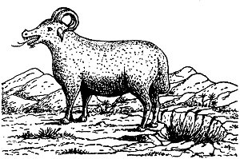
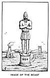

  
[Intangible Textual Heritage](../../index)  [Christianity](../index) 
[Revelation](../../bib/kjv/rev)  [Index](index)  [Previous](tbr061) 
[Next](tbr063) 

------------------------------------------------------------------------

### 7. THE BEAST OUT OF THE EARTH.

### The "False Prophet" Or "Anti-Spirit."

Rev. 13:11-18.

 

"And I beheld **another 'BEAST'** coming up out of the **EARTH**; and he
had **two horns like a lamb**, and he **spake as a DRAGON**. And he
exerciseth all the power of the 'First Beast' before him, and causeth
the earth and them which dwell therein to worship the 'First Beast,'
whose **deadly wound was healed**. And he doeth great wonders, so that
he maketh **fire come down from heaven on the earth in the sight of
men**, and deceiveth them that dwell on the earth by the means of those
miracles which he had power to do in the sight of the 'Beast'; saying to
them that dwell on the earth, that they should make an '**IMAGE TO THE
BEAST**,' which had the wound by a sword, and did live. And he had power
to give **LIFE UNTO THE 'IMAGE OF THE 'BEAST,'** that the '**IMAGE OF
THE BEAST' SHOULD BOTH SPEAK, AND CAUSE THAT AS MANY AS WOULD NOT
WORSHIP THE 'IMAGE OF THE BEAST' SHOULD BE KILLED**. And he causeth all,
both small and great, rich and poor, free and bond, to receive a
'**MARK**' in their **right hand**, or in their **foreheads**; and that
no man might **BUY** or **SELL**, save he that had the '**MARK**,' or
the '**NAME OF THE BEAST**,' or the '**NUMBER OF HIS NAME**.' Here is
wisdom. Let him that hath understanding count the '**NUMBER OF THE
BEAST**': for it is the '**NUMBER OF MAN**': and his number is **SIX
HUNDRED THREESCORE AND SIX**."

After the Apostle John had seen and described the "Beast" that came up
**out of the SEA**, he saw another "Beast" come up **out of the EARTH**.
This "Second Beast," while John does not say it **was a lamb**, had
**"Two Horns" "like a lamb,"** that is, it was **LAMB-LIKE**. Because of
this resemblance many claim that the "Second Beast" is the Antichrist,
for Antichrist is supposed to imitate Christ. While the **LAMB**
(Christ) is mentioned in the Book of Revelation 22 times,

p. 126

the description given of Him in chapter 5:6, is that of a lamb having
"**SEVEN HORNS**" and not "**TWO**." This differentiates Him from the
"**lamb-like Beast**" that comes up out of the earth, who, though he is
"**lamb-like in appearance SPEAKS AS A DRAGON**."

The "Second Beast" has a name. He is called the "**FALSE PROPHET**"
three times. First in chapter 16:13, then in chapter 19:20, and again in
chapter 20:10. Twice he is associated with the "First Beast"
(Antichrist) and once with the "Dragon" (Satan) and the "First Beast,"
and as they are **PERSONS** so must he be. The fact that he is called
the "False Prophet" is proof that he is not the "Antichrist." Jesus had
a foreview of him when He said--"There shall arise '**FALSE CHRISTS**'
and '**FALSE PROPHETS**,' and shall show **GREAT SIGNS AND WONDERS**:
insomuch that, if it were possible they shall deceive the very elect."
Matt. 24:24. Here Jesus differentiates between "**FALSE CHRISTS**" and
"**FALSE PROPHETS**," therefore the "**ANTICHRIST**" and the "**FALSE
PROPHET**" cannot be the same.

That the "Second Beast" comes up **out of the EARTH** may signify that
he will be a **resurrected person**. If, as was hinted at, "Antichrist"
was Judas resurrected, why should not the "False Prophet" also be a
resurrected person? There will be two persons, as we have seen, who
shall come back from Heaven as the "Two Witnesses," Moses and Elijah,
why not two persons come up from "The Underworld," brought up by Satan
to counteract the work of the "Two Witnesses"? The fact that the "First
Beast" (Antichrist), and the "Second Beast" (False Prophet) are cast
**ALIVE** into the "Lake of Fire" (Rev. 19:20) is further proof that
they are more than ordinary mortals, and that the "First Beast" is
**more** than the last ruling Emperor of the revived Roman Empire. He is
the **Antichrist**, Satan's **SUPERMAN**.

In the "Dragon," the "Beast," and the "False Prophet," we have the
"**SATANIC TRINITY**," Satan's imitation of the "Divine Trinity." In the
unseen and invisible "Dragon" we have the **FATHER** (the **ANTI-GOD**).
In the "Beast" we have the "**SON OF PERDITION**" (the **ANTI-CHRIST**),
**begotten** of the Dragon, who appears on the earth, dies, and is
resurrected, and to whom is given a throne by his Father the Dragon. In
the "False Prophet" we have the "**ANTI-SPIRIT**," who **proceeds** from
the "Dragon Father" and "Dragon Son," and whose speech is like the
Dragon's. The "Dragon" then will be the "**ANTI-GOD**," the "Beast" the
"**ANTI-CHRIST**," and the "False Prophet" the "**ANTI-SPIRIT**," and
the fact that all three are cast **ALIVE** into the "Lake of Fire" (Rev.
20:10) is proof that they together form a "**Triumvirate**" which we may
well call--"**THE SATANIC TRINITY**."

Again the "Antichrist" is to be a **KING** and rule over a **KINGDOM**.
He will accept the "Kingdoms of this world" that Satan offered Christ,
and that Christ refused. Matt. 4:8-10. He will also **EXALT** himself,
and claim to be God. 2. Thess. 2:4. But the "False Prophet" is not a
King, He does not exalt himself, he exalts the "First Beast"
(Antichrist). His relation to the "First Beast" is the same as the Holy
Spirit's relation to Christ. He causeth the earth

p. 127

 

[  
Click to enlarge](img/12700.jpg)  
The Gentile Nations  

 

p. 128

 

[  
Click to enlarge](img/12800.jpg)  
Image of the Beast  

 

p. 129

and them which dwell therein to worship the "First Beast." He also has
power to give **life**, and in this he imitates the Holy Spirit. And as
the followers of Christ are sealed by the Holy Spirit until the "**Day
of Redemption**" (Eph. 4:30); so, the followers of Antichrist shall be
sealed by the False Prophet until the "**Day of Perdition**." Rev.
13:16-17.

The False Prophet will be a "Miracle Worker." While Jesus was a "miracle
worker," He did all His mighty works in the "**power**" of the Holy
Spirit. Acts 10:38. Among the miracles that the False Prophet will
perform he will bring down **FIRE FROM HEAVEN**. As we have seen under
the work of the "Two Witnesses," chapter 11:1-14, there will probably be
a "**FIRE-TEST**" between Elijah and the False Prophet, and the test as
to who is God of Mt. Carmel will be repeated. That Satan, who will then
energize the False Prophet, can do this is clear from Job 1:16, where
Satan, having secured per-mission from God to touch all that Job had,
brought down "**fire from heaven**" and burned up Job's sheep and
servants.

The False Prophet then commands the people to make an

"**IMAGE OF THE BEAST**."

This is further proof that the "First Beast" is the Antichrist. It is a
strange weakness of mankind that they must have some **VISIBLE** God to
worship, and when the Children of Israel, who had been delivered from
Egypt under Moses' leadership, thought he had forsaken them because he
did not come down from the Mount, they called Aaron to make them gods
which should go before them, and Aaron made for them the "**GOLDEN
CALF**." Ex. 32:1-6. So the False Prophet will have the people make for
the purpose of worship an "**IMAGE OF THE BEAST**." But the wonderful
thing about the "**IMAGE**" is that the False Prophet will have power to
give **LIFE** to it, and cause it to **SPEAK**, and to demand that all
who will not worship it shall be put to death. In other words the
"**IMAGE**" will be a **living, speaking, AUTOMATON**.

This "Image" reminds us of the "**GOLDEN IMAGE**" that Nebuchadnezzar
commanded to be made and set up in the "Plain of Dura," in the Province
of Babylon (Dan. 3:1-30), before which, at the sounding of musical
instruments, the people were commanded to bow down and worship under
penalty, for those who disobeyed, of being cast into a "**BURNING FIERY
FURNACE**." Doubtless there will be many in the "Day of Antichrist" who
will refuse to bow down and worship the "**Image of the Beast**," and
who will not escape as did the "Three Hebrew Children," though God may
inter-pose in a miraculous way to deliver some. And as if this was not
enough the False Prophet shall cause--"**ALL**, both small and great,
rich and poor, free and bond, to receive a '**MARK**' in their **RIGHT
HAND**, or in their **FOREHEAD**; and that no man might **BUY** or
**SELL**, save he that has the '**MARK**' or the '**NAME OF THE
BEAST**,' or the '**NUMBER OF HIS NAME**'." This "**MARK**" will be
known as the

"**BRAND OF HELL**."

This is what the world is fast coming to. The time is not far distant
when the various "Trusts" and "Combinations of Capital"

p. 130

will be merged into a "**FEDERATION OF TRUSTS**," at the head of which
shall be a "**NAPOLEON OF CAPITAL**." Ultimately this "Federation of
Trusts" will extend to the whole world, at the head of which shall be
**THE ANTICHRIST**, and the **producer** and **consumer** will be
powerless in the tentacles of this **OCTOPUS**, and no man shall be able
to **BUY** or **SELL** who has not the "**MARK OF THE BEAST**" either
upon his "**right hand**" or on his "**forehead**." This "**Mark**" will
be **BRANDED** or burnt on. It will probably be the "**NUMBER OF THE
BEAST**" or "666." The number "666" is the "**NUMBER OF MAN**," and
stops short of the perfect number **SEVEN**. Man was created on the
**SIXTH** day. Goliath, the opposer of God's people, a type of Satan,
was 6 cubits in height, he had 6 pieces of armor, and his spearhead
weighed 600 shekels. 1. Sam. 17:4-7. Nebuchadnezzar's Image, a type of
the "Image of the Beast," was 60 cubits in height, 6 cubits wide, and 6
instruments of music summoned the worshippers. Dan. 3:1-7.

In that day men will doubtless prefer to have the "**MARK**" on the back
of their right hand so it can be readily seen in the act of signing
checks, drafts, and receipts. There will doubtless be public officials
in all public places of business to see that no one buys or sells who
has not the "**MARK**." This will apply to women as well as men. No one
can shop, or even buy from the huckster at the door, without the
"**MARK**," under **penalty of DEATH**. Those will be awful times for
those who will not **WORSHIP THE BEAST**. If they can neither buy or
sell without the "**MARK**," they must beg, or starve or be killed. The
instrument of death will be the guillotine (Rev. 20:4), and the daily
papers will contain a list of the names of those who were beheaded the
day before so as to frighten the people into obedience to the law. The
doom of the "Satanic Trinity" will be, that at the close of that awful
time of Tribulation the Lord Jesus Christ will return, and the "Dragon,"
the "**Anti-God**," will be cast into the "**BOTTOMLESS PIT**" for a
1000 years (Rev. 20:1-3), and the "Beast," the "**Anti-Christ**," and
the "False Prophet," the "**Anti-Spirit**," will be cast **ALIVE** into
the "**LAKE OF FIRE**." Rev. 19:20.

------------------------------------------------------------------------

[Next: 1. The Lamb on Mount Zion](tbr063)
