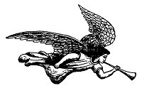
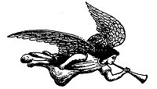
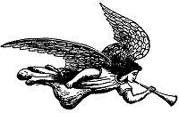

  
[Intangible Textual Heritage](../../index)  [Christianity](../index) 
[Revelation](../../bib/kjv/rev)  [Index](index)  [Previous](tbr063) 
[Next](tbr065) 

------------------------------------------------------------------------

### 2. THE THREE ANGEL MESSENGERS.

### FIRST ANGEL.

### THE EVERLASTING GOSPEL.

Rev. 14:6-7.

 

"And I saw another angel fly, in the midst of heaven, having the
'**EVERLASTING GOSPEL**' to preach unto them that dwell on the earth,
and to **every nation**, and **kindred**, and **tongue**, and
**people**; saying with a loud voice '**FEAR GOD, AND GIVE GLORY TO HIM;
FOR THE HOUR OF HIS JUDGMENT IS COME: AND WORSHIP HIM THAT MADE HEAVEN,
AND EARTH, AND THE SEA, AND THE FOUNTAINS OF WATERS**."

In his vision of Apocalyptic Judgments John sees many angels at work.
Here he sees one flying in "**MID-HEAVEN**." That is, in the heaven or
atmosphere that surrounds our earth. The mission of this Angel is to
preach the

"**EVERLASTING GOSPEL**"

unto every nation, kindred, tongue, and people on the earth. Here is the
first and only place in the Bible where an **angel** is commissioned to
preach the Gospel. An angel could not tell Cornelius how to be saved, he
could only tell him to send for Peter for that purpose. Acts 10:3-6. In
this "Gospel Age" only redeemed men can preach the

p. 133

\[paragraph continues\] Gospel, but at the "End Time," just before the
return of the Lord, an angel will go forth to preach the "**EVERLASTING
GOSPEL**," or as the revised Version puts it, the "**ETERNAL GOSPEL**."
The word "Gospel" means "**Good News**." Four forms of the Gospel are
mentioned in the New Testament, and we must distinguish carefully
between them.

#### (1). THE GOSPEL OF "THE KINGDOM."

Matt. 24:14.

This is the "Good News" that God purposes to set up a Kingdom on this
earth over which David's Son, **JESUS**, shall reign, as prophesied in
Luke 1:32-33. Two preachings of this Gospel are mentioned, one past,
beginning with the ministry of John the Baptist, and preached by Jesus
and His Disciples, but it ended with the rejection of Jesus as King.
This Gospel is to be preached again after the Church is taken out. It
will be the fulfilment of Matt. 24:14, where it says: "This Gospel of
'**THE KINGDOM**' shall be preached in all the world for a **WITNESS**
unto all nations: and then shall the end come." This has no reference to
the Gospel that is now being preached. to the nations. It is the Gospel
of **SALVATION**, but the "Gospel of the Kingdom" is not for "Salvation"
but for a **WITNESS**, that is. it is the **announcement that the time
has come to SET UP THE KINGDOM**. It will be preached first by Elijah
the forerunner (Mal. 4:5-6): and by others who shall be commissioned to
bear the news to all nations as a proclamation of the Coming of Christ
as King to occupy the Throne of David, and for the purpose of
regathering Israel to the Promised Land,

#### (2). THE GOSPEL OF THE "GRACE OF GOD."

Acts 20:24.

This is the "Good News" that Jesus Christ the rejected King died on the
Cross for our **SALVATION**. This form of the Gospel is described in
many ways. It is called the "**GOSPEL OF GOD**" (Rom. 1:1), because it
has its **source** in the **LOVE OF GOD**. John 3:16. Its **Character**
is "**GRACE**." Acts 20:24. Its subject is **CHRIST** (Rom. 1:16; 2.
Cor. 10:14), and it is the **POWER OF GOD UNTIL SALVATION**. It is also
a "**GLORIOUS GOSPEL**" because it speaks of Him who is in the
**GLORY**, and has been **GLORIFIED**, and who is bringing many sons to
**GLORY**. 1. Tim. 1:11, 2. Cor. 4:4, Heb. 2:10. And it is the "**GOSPEL
OF PEACE**," because it makes peace between the sinner and God, and
brings peace to the soul. Eph. 6:15.

#### (3). MY GOSPEL.

Rom. 2:16. (Acts 26:16-18.)

This is the same as the "Gospel of the Grace of God," or of Salvation,
with the additional revelations that were made known to Paul as to the
Church (Eph. 3:1-7), and as to Israel. Rom. 11:1-36.

p. 134

#### (4) THE "EVERLASTING GOSPEL."

Rev. 14:6.

This is what the Angel preaches in this chapter. It is neither the
"Gospel of the Kingdom," nor of "Grace." Its burden is **not Salvation**
but **JUDGMENT**. "Fear God, and give glory to Him: for the **HOUR OF
HIS JUDGMENT IS COME**." It is "Good News" to Israel, and all who are
passing through the "fires of Judgment," because it declares that their
troubles will soon end in the judgment and destruction of Antichrist. It
calls on men to worship God as "**Creator**," and not as "Saviour," and
so it is called in the Revised Version--"**THE ETERNAL GOSPEL**," the
Gospel that has been proclaimed from Eden down by Patriarchs' and
Prophets, and not an "Everlasting Gospel" in the sense that it saves men
for all eternity.

There is "**ANOTHER GOSPEL**" (Gal. 1:6-12, 2. Cor. 11:4), which is not
another, and which Paul repudiated. It is a perversion of the true
Gospel and has many seductive forms, and in the main teaches that
**"faith" is not sufficient to Salvation**, nor able to keep and
perfect, and so emphasizes "Good Works." Col. 2:18-23, Heb. 6:1, 9:14.
The Apostle pronounces a fearful "Anathema" upon its preachers and
teachers. Gal. 1:8-9. Our message is: "**Believe on the Lord Jesus
Christ and thou shalt be saved**." Acts 16:31. The Angel's message is:
"**Fear God for the HOUR of His Judgment is come**." Men reject the
human messenger and they will also reject the Angelic message, they will
not believe even though the **ONE** (Jesus) rose from the dead.

### SECOND ANGEL.

### FALL OF BABYLON PROCLAIMED.

Chap. 14:8.

 

"And there followed another angel, saying **BABYLON IS FALLEN, IS
FALLEN**, that great **City**, because she made all nations drink of the
wine of the wrath of her fornication."

Here is proof that the City of Babylon is to be rebuilt. For further
proof see chapter eighteen. As to the fall and destruction of the
literal City of Babylon this proclamation is anticipative, but as a
declaration that Babylon **had fallen** to fearful depths of wickedness
and apostasy, and had become "**the habitation of demons, and the hold
of every foul spirit, and a cage of every unclean and hateful bird**,"
as described in chapter 18:2, it was already true, for the City of
Babylon

p. 135

will have been rebuilt at the time when this Angel utters his
proclamation. The Angel's warning was that God's people might hear His
voice saying: "**Come out of her, MY PEOPLE**, that ye be not
**partakers of her sins, and that ye receive not of her plagues**." Rev.
18:4.

### THIRD ANGEL.

### THE DOOM OF ANTICHRIST'S FOLLOWERS.

Rev. 14:9-11.

 

"And the third Angel followed them, saying with a loud voice, If any man
worship the Beast and his Image, and receive his mark in his forehead,
or in his hand, the same shall drink of the wine of the '**wrath of
God**,' which is poured out without mixture into the '**cup of His
Indignation**'; and he shall be **tormented with fire and brimstone** in
the presence of the Holy Angels, and in the presence of the **LAMB**:
and the smoke of their torment ascendeth up for **ever and ever**: and
they have no rest **day** or **night**, who **worship the Beast and his
Image**, and whosoever receiveth the **'Mark' of his name**."

This is a most awful warning. Any man who worships the Beast, and
receives his 'Mark' in forehead or hand, his doom is fixed **FOREVER**,
and he shall be tormented with fire and brimstone in the presence of the
Holy Angels and of the Lamb, and the smoke of his torment shall ascend
**for ever and ever**, and they shall have no rest day or night. That
means during the 3½ years of Antichrist's reign, after they have
received the "Mark," for there is no day or night in eternity. If
"Eternal Punishment" is taught nowhere else in the Bible it is taught
here, and if here, why is it not true as to other classes of sinners?
Just think of the horror of remorse in the "Lake of Fire," as these
worshippers of the Beast shall recall the "Mark of the Beast" as it was
imprinted on their forehead or right hand with their own consent because
of their desire to enrich themselves in the markets of their day.

------------------------------------------------------------------------

[Next: 3. The Blessed Dead](tbr065)
