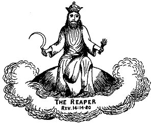

  
[Intangible Textual Heritage](../../index)  [Christianity](../index) 
[Revelation](../../bib/kjv/rev)  [Index](index)  [Previous](tbr065) 
[Next](tbr067) 

------------------------------------------------------------------------

### 4. THE HARVEST AND VINTAGE.

Rev. 14:14-20.

 

"And I looked, and behold a white cloud, and upon the cloud one sat like
unto the **SON OF MAN**, having on His head a Golden Crown, and in His
hand a sharp Sickle. And another angel came out of the Temple, crying
with a loud voice to Him that sat on the cloud, Thrust in Thy **SICKLE,
and reap**: for the time is come for Thee to reap: for the **'Harvest of
the Earth' IS RIPE.** And He that sat on the cloud thrust in His Sickle
on the earth: and the earth was reaped. And another angel came out of
the Temple which is in Heaven, he also having a sharp Sickle. And
another angel came out from the Altar, which had power over fire; and
cried with a loud cry to him that had the sharp Sickle, saying Thrust in
thy sharp Sickle, p. 137 and gather the
clusters of the '**VINE OF THE EARTH**'; for her grapes are **fully
ripe**. And the angel thrust in his Sickle into the earth, and gathered
the '**VINE OF THE EARTH**,' and cast it into the great **WINEPRESS** of
the '**Wrath of God**.' And the **WINEPRESS** was trodden without the
city, and **BLOOD came out of the WINEPRESS, even unto the horse
bridles, by the space of a thousand and six hundred furlongs**."

There can be no question as to who is the "Reaper" of the "**HARVEST OF
THE EARTH**." It is the "**SON OF MAN**," Christ Himself. He was the
"**Sower**" and He shall be the "**Reaper**." This is not the "Harvest
of the Church." That was harvested in chapters four and five, and the
"Reapers" were the angels. Matt. 13:39. This is the "Harvest" of the
Gentile Nations'. In Joel 3:9-17 we have a description of this "Harvest
and Vintage." The "Harvest and Vintage" are **JUDICIAL**. That is, they
are for the purpose of Judgment. The account here is anticipative. It
looks forward to chapter 16:13-16, which speaks of how the armies of the
world are to be gathered together by "**THREE UNCLEAN SPIRITS**" to the
Battle of the Great Day of God Almighty at Armageddon. This Battle takes
place **after** the "Fall of Babylon," and is more fully described in
chapter 19:17-19.

Here we are told that the Harvest is **RIPE**, and the "Son of Man" is
commanded to thrust in His Sickle, which He does, and while the pouring
out of the "Vials" is a part of the reaping, the Harvest is not finished
until the end of the "Battle of Armageddon."

The difference between the "Harvest and the Vintage" is, that the
"harvest" in the natural world precedes the "vintage," but often, as in
this case, continues until they become one.

The "**Vintage**" is of the "**VINE OF THE EARTH**." Israel was a
"**VINE**" brought out of Egypt (Psa. 80:8) and planted in Canaan, but
when God looked for it to bring forth "**good grapes**" it brought forth
"**WILD GRAPES**" (Isa. 5:1-7), and fruit unto **itself**. Hosea 10:1.
When the Lord of the "Vineyard" sent His servants for the "Fruit of the
Vineyard," the husbandmen beat one, killed another, and stoned another.
At last He sent His Son, Him they took and cast out of the Vineyard and
slew. Matt. 21:33-43. Then Jesus Himself became the "**TRUE VINE**," of
which His disciples are the branches. John 15:5. The "**VINE OF THE
EARTH**" is Antichrist and all who belong to his pernicious system.

The "**WINEPRESS**" is the winepress of the "**FIERCENESS AND WRATH OF
ALMIGHTY GOD**." **Rev. 19:15**. The Prophet Isaiah (Isa. 63:1-6)
describes Christ's share in it. It will cover the whole Land of
Palestine, and extend as far south as Edom and Bozrah. So great shall be
the slaughter that the blood shall be up to the horses' bridles in the
valleys over the whole of Palestine for 1600 furlongs, or 200 miles. It
will be the time of which the Prophet Isaiah speaks, when the land shall
be **DRUNK WITH BLOOD**. Isa.. 34:7-8. We will consider it more in
detail when we study the Battle of Armageddon in chapter nineteen.

------------------------------------------------------------------------

[Next: The Seven Last Plagues](tbr067)
