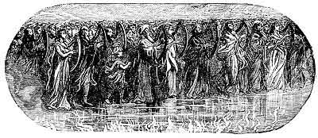

  
[Intangible Textual Heritage](../../index)  [Christianity](../index) 
[Revelation](../../bib/kjv/rev)  [Index](index)  [Previous](tbr067) 
[Next](tbr069) 

------------------------------------------------------------------------

### PRELUDE.

### THE SEA OF GLASS.

Rev. 15:2-4.

 

p. 139

"And I saw as it were a '**SEA OF GLASS**' **MINGLED WITH FIRE**: and
them that had gotten the victory over the **Beast**, and over his
**Image**, and over his **Mark**, and over the **NUMBER OF HIS NAME**,
stand on the **SEA OF GLASS**, having the Harps of God. And they sing
the **SONG OF MOSES** the servant of God, and the **SONG OF THE LAMB**,
saying, **Great and Marvellous are Thy Works, Lord God Almighty; just
and true are Thy Ways, Thou King of Saints**. Who shall not fear Thee, O
Lord, and glorify Thy name? for thou only art holy! for all nations
shall come and worship before Thee; for Thy judgments are made
manifest."

This "**SEA OF GLASS**" is the same "Sea of Glass" that we saw before
the Throne in chapter 4:6. Then it was unoccupied, now it is occupied.
Then its surface was crystal clear and plain, now its surface is of a
"**fiery**" aspect, symbolizing the "**fiery trials**" of its occupants.
The occupants of this "Sea of Glass" come out of the Great Tribulation,
for they have gotten the victory over the "**Beast**," and over his
"**Image**," and over his **Mark**, and over the "**Number of His
Name**," and they have harps, and they sing the "**SONG OF MOSES**" and
the "**SONG OF THE LAMB**." They are the "Harpers" of chapter 14:2,
whose song only the 144,000 "Sealed Ones" could sing. John only heard
them then, now he sees them. That they could sing both the "Song of
Moses" and the "Song of the Lamb" implies that they were all or in part
Israelites. Some think that the "Song of Moses" that they sung was the
song the Children of Israel sang on the shore of the Red Sea after their
escape from Egypt, as given in Ex. 15:1-22, while others think it is
Moses' "**SWAN SONG**" as found in Deu. 31:19, 22; 31:30; 32:43. They
sang the "Song of the Lamb" because as Israelites they had been redeemed
by the blood of the Lamb.

------------------------------------------------------------------------

[Next: The Tabernacle of Testimony](tbr069)
