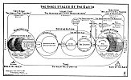

  
[Intangible Textual Heritage](../../index)  [Christianity](../index) 
[Revelation](../../bib/kjv/rev)  [Index](index)  [Previous](tbr093) 
[Next](tbr095) 

------------------------------------------------------------------------

### 2. THE NEW EARTH.

Rev. 21:1.

"And I saw a new Heaven and a **NEW EARTH**: for the first heaven and
the first earth were passed away; and there was **no more sea**."

The first heaven and the first earth were created in the dateless past.
The Scriptures begin with the sublime declaration--"In the **beginning**
God **CREATED** the heaven and the earth." Gen. 1:1. The second verse of
Gen. 1, records that "the earth was **without form and void**; and
**darkness was upon the face of the deep**." That this earth was not
originally created "**formless and void**" is clear from Isa. 45:18 (R.
V.). "Thus saith the Lord that created the heavens; He is God; that
formed the earth and made it; He established it, He created it **not a
waste**, He formed it to be inhabited." See also Jer. 4:23-26. What
caused the earth to become a **waste** after its original creation is
not expressly stated. Some awful catastrophe must have befallen it. It
is clear from the account of the Fall of Adam and Eve that sin existed
before man was created. The inference is from Ezek. 28:12-19, and Isa.
14:12-14, that when the earth was originally created that Satan was
placed in charge of it, and that he and his angels rebelled and led
astray the inhabitants of the Original Earth, and that the Pre-Adamite
race are now the demons who as they are permitted liberty seek to
re-embody themselves in human beings that they may again dwell on the
earth. It is clear that the Original Earth was inhabited, or God would
not have blessed Adam and Eve and said--"Be fruitful and multiply and
**REPLENISH the Earth**." Gen. 1:28. It does not follow however that
those inhabitants were human beings like ourselves. No human remains
have been found ante-dating the creation of man.

Peter speaks of the Original Earth as the--"World that then **WAS**,
that, being **OVERFLOWED WITH WATER, perished**." 2. Pet. 3:6. It is
clear that Peter does not refer here to Noah's Flood, for the world of
Noah's day did **not perish**, and Peter goes on to add that--"The
heavens and the earth **WHICH ARE NOW** (that is, have been in existence
since the restoration of the earth as described in Gen. 1:3-31), by the
same word are kept in store, **RESERVED UNTO FIRE**" (2 Pet. 3:7),
nevertheless he adds, "we look for a

p. 196

 

[  
Click to enlarge](img/19600.jpg)  
The Three Stages of the Earth  

 

p. 197

\[paragraph continues\] **NEW HEAVEN AND A NEW EARTH**." 2. Pet. 3:13.
These words of Peter reveal the fact that this Earth is to pass through
3 stages. First the Original Earth that **"perished" by WATER**. Second
the Earth that is now, that is to be renovated or cleansed by **FIRE**.
And the New Earth that is to exist forever. See the Chart "The Three
Stages of the Earth."

There can be no question but what the Earth in its original formation
required millions of years. There is ample time in the statement of Gen.
1:1 that--"In the **BEGINNING** God '**created**' the heaven and the
earth," for all the "**Geologic Ages**" that science declares were
necessary for the **creation of the Earth**. There is no conflict
between the Bible and Science as to the time occupied in the formation
of the Earth.

How long a period elapsed between the Creation of the Earth and its
becoming "**formless and void**" we do not know, neither do we know how
long it continued in that condition, but when the time came in the
purpose of God to restore it to a habitable state, and make it fit for
the abode of the human race, He did it in **six periods** of longer or
shorter duration. These "Periods" were **six** in number, and with the
seventh or Sabbatic Period, are called the "**Creative Week**."

These "Six Periods" do not describe or include the original creation.
The word "**CREATE**" is not mentioned after Gen. 1:1 until verse 21,
which describes the work of the Fifth Day. God did not "**create
light**" on the First Day. He simply said--"**let there be light**," as
one would say "**turn on the light**."

On the Second Day God simply, divided the waters by providing clouds to
hold the moisture of the atmosphere.

The work of the Third Day is "**twofold**," the **emergence of the land
from the sea**, and the **reappearance of vegetable life**. This was not
a new creation but a **RESURRECTION**. The earth rises up out of the
"**Waters of Death**," and seeds, and the roots of plants and herbs are
called upon to germinate and sprout and grow as they did before the
catastrophe that submerged the Primeval Earth. If that catastrophe was
what we know as the "Glacial Period" the resurrection of plant life no
more required a "**creative act**" than vegetation does in the spring of
the year after the winter is over. That this is what really happened is
clear from Gen. 1:11-12, where it says, "Let the earth bring forth
grass, the herb yielding seed, and the fruit tree yielding fruit **after
his kind**, whose seed is **IN ITSELF, UPON** (in) **THE EARTH**." That
is, the seed was already in the earth, having been buried by the flood
that swept over the Primeval Earth, and, being indestructible, it only
needed the proper condition to spring up and cover the earth with
verdure. This reveals the fact that the Primeval Earth was clothed with
verdure, and covered with plants and trees.

The appearance of the Sun and Moon on the Fourth Day was not a new
creation. They had existed in connection with the Primeval Earth and had
not been destroyed when it was made waste. The word translated
"**made**" in the 16th verse is not the same word as is translated
"**created**" in verse one, and does not imply a "**creative** 

p. 198

**act**." What is meant is that the clouds broke away that up to this
time had shrouded the earth and permitted the Sun and Moon to be seen,
and that from that time they were appointed to measure the days, and
years, and seasons as we have them today. In other words, on the Fourth
Day "**Time**" in contrast with "**eternity**" began.

The work of the Fifth Day was the "CREATION" of fish and fowl. Here is
the first time we come across the word "**create**" since we read of the
original creation of the Earth in verse one. This shows that all
"**animal life**" was destroyed in the catastrophe that overtook the
Primeval Earth. We have traces of this animal life in the fossil remains
of birds and animals found in the earth. If scientists will relegate
fossils and the remains of mammoth animals, etc., to the period of the
Primeval Earth there will be no conflict between Science and the Genesis
account of Creation. The remains of man are never found in a "fossil
state," showing that man did not exist on the Primeval Earth. Man was
made for this present earth and is a "**NEW**" Creation.

The **creative work** of the Sixth Day was "**twofold**," that of **land
animals** and **man**. These land animals were probably the same that we
have today. The fact that they were created "**after their kind**,"
which expression is six times repeated, shows that they were not
"**evolved**" from one common species. That man also was **"CREATED" as
man**, shows that he has not descended from an "**ape**." Man was made
in the "**IMAGE OF GOD**," not in the image of an "**ape**," and was not
formed from a brute, but of the "**Dust of the Earth**." The fact is,
there is an "**IMPASSABLE GULF**" between the lowest order of man and
the highest type of beast that science has failed to bridge. The
"**Missing Link**" has never been found.

That all the different species of animals were created "**separately**"
is proven from the fact that when species are crossed their offspring
are **sterile**. The crossing of the jackass and a mare is the mule, and
a mule is a hybrid and is **sterile**. That the whole human race is of
"**one species**" and had a common origin (Acts 17:26) is clear from the
fact that, when the different races of the earth's inhabitants marry
their offspring are not sterile but fertile. This nullifies the argument
that the white race alone is the Adamic race.

Neither was Adam created a **baby** or a **primitive savage**, but a
full grown man perfect in intellect and knowledge, else he could not
have named the beasts of the field and the fowls of the air. And the
fact that his descendants had such skill in the invention of musical
instruments and mechanical devices and could build cities and towers and
such a vessel as the Ark, proves that the men of Antediluvian times were
men of gigantic intellect and attainments, and that instead of man
having "**evolved upward**" he has "**degenerated downward**."

### THE FLOOD VERSUS THE SECOND COMING.

While the Earth has had its "**Baptism of Water**," and is to have its
"**Baptism of Fire**," it is worth noting that between these two Great
Events there are two Minor Events that affect the structure of the
Earth. The first was "**the flood**." At that time there were

p. 199

great "**cataclysmic**" and "**climatic**" changes, for the "**FOUNTAINS
OF THE GREAT DEEP WERE BROKEN UP**." Gen. 7:11. That is, there was a
subsidence of the land, that resulted in great physical changes that
affected the climate of the earth, and divested the atmosphere of some
of its life sustaining properties, so that the length of life was
reduced from 900 to 100 years, and later to three-score years and ten.
The second "Minor Event" will be caused by the Return of the Lord Jesus
Christ to the earth to set up His Millennial Kingdom. Then the Mt. of
Olives will be divided in twain, the mountains and valleys of Palestine
will be leveled, the Dead Sea will be raised, and the whole contour of
that part of the world will be changed. Zech. 14:4-10. Ez. 47:1-12. As a
result of the "**cataclysmic**" and "**climatic**" changes thus
produced, the effects of the Flood will be reversed and the
life-sustaining power of the atmosphere will be restored, and human life
will again be prolonged, and men shall live as long as did the people
before the Flood. Isa. 65:20.

### THE NEW HEAVEN AND THE NEW EARTH.

Immediately after the destruction of Satan and his armies, John says,

"I saw a '**Great White Throne**' and Him that sat on it, from whose
face the **Earth** and the **Heaven** (atmosphere of the earth) **fled
away**; and there was no place for them." Rev. 20:11.

John then describes the Judgment of the "Great White Throne," and then
adds--

"I saw a **New Heaven**; and a **New Earth**; for the first heaven and
the first earth were passed away; and there was **no more sea**." Rev.
21:1.

Of such a change in this earth we are not ignorant, but John does not
tell us how it is to come to pass. But the Apostle Peter does.

"But the heavens and the earth which are **now**, by the same word are
kept in store, **RESERVED UNTO FIRE** against the **Day of Judgment and
Perdition of Ungodly Men**. (The Great White Throne Judgment)--The 'Day
of the Lord' will come as a thief in the night; in the which the
**Heavens Shall Pass Away With a Great Noise**, and the **Elements Shall
Melt With Fervent Heat, the Earth Also and the Works That Are Therein
Shall be Burned Up**.

"Nevertheless we, according to His **Promise** (Isa. 65:17; 66:22), look
for a **New Heavens** and a **New Earth**, wherein dwelleth
righteousness." 2. Pet. 3:7-13.

It is clear that Peter is referring to the same event as John, for he
says it is to be at the "**Day of Judgment and Perdition of Ungodly
Men**," and that is the "**Great White Throne Judgment**" of the
**Wicked Dead**.

A surface reading of the above passage would lead one to believe that
the earth as a planet, and the sidereal heavens, are to be **destroyed
by fire and pass away**. But a careful study of the Scriptures will show
us that this is not so, that what is to happen is, that this present
earth, and the atmosphere surrounding it, is to be **Renovated by Fire,
so that its exterior surface shall be completely changed**, and all that
sin has brought into existence, such as thorns and thistles, disease
germs, insect pests, etc., shall be destroyed, and the atmosphere

p. 200

purified and forever freed from evil spirits and destructive agencies.

That this is the correct view of the passage is clear from Peter's words
in verses 5 and 6.

"By the word of God the heavens were of old, and the earth standing out
of the water and in the water; whereby the world that **then was, being
overflowed with water, PERISHED**."

As we have seen the Apostle Peter was referring here not to the Flood,
but to the Primeval Earth, which was made "**formless and void**" by a
"**Baptism of Water**" that completely submerged it and destroyed all
animal life.

Now as the **Framework** of the "Primeval Earth" was not destroyed by
its "**Watery Bath**," so the Framework of the "Present Earth" is not to
be destroyed by its "**Baptism of Fire**."

This is confirmed by the Apostle's use of the Greek word "**Cosmos**,"
which means the "**land surface**," the **inhabitableness** of the earth
and not the earth as a planet. It is the **exterior surface** of the
earth then that is to "M**elt With Fervent Heat**" and the "**Works
Therein Burnt Up**." The intense heat will cause the gases in the
atmosphere to explode, which the Apostle describes as the "heavens (the
atmosphere) passing away with a **great noise**." The result will be the
destruction of all animal and vegetable life, and the alteration of the
earth's surface.

The Greek word "**Parerchomai**," translated "**pass away**," does not
mean "**termination of existence**" or "**annihilation**," but means to
pass from "**one condition of existence to another**." The Apostle Paul
in his letter to Titus (Titus 3:5), speaking of the "**Regeneration**"
of men, uses the same word that Jesus used when, in Matt. 19:28, He
promised His Disciples that in the "**Regeneration**," that is in the
"**New Earth**," they should sit on "Twelve Thrones" judging the "Twelve
Tribes" of Israel. Now no one supposes that the "**Regeneration of a
man** is his **Annihilation**." It is simply a **Renewing Process** by
which he is brought back to the condition of man spiritually as before
the Fall. The word "**Restitution**" in Acts 3:21, means the same thing.
The "**Dissolving**" of which Peter speaks (2 Pet. 3:11), is the same
word Jesus used when He said of the colt--"**Loose** him and let him
go." The teaching of the Scriptures is, that "Creation" is at present in
a "**State of Captivity**," waiting to be **Loosed from the Bondage**
that sin has caused. Rom. 8:19-23.

As to the "**Departing as a Scroll**" of the heavens, and the "**Flying
Away**" of the earth and heavens, of which John speaks, (Rev. 6:14;
20:11), a total disappearance of all the material worlds is not at all
the idea, for he tells us that **afterwards** he saw--the New Jerusalem
coming down **out of Heaven**, and **nations living and walking in the
Light of it on the earth, and the Kings of the Earth bringing their
Glory and Honor Into It**." Rev. 21:2, 24.

The Holy Spirit by Solomon said,

"One generation passeth away, and another generation cometh, but the
**Earth Abideth Forever**." Ecc. 1:4.

It is specifically promised that "the **Meek** shall **Inherit the
Earth**," (Matt. 5:5), and that the Children of Israel shall dwell in it
**forever**, (Isa. 60:21; 66:22), and if God's people are to inhabit it
**forever**, it

p. 201

must **EXIST FOREVER**. It is clear then that this earth as a planet is
not to be annihilated, but that it is to be **Cleansed and Purified by
Fire** and made fit for the home of those peoples and nations that are
to occupy it after its renovation.

This earth that has been consecrated by the **Presence of the Son of
God**, where the costliest sacrifice that the Universe could furnish was
offered up on Calvary to redeem a race, for which God has a great
future, is too sacred a place to ever be blotted out or cease to exist,
for it is the most cherished orb in the mind of God of all His great
creation.

With the "Renovation of the Earth by Fire," Time does not end and
Eternity begin, for we read in the New Testament of a

"**Perfect Kingdom**"

that Christ shall surrender to the Father, so that God may be "**All in
All**." 1 Cor. 15:24-28. A Kingdom in which--

"At the name of Jesus **every knee shall bow**, of things in **Heaven**,
and things in **Earth**, and things **Under the Earth**, and that
**every tongue shall confess** that **Jesus Christ IS LORD**." Phil.
2:9-11.

This describes a Kingdom in which all things **Celestial**,
**Terrestrial** and **Infernal** are to be subject to the **SON OF
MAN**.

Now this "Perfect Kingdom" cannot be the "Millennial Kingdom," for that,
as we have seen, ends in **Apostasy** and **Rebellion**. It must
therefore mean another Kingdom on the **Other Side** of the "Millennial
Kingdom," and as there is to be no other Kingdom **between** the
"Millennial Kingdom" and the "Renovation of the Earth by Fire," it must
mean a Kingdom that is to **follow** the "Renovation of the Earth by
Fire," and that Kingdom is the Kingdom of the "**New Heaven and the New
Earth**," which we call on the "Rightly Dividing the Word" Chart, the
"**Perfect Kingdom**."

If, as some hold, the "Seventh Day" of the "Creative Week" corresponds
to the Millennium, then we have a prophecy of the Dispensation that
follows the "Renovation of the Earth" in the "**Morrow After the
Sabbath**." Lev. 23:36.

The Seventh day of Genesis had to do with the "Old Creation," which was
imperfect, but the "**Eighth Day**" has to do with the "**New
Creation**," which is perfect, for it was on the "**Eighth Day**," or
the "First Day of the week," that our Lord arose from the dead, and 50
days later, on the "**Eighth Day**," that the Holy Spirit was given at
Pentecost. The "Eighth Day" cannot point to the Millennium, for that is
represented by the "Seventh Day," neither can it point to Eternity, for
a day is a **Period of Time**, while Eternity is **Timeless**. The
"Eighth Day" must then point to a "period of time" **between** the
"Renovation of the Earth" and Eternity, or what we are pleased to call
the "**Perfect Age**."

It is also a Dispensation, called in Eph. 1:10--

"**The Dispensation of the Fulness of Times**."

That is, a "**Full-Time Dispensation**." The intimation is, that all the
previous Dispensations were not "**Full-Time**" Dispensations, that God
had to cut them short on account of sin.

p. 202

As to the duration of this Dispensation of the "Fulness of Times" we are
not in the dark. Israel is to have a large place in that Dispensation.

"For as the New Heavens and the New Earth, which I will make shall
remain before me, saith the Lord, so shall your (Israel's) **Seed** and
your **Name REMAIN**." Isa. 66:22.

And as the duration of God's Covenant with Israel was extended in Deu.
7:9 to a "Thousand Generations" or 33,000 years, we have an intimation
that the "Dispensation of the Fulness of Times" will last for at least
that length of time.

Let us look at some of the characteristics of that Age or Dispensation.

**There Will Be No Sin**.

All the powers of Evil will have been expelled from the earth and
imprisoned in the "Lake of Fire" forever.

The atmosphere of the New Earth will afford no lurking place for disease
germs, for there shall be no more sickness or death, and health will be
preserved by the use of the leaves of the "Tree of Life." The heavens
shall not robe themselves in angry tempests and sombre blackness, nor
flash with the thunderbolts of Divine wrath, nor cast plagues of hail on
the earth, nor cause devouring floods of water or destructive wind
storms. It may be that in that day "a **Mist** shall go up from the
earth and water the whole face of the ground" as in Eden, for we read
that there shall be--"**No More Sea**," not that there shall not be
large bodies of water, for the river that flows through the street of
the New City must have an outlet, but that there shall be no great
oceans.

The earth shall also put on its Edenic beauty and glory. There shall no
longer be thorns and thistles, no parasites or destructive insects, and
labor shall be a delight. No serpents shall hiss among its flowers, nor
savage beasts lie in ambush to destroy and devour. Its sod shall not be
heaped over newly made graves, nor its soil moistened with tears of
sorrow and shame, or saturated with human blood in fratricidal strife.
The meek shall inherit the earth, and from north to south, and from east
to west, it shall blossom like the rose and be clothed with the verdure
of Paradise Restored.

Rev. 21:2-8.

"And I John saw the Holy City, New Jerusalem, coming down from God out
of Heaven, prepared as a bride adorned for her husband. And I heard a
great voice out of Heaven saying: Behold the 'Tabernacle of God' is with
men, and He will dwell with them, and they shall be His people, and God
Himself shall be with them, and be their God. And God shall wipe away
all tears from their eyes; and there shall be **no more death**, neither
**sorrow**, nor **crying**, neither shall there be any more **pain**;
for the **FORMER THINGS ARE PASSED AWAY**. And He that sat upon the
Throne said, Behold, I make **all things NEW**. And He said unto me,
Write: for these words are true and faithful. And He said unto me, **IT
IS DONE**. I am Alpha and Omega, the beginning and the end. I will give
unto him that is athirst of the Fountain of the 'Water of Life' freely.
He that **overcometh** shall **inherit all things**; and I will be his
God and he shall be My **son**. p. 203 But
the **fearful**, and **unbelieving**, and the **abominable**, and
**murderers**, and **whoremongers**, and **[sorcerers](errata.htm#5)**,
and **idolators**, and **all liars**, shall have their part in the
**LAKE OF FIRE** which burneth with **FIRE** and **BRIMSTONE**: which is
the **SECOND DEATH**."

------------------------------------------------------------------------

[Next: 3. The New City](tbr095)
