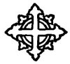

  
[Intangible Textual Heritage](../../index)  [Christianity](../index.md) 
[Revelation](../../bib/kjv/rev)  [Index](index)  [Previous](tbr101.md) 

------------------------------------------------------------------------

### The Epilogue or Final Testimony and Warnings.

Rev. 22:6-21.

"And he said unto me, These sayings are faithful and true; and the Lord
God of the Holy Prophets sent His Angel to shew unto His Servants the
Things which must **shortly be done**. Behold, I come quickly: **blessed
is he that keepeth the sayings of the prophecy of this BOOK**.

"And I John saw these things, and heard them. And when I had heard and
seen, I fell down to worship before the feet of the Angel which shewed
me these things. Then saith he unto me, See thou do it not: for I am thy
Fellowservant, and of the [Brethren](errata.htm#6.md) the Prophets, and of
them which keep the sayings of this Book: worship **GOD**.

"And he saith unto me. **Seal not** the sayings of **THE PROPHECY OF
THIS BOOK**: for the **TIME IS AT HAND**. p.
210 He that is **unjust**, let him be **unjust still**: and he
which is **filthy**, let him be **filthy still**: and he that is
**righteous**, let him be **righteous still**: and he that is **holy**,
let him be **holy still**. And, behold, I come quickly; and my reward is
with me, to give every man according as his work shall be. I am
**ALPHA** and **OMEGA**, the **Beginning** and the **End**, the
**First** and the **Last**.

"Blessed are they that do His Commandments, that they may have right to
the '**TREE OF LIFE**,' and may enter in through the gates into the
City. For without are **dogs**, and **sorcerers**, and **whoremongers**,
and **murderers** and **idolators**, and whosoever **loveth and maketh a
lie**.

"I Jesus have sent mine Angel to testify unto you these things in the
Churches. I am the **Root** and the **Offspring** of David, and the
**BRIGHT AND MORNING STAR**.

"And the **SPIRIT** (Holy Spirit) and the **BRIDE** (the Church, still
on the earth) say **COME**. And let him that is **athirst COME**. And
**WHOSOEVER WILL**, let him take of the **'Water of Life' FREELY**.

"For I testify unto every man that **heareth** the words of the
**PROPHECY OF THIS BOOK**. If any man shall **ADD UNTO THESE THINGS, GOD
SHALL ADD UNTO HIM THE PLAGUES THAT ARE WRITTEN IN THIS BOOK**: and if
any man shall **TAKE AWAY FROM THE WORDS OF THE BOOK OF THIS PROPHECY,
GOD SHALL TAKE AWAY HIS PART OUT OF THE BOOK OF LIFE AND OUT OF THE HOLY
CITY, AND FROM THE THINGS WHICH ARE WRITTEN IN THIS BOOK**.

"He which testifieth these things, saith, Surely I **COME QUICKLY**.
**AMEN**. **EVEN SO, COME LORD JESUS**.

"**THE GRACE OF OUR LORD JESUS CHRIST BE WITH YOU ALL. AMEN**."

 

 
