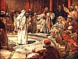

  
[Intangible Textual Heritage](../../index)  [Christianity](../index.md) 
[Index](index)  [Previous](toc07)  [Next](toc09.md) 

------------------------------------------------------------------------

[Buy this Book on
Kindle](https://www.amazon.com/exec/obidos/ASIN/B002IVUDJW/internetsacredte.md)

------------------------------------------------------------------------

  
*The Trial of Christ*, by David K. Breed, \[1948\], at Intangible
Textual Heritage

------------------------------------------------------------------------

p. 44

### CHAPTER V

### FIVE COURTS AND SIX TRIALS

Jesus, arrested about midnight in the Garden of Gethsemane, was tried
six times before he was crucified the following noon. Six trials in
twelve hours! Peloubet's Bible Dictionary gives the time of this
chronology as follows: [34](#fn_33.md)

|     |                 |                      |
|-----|-----------------|----------------------|
| 1\. | Before Annas    | FRIDAY               |
| 2\. | Before Caiaphas | 1 to 5 A. M.         |
| 3\. |                 | Before the Sanhedrin |
| 4\. | Before Pilate   | 5 to 6 A. M.         |
| 5\. |                 | Before Herod         |
| 6\. |                 | Before Pilate Again  |

From a standpoint of technical law, the personnel of a legally
constituted court is of slight significance. Yet historians know that
the course of law has been at times altered and history influenced by
the character of judges. Marshall and Holmes, of the United States
Supreme Court, Lord Mansfield, Lord Eldon, and Sir William Blackstone of
England,

p. 45

\[paragraph continues\] Moses of the
Hebrews, Justinian of the Romans, Solon of the Greeks, Dean Wigmore of
Northwestern University Law School and Dean Pound of Harvard have all
made great contributions to law and legal literature. So, in a study of
the trial of Christ, one should know something about Annas, Caiaphas,
Pilate, and Herod.

This is [particularly](errata.htm#0.md) true because, as we shall see,
Christian and Jewish scholars alike agree that the trial of Christ was
not a proper trial, the Christians [35](#fn_34.md)
contending that prophecy was fulfilled, [36](#fn_35.md) the Jews contending that the Christians
falsely blame the Jews for a Roman crime. [37](#fn_36.md)

#### A. BIOGRAPHICAL

Annas, his five sons, and his father-in-law Caiaphas, all held the
Jewish High-Priesthood during the first century, A. D., [38](#fn_37.md) and it

p. 46

appears from the New Testament that at the time of the arrest of Jesus,
Caiaphas was actually in office as High Priest, [39](#fn_38.md) his son-in-law, Annas, being a former
High Priest but also holding the title for life. [40](#fn_39.md) Caiaphas was a wily politician in the
Sanhedrin who had held office as High Priest for eighteen years, [41](#fn_40.md) although custom was to elect for a one
year term. Rollins describes Annas as a nefarious moneylending Sadducee,
a political friend of the Romans, [42](#fn_41.md)
while we know that Caiaphas had conspired with Judas to betray
Christ; [43](#fn_42.md) and that none of the
writers give either man any praise.

Herod was Roman Governor of Galilee; Pilate, of Judea. Both happened to
be in Jerusalem for the Passover crowd. Herod was a son of Herod the
Great, who had ordered the slaughter of the infants thirty years
before, [44](#fn_43.md) and probably hated Jesus.

Pilate was the fifth Roman governor of

p. 47

\[paragraph continues\] Judea [45](#fn_44.md) and was noted for his cruel and arbitrary
administration of the government. He was also weak at times and has been
greatly criticized by historians. Rabbi Drucker, in his analysis of the
Trial of Christ, not only pictures Pilate as a persecutor of the Jews
but states that Caiaphas was a Roman spy [46](#fn_45.md) and that the historian Tacitus correctly
stated that "Jesus, called Christ, was crucified by Pilate for promoting
a rebellion among the Jews." [47](#fn_46.md) We do
know that Pilate was a craven coward and was afraid to release Jesus.

#### B. CHRONOLOGY OF THE TRIALS

1\. Jesus was taken first to Annas, who was not then High Priest and had
no power, so took no formal action but merely "marked time" as it were,
until Caiaphas and the Sanhedrin were ready for action. [48](#fn_47.md)

2\. Caiaphas was High Priest and seems to have questioned Jesus
privately prior to

p. 48

the convening of the Sanhedrin. [49](#fn_48.md) Mr.
Chandler, in his two volume work on the Trial of Jesus devotes a whole
volume to the Biblical Record, Jewish Law and the Jewish Trials (Volume
I), filling up his second volume with a discussion of the Roman Trial of
Jesus, and while most of his discussion is interesting, it is longer
than necessary. Suffice it to say that Caiaphas’ examination of Jesus
was merely preparatory to the formal Sanhedrin trial. John gives the
clearest account of the action before Caiaphas alone, [50](#fn_49.md) probably in the presence only of Peter
who had followed afar off. [51](#fn_50.md)

3\. The Sanhedrin was a court in the limited sense of the word. It had
legislative, executive, judicial, civil, criminal, and ecclesiastical
powers over the Jews, and its judges were 72 descendants of Moses. It
had to meet legally in daylight, in the forenoon, in a certain room,
with court reporters present; and its rules of procedure were so strict
that an unanimous verdict of guilt meant

p. 49

acquittal. [52](#fn_51.md) There could be unanimous
verdicts of acquittal, but no unanimous verdicts of guilt. But the
Sanhedrin (in violation of its rules) moved quickly to try Jesus on a
charge of Blasphemy, [53](#fn_52.md) on the
testimony of two false witnesses who contradicted each other, [54](#fn_53.md) but Jesus here broke His silence and said
He is Christ. [55](#fn_54.md) Then the Sanhedrin
unanimously found Him guilty of Blasphemy, but had no power to put Him
to death without the consent of Pilate. The Sanhedrists at this point
spit on Jesus, while some struck Him with their hands. [56](#fn_55.md) In the morning, [57](#fn_56.md) they sent Jesus to Pilate.

4\. Pilate was Roman Governor and not interested at all in the Jewish
charges of Blasphemy, so he found no harm in Jesus. He was impressed
though with the "trumped up" charge of Treason; but when Jesus said His
kingdom is "not of this world," [58](#fn_57.md) and
that Pilate had "no power at all against me

p. 50

except it were given thee from above: therefore he that hath delivered
me unto thee hath the greater sin," [59](#fn_58.md)
Pilate was less interested than before and sent Jesus to Herod.

5\. Herod questioned Jesus at length but, getting no answer, sent Jesus
back to Pilate. [60](#fn_59.md)

6\. Pilate had Jesus before him a second time, and again tried to
appease the Jews by releasing Jesus as a Holiday Pardon, but they
demanded the release of Barabbas, then Pilate delivered Jesus up to be
crucified by Roman soldiers on the demand of the Jewish mob. [61](#fn_60.md) However, Pilate required that it be
inscribed over the Cross, "Jesus of Nazareth the King of the Jews.
" [61a](#fn_61.md)

------------------------------------------------------------------------

### Footnotes

[44:34](toc08.htm#fr_33.md) 1925 Edn., pp. 779 &
780.

[45:35](toc08.htm#fr_34.md) Edersheim, Chandler,
Rollins, among our citations.

[45:36](toc08.htm#fr_35.md) Compare: Mk. 14:62 with
Ps. 110:1 and Dan 7:13; Mk. 15:1 with Is. 53:8; Mk. 15: 3-5 with Is.
53:7; John 19:1-3 with Is. 53:3, 5, 7; John 19:36 with Num. 9:12; John
19:37 with Zech. 12:10; etc.

[45:37](toc08.htm#fr_36.md) Rabbi Drucker, op.
cit., entire work, especially pp. 18-19; Rabbi Klausner, *Jesus of
Nazareth*, (Danby Trans), pp. 339-48, inclusive, 413, 414.

[45:38](toc08.htm#fr_37.md) Peloubet's Bible Dict.,
35; Klausner, op. cit., 339.

[46:39](toc08.htm#fr_38.md) John 18:3.

[46:40](toc08.htm#fr_39.md) Peloubet, op. cit., 35;
Klausner, 339.

[46:41](toc08.htm#fr_40.md) Klausner, 340.

[46:42](toc08.htm#fr_41.md) Rollins, op. cit., 17 &
18; Compare, Strachan, op. cit., pp. 244 and 308 on Annas & Caiaphas.

[46:43](toc08.htm#fr_42.md) Matt. 26:3-5.

[46:44](toc08.htm#fr_43.md) Matt. 2:16-20.

[47:45](toc08.htm#fr_44.md) Tacitus Ann., xv:44;
Peloubet, op. cit., 518.

[47:46](toc08.htm#fr_45.md) Op. cit., p. 38 ff;
loyal Jews thought all Sadducees were quislings.

[47:47](toc08.htm#fr_46.md) Drucker, p 27; Tacitus,
Ann., xv:44.

[47:48](toc08.htm#fr_47.md) Only John gives the
story as to Annas; John 18:13-15.

[48:49](toc08.htm#fr_48.md) Matt. 26:57 & 58; Mk.
14:53; Luke 22:54 & 55; John 18:19-24.

[48:50](toc08.htm#fr_49.md) John 18:19-24.

[48:51](toc08.htm#fr_50.md) John 18:16-18 & 25-27.

[49:52](toc08.htm#fr_51.md) Chandler, Op. Cit., I,
279.

[49:53](toc08.htm#fr_52.md) Matt. 26:59-66; Mark
14:55-64.

[49:54](toc08.htm#fr_53.md) Mark 14:59.

[49:55](toc08.htm#fr_54.md) Mark 14:62; compare,
Ps. 110:1 and Dan. 7:13.

[49:56](toc08.htm#fr_55.md) Mark 14:64 & 65; Matt.
26:67; Compare, Isaiah 50:6.

[49:57](toc08.htm#fr_56.md) Mark 15:1; John 18:28;
Matt. 27:1 & 19; Lu. 22:66.

[49:58](toc08.htm#fr_57.md) John 18:36.

[50:59](toc08.htm#fr_58.md) John 19:11.

[50:60](toc08.htm#fr_59.md) Luke 23:7-12.

[50:61](toc08.htm#fr_60.md) Matt. 27:27 ff; Mark
15:16 ff; Luke 23:26 ff; John 19:17 ff., especially verse 23.

[50:61a](toc08.htm#fr_61.md) John 19:19-22,
inclusive.

------------------------------------------------------------------------

[Next: Chapter VI. Argument As To Jewish Trials](toc09.md)
