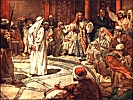

  
[Intangible Textual Heritage](../../index)  [Christianity](../index.md) 
[Index](index)  [Previous](toc14.md) 

------------------------------------------------------------------------

[Buy this Book on
Kindle](https://www.amazon.com/exec/obidos/ASIN/B002IVUDJW/internetsacredte.md)

------------------------------------------------------------------------

  
*The Trial of Christ*, by David K. Breed, \[1948\], at Intangible
Textual Heritage

------------------------------------------------------------------------

p. 87

### INDEX [\*](#fn_139.md)

(References are to Pages)

Annas, biog., [45](toc08.htm#page_45); mentioned, [4](toc01.htm#page_4.md),
[39](toc07.htm#page_39), [44](toc08.htm#page_44.md)

Albright, Rev. Wm., [16](toc05.htm#page_16.md) ftn.

Appellant, Christ would be, [39](toc07.htm#page_39.md) ftn.

Appellate History & Procedure, [53](toc09.htm#page_53.md)

Apostles’ Creed, [63](toc10.htm#page_63.md)

Archeology, aid to research, [68](toc11.htm#page_68.md),
[71](toc11.htm#page_71.md)

Argument as to Jewish Trials, [51](toc09.htm#page_51.md) ff

— as to Roman Trials, [62](toc10.htm#page_62.md) ff

Assignment of Errors, defined, [10](toc04.htm#page_10.md)

 

Blackinton, Oliver, Esq., [7](toc02.htm#page_7.md)

Blackstone's *Commentaries*, [13](toc05.htm#page_13.md),
[14](toc05.htm#page_14.md)

Blasphemy, [42](toc07.htm#page_42), [49](toc08.htm#page_49.md),
[56](toc09.htm#page_56.md)

Bowman, Rev. John Wick, [42](toc07.htm#page_42.md)

Breed, Rev. M. Edwards, [7](toc02.htm#page_7), [42](toc07.htm#page_42.md),
[69](toc11.htm#page_69.md)

 

Caiaphas, [4](toc01.htm#page_4), [44](toc08.htm#page_44.md)

Caiaphas’ Palace not proper meeting place, [40](toc07.htm#page_40.md),
[56](toc09.htm#page_56.md)

Chandler, W. M. Esq., cited, [41](toc07.htm#page_41.md) ff

— discussed, [48](toc08.htm#page_48), [62](toc10.htm#page_62.md)

Christ, as an Appellant, [39](toc07.htm#page_39.md)

Christianity a Revelation, not a religion, [6](toc01.htm#page_6.md),
[73](toc12.htm#page_73.md)

Citizenship, lesson in, [66](toc11.htm#page_66.md)

Commentaries, by Blackstone, [13](toc05.htm#page_13.md),
[14](toc05.htm#page_14.md)

Conant, Ernest Bancroft, Esq., [3](toc00.htm#page_3.md),
[63](toc10.htm#page_63), [64](toc10.htm#page_64.md),
[69](toc11.htm#page_69.md)

Confucian Code, [69](toc11.htm#page_69.md)

Constitution of U. S., [13](toc05.htm#page_13.md)

Counsel, Jesus had no, [41](toc07.htm#page_41), [58](toc09.htm#page_58.md)

Court Reporters in Sanhedrin, [15](toc05.htm#page_15.md),
[16](toc05.htm#page_16), [48](toc08.htm#page_48.md)

*Corpus Juris Civilis* (Justinian), [63](toc10.htm#page_63.md)

*Corpus Juris* (Modern Legal Ency.), [38](toc07.htm#page_38.md),
[43](toc07.htm#page_43.md)

*Criminal Jurisprudence of the Ancient Hebrews* (Mendelsohn),
[43](toc07.htm#page_43.md)

 

Deutsch, *The Talmud* (Rabbi Emmanuel), [41](toc07.htm#page_41.md)

Dominion rule, Jerusalem by Rome, [52](toc09.htm#page_52.md); compared with
British Dominions, [52](toc09.htm#page_52.md)

"Double Jeopardy", [43](toc07.htm#page_43.md)

p. 88

Drucker, Rabbi A. P., cited, [40](toc07.htm#page_40.md) ff, discussed,
[47](toc08.htm#page_47), [82](toc13.htm#page_82.md)

"Due Process of Law", [13](toc05.htm#page_13), [42](toc07.htm#page_42.md)

 

Edersheim, *Life & T. of Jesus, etc.*, [16](toc05.htm#page_16.md),
[40](toc07.htm#page_40.md) ff

Edwards, Jonathan, [6](toc01.htm#page_6.md)

Errors, assignment of, [10](toc04.htm#page_10.md); reversible, defined,
[38](toc07.htm#page_38); illus., [14](toc05.htm#page_14.md); in trial of
Christ, listed, [40](toc07.htm#page_40.md) ff; discussed,
[51](toc09.htm#page_51.md) ff Exceptions to court rulings, explained,
[39](toc07.htm#page_39.md)

*Fourth Gospel, The*—by Strachan, [41](toc07.htm#page_41.md)

 

Gaius, [68](toc11.htm#page_68.md)

Gamaliel, [70](toc11.htm#page_70.md)

Gospel Record of the Trials, quoted, [17](toc06.htm#page_17.md) ff

— Matthew's, [17](toc06.htm#page_17.md) ff

— Mark's, [22](toc06.htm#page_22.md) ff

— Luke's, [26](toc06.htm#page_26.md) ff

— John's, [31](toc06.htm#page_31.md) ff

Government, function of earthly, [14](toc05.htm#page_14.md)

[Hammurabi](errata.htm#8), Code of, [68](toc11.htm#page_68.md)

Herod, biog., [46](toc08.htm#page_46.md); actions of,
[50](toc08.htm#page_50.md) ff

 

Isaiah's Prophecy fulfilled, (Is. 53), [76](toc12.htm#page_76.md) ff

 

Jesus, had no counsel, [58](toc09.htm#page_58.md)

Jewish Law, [9](toc04.htm#page_9.md)

Jewish Trials of Christ, [51](toc09.htm#page_51.md) ff

John's Gospel gives the Record, [17](toc06.htm#page_17.md),
[31](toc06.htm#page_31.md) ff

Josephus, [41](toc07.htm#page_41.md)

Jurisdiction of Sanhedrin, [41](toc07.htm#page_41.md) ff

Justinian Corpus Juris (Code), [63](toc10.htm#page_63.md)

 

Klausner, Rabbi Joseph, [52](toc09.htm#page_52.md)

 

Law and the Scriptures (book), [13](toc05.htm#page_13.md)

— Jewish, [9](toc04.htm#page_9.md)

— Roman, [9](toc04.htm#page_9.md)

— not a panacea for ills, [69](toc11.htm#page_69.md)

Lawyers in Sanhedrin, [59](toc09.htm#page_59), [79](toc13.htm#page_79.md)
ff

— in New Testament, [79](toc13.htm#page_79.md) ff

*Life & Times of Jesus the M*., see Edersheim

Luke's Gospel gives the Record, [17](toc06.htm#page_17.md),
[26](toc06.htm#page_26.md) ff

 

Macartney, Rev. Clarence Edward, [4](toc01.htm#page_4.md),
[7](toc02.htm#page_7), [12](toc05.htm#page_12.md)

Mark's Gospel, earliest [17](toc06.htm#page_17.md), gives the Record,
[17](toc06.htm#page_17), [22](toc06.htm#page_22.md) ff

p. 89

Matthew's Gospel gives the Record, [17](toc06.htm#page_17.md) ff

Mendelsohn, *Crim. Jur. of Anc. Hebrews*, [43](toc07.htm#page_43.md)

Mischna, ftns., pp. [41](toc07.htm#page_41.md) ff

Mosaic Law, [13](toc05.htm#page_13.md)

Moses, [45](toc08.htm#page_45), [68](toc11.htm#page_68.md)

 

*Numbers*, 35:30 & "Due Process", [13](toc05.htm#page_13.md)

 

Paul, as a lawyer, [59](toc09.htm#page_59), [70](toc11.htm#page_70.md),
[79](toc13.htm#page_79) ff; quotes Roman L [82](toc13.htm#page_82.md)

Pilate, [5](toc01.htm#page_5), biog. [46](toc08.htm#page_46.md) ff, errors
in trial, [63](toc10.htm#page_63.md) ff

*Pirke Aboth* (Mischna), [41](toc07.htm#page_41.md)

Political Lessons from Trial of Christ, [66](toc11.htm#page_66.md) ff

Process (of Court) Due Process, [13](toc05.htm#page_13.md)

— Illegal on sabbath, [5](toc01.htm#page_5), [40](toc07.htm#page_40.md),
[54](toc09.htm#page_54.md)

— Illegal at night, [5](toc01.htm#page_5), [40](toc07.htm#page_40.md),
[54](toc09.htm#page_54.md)

Prophecy of Isaiah (chap. 53) fulfilled, p. [75](toc12.htm#page_75.md) ff

 

Record on Appeal (modern), [10](toc04.htm#page_10.md); of trial of Christ,
[17](toc06.htm#page_17) ff; by Matthew, [17](toc06.htm#page_17.md); by
Mark, [22](toc06.htm#page_22) ff; by Luke, [26](toc06.htm#page_26.md) ff;
by John, [31](toc06.htm#page_31.md) ff

Redeemer, Christ as our, [73](toc12.htm#page_73.md) ff

Religion, Christianity not, [6](toc01.htm#page_6.md),
[73](toc12.htm#page_73.md)

Reporters, in Court, [15](toc05.htm#page_15), [16](toc05.htm#page_16.md)

Revelation not a religion, [6](toc01.htm#page_6.md),
[73](toc12.htm#page_73.md)

Reversible Error defined, [38](toc07.htm#page_38.md); illustrated,
[14](toc05.htm#page_14.md); in trial of Christ listed,
[40](toc07.htm#page_40); discussed, [60](toc09.htm#page_60.md) ff,
[64](toc10.htm#page_64.md) ff

Rimmer, Rev. Harry, [16](toc05.htm#page_16), [71](toc11.htm#page_71.md)

Rollins, Senator J. M., Esq., [7](toc02.htm#page_7.md),
[39](toc07.htm#page_39); discussed [62](toc10.htm#page_62.md) ff

— Myrt A., Jr., Esq., [7](toc02.htm#page_7), [39](toc07.htm#page_39.md)

Roman Law, [9](toc04.htm#page_9), [43](toc07.htm#page_43.md),
[63](toc10.htm#page_63), [82](toc13.htm#page_82.md)

Roman Trial of Christ, [62](toc10.htm#page_62.md) ff

Salvanus, [65](toc10.htm#page_65.md)

Sanhedrin, [5](toc01.htm#page_5), [40](toc07.htm#page_40.md),
[41](toc07.htm#page_41); Court reporters in, [16](toc05.htm#page_16.md);
jurisdiction of, [41](toc07.htm#page_41), [48](toc08.htm#page_48.md),
[52](toc09.htm#page_52), [53](toc09.htm#page_53.md); lawyers in,
[59](toc09.htm#page_59), [79](toc13.htm#page_79.md) ff; verdict of as
illegal, [40](toc07.htm#page_40), [60](toc09.htm#page_60.md)

Scope of this book, [9](toc04.htm#page_9.md)

Self Incrimination, law of, [40](toc07.htm#page_40.md),
[42](toc07.htm#page_42), [43](toc07.htm#page_43.md),
[55](toc09.htm#page_55.md) ff

*Stone Age to Christianity* (book) cited, [16](toc05.htm#page_16.md)

 

Tacitus, [47](toc08.htm#page_47), [63](toc10.htm#page_63.md)

Talmud, [41](toc07.htm#page_41.md) ff

Technicalities defined and discussed, [15](toc05.htm#page_15.md),
[67](toc11.htm#page_67.md) ff

Ten Commandments, mentioned, in modern law, [68](toc11.htm#page_68.md)

p. 90

Trials of Christ, six in twelve hours, [4](toc01.htm#page_4.md);
chronology, [47](toc08.htm#page_47.md) ff; errors in,
[40](toc07.htm#page_40) ff; Jewish, [51](toc09.htm#page_51.md) ff; Roman,
[62](toc10.htm#page_62) ff; fulfills Prophecy, [76](toc12.htm#page_76.md)
ff

Trials should be public, [42](toc07.htm#page_42.md)

*Trials of Great Men of the Bible* (book), [13](toc05.htm#page_13.md)

*Trial of Jesus from Jewish Sources* (Drucker), [40](toc07.htm#page_40.md)
ff

*Trial of Jesus from a Lawyer's Standpoint* (Chandler),
[40](toc07.htm#page_40.md) ff

Twelve Tables (of Roman Law), [43](toc07.htm#page_43.md),
[63](toc10.htm#page_63), [64](toc10.htm#page_64.md),
[65](toc10.htm#page_65.md)

 

United States Constitution, [13](toc05.htm#page_13.md),
[42](toc07.htm#page_42), [43](toc07.htm#page_43.md) ff,
[55](toc09.htm#page_55.md)

Unanimous Verdict illegal in Sanhedrin, [53](toc09.htm#page_53.md),
[60](toc09.htm#page_60.md)

 

Verdict of Sanhedrin, illegal, [43](toc07.htm#page_43.md),
[53](toc09.htm#page_53), [60](toc09.htm#page_60.md)

Voices *from the Silent Centuries* (Rimmer), [16](toc05.htm#page_16.md),
[71](toc11.htm#page_71.md)

 

White, *The Law in the Scriptures*, [13](toc05.htm#page_13.md)

Wigmore, *A Panorama &c.*, [16](toc05.htm#page_16.md),
[68](toc11.htm#page_68); *Laws Evidence*, [55](toc09.htm#page_55.md)

Witnesses, false [23](toc06.htm#page_23), [41](toc07.htm#page_41.md) ff;
"warned" in capital cases, [42](toc07.htm#page_42.md)

Writing, history of, [14](toc05.htm#page_14.md)

 

 

------------------------------------------------------------------------

### Footnotes

[87:\*](toc15.htm#fr_139.md) Biblical quotations
are not indexed.

 
