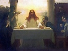

  
[Intangible Textual Heritage](../../index)  [Christianity](../index) 
[Index](index)  [Previous](uljc07)  [Next](uljc09) 

------------------------------------------------------------------------

[Buy this Book on
Kindle](https://www.amazon.com/exec/obidos/ASIN/B002TX7KEA/internetsacredte)

------------------------------------------------------------------------

  
The Unknown Life of Jesus Christ, by Nicolas Notovitch \[1890\], at
Intangible Textual Heritage

------------------------------------------------------------------------

### III.

1\. The glory of Israel's wealth spread over the whole earth, and the
surrounding nations became envious.

2\. But the Most High himself led the victorious arms of the Hebrews,
and the Pagans did not dare to attack them.

p. 161

3\. Unfortunately, man is prone to err, and the fidelity of the
Israelites to their God was not of long duration.

4\. Little by little they forgot the favors he had bestowed upon them;
rarely invoked his name, and sought rather protection by the magicians
and sorcerers.

5\. The kings and the chiefs among the people substituted their own laws
for those given by Mossa; the temple of God and the observances of their
ancient faith were neglected; the people addicted themselves to sensual
gratifications and lost their original purity.

6\. Many centuries had elapsed since their exodus from Egypt, when God
bethought himself of again inflicting chastisement upon them.

7\. Strangers invaded Israel, devastated

p. 162

the land, destroyed the villages, and carried their inhabitants away
into captivity.

8\. At last came the Pagans from over the sea, from the land of Romeles.
These made themselves masters of the Hebrews, and placed over them their
army chiefs, who governed in the name of Cæsar.

9\. They defiled the temples, forced the inhabitants to cease the
worship of the indivisible God, and compelled them to sacrifice to the
heathen gods.

10\. They made common soldiers of those who had been men of rank; the
women became their prey, and the common people, reduced to slavery, were
carried away by thousands over the sea.

11\. The children were slain, and soon, in the whole land, there was
naught heard but weeping and lamentation.

p. 163

12\. In this extreme distress, the Israelites once more remembered their
great God, implored his mercy and prayed for his forgiveness. Our
Father, in his inexhaustible clemency, heard their prayer.

------------------------------------------------------------------------

[Next: IV](uljc09)

