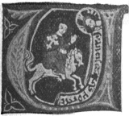

  
[Intangible Textual Heritage](../../index)  [Christianity](../index.md) 
[Index](index)  [Previous](wosf02)  [Next](wosf04.md) 

------------------------------------------------------------------------

[Buy this Book at
Amazon.com](https://www.amazon.com/exec/obidos/ASIN/B00267RU8U/internetsacredte.md)

------------------------------------------------------------------------

*The Writings of St. Francis of Assisi*, tr. by Paschal Robinson,
\[1905\], at Intangible Textual Heritage

------------------------------------------------------------------------

p. 1

# PART I.

p. 2

# ADMONITIONS, RULES, ETC.

p. 3

### I.

### WORDS OF ADMONITION OF OUR HOLY FATHER ST. FRANCIS.

|                    |
|--------------------|
|  |

UNDER this title a precious series of spiritual counsels on the
religious life has come down to us from the pen of St. Francis. The
early Legends afford no indication of the time or circumstances of the
composition of these Admonitions; nor is it possible to determine by
whom they were collected. But they accord so completely with the Saint's
genuine works and are so redolent of his spirit that their authenticity
is admitted by all. [1](#fn_73.md) Moreover, the
various codices in which these Admonitions may be found are unanimous in
attributing them to St. Francis, while the number of the
Admonitions [2](#fn_74.md) and the order in which
they are given in the different codices are almost the same as in the
Laurentian codex at Florence, dating from the thirteenth century.

Codices containing the Admonitions of St. Francis are to be found at the
following places: 1. *Assisi* (Munic. lib. cod. 338, fol. 18);—2.
*Berlin* (Royal lib. cod. lat. 196, fol. 101);—3. *Florence* (Laurentian
lib.

p. 4

cod. X. Plut. XIX. dextr., fol. 448);—4. *Florence* (cod. of the Convent
of Ognissanti, fol. 5);—5. *St. Floriano* (monast. lib. cod. XI. 148,
fol. 38);—6. *Foligno* (cod. of Capuchin Conv., fol. 21);—7. *Lemberg*
(Univ. lib. cod. 131, fol. 331);—8. *Liegnitz* [1](#fn_75.md) (lib. of SS. Peter and Paul. cod. 12, fol.
131);—9. *Luttich* (Munic. lib. cod. 343, fol. 154);—10. *Munich* (Royal
lib. cod. lat. 11354, fol. 25, number 1 only);—11. *Naples* (Nation.
lib. cod. XII. F. 32, folio antepaen. numbers 6-27);—12. *Oxford* [2](#fn_76.md) (Bodl. lib. cod. Canon miscell. 525, fol.
93);—13. *Paris* (Nat. lib. cod. 38327, fol. 354);—14, 15. *Paris*
(Mazarin lib. cod. 1743, fol. 134, and cod. 989, fol. 191);—16. *Paris*
(codex at lib. of the Prot. theol. faculty, fol. 86);—17. *Prague*
(Metrop. lib. cod. B. XC., fol. 244);—18. *Rome* (codex at St. Antony's
Coll. [3](#fn_77) fol. 77.md);—19, 20. *Rome*
(archiv. of St. Isidore's College, cod. 1/25, fol. 14, and cod. 1/73,
fol. 11);—21, 22. *Rome* (Vatic. lib. cod. 4354, fol. 39, and cod. 7650,
fol. 10);—23. *Toledo* (capit. lib. cod. Cai. 25, no. 11, fol. 65)
and—24. *Volterra* (Guarnacci lib. cod. 225, fol. 141).

Of the foregoing codices that in the Laurentian Library at Florence
dates from the thirteenth century; those at Ognissanti, Florence, at
Assisi, Berlin, St. Floriano, Oxford, Rome (St. Antony's, St. Isidore's,
and the Vatican codex 4354), Toledo, and Volterra date from the
fourteenth, and the others from the fifteenth century.

For the Quaracchi edition of the Admonitions, upon which the present
translation is based, the two oldest of all these codices, to wit, those
of the Laurentian

p. 5

\[paragraph continues\] Library at
Florence and of the Municipal Library at Assisi, [1](#fn_78.md) have been used. Those at St. Isidore's,
Rome, and Ognissanti, Florence, have also been consulted, besides the
editions of the Admonitions found in the *Monumenta Ordinis Minorum*
(Salamanca, 1511, tract. 11, fol. 276 r), the *Firmamenta Trium
Ordinum* [2](#fn_79.md) (Paris, 1512, P. I, fol. 19
r), and the Liber Conformitatum of Bartholomew of Pisa (Milan, 1510,
fruct. XII, P. 11). But for the titles and paragraphing, which differ
more or less in different codices, the Laurentian codex has been
followed. [3](#fn_80.md)

So much by way of preface to the

### ADMONITIONS.

#### 1. Of the Lord's Body

The Lord Jesus said to His disciples: "I am the Way, and the Truth, and
the Life. No man cometh to the Father, but by Me. If you had known Me
you would, without doubt, have known My Father also: and from henceforth
you shall

p. 6

know Him, and you have seen Him. Philip saith to Him: Lord, show us the
Father, and it is enough for us. Jesus saith to him: Have I been so long
a time with you and have you not known Me? Philip, he that seeth Me
seeth \[My\] Father also. How sayest thou, Shew us the Father?" [1](#fn_81.md) The Father "inhabiteth light
inaccessible," [2](#fn_82.md) and "God is a
spirit," [3](#fn_83.md) and "no man hath seen God
at any time." [4](#fn_84.md) Because God is a
spirit, therefore it is only by the spirit He can be seen, for "it is
the spirit that quickeneth; the flesh profiteth nothing." [5](#fn_85.md) For neither is the Son, inasmuch as He is
equal to the Father, seen by any one other than by the Father, other
than by the Holy Ghost. Wherefore, all those who saw the Lord Jesus
Christ according to humanity and did not see and believe according to
the Spirit and the Divinity, that He was the Son of God, were condemned.
In like manner, all those who behold the Sacrament of the Body of Christ
which is sanctified by the word of the Lord upon the altar by the hands
of the priest in the form of bread and wine, and who do not see and
believe according to the Spirit and Divinity that It is really the most
holy Body and Blood of our Lord Jesus Christ, are condemned, He the Most
High having declared it when He said, "This is My Body, and the Blood of
the New Testament," [6](#fn_86.md) and "he that
eateth My

p. 7

\[paragraph continues\] Flesh and drinketh
My Blood hath everlasting life." [1](#fn_87.md)

Wherefore \[he who has\] [2](#fn_88.md) the Spirit
of the Lord which dwells in His faithful, he it is who receives the most
holy Body and Blood of the Lord: all others who do not have this same
Spirit and who presume to receive Him, eat and drink judgment to
themselves. [3](#fn_89.md) Wherefore, "O ye sons of
men, how long will you be dull of heart?" [4](#fn_90.md) Why will you not know the truth and
"believe in the Son of God?" [5](#fn_91.md) Behold
daily He humbles Himself as when from His "royal throne" [6](#fn_92.md) He came into the womb of the Virgin; daily
He Himself comes to us with like humility; daily He descends from the
bosom of His Father upon the altar in the hands of the priest. And as He
appeared in true flesh to the Holy Apostles, so now He shows Himself to
us in the sacred Bread; and as they by means of their fleshly eyes saw
only His flesh, yet contemplating Him with their spiritual eyes,
believed Him to be God, so we, seeing bread and wine with bodily eyes,
see and firmly believe it to be His most holy Body and true and living
Blood. And in this way our Lord is ever with His faithful, as He Himself
says: "Behold I am with you all days, even to the consummation of the
world." [7](#fn_93.md)

p. 8

#### 2. The Evil of Self-will.

The Lord God said to Adam: "Of every tree of paradise thou shalt eat.
But of the tree of knowledge of good and evil thou shalt not eat." [1](#fn_94.md) Adam therefore might eat of every tree of
paradise and so long as he did not offend against obedience he did not
sin. For one eats of the tree of knowledge of good who appropriates to
himself his own will [2](#fn_95.md) and prides
himself upon the goods which the Lord publishes and works in him and
thus, through the suggestion of the devil and transgression of the
commandment, he finds the apple of the knowledge of evil; wherefore, it
behooves that he suffer punishment.

#### 3. Of Perfect and Imperfect Obedience.

The Lord says in the Gospel: he "that doth not renounce all that he
possesseth cannot be" a "disciple " [3](#fn_96.md)
and "he that will save his life, shall lose it." [4](#fn_97.md) That man leaves all he possesses and loses
his body and his soul who abandons himself wholly to obedience in the
hands of his superior, and whatever he does and says—provided he himself
knows that what he does is good and not contrary to his \[the
superior's\] will—is true obedience. And if at times a subject sees
things which would be better or more useful to his soul than those which
the

p. 9

superior commands him, let him sacrifice his will to God, let him strive
to fulfil the work enjoined by the superior. This is true and charitable
obedience which is pleasing to God and to one's neighbor.

If, however, a superior command anything to a subject that is against
his soul it is permissible for him to disobey, but he must not leave him
\[the superior\], and if in consequence he suffer persecution from some,
he should love them the more for God's sake. For he who would rather
suffer persecution than wish to be separated from his brethren, truly
abides in perfect obedience because he lays down his life for his
brothers. [1](#fn_98.md) For there are many
religious who, under pretext of seeing better things than those which
their superiors command, look back [2](#fn_99.md)
and return to the vomit of their own will [3](#fn_100.md). These are homicides and by their bad
example cause the loss of many souls.

#### 4. That no one should take Superiorship upon himself.

I did "not come to be ministered unto, but to minister," says the
Lord. [4](#fn_101.md) Let those who are set above
others glory in this superiority only as much as if they had been
deputed to wash the feet of the brothers; and if they are more perturbed
by the loss of their superiorship than they would be by losing the
office of washing feet, so much

p. 10

the more do they lay up treasures to the peril of their own soul.

#### 5. That no one should glory save in the Cross of the Lord.

Consider, O man, how great the excellence in which the Lord has placed
you because He has created and formed you to the image of His beloved
Son according to the body and to His own likeness according to the
spirit. [1](#fn_102.md) And all the creatures that
are under heaven serve and know and obey their Creator in their own way
better than you. And even the demons did not crucify Him, but you
together with them crucified Him and still crucify Him by taking delight
in vices and sins. Wherefore then can you glory For if you were so
clever and wise that you possessed all science, and if you knew how to
interpret every form of language and to investigate heavenly things
minutely, you could not glory in all this, because one demon has known
more of heavenly things and still knows more of earthly things than all
men, although there may be some man who has received from the Lord a
special knowledge of sovereign wisdom. In like manner, if you were
handsomer and richer than all others, and even if you could work wonders
and put the demons to flight, all these things are hurtful to you and in
nowise belong to you, and in them you cannot glory; that, however, in
which we may glory is in our infirmities, [2](#fn_103.md) and in

p. 11

bearing daily the holy cross of our Lord Jesus Christ.

#### 6. Of the Imitation of the Lord.

Let us all, brothers, consider the Good Shepherd who to save His sheep
bore the suffering of the Cross. The sheep of the Lord followed Him in
tribulation and persecution and shame, in hunger and thirst, in
infirmity and temptations and in all other ways; [1](#fn_104.md) and for these things they have received
everlasting life from the Lord. Wherefore it is a great shame for us,
the servants of God, that, whereas the Saints have practised works, we
should expect to receive honor and glory for reading and preaching the
same.

#### 7. That Good Works should accompany Knowledge.

The Apostle says, "the letter killeth, but the spirit quickeneth." [2](#fn_105.md) They are killed by the letter who seek
only to know the words that they may be esteemed more learned among
others and that they may acquire great riches to leave to their
relations and friends. And those religious are killed by the letter who
will not follow the spirit of the Holy Scriptures, but who seek rather
to know the words only and to interpret them to others. And they are
quickened by the spirit of the Holy Scriptures who do not interpret

p. 12

materially every text they know or wish to know, but who by word and
example give them back to God from whom is all good.

#### 8. Of avoiding the Sin of Envy.

The Apostle affirms that "no man can say the Lord Jesus but by the Holy
Ghost," [1](#fn_106.md) and "there is none that
doth good, no not one." [2](#fn_107.md) Whosoever,
therefore, envies his brother on account of the good which the Lord says
or does in him, commits a sin akin to blasphemy, because he envies the
Most High Himself who says and does all that is good.

#### 9. Of Love.

The Lord says in the Gospel, "Love your enemies," etc. [3](#fn_108.md) He truly loves his enemy who does not
grieve because of the wrong done to himself, but who is afflicted for
love of God because of the sin on his \[brother's\] soul and who shows
his love by his works.

#### 10. Of Bodily Mortification.

There are many who if they commit sin or suffer wrong often blame their
enemy or their neighbor. But this is not right, for each one has his
enemy in his power,—to wit, the body by which he sins. Wherefore blessed
is that servant who always holds captive the enemy

p. 13

thus given into his power and wisely guards himself from it, for so long
as he acts thus no other enemy visible or invisible can do him harm.

#### 11. That one must not be seduced by Bad Example. [1](#fn_109.md)

To the servant of God nothing should be displeasing save sin. And no
matter in what way any one may sin, if the servant of God is troubled or
angered—except this be through charity—he treasures up guilt to
himself. [2](#fn_110.md) The servant of God who
does not trouble himself or get angry about anything lives uprightly and
without sin. And blessed is he who keeps nothing for himself, rendering
"to Cæsar the things that are Cæsar's and to God the things that are
God's." [3](#fn_111.md)

#### 12. Of Knowing the Spirit of God.

Thus may the servant of God know if he has the Spirit of God: if when
the Lord works some good through him, his body—since it is ever at
variance with all that is good—is not therefore puffed up; but if he
rather becomes viler in his own sight and if he esteems himself less
than other men. [4](#fn_112.md)

p. 14

#### 13. Of Patience.

How much interior patience and humility a servant of God may have cannot
be known so long as he is contented. [1](#fn_113.md) But when the time comes that those who
ought to please him go against him, as much patience and humility as he
then shows, so much has he and no more.

#### 14. Of Poverty of Spirit.

"Blessed are the poor in spirit: for theirs is the kingdom of
heaven." [2](#fn_114.md) Many apply themselves to
prayers and offices, and practise much abstinence and bodily
mortification, but because of a single word which seems to be hurtful to
their bodies or because of something being taken from them, they are
forthwith scandalized and troubled. These are not poor in spirit: for he
who is truly poor in spirit, hates himself and loves those who strike
him on the cheek. [3](#fn_115.md)

#### 15. Of Peacemakers.

"Blessed are the peacemakers: for they shall be called the children of
God." [4](#fn_116.md) They are truly peacemakers
who amidst all they suffer in this world maintain peace in soul and body
for the love of our Lord Jesus Christ.

p. 15

#### 16. Of Cleanness of Heart.

"Blessed are the clean of heart: for they shall see God." [1](#fn_117.md) They are clean of heart who despise
earthly things and always seek those of heaven, and who never cease to
adore and contemplate the Lord God Living and True, with a pure heart
and mind.

#### 17. Of the Humble Servant of God.

Blessed is that servant who is not more puffed up because of the good
the Lord says and works through him than because of that which He says
and works through others. A man sins who wishes to receive more from his
neighbor than he is himself willing to give to the Lord God.

#### 18. Of Compassion toward one's Neighbor.

Blessed is the man who bears with his neighbor according to the frailty
of his nature as much as he would wish to be borne with by him if he
should be in a like case.

#### 19. Of the Happy and Unhappy Servant.

Blessed is the servant who gives up all his goods to the Lord God, for
he who retains anything for himself hides "his Lord's money," [2](#fn_118.md) and that "which he thinketh he hath
shall be taken away from him." [3](#fn_119.md)

p. 16

#### 20. Of the Good and Humble Religious.

Blessed is the servant who does not regard himself as better when he is
esteemed and extolled by men than when he is reputed as mean, simple,
and despicable: for what a man is in the sight of God, so much he is,
and no more. [1](#fn_120.md) Woe to that religious
who is elevated in dignity by others, and who of his own will is not
ready to descend. And blessed is that servant who is raised in dignity
not by his own will and who always desires to be beneath the feet of
others.

#### 21. Of the Happy and Vain Religious.

Blessed is that religious who feels no pleasure or joy save in most holy
conversation and the works of the Lord, and who by these means leads
men [2](#fn_121.md) to the love of God in joy and
gladness. And woe to that religious who takes delight in idle and vain
words and by this means provokes men to laughter.

#### 22. Of the Frivolous and Talkative Religious. [3](#fn_122.md)

Blessed is that servant who does not speak through hope of reward and
who does not manifest everything and is not "hasty to speak," [4](#fn_123.md) but who

p. 17

wisely foresees what he ought to say and answer. Woe to that religious
who not concealing in his heart the good things which the Lord has
disclosed to him and who not manifesting them to others by his work,
seeks rather through hope of reward to make them known to men by words:
for now he receives his recompense and his hearers bear away little
fruit.

#### 23. Of True Correction.

Blessed is the servant who bears discipline, accusation, and blame from
others as patiently as if they came from himself. Blessed is the servant
who, when reproved, mildly submits, modestly obeys, humbly confesses,
and willingly satisfies. Blessed is the servant who is not prompt to
excuse himself and who humbly bears shame and reproof for sin when he is
without fault.

#### 24. Of True Humility. [1](#fn_124.md)

Blessed is he [2](#fn_125.md) who shall be found
as humble among his subjects as if he were among his masters. Blessed is
the servant who always continues under the rod of correction. He is "a
faithful and wise servant" [3](#fn_126.md) who
does not delay to punish himself for all his offences, interiorly by
contrition and exteriorly by confession and by works of satisfaction.

p. 18

#### 25. Of True Love.

Blessed is that brother who would love his brother as much when he is
ill and not able to assist him as he loves him when he is well and able
to assist him. Blessed is the brother who would love and fear his
brother as much when he is far from him as he would when with him, and
who would not say anything about him Behind his back that he could not
with charity say in his presence.

#### 26. That the Servants of God should honor Clerics.

Blessed is the servant of God who exhibits confidence in clerics who
live uprightly according to the form of the holy Roman Church. And woe
to those who despise them: for even though they \[the clerics\] may be
sinners, nevertheless no one ought to judge them, because the Lord
Himself reserves to Himself alone the right of judging them. For as the
administration with which they are charged, to wit, of the most holy
Body and Blood of our Lord Jesus Christ, which they receive and which
they alone administer to others—is greater than all others, even so the
sin of those who offend against them is greater than any against all the
other men in this world.

p. 19

#### 27. Of the Virtues putting Vices to flight.

Where there is charity and wisdom there is neither fear nor ignorance.
Where there is patience and humility there is neither anger nor
worry. [1](#fn_127.md) Where there is poverty and
joy there is neither cupidity nor avarice. Where there is quiet and
meditation there is neither solicitude nor dissipation. Where there is
the fear of the Lord to guard the house the enemy cannot find a way to
enter. Where there is mercy and discretion there is neither superfluity
nor hard-heartedness.

#### 28. Of hiding Good lest it be lost.

Blessed is the servant who treasures up in heaven [2](#fn_128.md) the good things which the Lord shows him
and who does not wish to manifest them to men through the hope of
reward, for the Most High will Himself manifest his works to whomsoever
He may please. Blessed is the servant who keeps the secrets of the Lord
in his heart. [3](#fn_129.md)

------------------------------------------------------------------------

### Footnotes

[3:1](wosf03.htm#fr_73.md) See Goetz: Quellen zur
Geschichte des hl. Franz von Assisi, in *Zeitschrift für
Kirchengeschichte*, t. xxii, p. 551, and Van Ortroy, S.J., in *Anal.
Bolland.*, t. xxiv, fasc. iii (1905), p. 411.

[3:2](wosf03.htm#fr_74.md) The codex of St.
Antony's College, Rome, omits the Admonitions numbered 11 and 22. It may
be noted, however, that both these numbers are found at the end of the
*Speculum Perfectionis*, ed. Lemmens. See *Documenta Antiqua
Franciscans*, P. II, p. 84.

[4:1](wosf03.htm#fr_75.md) On this MS. see
Sabatier, *Opuscules*, fasc. ii.

[4:2](wosf03.htm#fr_76.md) On this MS. see Little,
*Opuscules*, fasc. v.

[4:3](wosf03.htm#fr_77.md) As to this codex see
Lemmens: *Documenta Antiqua Franciscana*, P. III, p. 72.

[5:1](wosf03.htm#fr_78.md) Mgr. Faloci has edited
the first of the Admonitions from this codex in his *Miscellanea
Francescana*, t. vi, p. 96.

[5:2](wosf03.htm#fr_79.md) In this edition, which
Wadding has followed (fol. 21 v.), nos. 20, 21, and 23 are repeated.

[5:3](wosf03.htm#fr_80.md) In places where variants
are noted at the foot of the page the following abbreviations will be
used:

|         |                                                             |
|---------|-------------------------------------------------------------|
| L.      | Laurentian Codex.                                           |
| As.     | Assisian Codex.                                             |
| O.      | Ognissanti Codex.                                           |
| An.     | Codex at St. Antony's College.                              |
| Is.     | Codex at St. Isidore's College.                             |
| *Mon.*  | Version of the *Monumenta*.                                 |
| *Firm.* | Version of the *Firmamenta*.                                |
| Pis.    | Version given by Bartholomew of Pisa in his *Conformities*. |

[6:1](wosf03.htm#fr_81.md) John 14: 6-9.

[6:2](wosf03.htm#fr_82.md) I Tim. 6: 16.

[6:3](wosf03.htm#fr_83.md) John 4: 24.

[6:4](wosf03.htm#fr_84.md) John 1: 18.

[6:5](wosf03.htm#fr_85.md) John 6: 64.

[6:6](wosf03.htm#fr_86.md) Mark 14: 22-24.

[7:1](wosf03.htm#fr_87.md) John 6: 55.

[7:2](wosf03.htm#fr_88.md) These words are added in
the text given by Pis. and Wadd.

[7:3](wosf03.htm#fr_89.md) See I Cor. 11: 29.

[7:4](wosf03.htm#fr_90.md) Ps. 4: 3.

[7:5](wosf03.htm#fr_91.md) John 9: 35.

[7:6](wosf03.htm#fr_92.md) Wis. 18: 15.

[7:7](wosf03.htm#fr_93.md) Matt. 28: 20.

[8:1](wosf03.htm#fr_94.md) Gen. 2: 16-17.

[8:2](wosf03.htm#fr_95.md) To which, namely, he has
no right after religious profession, having relinquished his will by the
vow of obedience.

[8:3](wosf03.htm#fr_96.md) Luke 14: 33.

[8:4](wosf03.htm#fr_97.md) Matt. 16: 25.

[9:1](wosf03.htm#fr_98.md) See John 15: 13.

[9:2](wosf03.htm#fr_99.md) See Luke 9: 62.

[9:3](wosf03.htm#fr_100.md) See Prov. 26: 11.

[9:4](wosf03.htm#fr_101.md) Matt. 20: 28.

[10:1](wosf03.htm#fr_102.md) See Gen. 1: 26.

[10:2](wosf03.htm#fr_103.md) See II Cor. 12: 5.

[11:1](wosf03.htm#fr_104.md) See John 10: 11; Heb.
12: 2; John 10: 4; Rom. 8: 35.

[11:2](wosf03.htm#fr_105.md) II Cor. 3: 6.

[12:1](wosf03.htm#fr_106.md) I Cor. 12: 3.

[12:2](wosf03.htm#fr_107.md) Ps. 52: 4.

[12:3](wosf03.htm#fr_108.md) Matt. 5: 44.

[13:1](wosf03.htm#fr_109.md) This Admonition is
wanting in codex An., but is found in the *Speculum Perfectionis*, ed.
Lemmens. See *Documenta Antiqua Franciscana*, P. II, p. 84.

[13:2](wosf03.htm#fr_110.md) See Rom. 2: 5.

[13:3](wosf03.htm#fr_111.md) Matt. 22: 21.

[13:4](wosf03.htm#fr_112.md) Cod. O. and Is. read:
"If therefore his body is puffed up, he has not the Spirit of God. If,
however, he becomes rather viler in his own sight, then he truly has the
Spirit of God."

[14:1](wosf03.htm#fr_113.md) Cod. O. reads: "so
long as he enjoys everything according to his wish and necessity."

[14:2](wosf03.htm#fr_114.md) Matt. 5: 3.

[14:3](wosf03.htm#fr_115.md) See Matt. 5: 39.

[14:4](wosf03.htm#fr_116.md) Matt. 5: 9.

[15:1](wosf03.htm#fr_117.md) Matt. 5: 8.

[15:2](wosf03.htm#fr_118.md) See Matt. 25: 18.

[15:3](wosf03.htm#fr_119.md) Luke 8: 18.

[16:1](wosf03.htm#fr_120.md) See Bonav. *Leg.
Maj.*, VI, 1: "And he had these words continually in his mouth**:
'**what a man is in the eyes of God, so much he is, and no more.'" See
also *Imitation of Christ*, Bk. III, Chap. L, where the same saying of
St. Francis is quoted.

[16:2](wosf03.htm#fr_121.md) See *Speculum
Perfectionis*, ed. Sabatier, p. 189.

[16:3](wosf03.htm#fr_122.md) This Admonition (like
No. 11) is wanting in Cod. An., but is found in the *Speculum
Perfectionis*, ed. Lemmens. See *Doc. Act. Franc.*, P. II, p. 84.

[16:4](wosf03.htm#fr_123.md) Prov. 29: 20.

[17:1](wosf03.htm#fr_124.md) In Cod. O. numbers 23
and 24 are not divided.

[17:2](wosf03.htm#fr_125.md) Cod. An. reads:
"Blessed is that superior . . . "

[17:3](wosf03.htm#fr_126.md) Matt. 24: 45.

[19:1](wosf03.htm#fr_127.md) Cod. O. omits this
sentence.

[19:2](wosf03.htm#fr_128.md) See Matt. 6: 20.

[19:3](wosf03.htm#fr_129.md) St. Francis would
often say to his brethren: "When a servant of God receives any divine
inspiration in prayer, he ought to say, 'This consolation, O Lord, Thou
hast sent from heaven to me, a most unworthy sinner, and I commit it to
Thy care, for I know that I should be but a thief of Thy treasure.' And
when he returns to prayer, he ought to bear himself as a little one and
a sinner, as if he had received no new grace from God."—St. Bonaventure,
*Leg. Maj.*, X, 4.

------------------------------------------------------------------------

[Next: II. Salutation of the Virtues](wosf04.md)
