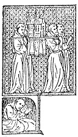

  
[Intangible Textual Heritage](../../index)  [Christianity](../index.md) 
[Index](index)  [Previous](wosf10)  [Next](wosf12.md) 

------------------------------------------------------------------------

[Buy this Book at
Amazon.com](https://www.amazon.com/exec/obidos/ASIN/B00267RU8U/internetsacredte.md)

------------------------------------------------------------------------

*The Writings of St. Francis of Assisi*, tr. by Paschal Robinson,
\[1905\], at Intangible Textual Heritage

------------------------------------------------------------------------

p. 91

# PART II.

p. 92

# SIX LETTERS OF ST. FRANCIS

p. 93

### THE LETTERS OF ST. FRANCIS.

|                    |
|--------------------|
|  |

OF the seventeen letters attributed to St. Francis in Wadding's edition
of the *Opuscula*, five cannot be admitted as genuine, at least in the
form given in that work, and the rest need, with two exceptions, to be
reclassified.

In the first category, we must place the familiar letter in which St.
Francis gives St. Antony permission to teach theology (Epistle III, in
Wadding's edition), and which has been excluded by the Quaracchi editors
as doubtful on the ground that it exists in too many different
forms. [1](#fn_369.md) The letters to Brother
Elias, to the Provincial Ministers, and to the Custodes (Epistles VII,
IX, and XIV, in Wadding's edition), were translated by Wadding into
Latin from a Spanish text, [2](#fn_370.md) and
have not come down to us in their original form. Hence they do not
figure in the Quaracchi edition. Neither does the letter (Epis. XVII, in
Wadding's edition) to "Brother" Giacoma dei Settisoli, which is clearly
an extract from Chapter XVIII of the *Actus B. Francisci et Sociorum
ejus*. [3](#fn_371.md) Following the

p. 94

\[paragraph continues\] Quaracchi editors,
I have excluded these five letters from the present work.

As regards the reclassification of the other letters attributed to St.
Francis by Wadding, Epistles IV, V, and XIII in his edition are without
doubt genuine writings of St. Francis, but they are not letters; at
least, the oldest MSS. do not give them in epistolary form. The two
former are fragments of a "rule of life" and a "last wish," written by
St. Francis for St. Clare; No. XIII is an Instruction on the Blessed
Sacrament. All three are given elsewhere in the present volume in their
proper form. [1](#fn_372.md) For the rest, the
Epistles numbered I and II by Wadding form the text of one and the same
letter "To all the Faithful;" those numbered VI and VIII seem to be a
summary of the genuine letter "To a Minister," and No. X is part of the
letter "To the General Chapter" also given below, while Epistles XI and
XII form but one letter in the oldest codices and belong to this same
letter to the General Chapter. The only two letters, then, of St.
Francis which, both as regards matter and form, may be accepted as
Wadding gives them, are numbers VIII and XV, addressed to the

p. 95

\[paragraph continues\] Rulers and to
Brother Leo respectively. In a word, as a result of this process of
elimination and reclassification, only five of the seventeen letters
ascribed to St. Francis by Wadding remain to us, namely:—

1\. *Letter to all the Faithful* (Ep. I and II of Wadding).

2\. *Letter to the General Chapter* (Ep. X, XI, and XII of Wadding).

3\. *Letter to a Minister* (Ep. VI and VIII of Wadding).

4\. *Letter to the Rulers* (Ep. XV of Wadding).

5\. *Letter to Brother Leo* (Ep. XVI of Wadding).

To these five letters, the Quaracchi editors have added the undoubtedly
authentic letter of St. Francis to the Custodes, [1](#fn_373.md) making six in all. Such are the six
letters which I have here rendered into English. Let us now consider
each of them in order.

------------------------------------------------------------------------

### Footnotes

[93:1](wosf11.htm#fr_369.md) On this letter see
Appendix.

[93:2](wosf11.htm#fr_370.md) Wadding drew on the
Spanish text of Rebolledo (*Chron*, P. I, l. II, c. xxvii) and himself
appears to have had misgivings, at least as regards the authenticity of
Epistle VII.

[93:3](wosf11.htm#fr_371.md) See *Actus B.
Francisci*, etc., ed. Sabatier, p. 63. M. Sabatier attributes the
authorship of this compilation (which contains, as is now known, among
other matters, the original Latin text of the traditional *Fioretti*) to
Fra Ugolino di Monte Giorgio, and believes its date to be between 1280
and 1320. It is, however, from Thomas of Celano that we know St. p. 94Francis to have written a letter to the Lady
Giacoma (See *Tr. de Miraculis in Anal. Bolland.*, t. xviii). See also
*Spec. Perf.* (ed. Sabatier), c. XII, for reference to this letter. The
narrative of Celano renders the text of the letter given in the Actus
very doubtful. The fact that the expression "St. Mary of the Angels" is
used in it to designate the Portiuncula is in itself sufficient to
militate against its authenticity. Neither St. Francis nor his
companions ever employed this term; they invariably said "St. Mary of
the Portiuncula." Any document, therefore, containing the former
expression bespeaks a fourteenth century origin at earliest. See *Frère
Jacqueline: Recherches Historiques*, by Fr. Edouard d’Alencon, Paris,
1899.

[94:1](wosf11.htm#fr_372.md) See above, pp.
[23](wosf05.htm#page_23), [77](wosf08.htm#page_77.md),
[78](wosf08.htm#page_78.md).

[95:1](wosf11.htm#fr_373.md) The letter which
Wadding translated from the Spanish, under this title and numbered XIV,
appears to have been an incomplete version of the letter here given in
full.

------------------------------------------------------------------------

[Next: I. Letter to All The Faithful](wosf12.md)
