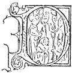

  
[Intangible Textual Heritage](../../index)  [Christianity](../index.md) 
[Index](index)  [Previous](wosf23)  [Next](wosf25.md) 

------------------------------------------------------------------------

[Buy this Book at
Amazon.com](https://www.amazon.com/exec/obidos/ASIN/B00267RU8U/internetsacredte.md)

------------------------------------------------------------------------

*The Writings of St. Francis of Assisi*, tr. by Paschal Robinson,
\[1905\], at Intangible Textual Heritage

------------------------------------------------------------------------

p. 177

# APPENDIX

p. 178 p. 179

### APPENDIX.

### SOME LOST, DOUBTFUL, AND SPURIOUS WRITINGS.

|                    |
|--------------------|
|  |

DOUBTLESS we should have expected every fragment of St. Francis’
writings to have been preserved with loving care throughout the ages.
But when we consider the conditions under which some of them were
composed and the vicissitudes they afterwards passed through, we need
not be surprised if all of them have not come down to us. On the
contrary. For if we may believe such writers as Ubertino da Casale,
serious attempts were made in certain quarters toward the close of the
thirteenth century to suppress altogether part of the Saint's
writings. [1](#fn_579.md) Be this as it may, it is
certain that several of these precious documents disappeared in the
course of time. Among such lost treasures we must reckon the primitive
Rule of the Friars in the form approved by Innocent III in 1209. [2](#fn_580.md) Again only two fragments seem to have
survived of the "many writings" which, as has been already mentioned,
St. Francis addressed to the Poor Ladies at St.

p. 180

\[paragraph continues\] Damian's. [1](#fn_581.md) Whether or not either of these fragments
is to be identified with a letter written by St. Francis to console the
Clares, of which we read in the *Speculum* and the *Conformities*, it is
well nigh impossible to determine. [2](#fn_582.md)
Celano speaks [3](#fn_583.md) of a letter to St.
Antony of Padua, different apparently from the one known to us, and of
others to Cardinal Ugolino. [4](#fn_584.md) So,
too, Eccleston [5](#fn_585.md) tells of letters
written to the brothers in France and at Bologna. [6](#fn_586.md)

As to the famous letter of St. Francis to St. Antony commissioning the
latter to teach theology, there is no small diversity of opinion. It is
given for the first time in the *Liber Miraculorum*, [7](#fn_587.md) and also in the *Chron. XXIV
Generalium*. [8](#fn_588.md) M. Sabatier, who was,
I believe, the first to call the authenticity of this letter into
question, [9](#fn_589.md)

p. 181

now seems less inclined to reject it. [1](#fn_590.md) Professor Goetz [2](#fn_591.md) has decided for, and Professor
Boehmer [3](#fn_592.md) against it. The Quaracchi
editors, in excluding this letter from their edition of the *Opuscula*,
by no means intended to deny that St. Francis wrote to *fratri
Antonio*, [4](#fn_593.md) but they were unable to
determine which if any of the three different forms of this letter now
in circulation might be the genuine one. Since the matter is *sub
judice*, [5](#fn_594.md) so to say, I think, with
Mr. Carmichael, this letter might find a place among the "Doubtful
Works" of St. Francis. [6](#fn_595.md)

Apropos of the Saint's doubtful works it seems proper to say a word as
to the Rule of the Brothers and Sisters of Penance. Although this
Rule—like that of the Clares—is wanting in all the early MS. collections
of St. Francis’ writings, we know from Bernard of Besse [7](#fn_596.md) that St.

p. 182

\[paragraph continues\] Francis, with the
coöperation of Cardinal Ugolino, wrote a Rule for these Tertiaries. What
became of this document? It is generally conceded that the Rule of this
Third Order as it stands in the Bull *Supra montem* of Nicholas IV in
1289 [1](#fn_597.md) is not the handiwork of St.
Francis; and for the rest the early history of the Third Order is
uncertain, as all Franciscan students are aware. [2](#fn_598.md) But what are we to think of the much
older text of this Rule published by M. Sabatier in 1901, after MS. XX
of the convent at Capistran in the Abruzzi? [3](#fn_599.md) Father Mandonnet, O.P., has tried to
prove that the first twelve of the thirteen chapters comprising this
document discovered by M. Sabatier, represent the Rule of 1221 in its
primitive state. [4](#fn_600.md) I would fain
share the opinion of the learned Dominican on this head, but the
objection raised against it by the Quaracchi editors seems to me
insuperable. It amounts to this: In Chapter VI, § 4, of this *Regula
Antiqua* there is a clear allusion to a

p. 183

\[paragraph continues\] Bull of March 30,
1228, [1](#fn_601.md) which it is difficult to
regard as an interpolation. Moreover, as Fr. Ubald d’Alençon points
out, [2](#fn_602.md) the mention of coin in
circulation at Ravenna is also hard to explain in an Umbrian writer.
Perhaps this document may prove to be St. Francis’ Rule for Tertiaries
put into legislative form, with the addition of a few minor regulations.
Meanwhile, following the example of the Quaracchi editors, I have
abstained from including it among the authentic writings of St.
Francis. [3](#fn_603.md)

Coming next to St. Francis’ poems, although he doubtless wrote some few
canticles besides the Canticle of the Sun, the two others given by
Wadding can hardly be accepted as his, at least in their present form. I
refer to the *Amor de caritade* [4](#fn_604.md)
and *In foco l’amor mi mise*. [5](#fn_605.md)
True, they are both attributed to St. Francis by St. Bernardine of
Siena, [6](#fn_606.md) but they are also found
among the works of Jacopone da Todi, [7](#fn_607.md) although Ozanam thinks that at most they
were only retouched by the latter. [8](#fn_608.md)
The tendency nowadays is to ascribe

p. 184

all the early Franciscan poetry to Jacopone. When the critical edition
of this extraordinary man's works is published at Quaracchi, some needed
light will no doubt be thrown on this delicate question; then too,
perhaps, Pacifico, the "King of Verses," and " most courtly doctor of
singers," may at length come into his own. Meanwhile a number of poems
found in a fifteenth century manuscript at the National Library at
Naples, once at the convent of Aquila in the Abruzzi, and lately
ascribed to St. Francis, are clearly apocryphal, as Professor Ildebrando
della Giovanna has sufficiently demonstrated.

Wadding himself regarded the seven sermons of St. Francis he gives as of
doubtful authenticity. And rightly, for they are from the work of Fr.
Louis Rebolledo, already mentioned. [1](#fn_609.md) The twenty-eight *Collationes* are,
*pace* Fr. Mandonnet, who regards them as genuine, [2](#fn_610.md) rightly rejected by Professor Goetz, who
points out how Wadding compiled them from various sources. [3](#fn_611.md) Many are translated from an Italian MS.
at Fano in the Marches of which we know neither the age nor the
parentage. [4](#fn_612.md) But they seem to be
mere transcripts from the early legends. Thus *Collatio I* is an
adaptation of Celano (1, 2)

p. 185

and *Collatio XIV* is taken almost verbatim from St. Bonaventure, while
*Collatio V* is an accommodation of Celano and St. Bonaventure; *XXVI*
and *XXVIII* are abridged from the *Speculum; XXIV* is found in the
*Chron. XXI V Gen.*, and so on. It is therefore to the authors of these
works and not to St. Francis that these conferences are to be ascribed.

At the end of his edition of the *Opuscula* Wadding has collected
several "Prayers of St. Francis" of which the text is more than
doubtful. Let us see why. Take for example the prayers said to have been
used by St. Francis "at the beginning of his conversion" or "in time of
sickness" or "at the elevation." One searches in vain among the early
MS. collections for any trace of these prayers, nor is mention of them
to be found [1](#fn_613.md) elsewhere. As regards
the prayer "to obtain Poverty," it has long been known that it was not
written by St. Francis himself. Wadding found it in the *Arbor Vitae*
(l. v., cap. iii), but Ubertino da Casale is there quoting from the
*Sacrum Commercium B. Francisci cum Domina Paupertate*. [2](#fn_614.md) The latter work is not an historical
narrative, but an exquisite allegory in which St. Francis’ own tale of
his mystic espousals with the Lady Poverty is most poetically expanded
by one of his

p. 186

followers, [1](#fn_615.md) and consequently
Ubertino did not pretend in citing such a work to give this prayer as
the actual composition of Francis. [2](#fn_616.md)

In some MS. collections and library catalogues certain works may be
found ascribed to St. Francis which are obviously spurious. For example,
the *Epistola B. Francisci ad Fr. Bernardum*, found in at least two
fifteenth century codices, [3](#fn_617.md) is
nothing else but the letter of St. Bonaventure *continens XXV
memoralia*. [4](#fn_618.md)

Sbaralea [5](#fn_619.md) mentions copies of a book
of the "Sayings" of St. Francis as existing at Assisi and Ferrara, [6](#fn_620.md) but a careful search has failed to
reveal any trace of them. He also refers to a MS. (B. 31) in the
Vallicellian Library at Rome in which "the sayings of St. Francis are
found with the Rule," [7](#fn_621.md) but this
codex is also missing. In this library, however, there *is* a codex (B.
82, fol. 141 r) which contains a "Sermon delivered by St. Francis at the
end of his life." [8](#fn_622.md) The

p. 187

number of patristic citations this work contains is alone sufficient to
demonstrate its spuriousness.

*The Francisci Collationes cum fratribus*, catalogued among the Latin
MSS. of the Royal Library at Munich [1](#fn_623.md) as being contained in a fifteenth
century MS. at that library (cod. 11354), are a selection from the
*Dicta* of the Blessed Brother Giles, as is evident from the *Incipit*
of the prologue and the text of the first collation. [2](#fn_624.md) Their attribution to St. Francis is
therefore an error of the catalogue. The *Verba S. Francisci de
Paupertate*, mentioned in the same catalogue as contained in Cod. 5998,
fol. 189, are an excerpt from Chap. VI of the Second Rule of the Friars
Minor. [3](#fn_625.md)

This attribution of writings to St. Francis which clearly do not belong
to him is rarely intentional; it is often the result of error. For the
rest, it was easiest for compilers and librarians unacquainted with the
authorship of certain Franciscan works, and not eager to undertake deep
researches as to their origin, to ascribe them to the common father of
all Franciscan literature and the source of its inspiration.

Since every new revelation of St. Francis must be a priceless gain, it
is devoutly to be wished that the present energetic research work among

p. 188

the sources of Franciscan history may happily bring to light some of St.
Francis’ writings not known to us save through the formal attestation of
the early legends and chronicles, or at least put us in possession of
complete copies of such as have come down to us only in fragmentary
form.

Meanwhile I conclude this volume by wishing its readers their full share
in the blessing which St. Francis himself has promised to those who
receive his words kindly: *Omnes illi et illae, qui ea benigne
recipient, benedicat eis Pater et Filius et Spiritus Sanctus. Amen*.

------------------------------------------------------------------------

### Footnotes

[179:1](wosf24.htm#fr_579.md) "Et toto conatu
fuerunt solliciti annulare scripta beati patris nostri Francisci, in
quibus sua intentio de observantia regulae declaratur."—See Archiv.,
III, pp. 168-169.

[179:2](wosf24.htm#fr_580.md) See above, [p.
26](wosf06.htm#page_26.md).

[180:1](wosf24.htm#fr_581.md) We need not despair
of finding others; the Clares’ archives have mostly escaped spoliation.

[180:2](wosf24.htm#fr_582.md) See *Spec. Perf.*
(ed. Sabatier), c. 108, and ed. Lemmens, c. 18. See also the
*Conformities* (I, fol. 185), and above, [p. 75](wosf08.htm#page_75.md).

[180:3](wosf24.htm#fr_583.md) See 2 Cel. 3, 99.

[180:4](wosf24.htm#fr_584.md) See 1 Cel. 82. See
also *Leg III Soc.*, 67, where the *Incipit* of the letters is given.

[180:5](wosf24.htm#fr_585.md) *De Adventu Minorum
in Angliam*. See *Mon. Germ. Hist.*, *Script*., t. XXVIII, p. 563, and
*Anal. Franc.*, t. I, p. 232, note 4. See also Fr. Cuthbert's
translation of Eccleston, p. 64.

[180:6](wosf24.htm#fr_586.md) Prof. Herkless in
his *Francis and Dominic*, p. 54, cites some passages from a letter
which St. Francis "wrote to his friends at Bologna " in 1228. One
searches in vain for any trace of such a letter among the early
collections of St. Francis’ writings.

[180:7](wosf24.htm#fr_587.md) See ed. *Acta S.S.*,
no. 20.

[180:8](wosf24.htm#fr_588.md) See *Anal. Franc.*,
t. III, p. 132.

[180:9](wosf24.htm#fr_589.md) *Vie de S.
François*, p. 322.

[181:1](wosf24.htm#fr_590.md) See *Opuscules*,
fasc. x, p. 128, note 1.

[181:2](wosf24.htm#fr_591.md) *Die Quellen*, etc.,
p. 20. He places its composition between 1222 and 1225.

[181:3](wosf24.htm#fr_592.md) *Analekten*, p. vii.

[181:4](wosf24.htm#fr_593.md) In the Liegnitz MS.
and the Vatican Codex 4354 the present letter is addressed *fratri
Antonio episcopo meo*, which corresponds with the direction given by
Celano (2 Cel. 3, 99).

[181:5](wosf24.htm#fr_594.md) On this letter see
also Papini (*Storia*, t. I, p. 118, n. 1), Müller (*Anfänge*, p. 103),
Lempp (*Zeitschrift*, t. XII, pp. 425, 438), Lepitre (*S. Antoine*, p.
73), and de Kerval (*S. Antonii*, etc., p. 259, n. 1).

[181:6](wosf24.htm#fr_595.md) Another less well
known letter to St. Antony, giving him permission "to build a church
near the city wall of Patti," is sometimes attributed to St. Francis.
But the text is most improbable and gives rise to colossal historic
difficulties. See Lepitre, *S. Antoine*, p. 120, note, and Fr. Edouard
d’Alençon, *Etudes Franc.*, t. XII, p. 36r.

[181:7](wosf24.htm#fr_596.md) *Liber de Laudibus*
in *Anal. Franc.*, t. III, p. 686.

[182:1](wosf24.htm#fr_597.md) The text of this
Rule (which was the one in force for Franciscan Tertiaries until the
promulgation of the Apostolic Constitution *Misericors Dei Filius*, by
Leo XIII, May 30, 1883) may be found in *Seraph. Legisl.*, pp. 77-94.
For the new Rule substituted by Leo XIII, see *Acta ad Tertium
Franciscalem Ordinem spectantia* (Quaracchi, 901), pp. 72-87.

[182:2](wosf24.htm#fr_598.md) See *Anal. Boll.*,
t. xviii, p. 294.

[182:3](wosf24.htm#fr_599.md) *Regula Antiqua
Fratrum et Sororum de Poenitentia*. See *Opuscules*, t. I, p. 17.
Boehmer also gives the text in his *Analekten*.

[182:4](wosf24.htm#fr_600.md) "La règle donnée en
1221 . . . dans son état primitif." See his Les Règles et le
gouvernement de l’ordo de poenitentia au XIIIe Siècle in *Opuscules*, t.
I, p. 175.

[183:1](wosf24.htm#fr_601.md) The Bull *Detestanda
humani generis* of Gregory IX.

[183:2](wosf24.htm#fr_602.md) *Opuscules de S.
François*, p. 28.

[183:3](wosf24.htm#fr_603.md) There is an English
translation of it. See *Third Orders*, etc., by Adderley and Marson
(Mowbray, 1902).

[183:4](wosf24.htm#fr_604.md) Rosetti translated
part of this poem in his *Dante and his Circle*, attributing it to St.
Francis.

[183:5](wosf24.htm#fr_605.md) See *Misc. Franc.*,
1888, pp. 96 and 190, for two interesting texts of this poem.

[183:6](wosf24.htm#fr_606.md) *Opera omnia*, t.
IV, sermo 16 and 4 (see *Acta S.S.*, t. II, Oct., p. 1003).

[183:7](wosf24.htm#fr_607.md) Jacopone, lib. VI,
chap. XVI, and lib. VII, chap. VI.

[183:8](wosf24.htm#fr_608.md) *Les Poètes
Franciscains*, p. 90.

[184:1](wosf24.htm#fr_609.md) See Wadding,
*Opusc.*, p. 508 ff.

[184:2](wosf24.htm#fr_610.md) See his *Les
Origines de l’ordo de Poenitentia;* see also the Révue Thomiste, pp.
295-314.

[184:3](wosf24.htm#fr_611.md) *Quellen*, etc.,
XXII, 362. But see above, [p. 89](wosf10.htm#page_89.md), n.
[1](wosf10.htm#fn_360.md) also.

[184:4](wosf24.htm#fr_612.md) "Codiculus quidam
vestustus MS. Italico idiomati exaratus mihi à Fano Piceni urbe, ad
Metaurum amnem extructa, transmissus." See Wadding, *Opusc.*, p. 285.

[185:1](wosf24.htm#fr_613.md) The text of the
prayer "in time of sickness" is given by Bonav. *Leg. Maj.*, XIV, 2.

[185:2](wosf24.htm#fr_614.md) Latin text published
in 1900 by Fr. Ed. d’Alençon, and English translation by Montgomery
Carmichael (*The Lady Poverty*) in 1901.

[186:1](wosf24.htm#fr_615.md) See Chron. XXIV
Generalium in *Anal. Franc.*, t. III, p. 283.

[186:2](wosf24.htm#fr_616.md) It is none the less
a pearl of Franciscan literature. See the beautiful rendering of it
which forms the appendix to Mr. Carmichael's translation of the *Sacrum
Commercium*.

[186:3](wosf24.htm#fr_617.md) At Vicenza (Bertol.
lib. cod. G. I. 10. 24, fol. 89 r), also the Capistran MS. XXI, fol. 180
r.

[186:4](wosf24.htm#fr_618.md) See Bonav. *Opera
omnia*, t. VIII, p. 491.

[186:5](wosf24.htm#fr_619.md) *Supplementum*, p.
244.

[186:6](wosf24.htm#fr_620.md) *Liber Dictorum*
cujus initium *Quid faciet homo* et finis *Oratio semper est
praemittenda*.

[186:7](wosf24.htm#fr_621.md) "Dicta *S.
Francisci*, cum regula extant," he says.

[186:8](wosf24.htm#fr_622.md) It is entitled:
"Praedicatio quaedam quam fecit B. Franciscus Fratribus suis circa finem
mortis sui corporis." It abounds in quotations from SS. Basil,
Chrysostom, Augustine, Isidore, Gregory, and Bernard.

[187:1](wosf24.htm#fr_623.md) See *Catal. codicum
latinorum*, t. II, P. II, p. 27, n. 214.

[187:2](wosf24.htm#fr_624.md) See *Dicta B.
Ægidii* (Quaracchi, 1905), pp. 1-51.

[187:3](wosf24.htm#fr_625.md) As to the
"Perfectiones S. Francisci, quas dedit fratri Junipero,'' found at Paris
(nat. lib., cod. 18327, fol. 158 r), see *Monumenta*, tr. II, fol. 281
r.

------------------------------------------------------------------------

[Next: Bibliography](wosf25.md)
