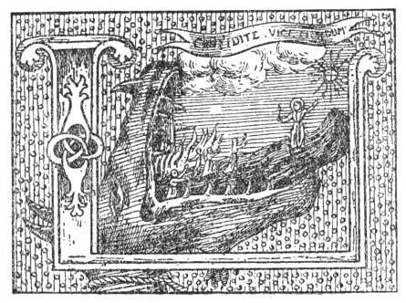

  
[Intangible Textual Heritage](../../index)  [Christianity](../index) 
[Index](index)  [Previous](wosf24)  [Next](wosf26) 

------------------------------------------------------------------------

[Buy this Book at
Amazon.com](https://www.amazon.com/exec/obidos/ASIN/B00267RU8U/internetsacredte)

------------------------------------------------------------------------

*The Writings of St. Francis of Assisi*, tr. by Paschal Robinson,
\[1905\], at Intangible Textual Heritage

------------------------------------------------------------------------

p. 189

### BIBLIOGRAPHY.

THE following list of works is intentionally limited. Its aim is to give
collectively and in alphabetical order a fuller reference to the
principal and most accessible sources of information cited in the course
of the present volume.

*Acta Sanctorum quotquot toto orbe coluntur*, collegit Joannes
Bollandus, etc. (ed. 3).

*Actus B. Francisci et Sociorum ejus*. Ed. Sabatier, Paris, 1902.

Prof. Alessandri: *Inventario dei Manoscritti della biblioteca del conv.
di S. Francesco di Assisi*. Forli, 1894.

*Analecta Bollandiana*. [1](#fn_626) Brussels.

*Analecta Franciscana*. Quaracchi.

Matthew Arnold: *Essays in Criticism*. Macmillan, 1875.

Reginald Balfour: *The Seraphic Keepsake*. Burns & Oates, 1905.

Fr. Francisci Bartholi, O.F.M.: *Tractatus de Indulgentia S. Mariae de
Portiuncula*. Ed. Sabatier, Paris, 1900.

Fr. Bartholomaeus Pisanus, O.F.M.: *De Conformitate Vitae B. Francisci
ad vitam D. N. Jesu Christi*. Milan, 1510. [2](#fn_627)

p. 190

Fr. Bernardus de Bessa, O.F.M.: *Liber de Laudibus B. Francisci*. In
*Anal. Franc.*, t. III.

Fr. Bernardo da Fivizzano, O.M.Cap.: *Oposcoli di S. Francesco*.
Florence, 1880.

*Bibliotheca Hagiographica Latina antiquae et mediae aetatis*. Ed. Socii
Bollandiani. Brussels.

Prof. H. Boehmer: *Analekten zur Geschichte des Franciscus von Assisi*.
Tübingen and Leipzig (Mohr), 1904.

*Bullettino Critico di Cose Francescane*. Florence.

S. Bonaventura: *Legendae duae de Vita S. Francisci*. Quaracchi, 1898.
(English translation by Miss Lockhart. Washbourne, 1898.)

*Bullarium Franciscanum*. Ed. F. F. Hyacinth Sbaralea and Conrad Eubel,
O.M.Conv. 1759 and 1898.

Montgomery Carmichael: *La Benedizione di San Francesco*. Livorno, 1900.
"The Origin of the Rule of St. Francis," in *Dublin Review*, Vol.
CXXXIV, 1904, pp. 357-385. "The Writings of St. Francis," in the
*Month*, January, 1904, t. CIII, pp. 156-164. See also under *Sacrum
Commercium*.

Fr. Thomas de Celano, O.F.M.: *Vita Prima S. Francisci*. Ed. Suyskens,
S.J., in *Acta S.S.*, Oct., II.

*Vita Secunda S. Francisci*. Ed. Amoni. Rome, 1880.

*Tractatus de Miraculis*. Ed. Van Ortroy, S.J., in *Anal. Boll.*, t.
XVIII, 1899.

p. 191

*Vita S. Clarae*. Ed. Sedulius, O.F.M. Antwerp, 1613.

Fr. Leopold de Chérancé: *S. François d’Assise*. Paris, 1892. (English
translation by R. F. O'Connor: Burns & Oates, 1901.)

Fr. Bernard Christen, O.M.Cap.: *Leben des hl. Franciscus von Assisi*.
Innsbruck, 1899.

*Chronica XXIV Generalium* in *Anal. Francis.*, t. III.

Fr. Cuthbert, O.S.F.C. See under Eccleston.

G. Cozza-Luzi: *Chiara di Assisi ed Innocenzo IV*. Rome, 1887.

Lina Duff Gordon: *The Story of Assisi*. Dent, 1901.

Fr. Thomas Eccleston, O.F.M.: *De Adventu Fratrum Minorum in Angliam* in
*Anal. Franc.*; t. I; see *Monumenta Franc.* Ed. Brewer. Rolls series.
(English translation by Fr. Cuthbert, O.S.F.C.: *The Friars and how they
came to England*. Sands, 1903.)

Fr. Edouard d’Alençon, O.M.Cap.: [1](#fn_628)
*Epistola S. Francisci ad Ministrum Generalem in sua forma authentica*.
Rome, 1899. *La Benediction de S. François*. Paris, 1896. See also
*Sacrum Commercium*.

Fr. Ehrle, S.J.: "Die Historischen Handschriften von S. Francesco in
Assisi" in the *Archiv für* 

p. 192

\[paragraph continues\] *Litteratur und
Kirchengeschichte des Mittelalters*, t. I, pp. 484 seq. "Controversen
über die Anfänge des Minoritenordens" in *Zeitschrift für Katholische
Theologie*, t. XI, pp. 725 seq.

Mgr. Faloci-Pulignani: "Tre Autografi di S. Francesco" in *Misc.
Francescana*, t. VI, pp. 33 seq., and "La Calligrafia di S. Francesco,"
*l.c.*, t. VII, pp. 67 seq.

*Floretum S. Francisci Assisiensis*. Ed. Sabatier. Paris, 1902. A
satisfactory Italian version of the *Fioretti* is that of Barbere,
Florence, 1902. An excellent English translation, *The Little Flowers of
St. Francis*, is published by Kegan Paul, 1905.

*Etudes Franciscaines*. Namur.

Joseph Görres: *Der hl. Franciscus von Assisi, ein Troubadour*.
Ratisbon, 1879.

Prof. Walter Goetz: *Die Quellen zur Geschichte des hl. Franz von
Assisi*. Gotha, 1904.

Prof. John Herkless: *Francis and Dominic and the Mendicant Orders*.
Scribner, 1901.

Fr. Jordani a Jano, O.F.M.: *Chronica*, in *Anal. Franc.*, t. I.

Leon de Kerval: *Sancti Antonii de Padua Vitae duae*. Paris, 1904.

Fr. Leonard Lemmens, O.F.M.: "Die Anfänge des Clarissenordens " in
*Römische Quartalschrift*, t. XVI, pp. 93 seq. *Scripta Fratris Leonis*,
Quaracchi, 1901. See also under *Speculum Perfectionis*.

Abbé Leon Le Monnier: *Histoire de S. François* 

p. 193

*d’Assise*. (English translation by a Franciscan Tertiary. Kegan Paul,
1894.)

Prof. A. G. Little: *Description de MS. Can. Misc.* 525, de la
Bibliothèque Bodleienne. Paris, 1903.

Canon Knox Little: *St. Francis of Assisi: His Times, Life, and Work*.
Isbister, 1904.

Anne Macdonnell: *The Words of St. Francis*. Dent, 1905.

Fr. P. Mandonnet, O.P.: *Les Origines de l’Ordo de Poenitentia*
(Freiburg, 1898). *Les Regles et le Gouvernement de l’Ordo de
Poenitentia au XIIIe Siècle* (Paris, 1902).

*Miscellanea Francescana di Storia di Lettere, di Arti*. Foligno.

*Monumenta Germaniae Historica*. Berlin.

Prof. Karl Müller: *Anfänge des Minoritenordens und der*
[*Bussbrüderschaften*](errata.htm#5). Freiburg, 1885.

A. F. Ozanam: *Les Poètes Franciscains en Italie au Treizième Siècle*.
Paris, 1882, 6th ed.

*Opuscula S. P. Francisci Assisiensis*. Edita a PP. Collegii S.
Bonaventurae, Quaracchi, 1904.

Fr. Panfilo da Magliano, O.F.M.: *Storia Compendiosa di San Francesco*.
Rome, 1874-1876.

Paul Sabatier: *Vie de S. François d’Assise*. Paris, 1894. (English
translation by L. S. Houghton.) *Regula antiqua Fratrum et Sororum de
Poenitentia*. Paris. (English translation in Adderley and Marsons’
*Third Orders*. Mowbray, 1902.) *Description du MS. Franciscain de
Liegnitz*. Paris, 1901. *Examen de quelques* 

p. 194

\[paragraph continues\] *Travaux resents
sur les Opuscules de Saint François*. Paris, 1904. See also under
*Actus*, Bartholi, and *Speculum*.

Fr. Hyacinth. Sbaralea, O.M.Conv.: *Supplementum et Castigatio ad
Scriptores Trium Ordinum S. Francisci*. Rome, 1806.

*Sacrum Commercium Beati Francisci cum Domina Paupertate*. Ed. Fr. Ed.
d’Alençon, O.M.Cap. Rome, 1900. (English translation by Montgomery
Carmichael, *The Lady Poverty;* Murray, 1901.)

Emma Gurney Salter: *Franciscan Legends in Italian Art*. Dent, 1905.

*Seraphicae Legislationis Textus Originales*. Quaracchi, 1897.

*Speculum Perfectionis*. Ed. Lemmens: Quaracchi, 1901.

*Speculum Perfectionis*. Ed. Sabatier. Paris, 1898. (English translation
of the text only, by the Countess de la Warr: *The Mirror of
Perfection*. Burns & Oates, 1902.)

Luigi Suttina: *Appunti Bibliografici di Studi Francescani*. Padua,
1904.

H. Thode: *Franz von Assisi und die Anfänge der Kunst der Renaissance in
Italien*. Berlin, 1885 and 1904.

*Trium Sociorum, Legenda S. Francisci Assis*. Ed. Faloci. Foligno, 1898.
(English translation by E. Gurney Salter: *The Legend of the Three
Companions*. Dent, 1902.)

Fr. Ubald d’Alençon, O.M.Cap.: *Les Opuscules de S. François d'Assise*.
Paris, 1905.

p. 195

Fr. Van Ortroy, S.J. For his article on the *Opuscula* of St. Francis,
see *Analecta Bollandiana*, t. xxiv, fasc. iii (1905), p. 411 seq.

Fr. Luke Wadding, O.F.M.: *Annales Minorum*. [1](#fn_629) *B. P. Francisci Assisiatis Opuscula*.
Antwerp, 1623. *Scriptores Ordinis Minorum*. Rome, 1650.

 

------------------------------------------------------------------------

### Footnotes

[189:1](wosf25.htm#fr_626) The space devoted by
Fr. Van Ortroy, S.J., to Franciscan history in this periodical assumes
larger proportions each year.

[189:2](wosf25.htm#fr_627) A critical edition
of this work will form Vol. IV of the *Anal. Franc.*

[191:1](wosf25.htm#fr_628) When this volume is
almost through the press, I learn of the publication of Fr. Edouard's
long-promised edition of Celano's works—*S. Francisci Assisiensis vita
et miracula additis opusculis liturgicis auctore Fr. Thoma de Celano.
Hanc editionem novam ad fidem mss. recensuit P. Eduardus Alenconiensis*,
Rome. Desclée, 1905.

[195:1](wosf25.htm#fr_629) Wadding's *Annales*
appeared at Lyons in 8 vols. in fol. 1625-54. Fr. Jos. Man. Fonseca
published a new edition and a continuation of the *Annales* in 19 vols.
at Rome, 1731-45. The official Annalists of the Friars Minor have since
added 6 vols. (tom. 20-25), which were issued at Naples, Ancona, and
Quaracchi. The last vol. (t. 25) edited by Fr. Eusebius Fernandzin (†
1899) extends to the year 2622. The Quaracchi Friars are now engaged on
the 26th volume.

------------------------------------------------------------------------

[Next: Index](wosf26)
