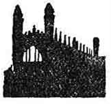

  
[Intangible Textual Heritage](../../index)  [Classics](../index) 
[Index](index)  [Next](aar01) 

------------------------------------------------------------------------

p. i

ANCIENT ART  
AND RITUAL

THE  
HOME UNIVERSITY LIBRARY  
OF MODERN KNOWLEDGE

p. ii

Editors of  
THE HOME UNIVERSITY LIBRARY  
OF MODERN KNOWLEDGE  
RT. HON. H. A. L. FISHER, F.R.S., LL.D., D.LITT.  
PROF. GILBERT MURRAY, F.B.A., LL.D., D.LITT.  
PROF. JULIAN S. HUXLEY, M.A.  
*For list of volumes in the Library see end of book*.

p. iii

# ANCIENT ART AND RITUAL

###### *By*

## JANE ELLEN HARRISON,

###### LL.D., D.LITT.

###### *Author of*

###### "Primitive Athens," "Religion of Ancient Greece," "Prolegomena to the Study of Greek Religion," etc.

 

#### LONDON

#### Thornton Butterworth Ltd

#### \[1913\]

###### NOTICE OF ATTRIBUTION Scanned at Intangible Textual Heritage, December, 2004. J.B. Hare, redactor. This text is in the public domain in the United States because it was published prior to 1922. This text has been in the public domain in the UK and EU since 1998 because the author died in 1928. These files may be used for any non-commercial purpose provided this notice of attribution is left intact in all copies.

p. iv

|                       |               |
|-----------------------|---------------|
| First Published       | June 1913     |
| Revised and Reprinted | February 1918 |

------------------------------------------------------------------------

[Next: Prefatory Note](aar01)
