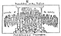
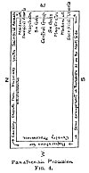
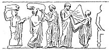
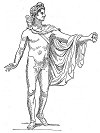

  
[Intangible Textual Heritage](../../index)  [Classics](../index.md) 
[Index](index)  [Previous](aar07)  [Next](aar09.md) 

------------------------------------------------------------------------

p. 170

# CHAPTER VI

### GREEK SCULPTURE: THE PANATHENAIC FRIEZE AND THE APOLLO BELVEDERE

IN passing from the drama to Sculpture we make a great leap. We pass
from the living thing, the dance or the play acted by real people, the
thing *done*, whether as ritual or art, whether *dromenon* or *drama*,
to the thing *made*, cast in outside material rigid form, a thing that
can be looked at again and again, but the making of which can never
actually be re-lived whether by artist or spectator.

Moreover, we come to a clear threefold distinction and division hitherto
neglected. We must at last sharply differentiate the artist, the work of
art, and the spectator. The artist may, and usually indeed does, become
the spectator of his own work, but the spectator is not the artist. The
work of art is, once executed, forever distinct both from artist and
spectator. In the primitive choral dance all three--artist, work of art,
spectator--were

p. 171

fused, or rather not yet differentiated. Hand-books on art are apt to
begin with the discussion of rude decorative patterns, and after leading
up through sculpture and painting, something vague is said at the end
about the primitiveness of the ritual dance. But historically and also
genetically or logically the dance in its inchoateness, its
undifferentiatedness, comes first. It has in it a larger element of
emotion, and less of presentation. It is this inchoateness, this
undifferentiatedness, that, apart from historical fact, makes us feel
sure that logically the dance is primitive.

 

To illustrate the meaning of Greek sculpture and show its close affinity
with ritual, we shall take two instances, perhaps the best-known of
those that survive, one of them in relief, the other in the round, the
Panathenaic frieze of the Parthenon at Athens and the Apollo Belvedere,
and we shall take them in chronological order. As the actual frieze and
the statue cannot be before us, we shall discuss no technical questions
of style or treatment, but simply ask how they came to be, what human
need do they express. The Parthenon frieze is in the British Museum, the
Apollo

p. 172

\[paragraph continues\] Belvedere is in the Vatican at Rome, but is
readily accessible in casts or photographs. The outlines given in [Figs.
5](#img_fig05) and [6](#img_fig06.md) can of course only serve to recall
subject-matter and design.

 

The Panathenaic frieze once decorated the *cella* or innermost shrine of
the Parthenon, the temple of the Maiden Goddess Athena. It twined like a
ribbon round the brow of the building and thence it was torn by Lord
Elgin and brought home to the British Museum as a national trophy, for
the price of a few hundred pounds of coffee and yards of scarlet cloth.
To realize its meaning we must always think it back into its place.
Inside the *cella*, or shrine, dwelt the goddess herself, her great
image in gold and ivory; outside the shrine was sculptured her worship
by the whole of her people. For the frieze is nothing but a great ritual
procession translated into stone, the Panathenaic procession, or
procession of *all* the Athenians, of all Athens, in honour of the
goddess who was but the city incarnate, Athena.

"A wonder enthroned on the hills and the sea,  
A maiden crowned with a fourfold glory, p.
173  
That none from the pride of her head may rend;  
Violet and olive leaf, purple and hoary,  
Song-wreath and story the fairest of fame,  
Flowers that the winter can blast not nor bend,  
A light upon earth as the sun's own flame,  
A name as his name--  
Athens, a praise without end."  
              SWINBURNE: *Erechtheus*, 141.

Sculptural Art, at least in this instance, comes out of ritual, has
ritual as its subject, is embodied ritual. The reader perhaps at this
point may suspect that he is being juggled with, that, out of the
thousands of Greek reliefs that remain to us, just this one instance has
been selected to bolster up the writer's art and ritual theory. He has
only to walk through any museum to be convinced at once that the author
is playing quite fair. Practically the whole of the reliefs that remain
to us from the archaic period, and a very large proportion of those at
later date, when they do not represent heroic mythology, are ritual
reliefs, "votive" reliefs as we call them; that is, prayers or praises
translated into stone.

p. 174

Of the choral dance we have heard much, of the procession but little,
yet its ritual importance was great. In religion to-day the dance is
dead save for the dance of the choristers before the altar at Seville.
But the procession lives on, has even taken to itself

[  
Click to enlarge](img/fig03.jpg.md)  
Panathenaic Procession. FIG. 3.  

new life. It is a means of bringing masses of people together, of
ordering them and co-ordinating them. It is a means for the magical
spread of supposed good influence, of "grace." Witness the "Beating of
the Bounds" and the frequent processions of the Blessed Sacrament in
Roman Catholic lands.

p. 175

The Queen of the May and the Jack-in-the--Green still go from house to
house. Nowadays it is to collect pence; once it was to

[  
Click to enlarge](img/fig04.jpg.md)  
Panathenaic Procession. FIG. 4.  

diffuse "grace" and increase. We remember the procession of the holy
Bull at Magnesia and the holy Bear at Saghalien (pp.
[92](aar06.htm#page_92)-100.md).

p. 176

What, then, was the object of the Panathenaic procession? It was first,
as its name indicates, a procession that brought all Athens together.
Its object was social and political, to express the unity of Athens.
Ritual in primitive times is always social, collective.

The arrangement of the procession is shown in [Figs. 3](#img_fig03.md) and
[4](#img_fig04) (pp. [174](#page_174), [175](#page_175).md). In [Fig.
3](#img_fig03.md) we see the procession as it were in real life, just as it
is about to enter the temple and the presence of the Twelve Gods. These
gods are shaded black because in reality invisible. [Fig. 4](#img_fig04.md)
is a diagram showing the position of the various parts of the procession
in the sculptural frieze. At the west end of the temple the procession
begins to form: the youths of Athens are mounting their horses. It
divides, as it needs must, into two halves, one sculptured on the north,
one on the south side of the cella. After the throng of the cavalry
getting denser and denser we come to the chariots, next the sacrificial
animals, sheep and restive cows, then the instruments of sacrifice,
flutes and lyres and baskets and trays for offerings; men who carry
blossoming olive-boughs; maidens with water-vessels and drinking-cups.
The whole

p. 177

tumult of the gathering is marshalled and at last met and, as it were,
held in check, by a band of magistrates who face the procession just as
it enters the presence of the twelve seated gods, at the east end. The
whole body politic of the gods has come down to feast with the whole
body politic of Athens and her allies, of whom these gods are but the
projection and reflection. The gods are there together because man is
collectively assembled.

The great procession culminates in a sacrifice and a communal feast, a
sacramental feast like that on the flesh of the holy Bull at Magnesia.
The Panathenaia was a high festival including rites and ceremonies of
diverse dates, an armed dance of immemorial antiquity that may have
dated from the days when Athens was subject to Crete, and a recitation
ordered by Peisistratos of the poems of Homer.

 

Some theorists have seen in art only an extension of the "play
instinct," just a liberation of superfluous vitality and energies, as it
were a rehearsing for life. This is not our view, but into all art, in
so far as it is a cutting off of motor reactions, there certainly enters
an element of recreation. It is interesting

p. 178

to note that to the Greek mind religion was specially connected with the
notion rather of a festival than a fast. Thucydides [1](#fn_42.md) is assuredly by nature no reveller, yet
religion is to him mainly a "rest from toil." He makes Perikles say:
"Moreover, we have provided for our spirit by many opportunities of
recreation, by the celebration of games and sacrifices throughout the
year." To the anonymous writer known as the "Old Oligarch" the main gist
of religion appears to be a decorous social enjoyment. In easy
aristocratic fashion he rejoices that religious ceremonials exist to
provide for the less well-to-do citizens suitable amusements that they
would otherwise lack. "As to sacrifices and sanctuaries and festivals
and precincts, the People, knowing that it is impossible for each man
individually to sacrifice and feast and have sacrifices and an ample and
beautiful city, has discovered by what means he may enjoy these
privileges."

 

In the procession of the Panathenaia all Athens was gathered together,
but--and this is important--for a special purpose, more

p. 179

primitive than any great political or social union. Happily this purpose
is clear; it is depicted in the central slab of the east end of the
frieze ([Fig. 5](#img_fig05).md). A priest is there represented receiving
from the hands of a boy a great *peplos* or robe. It is the sacred robe
of Athena woven for her and embroidered by young Athenian maidens and
offered to her

[  
Click to enlarge](img/fig05.jpg.md)  
FIG. 5.  

every five years. The great gold and ivory statue in the Parthenon
itself had no need of a robe; she would scarcely have known what to do
with one; her raiment was already of wrought gold, she carried helmet
and spear and shield. But there was an ancient image of Athena, an old
Madonna of the people, fashioned before Athena became a warrior maiden.
This image was rudely hewn in wood, it was dressed and decked
doll-fashion

p. 180

like a May Queen, and to her the great *peplos* was dedicated. The
*peplos* was hoisted as a sail on the Panathenaic ship, and this ship
Athena had borrowed from Dionysos himself, who went every spring in
procession in a ship-car on wheels to open the season for sailing. To a
seafaring people like the Athenians the opening of the sailing season
was all-important, and naturally began not at midsummer but in spring.

The sacred *peplos*, or robe, takes us back to the old days when the
spirit of the year and the "luck" of the people was bound up with a rude
image. The life of the year died out each year and had to be renewed. To
make a new image was expensive and inconvenient, so, with primitive
economy it was decided that the life and luck of the image should be
renewed by re-dressing it, by offering to it each year a new robe. We
remember ([p. 60](aar05.htm#page_60).md) how in Thuringia the new puppet
wore the shirt of the old and thereby new life was passed from one to
the other. But behind the old image we can get to a stage still earlier,
when there was at the Panathenaia no image at all, only a yearly
maypole; a bough hung with ribbons and

p. 181

cakes and fruits and the like. A bough was cut from the sacred olive
tree of Athens, called the *Moria* or Fate Tree. It was bound about with
fillets and hung with fruit and nuts and, in the festival of the
Panathenaia, they carried it up to the Acropolis to give to Athena
*Polias*, "Her-of-the-City," and as they went they sang the old
Eiresione song ([p. 114](aar06.htm#page_114).md). *Polias* is but the city,
the *Polis* incarnate.

This *Moria*, or Fate Tree, was the very life of Athens; the life of the
olive which fed her and lighted her was the very life of the city. When
the Persian host sacked the Acropolis they burnt the holy olive, and it
seemed that all was over. But next day it put forth a new shoot and the
people knew that the city's life still lived. Sophocles [1](#fn_43.md) sang of the glory of the wondrous life
tree of Athens:

"The untended, the self-planted, self-defended from the foe,  
Sea-gray, children-nurturing olive tree that here delights to grow,  
None may take nor touch nor harm it, headstrong youth nor age grown
bold. p. 182  
For the round of Morian[,](errata.htm#0.md) Zeus has been its watcher from
of old;  
He beholds it, and, Athene, thy own sea-gray eyes behold."

The holy tree carried in procession is, like the image of Athena, made
of olive-wood, just the incarnate life of Athens ever renewed.

The Panathenaia was not, like the Dithyramb, a spring festival. It took
place in July at the height of the summer heat, when need for rain was
the greatest. But the month Hecatombaion, in which it was celebrated,
was the first month of the Athenian year and the day of the festival was
the birthday of the goddess. When the goddess became a war-goddess, it
was fabled that she was born in Olympus, and that she sprang full grown
from her father's head in glittering armour. But she was really born on
earth, and the day of her birth was the birthday of every earthborn
goddess, the day of the beginning of the new year, with its returning
life. When men observe only the actual growth of new green life from the
ground, this birthday will be in spring; when they begin to know that
the seasons depend on

p. 183

the sun, or when the heat of the sun causes great need of rain, it will
be at midsummer, at the solstice, or in northern regions where men fear
to lose the sun in midwinter, as with us. The frieze of the Parthenon
is, then, but a primitive festival translated into stone, a rite frozen
to a monument.

 

Passing over a long space of time we come to our next illustration, the
Apollo Belvedere ([Fig. 6](#img_fig06).md).

It might seem that here at last we have nothing primitive; here we have
art pure and simple, ideal art utterly cut loose from ritual, "art for
art's sake." Yet in this Apollo Belvedere, this product of late and
accomplished, even decadent art, we shall see most clearly the intimate
relation of art and ritual; we shall, as it were, walk actually across
that transition bridge of ritual which leads from actual life to art.

The date of this famous Apollo cannot be fixed, but it is clearly a copy
of a type belonging to the fourth century B.C. The poise of the figure
is singular and, till its intent is grasped, unsatisfactory. Apollo is
caught in swift motion but seems, as he stands delicately poised, to be
about to fly rather than to run.

p. 184

 

[  
Click to enlarge](img/fig06.jpg.md)  
THE APOLLO BELVEDERE  
FIG. 6.  

 

p. 185

\[paragraph continues\] He stands tiptoe and in a moment will have left
the earth. The Greek sculptor's genius was all focussed, as we shall
presently see, on the human figure and on the mastery of its many
possibilities of movement and action. Greek statues can roughly be dated
by the way they stand. At first, in the archaic period, they stand
firmly planted with equal weight on either foot, the feet close
together. Then one foot is advanced, but the weight still equally
divided, an almost impossible position. Next, the weight is thrown on
the right foot; and the left knee is bent. This is of all positions the
loveliest for the human body. We allow it to women, forbid it to men
save to "æsthetes." If the back numbers of *Punch* be examined for the
figure of "Postlethwaite" it will be seen that he always stands in this
characteristic relaxed pose.

When the sculptor has mastered the possible he bethinks him of the
impossible. He will render the human body flying. It may have been the
accident of a mythological subject that first suggested the motive.
Leochares, a famous artist of the fourth century B.C., made a group of
Zeus in the form of an eagle carrying off Ganymede. A replica of the

p. 186

group is preserved in the Vatican, and should stand for comparison near
the Apollo. We have the same tiptoe poise, the figure just about to
leave the earth. Again, it is not a dance, but a flight. This poise is
suggestive to us because it marks an art cut loose, as far as may be,
from earth and its realities, even its rituals.

What is it that Apollo is doing? The question and suggested answers have
occupied many treatises. There is only one answer: We do not know. It
was at first thought that the Apollo had just drawn his bow and shot an
arrow. This suggestion was made to account for the pose; but that, as we
have seen, is sufficiently explained by the flight-motive. Another
possible solution is that Apollo brandishes in his uplifted hand the
ægis, or goatskin shield, of Zeus. Another suggestion is that he holds
as often a lustral, or laurel bough, that he is figured as Daphnephoros,
"Laurel-Bearer."

We do not know if the Belvedere Apollo carried a laurel, but we *do*
know that it was of the very essence of the god to be a Laurel-Bearer.
That, as we shall see in a moment, he, like Dionysos, arose in part out
of a rite,

p. 187

a rite of Laurel-Bearing--a *Daphnephoria*. We have not got clear of
ritual yet. When Pausanias, [1](#fn_44.md) the
ancient traveller, whose notebook is our chief source about these early
festivals, came to Thebes he saw a hill sacred to Apollo, and after
describing the temple on the hill he says:

"The following custom is still, I know, observed at Thebes. A boy of
distinguished family and himself well-looking and strong is made the
priest of Apollo, *for the space of a year*. The title given him is
Laurel-Bearer (Daphnephoros), for these boys wear wreaths made of
laurel."

We know for certain now what these yearly priests are: they are the
Kings of the Year, the Spirits of the Year, May-Kings,
Jacks-o’-the-Green. The name given to the boy is enough to show he
carried a laurel branch, though Pausanias only mentions a wreath.
Another ancient writer gives us more details. [2](#fn_45.md) He says in describing the festival of the
Laurel-Bearing:

"They wreathe a pole of olive wood with laurel and various flowers. On
the top is

p. 188

fitted a bronze globe from which they suspend smaller ones. Midway round
the pole they place a lesser globe, binding it with purple fillets, but
the end of the pole is decked with saffron. By the topmost globe they
mean the sun, to which they actually compare Apollo. The globe beneath
this is the moon; the smaller globes hung on are the stars and
constellations, and the fillets are the course of the year, for they
make them 365 in number. The Daphnephoria is headed by a boy, both whose
parents are alive, and his nearest male relation carries the filleted
pole. The Laurel-Bearer himself, who follows next, holds on to the
laurel; he has his hair hanging loose, he wears a golden wreath, and he
is dressed out in a splendid robe to his feet and he wears light shoes.
There follows him a band of maidens holding out boughs before them, to
enforce the supplication of the hymns."

This is the most elaborate maypole ceremony that we know of in ancient
times. The globes representing sun and moon show us that we have come to
a time when men know that the fruits of the earth in due season depended
on the heavenly bodies. The year

p. 189

with its 365 days is a Sun-Year. Once this Sun-Year established and we
find that the times of the solstices, midwinter and midsummer became as,
or even more, important than the spring itself. The date of the
*Daphnephoria* is not known.

At Delphi itself, the centre of Apollo-worship, there was a festival
called the *Stepteria*, or festival "of those who make the wreathes," in
which "mystery" a Christian Bishop, St. Cyprian, tells us he was
initiated. In far-off Tempe--that wonderful valley that is still the
greenest spot in stony, barren Greece, and where the laurel trees still
cluster--there was an altar, and near it a laurel tree. The story went
that Apollo had made himself a crown from this very laurel, and *taking
in his hand a branch of this same laurel*, *i. e.* as Laurel-Bearer, had
come to Delphi and taken over the oracle.

"And to this day the people of Delphi send high-born boys in procession
there. And they, when they have reached Tempe and made a splendid
sacrifice return back, after wearing themselves wreaths from the very
laurel from which the god made himself a wreath."

p. 190

We are inclined to think of the Greeks as a people apt to indulge in the
singular practice of wearing wreaths in public, a practice among us
confined to children on their birthdays and a few eccentric people on
their wedding days. We forget the intensely practical purport of the
custom. The ancient Greeks wore wreaths and carried boughs, not because
they were artistic or poetical, but because they were ritualists, that
they might bring back the spring and carry in the summer. The Greek
bridegroom to-day, as well as the Greek bride, wears a wreath, that his
marriage may be the beginning of new life, that his "wife may be as the
fruitful vine, and his children as the olive branches round about his
table." And our children to-day, though they do not know it, wear
wreaths on their birthdays because with each new year their life is
re-born.

 

Apollo then, was, like Dionysos, King of the May and--saving his
presence--Jack-in-the-Green. The god manifestly arose out of the rite.
For a moment let us see *how* he arose. It will be remembered that in a
previous chapter ([p. 70](aar05.htm#page_70).md) we spoke of
"personification."

p. 191

We think of the god Apollo as an abstraction, an unreal thing, perhaps
as a "false god." The god Apollo does not, and never did, exist. He is
an idea--a thing made by the imagination. But primitive man does not
deal with abstractions, does not worship them. What happens is, as we
saw ([p. 71](aar05.htm#page_71).md), something like this: Year by year a
boy is chosen to carry the laurel, to bring in the May, and later year
by year a puppet is made. It is a different boy each year, carrying a
different laurel branch. And yet in a sense it is the same boy; he is
always the Laurel-Bearer--"Daphnephoros," always the "Luck" of the
village or city. This Laurel-Bearer, the same yesterday, to-day, and
forever, is the stuff of which the god is made. The god arises from the
rite, he is gradually detached from the rite, and as soon as he gets a
life and being of his own, apart from the rite, he is a first stage in
art, a work of art existing in the mind, gradually detached from even
the faded action of ritual, and later to be the model of the actual work
of art, the copy in stone.

The stages, it would seem, are: actual life with its motor reactions,
the ritual copy of life with its faded reactions, the image of the

p. 192

god projected by the rite, and, last, the copy of that image, the work
of art.

 

We see now why in the history of all ages and every place art is what is
called the "hand-maid of religion." She is not really the "handmaid" at
all. She springs straight out of the rite, and her first outward leap is
the image of the god. Primitive art in Greece, in Egypt, in
Assyria, [1](#fn_46.md) represents either rites,
processions, sacrifices, magical ceremonies, embodied prayers; or else
it represents the images of the gods who spring from those rites. Track
any god right home, and you will find him lurking in a ritual sheath,
from which he slowly emerges, first as a *dæmon*, or spirit, of the
year, then as a full-blown divinity.

 

In Chapter II we saw how the *dromenon* gave birth to the *drama*, how,
bit by bit, out of the chorus of dancers some dancers withdrew

p. 193

and became spectators sitting apart, and on the other hand others of the
dancers drew apart on to the stage and presented to the spectators a
spectacle, a thing to be looked *at*, not joined *in*. And we saw how in
this spectacular mood, this being cut loose from immediate action, lay
the very essence of the artist and the art-lover. Now in the drama of
Thespis there was at first, we are told, but one actor; later Æschylus
added a second. It is clear who this actor, this *protagonist* or "first
contender" was, the one actor with the double part, who was Death to be
carried out and Summer to be carried in. He was the Bough-Bearer, the
only possible actor in the one-part play of the renewal of life and the
return of the year.

 

The May-King, the leader of the choral dance gave birth not only to the
first actor of the drama, but also, as we have just seen, to the god, be
he Dionysos or be he Apollo; and this figure of the god thus imagined
out of the year-spirit was perhaps more fertile for art than even the
protagonist of the drama. It may seem strange to us that a god should
rise up out of a dance or a procession,

p. 194

because dances and processions are not an integral part of our national
life, and do not call up any very strong and instant emotion. The old
instinct lingers, it is true, and emerges at critical moments; when a
king dies we form a great procession to carry him to the grave, but we
do not dance. We have court balls, and these with their stately ordered
ceremonials are perhaps the last survival of the genuinely civic dance,
but a court ball is not given at a king's funeral nor in honour of a
god.

But to the Greek the god and the dance were never quite sundered. It
almost seems as if in the minds of Greek poets and philosophers there
lingered some dim half-conscious remembrance that some of these gods at
least actually came out of the ritual dance. Thus, Plato, [1](#fn_47.md) in treating of the importance of rhythm in
education says: "The gods, pitying the toilsome race of men, have
appointed the sequence of religious festivals to give them times of
rest, and have given them the Muses and Apollo, the Muse-Leader, as
fellow-revellers."

"The young of all animals," he goes on to

p. 195

say, "cannot keep quiet, either in body or voice. They must leap and
skip and over-flow with gamesomeness and sheer joy, and they must utter
all sorts of cries. But whereas animals have no perception of order or
disorder in their motions, the gods who have been appointed to men as
our fellow-dancers have given to us a sense of pleasure in rhythm and
harmony. And so they move us and lead our bands, knitting us together
with songs and in dances, and these we call *choruses*." Nor was it only
Apollo and Dionysos who led the dance. Athena herself danced the Pyrrhic
dance. "Our virgin lady," says Plato, "delighting in the sports of the
dance, thought it not meet to dance with empty hands; she must be
clothed in full armour, and in this attire go through the dance. And
youths and maidens should in every respect imitate her example,
honouring the goddess, both with a view to the actual necessities of war
and to the festivals."

Plato is unconsciously inverting the order of things, natural
happenings. Take the armed dance. There is, first, the "actual necessity
of war." Men go to war armed, to

p. 196

face actual dangers, and at their head is a leader in full armour. That
is real life. There is then the festal re-enactment of war, when the
fight is not actually fought, but there is an imitation of war. That is
the ritual stage, the *dromenon*. Here, too, there is a leader. More and
more this dance becomes a spectacle, less and less an action. Then from
the periodic *dromenon*, the ritual enacted year by year, emerges an
imagined permanent leader; a dæmon, or god--a Dionysos, an Apollo, an
Athena. Finally the account of what actually happens is thrown into the
past, into a remote distance, and we have an "ætiological" myth--a story
told to give a cause or reason. The whole natural process is inverted.

And last, as already seen, the god, the first work of art, the thing
unseen, imagined out of the ritual of the dance, is cast back into the
visible world and fixed in space. Can we wonder that a classical
writer [1](#fn_48.md) should say "the statues of
the craftsmen of old times are the relics of ancient dancing." That is
just what they are, rites caught and fixed and frozen. "Drawing," says a
modern

p. 197

critic, [1](#fn_49.md) "is at bottom, like all the
arts, a kind of gesture, a method of dancing on paper." Sculpture,
drawing, all the arts save music are imitative; so was the dance from
which they sprang. But imitation is not all, or even first. "The dance
may be mimetic; but the beauty and verve of the performance, not
closeness of the imitation impresses; and tame additions of truth will
encumber and not convince. The dance must control the pantomime." Art,
that is, gradually dominates mere ritual.

 

We come to another point. The Greek gods as we know them in classical
sculpture are always imaged in human shape. This was not of course
always the case with other nations. We have seen how among savages the
totem, that is, the emblem of tribal unity, was usually an animal or a
plant. We have seen how the emotions of the Siberian tribe in Saghalien
focussed on a bear. The savage totem, the Saghalien Bear, is on the way
to be, but is not quite, a god; he is not personal enough. The
Egyptians, and in

p. 198

part the Assyrians, halted half-way and made their gods into monstrous
shapes, half-animal, half-man, which have their own mystical grandeur.
But since we are men ourselves, feeling human emotion, if our gods are
in great part projected emotions, the natural form for them to take is
human shape.

"Art imitates Nature," says Aristotle, in a phrase that has been much
misunderstood. It has been taken to mean that art is a copy or
reproduction of natural objects. But by "Nature" Aristotle never means
the out-side world of created things, he means rather creative force,
what produces, not what has been produced. We might almost translate the
Greek phrase, "Art, like Nature, creates things," "Art acts like Nature
in producing things." These things are, first and fore-most, human
things, human action. The drama, with which Aristotle is so much
concerned, invents human action like real, natural action. Dancing
"imitates character, emotion, action." Art is to Aristotle almost wholly
bound by the limitations of human nature.

This is, of course, characteristically a Greek limitation. "Man is the
measure of all

p. 199

things," said the old Greek sophist, but modern science has taught us
another lesson. Man may be in the foreground, but the drama of man's
life is acted out for us against a tremendous background of natural
happenings: a background that preceded man and will outlast him; and
this background profoundly affects our imagination, and hence our art.
We moderns are in love with the background. Our art is a landscape art.
The ancient landscape painter could not, or would not, trust the
background to tell its own tale: if he painted a mountain he set up a
mountain-god to make it real; if he outlined a coast he set human
coast-nymphs on its shore to make clear the meaning.

Contrast with this our modern landscape, from which bit by bit the nymph
has been wholly banished. It is the art of a stage, without actors, a
scene which is all background, all suggestion. It is an art given us by
sheer recoil from science, which has dwarfed actual human life almost to
imaginative extinction.

 

"Landscape, then, offered to the modern imagination a scene empty of
definite actors,

p. 200

superhuman or human, that yielded to reverie without challenge all that
is in a moral without a creed, tension or ambush of the dark, threat of
ominous gloom, the relenting and tender return or overwhelming outburst
of light, the pageantry of clouds above a world turned quaker, the
monstrous weeds of trees outside the town, the sea that is obstinately
epic still." [1](#fn_50.md)

 

It was to this world of backgrounds that men fled, hunted by the sense
of their own insignificance.

"Minds the most strictly bound in their acts by civil life, in their
fancy by the shrivelled look of destiny under scientific speculation,
felt on solitary hill or shore those tides of the blood stir again that
are ruled by the sun and the moon and travelled as if to tryst where an
apparition might take form. Poets ordained themselves to this vigil,
haunters of a desert church, prompters of an elemental theatre,
listeners in solitary places for intimations from a spirit in hiding;
and painters followed the impulse of Wordsworth."

p. 201

We can only see the strength and weakness of Greek sculpture, feel the
emotion of which it was the utterance, if we realize clearly this modern
spirit of the background. All great modern, and perhaps even ancient,
poets are touched by it. Drama itself, as Nietzsche showed, "hankers
after dissolution into mystery. Shakespeare would occasionally knock the
back out of the stage with a window opening on the 'cloud-capp’d
towers.'" But Maeterlinck is the best example, because his genius is
less. He is the embodiment, almost the caricature, of a tendency.

"Maeterlinck sets us figures in the fore-ground only to launch us into
that limbus. The supers jabbering on the scene are there, children of
presentiment and fear, to make us aware of a third, the mysterious one,
whose name is not on the bills. They come to warn us by the nervous
check and hurry of their gossip of the approach of that background
power. Omen after omen announces him, the talk starts and drops at his
approach, a door shuts and the thrill of his passage is the play." [1](#fn_51.md)

p. 202

It is, perhaps, the temperaments that are most allured and terrified by
this art of the bogey and the background that most feel the need of and
best appreciate the calm and level, rational dignity of Greek naturalism
and especially the naturalism of Greek sculpture.

For it is naturalism, not realism, not imitation. By all manner of
renunciations Greek sculpture is what it is. The material, itself
marble, is utterly unlike life, it is perfectly cold and still, it has
neither the texture nor the colouring of life. The story of Pygmalion
who fell in love with the statue he had himself sculptured is as false
as it is tasteless. Greek sculpture is the last form of art to incite
physical reaction. It is remote almost to the point of chill
abstraction. The statue in the round renounces not only human life
itself, but all the natural background and setting of life. The statues
of the Greek gods are Olympian in spirit as well as subject. They are
like the gods of Epicurus, cut loose alike from the affairs of men, and
even the ordered ways of Nature. So Lucretius [1](#fn_52.md) pictures them:

p. 203

"The divinity of the gods is revealed and their tranquil abodes, which
neither winds do shake nor clouds drench with rains, nor snow congealed
by sharp frost harms with hoary fall: an ever cloudless ether
o’ercanopies them, and they laugh with light shed largely around.
Nature, too, supplies all their wants, and nothing ever impairs their
peace of mind."

 

Greek art moves on through a long course of technical accomplishment, of
ever-increasing mastery over materials and methods. But this course we
need not follow. For our argument the last word is said in the figures
of these Olympians translated into stone. Born of pressing human needs
and desires, images projected by active and even anxious ritual, they
pass into the upper air and dwell aloof, spectator-like and all but
spectral.

------------------------------------------------------------------------

### Footnotes

[178:1](aar08.htm#fr_42.md) II, 38.

[181:1](aar08.htm#fr_43.md) *Oed. Col.* 694, trans.
D. S. MacColl.

[187:1](aar08.htm#fr_44.md) IX, 10, 4.

[187:2](aar08.htm#fr_45.md) See my *Themis*, p.
438.

[192:1](aar08.htm#fr_46.md) It is now held by some
and good authorities that the prehistoric paintings of cave-dwelling man
had also a ritual origin; that is, that the representations of animals
were intended to act magically, to increase the "supply of the animal or
help the hunter to catch him." But, as this question is still pending, I
prefer, tempting though they are, not to use prehistoric paintings as
material for my argument.

[194:1](aar08.htm#fr_47.md) *Laws*, 653.

[196:1](aar08.htm#fr_48.md) *Athen*. XIV, 26, p.
629.

[197:1](aar08.htm#fr_49.md) D. S. MacColl, "A Year
of Post-Impressionism" *Nineteenth Century*, p. 29. (1912.)

[200:1](aar08.htm#fr_50.md) D. S. MacColl,
*Nineteenth Century Art*, p. 20. (1902.)

[201:1](aar08.htm#fr_51.md) D. S. MacColl, *op.
cit.*, p. 18.

[202:1](aar08.htm#fr_52.md) II, 18.

------------------------------------------------------------------------

[Next: Chapter VII. Ritual, Art and Life](aar09.md)
