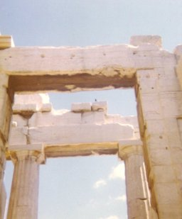

[Intangible Textual Heritage](../../index)  [Classics](../index.md) 

------------------------------------------------------------------------

<table>
<colgroup>
<col style="width: 50%" />
<col style="width: 50%" />
</colgroup>
<tbody>
<tr class="odd">
<td></td>
<td><h1 id="aesops-fables" data-align="CENTER">Aesop's Fables</h1>
<h3 id="translated-by-george-fyler-townsend" data-align="CENTER">Translated by George Fyler Townsend</h3>
<h4 id="chicago-belford-clarke-co.-1887." data-align="CENTER">Chicago, Belford, Clarke &amp; Co., 1887.</h4></td>
</tr>
</tbody>
</table>

------------------------------------------------------------------------

[Preface](aes000.md)  
[Life Of Aesop](aes001.md)  
[The Wolf and the Lamb](aes002.md)  
[The Bat and the Weasels](aes003.md)  
[The Ass and the Grasshopper](aes004.md)  
[The Lion and the Mouse](aes005.md)  
[The Charcoal-Burner and the Fuller](aes006.md)  
[The Father and His Sons](aes007.md)  
[The Boy Hunting Locusts](aes008.md)  
[The Cock and the Jewel](aes009.md)  
[The Kingdom of the Lion](aes010.md)  
[The Wolf and the Crane](aes011.md)  
[The Fisherman Piping](aes012.md)  
[Hercules and the Wagoner](aes013.md)  
[The Ants and the Grasshopper](aes014.md)  
[The Traveler and His Dog](aes015.md)  
[The Dog and the Shadow](aes016.md)  
[The Mole and His Mother](aes017.md)  
[The Herdsman and the Lost Bull](aes018.md)  
[The Hare and the Tortoise](aes019.md)  
[The Pomegranate, Apple-Tree, and Bramble](aes020.md)  
[The Farmer and the Stork](aes021.md)  
[The Farmer and the Snake](aes022.md)  
[The Fawn and His Mother](aes023.md)  
[The Bear and the Fox](aes024.md)  
[The Swallow and the Crow](aes025.md)  
[The Mountain in Labor](aes026.md)  
[The Ass, the Fox, and the Lion](aes027.md)  
[The Tortoise and the Eagle](aes028.md)  
[The Flies and the Honey-Pot](aes029.md)  
[The Man and the Lion](aes030.md)  
[The Farmer and the Cranes](aes031.md)  
[The Dog in the Manger](aes032.md)  
[The Fox and the Goat](aes033.md)  
[The Bear and the Two Travelers](aes034.md)  
[The Oxen and the Axle-Trees](aes035.md)  
[The Thirsty Pigeon](aes036.md)  
[The Raven and the Swan](aes037.md)  
[The Goat and the Goatherd](aes038.md)  
[The Miser](aes039.md)  
[The Sick Lion](aes040.md)  
[The Horse and Groom](aes041.md)  
[The Ass and the Lapdog](aes042.md)  
[The Lioness](aes043.md)  
[The Boasting Traveler](aes044.md)  
[The Cat and the Cock](aes045.md)  
[The Piglet, the Sheep, and the Goat](aes046.md)  
[The Boy and the Filberts](aes047.md)  
[The Lion in Love](aes048.md)  
[The Laborer and the Snake](aes049.md)  
[The Wolf in Sheep's Clothing](aes050.md)  
[The Ass and the Mule](aes051.md)  
[The Frogs Asking for a King](aes052.md)  
[The Boys and the Frogs](aes053.md)  
[The Sick Stag](aes054.md)  
[The Salt Merchant and His Ass](aes055.md)  
[The Oxen and the Butchers](aes056.md)  
[The Lion, the Mouse, and the Fox](aes057.md)  
[The Vain Jackdaw](aes058.md)  
[The Goatherd and the Wild Goats](aes059.md)  
[The Mischievous Dog](aes060.md)  
[The Fox Who Had Lost His Tail](aes061.md)  
[The Boy and the Nettles](aes062.md)  
[The Man and His Two Sweethearts](aes063.md)  
[The Astronomer](aes064.md)  
[The Wolves and the Sheep](aes065.md)  
[The Old Woman and the Physician](aes066.md)  
[The Fighting Cocks and the Eagle](aes067.md)  
[The Charger and the Miller](aes068.md)  
[The Fox and the Monkey](aes069.md)  
[The Horse and His Rider](aes070.md)  
[The Belly and the Members](aes071.md)  
[The Vine and the Goat](aes072.md)  
[Jupiter and the Monkey](aes073.md)  
[The Widow and Her Little Maidens](aes074.md)  
[The Shepherd's Boy and the Wolf](aes075.md)  
[The Cat and the Birds](aes076.md)  
[The Kid and the Wolf](aes077.md)  
[The Ox and the Frog](aes078.md)  
[The Shepherd and the Wolf](aes079.md)  
[The Father and His Two Daughters](aes080.md)  
[The Farmer and His Sons](aes081.md)  
[The Crab and Its Mother](aes082.md)  
[The Heifer and the Ox](aes083.md)  
[The Swallow, the Serpent, and the Court of Justice](aes084.md)  
[The Thief and His Mother](aes085.md)  
[The Old Man and Death](aes086.md)  
[The Fir-Tree and the Bramble](aes087.md)  
[The Mouse, the Frog, and the Hawk](aes088.md)  
[The Man Bitten by a Dog](aes089.md)  
[The Two Pots](aes090.md)  
[The Wolf and the Sheep](aes091.md)  
[The Aethiop](aes092.md)  
[The Fisherman and His Nets](aes093.md)  
[The Huntsman and the Fisherman](aes094.md)  
[The Old Woman and the Wine-Jar](aes095.md)  
[The Fox and the Crow](aes096.md)  
[The Two Dogs](aes097.md)  
[The Stag in the Ox-Stall](aes098.md)  
[The Hawk, the Kite, and the Pigeons](aes099.md)  
[The Widow and the Sheep](aes100.md)  
[The Wild Ass and the Lion](aes101.md)  
[The Eagle and the Arrow](aes102.md)  
[The Sick Kite](aes103.md)  
[The Lion and the Dolphin](aes104.md)  
[The Lion and the Boar](aes105.md)  
[The One-Eyed Doe](aes106.md)  
[The Shepherd and the Sea](aes107.md)  
[The Ass, the Cock, and the Lion](aes108.md)  
[The Mice and the Weasels](aes109.md)  
[The Mice in Council](aes110.md)  
[The Wolf and the Housedog](aes111.md)  
[The Rivers and the Sea](aes112.md)  
[The Playful Ass](aes113.md)  
[The Three Tradesmen](aes114.md)  
[The Master and His Dogs](aes115.md)  
[The Wolf and the Shepherds](aes116.md)  
[The Dolphins, the Whales, and the Sprat](aes117.md)  
[The Ass Carrying the Image](aes118.md)  
[The Two Travelers and the Axe](aes119.md)  
[The Old Lion](aes120.md)  
[The Old Hound](aes121.md)  
[The Bee and Jupiter](aes122.md)  
[The Milk-Woman and Her Pail](aes123.md)  
[The Seaside Travelers](aes124.md)  
[The Brazier and His Dog](aes125.md)  
[The Ass and His Shadow](aes126.md)  
[The Ass and His Masters](aes127.md)  
[The Oak and the Reeds](aes128.md)  
[The Fisherman and the Little Fish](aes129.md)  
[The Hunter and the Woodman](aes130.md)  
[The Wild Boar and the Fox](aes131.md)  
[The Lion in a Farmyard](aes132.md)  
[Mercury and the Sculptor](aes133.md)  
[The Swan and the Goose](aes134.md)  
[The Swollen Fox](aes135.md)  
[The Fox and the Woodcutter](aes136.md)  
[The Birdcatcher, the Partridge, and the Cock](aes137.md)  
[The Monkey and the Fishermen](aes138.md)  
[The Flea and the Wrestler](aes139.md)  
[The Two Frogs](aes140.md)  
[The Cat and the Mice](aes141.md)  
[The Lion, the Bear, and the Fox](aes142.md)  
[The Doe and the Lion](aes143.md)  
[The Farmer and the Fox](aes144.md)  
[The Seagull and the Kite](aes145.md)  
[The Philosopher, the Ants, and Mercury](aes146.md)  
[The Mouse and the Bull](aes147.md)  
[The Lion and the Hare](aes148.md)  
[The Peasant and the Eagle](aes149.md)  
[The Image of Mercury and the Carpenter](aes150.md)  
[The Bull and the Goat](aes151.md)  
[The Dancing Monkeys](aes152.md)  
[The Fox and the Leopard](aes153.md)  
[The Monkeys and Their Mother](aes154.md)  
[The Oaks and Jupiter](aes155.md)  
[The Hare and the Hound](aes156.md)  
[The Traveler and Fortune](aes157.md)  
[The Bald Knight](aes158.md)  
[The Shepherd and the Dog](aes159.md)  
[The Lamp](aes160.md)  
[The Lion, the Fox, and the Ass](aes161.md)  
[The Bull, the Lioness, and the Wild-Boar Hunter](aes162.md)  
[The Oak and the Woodcutters](aes163.md)  
[The Hen and the Golden Eggs](aes164.md)  
[The Ass and the Frogs](aes165.md)  
[The Crow and the Raven](aes166.md)  
[The Trees and the Axe](aes167.md)  
[The Crab and the Fox](aes168.md)  
[The Woman and Her Hen](aes169.md)  
[The Ass and the Old Shepherd](aes170.md)  
[The Kites and the Swans](aes171.md)  
[The Wolves and the Sheepdogs](aes172.md)  
[The Hares and the Foxes](aes173.md)  
[The Bowman and Lion](aes174.md)  
[The Camel](aes175.md)  
[The Wasp and the Snake](aes176.md)  
[The Dog and the Hare](aes177.md)  
[The Bull and the Calf](aes178.md)  
[The Stag, the Wolf, and the Sheep](aes179.md)  
[The Peacock and the Crane](aes180.md)  
[The Fox and the Hedgehog](aes181.md)  
[The Eagle, the Cat, and the Wild Sow](aes182.md)  
[The Thief and the Innkeeper](aes183.md)  
[The Mule](aes184.md)  
[The Hart and the Vine](aes185.md)  
[The Serpent and the Eagle](aes186.md)  
[The Crow and the Pitcher](aes187.md)  
[The Two Frogs](aes188.md)  
[The Wolf and the Fox](aes189.md)  
[The Walnut-Tree](aes190.md)  
[The Gnat and the Lion](aes191.md)  
[The Monkey and the Dolphin](aes192.md)  
[The Jackdaw and the Doves](aes193.md)  
[The Horse and the Stag](aes194.md)  
[The Kid and the Wolf](aes195.md)  
[The Prophet](aes196.md)  
[The Fox and the Monkey](aes197.md)  
[The Thief and the Housedog](aes198.md)  
[The Man, the Horse, the Ox, and the Dog](aes199.md)  
[The Apes and the Two Travelers](aes200.md)  
[The Wolf and the Shepherd](aes201.md)  
[The Hares and the Lions](aes202.md)  
[The Lark and Her Young Ones](aes203.md)  
[The Fox and the Lion](aes204.md)  
[The Weasel and the Mice](aes205.md)  
[The Boy Bathing](aes206.md)  
[The Ass and the Wolf](aes207.md)  
[The Seller of Images](aes208.md)  
[The Fox and the Grapes](aes209.md)  
[The Man and His Wife](aes210.md)  
[The Peacock and Juno](aes211.md)  
[The Hawk and the Nightingale](aes212.md)  
[The Dog, the Cock, and the Fox](aes213.md)  
[The Wolf and the Goat](aes214.md)  
[The Lion and the Bull](aes215.md)  
[The Goat and the Ass](aes216.md)  
[The Town Mouse and the Country Mouse](aes217.md)  
[The Wolf, the Fox, and the Ape](aes218.md)  
[The Fly and the Draught-Mule](aes219.md)  
[The Fishermen](aes220.md)  
[The Lion and the Three Bulls](aes221.md)  
[The Fowler and the Viper](aes222.md)  
[The Horse and the Ass](aes223.md)  
[The Fox and the Mask](aes224.md)  
[The Geese and the Cranes](aes225.md)  
[The Blind Man and the Whelp](aes226.md)  
[The Dogs and the Fox](aes227.md)  
[The Cobbler Turned Doctor](aes228.md)  
[The Wolf and the Horse](aes229.md)  
[The Brother and the Sister](aes230.md)  
[The Wasps, the Partridges, and the Farmer](aes231.md)  
[The Crow and Mercury](aes232.md)  
[The North Wind and the Sun](aes233.md)  
[The Two Men Who Were Enemies ](aes234.md)  
[The Gamecocks and the Partridge](aes235.md)  
[The Quack Frog](aes236.md)  
[The Lion, the Wolf, and the Fox](aes237.md)  
[The Dog's House](aes238.md)  
[The Wolf and the Lion](aes239.md)  
[The Birds, the Beasts, and the Bat](aes240.md)  
[The Spendthrift and the Swallow](aes241.md)  
[The Fox and the Lion](aes242.md)  
[The Owl and the Birds](aes243.md)  
[The Trumpeter Taken Prisoner](aes244.md)  
[The Ass in the Lion's Skin](aes245.md)  
[The Sparrow and the Hare](aes246.md)  
[The Flea and the Ox](aes247.md)  
[The Goods and the Ills](aes248.md)  
[The Dove and the Crow](aes249.md)  
[Mercury and the Workmen](aes250.md)  
[The Eagle and the Jackdaw](aes251.md)  
[The Fox and the Crane](aes252.md)  
[Jupiter, Neptune, Minerva, and Momus](aes253.md)  
[The Eagle and the Fox](aes254.md)  
[The Man and the Satyr](aes255.md)  
[The Ass and His Purchaser](aes256.md)  
[The Two Bags](aes257.md)  
[The Stag at the Pool](aes258.md)  
[The Jackdaw and the Fox](aes259.md)  
[The Lark Burying Her Father](aes260.md)  
[The Gnat and the Bull](aes261.md)  
[The Bitch and Her Whelps](aes262.md)  
[The Dogs and the Hides](aes263.md)  
[The Shepherd and the Sheep](aes264.md)  
[The Grasshopper and the Owl](aes265.md)  
[The Monkey and the Camel](aes266.md)  
[The Peasant and the Apple-Tree](aes267.md)  
[The Two Soldiers and the Robber](aes268.md)  
[The Trees Under the Protection of the Gods](aes269.md)  
[The Mother and the Wolf](aes270.md)  
[The Ass and the Horse](aes271.md)  
[Truth and the Traveler](aes272.md)  
[The Manslayer](aes273.md)  
[The Lion and the Fox](aes274.md)  
[The Lion and the Eagle](aes275.md)  
[The Hen and the Swallow](aes276.md)  
[The Buffoon and the Countryman](aes277.md)  
[The Crow and the Serpent](aes278.md)  
[The Hunter and the Horseman](aes279.md)  
[The King's Son and the Painted Lion](aes280.md)  
[The Cat and Venus](aes281.md)  
[The She-Goats and Their Beards](aes282.md)  
[The Camel and the Arab](aes283.md)  
[The Miller, His Son, and Their Ass](aes284.md)  
[The Crow and the Sheep](aes285.md)  
[The Fox and the Bramble](aes286.md)  
[The Wolf and the Lion](aes287.md)  
[The Dog and the Oyster](aes288.md)  
[The Ant and the Dove](aes289.md)  
[The Partridge and the Fowler](aes290.md)  
[The Flea and the Man](aes291.md)  
[The Thieves and the Cock](aes292.md)  
[The Dog and the Cook](aes293.md)  
[The Travelers and the Plane-Tree](aes294.md)  
[The Hares and the Frogs](aes295.md)  
[The Lion, Jupiter, and the Elephant](aes296.md)  
[The Lamb and the Wolf](aes297.md)  
[The Rich Man and the Tanner](aes298.md)  
[The Shipwrecked Man and the Sea](aes299.md)  
[The Mules and the Robbers](aes300.md)  
[The Viper and the File](aes301.md)  
[The Lion and the Shepherd](aes302.md)  
[The Camel and Jupiter](aes303.md)  
[The Panther and the Shepherds](aes304.md)  
[The Ass and the Charger](aes305.md)  
[The Eagle and His Captor](aes306.md)  
[The Bald Man and the Fly](aes307.md)  
[The Olive-Tree and the Fig-Tree](aes308.md)  
[The Eagle and the Kite](aes309.md)  
[The Ass and His Driver](aes310.md)  
[The Thrush and the Fowler](aes311.md)  
[The Rose and the Amaranth](aes312.md)  
[The Frogs' Complaint Against the Sun](aes313.md)  
[Footnotes](aes314.md)  
