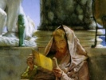

  
[Intangible Textual Heritage](../../../index)  [Classics](../../index) 
[Apollonius of Tyana](../index)  [Index](index)  [Previous](aot10) 
[Next](aot12) 

------------------------------------------------------------------------

[Buy this Book at
Amazon.com](https://www.amazon.com/exec/obidos/ASIN/156459131X/internetsacredte)

------------------------------------------------------------------------

  
*Apollonius of Tyana*, by G.R.S. Mead, \[1901\], at Intangible Textual
Heritage

------------------------------------------------------------------------

p. 99

### SECTION X

#### THE GYMNOSOPHISTS OF UPPER EGYPT

We now come to Apollonius’ visit to the
"Gymnosophists" in "Ethiopia," which, though the artistic and literary
goal of Apollonius’ journey in Egypt as elaborated by Philostratus, is
only a single incident in the real history of the unrecorded life of our
mysterious philosopher in that ancient land.

Had Philostratus devoted a chapter or two to the nature of the
practices, discipline, and doctrines of the innumerable ascetic and
mystic communities that honeycombed Egypt and adjacent lands in those
days, he would have earned the boundless gratitude of students of the
origins. But of all this he has no word; and yet he would have us
believe that Damis’ reminiscences were an orderly series of notes of
what actually happened. But in all things it is very apparent that Damis
was rather a *compagnon de voyage* than an initiated pupil.

Who then were these mysterious "Gymnosophists,"

p. 100

as they are usually called, and whence their name? Damis calls them
simply the "Naked" (γυμνοί), and it is very clear that the term is not
to be understood as merely physically naked; indeed, neither to the
Indians nor to these ascetics of uppermost Egypt can the term be applied
with appropriateness in its purely physical meaning, as is apparent from
the descriptions of Damis and Philostratus. A chance sentence that falls
from the lips of one of these ascetics, in giving the story of his life,
affords us a clue to the real meaning of the term. "At the age of
fourteen," he tells Apollonius, "I resigned my patrimony to those who
desired such things, and *naked* I sought the *Naked*" (vi. 16). [\*](#fn_105)

This is the very same diction that Philo uses about the Therapeut
communities, which he declares were very numerous in every province of
Egypt and scattered in all lands. We are not, however, to suppose that
these communities were all of the same nature. It is true that Philo
tries to make out that the most pious and the chief of all of them was
*his* particular community

p. 101

on the southern shore of Lake Mœris, which was strongly Semitic if not
orthodoxly Jewish; and for Philo any community with a Jewish atmosphere
must naturally have been the best. The peculiarity and main interest of
our community, which was at the other end of the land above the
cataracts, was that it had had some remote connection with India.

The community is called a φροντιστήριον, in the sense of a place for
meditation, a term used by ecclesiastical writers for a monastery, but
best known to classical students from the humorous use made of it by
Aristophanes, who in The Clouds calls the school of Socrates, a
*phrontistērion* or "thinking shop." The collection of *monasteria*
(ἱερά), presumably caves, shrines, or cells, [\*](#fn_106) was situated on a hill or rising ground
not far from the Nile. They were all separated from one another, dotted
about the hill, and ingeniously arranged. There was hardly a tree in the
place, with the exception of a single group of palms, under whose shade
they held their general meetings (vi. 6).

It is difficult to gather from the set speeches, put into the mouths of
the head of the community and Apollonius (vi. 10-13, 18-22), any precise
details as to the mode of life of these

p. 102

ascetics, beyond the general indications of an existence of great toil
and physical hardship, which they considered the only means of gaining
wisdom. What the nature of their cult was, if they had one, we are not
told, except that at midday the Naked retired to their *monasteria* (vi.
14).

The whole tendency of Apollonius’ arguments, however, is to remind the
community of its Eastern origin and its former connection with India,
which it seems to have forgotten. The communities of this particular
kind in southern Egypt and northern Ethiopia dated back presumably some
centuries, and some of them may have been remotely Buddhist, for one of
the younger members of our community who left it to follow Apollonius,
says that he came to join it from the enthusiastic account of the wisdom
of the Indians brought back by his father, who had been captain of a
vessel trading to the East. It was his father who told him that these
"Ethiopians" were from India, and so he had joined them instead of
making the long and perilous journey to the Indus itself (vi. 16).

If there be any truth in this story it follows that the founders of this
way of life had been Indian ascetics, and if so they must have belonged
to the only propagandising form of Indian religion, namely, the
Buddhist.

After the impulse had been given, the communities,

p. 103

which were presumably recruited from generations of Egyptians, Arabs,
and Ethiopians, were probably left entirely to themselves, and so in
course of time forgot their origin, and even perhaps their original
rule. Such speculations are permissible, owing to the *repeated*
assertion of the original connection between these Gymnosophists and
India. The whole burden of the story is that they were Indians who had
forgotten their origin and fallen away from the wisdom.

The last incident that Philostratus records with regard to Apollonius
among the shrines and temples is a visit to the famous and very ancient
oracle of Trophonius, near Lebadea, in Bœotia. Apollonius is said to
have spent seven days alone in this mysterious "cave," and to have
returned with a book full of questions and answers on the subject of
"philosophy" (viii. 19). This book was still, in the time of
Philostratus, in the palace of Hadrian at Antium, together with a number
of letters of Apollonius, and many people used to visit Antium for the
special purpose of seeing it (viii. 19, 20).

In the hay-bundle of legendary rigmarole solemnly set down by
Philostratus concerning the cave of Trophonius, a small needle of truth
may perhaps be discovered. The "cave" seems to have been a very ancient
temple or shrine, cut in the heart of a hill, to which a number of
underground

p. 104

passages of considerable length led. It had probably been in ancient
times one of the most holy centres of the archaic cult of Hellas,
perhaps even a relic of that Greece of thousands of years b.c., the only tradition of which, as Plato
tell us, was obtained by Solon from the priests of Saïs. Or it may have
been a subterranean shrine of the same nature as the famous Dictæan cave
in Crete which only last year was brought back to light by the
indefatigable labours of Messrs. Evans and Hogarth.

As in the case of the travels of Apollonius, so with regard to the
temples and communities which he visited, Philostratus is a most
disappointing cicerone. But perhaps he is not to be blamed on this
account, for the most important and most interesting part of Apollonius’
work was of so intimate a nature, prosecuted as it was among
associations of such jealously-guarded secrecy, that no one outside
their ranks could know anything of it, and those who shared in their
initiation would say nothing.

It is, therefore, only when Apollonius comes forward to do some public
act that we can get any precise historical trace of him; in every other
case he passes into the sanctuary of a temple or enters the privacy of a
community and is lost to view.

It may perhaps surprise us that Apollonius,

p. 105

after sacrificing his private fortune, could nevertheless undertake such
long and expensive travels, but it would seem that he was occasionally
supplied with the necessary monies from the treasuries of the temples
(*cf*. viii. 17), and that everywhere he was freely offered the
hospitality of the temple or community in the place where he happened to
be staying.

In conclusion of the present part of our subject, we may mention the
good service done by Apollonius in driving away certain Chaldæan and
Egyptian charlatans who were making capital out of the fears of the
cities on the left shores of the Hellespont. These cities had suffered
severely from shocks of earthquake, and in their panic placed large sums
of money in the hands of these adventurers (who "trafficked in the
misfortunes of others"), in order that they might perform propitiatory
rites (vi. 41). This taking money for the giving instruction in the
sacred science or for the performance of sacred rites was the most
detestable of crimes to all the true philosophers.

------------------------------------------------------------------------

### Footnotes

[100:\*](aot11.htm#fr_105) The word γυμνός
(naked), however, usually means lightly clad, as, for instance, when a
man is said to plough "naked," that is with only one garment, and this
is evident from the comparison made between the costume of the
Gymnosophists and that of people in the hot weather at Athens (vi. 6).

[101:\*](aot11.htm#fr_106) For they had neither
huts nor houses, but lived in the open air.

------------------------------------------------------------------------

[Next: Section XI. Apollonius and the Rulers of the Empire](aot12)
