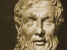

  
[Intangible Textual Heritage](../../../index)  [Classics](../../index) 
[Apollonius of Tyana](../index)  [Index](index)  [Previous](laot15) 
[Next](laot17) 

------------------------------------------------------------------------

[Buy this Book at
Amazon.com](https://www.amazon.com/exec/obidos/ASIN/0674996135/internetsacredte)

------------------------------------------------------------------------

  
*The Life of Apollonius of Tyana*, by Philostratus, tr. F.C. Conybeare,
\[1912\], at Intangible Textual Heritage

------------------------------------------------------------------------

### CHAPTER XLI

BOTH Apollonius and Damis then took part in the interviews devoted to
abstract discussions; not so with the conversations devoted to occult
themes, in which they pondered the nature of astronomy or divination,
and considered the problem of foreknowledge, and handled the problems of
sacrifice and of the invocations in which the gods take pleasure. In
these Damis says that Apollonius alone partook of the philosophic
discussion together with Iarchas, and that Apollonius embodied the
results in four books concerning the divination by the stars, a work
which Moeragenes has mentioned. And Damis says that he composed a work
on the way to offer sacrifice to the several gods in a manner pleasing
to them. Not only then do I regard the work on the science of the stars
and the whole subject of such divination as transcending human nature,
but I do not even know if anyone has these gifts; but I found the
treatise on sacrifices in several cities, and in the houses of several
learned men; moreover, if anyone should translate [1](#fn_7) it, he would find it to be a grave and
dignified composition, and one that rings of the author's personality.
And Damis says that

p. 322 p. 323

\[paragraph continues\] Iarchas gave seven
rings to Apollonius named after the seven stars, and that Apollonius
wore each of these in turn on the day of the week which bore its name.

### CHAPTER XLII

AS to the subject of foreknowledge, they presently had a talk about it,
for Apollonius was devoted to this kind of lore, and turned most of
their conversations on to it. For this Iarchas praised him and said: "My
good friend Apollonius, those who take pleasure in divination, are
rendered divine thereby and contribute to the salvation of mankind. For
here we have discoveries which we must go to a divine oracle in order to
make; yet these, my good friend, we foresee of our unaided selves and
foretell to others things which they know not yet. This I regard as the
gift of one thoroughly blessed and endowed with the same mysterious
power as the Delphic Apollo. Now the ritual insists that those who visit
a shrine with a view to obtaining a response, must purify themselves
first, otherwise they will be told to "depart from the temple."
Consequently I consider that one who would foresee events must be
healthy in himself, and must not have his soul stained with any sort of
defilement nor his character scarred with the wounds of any sins; so he
will pronounce his predictions with purity, because he will understand
himself and the sacred tripod in his breast, and with ever louder and
clearer tone and truer import will he utter his oracles. Therefore you
need not be surprised, if you comprehend the science, seeing that you
carry in your soul so much ether."

p. 324 p. 325

### CHAPTER XLIII

AND with these words he turned to Damis and said playfully: "And you, O
Assyrian, have you no foreknowledge of anything, especially as you
associate with such a man as this?" "Yes, by Zeus," answered Damis, "at
any rate of the things that are necessary for myself; for when I first
met with Apollonius here, he at once struck me as full of wisdom and
cleverness and sobriety and of true endurance; but when I saw that he
also had a good memory, and that he was very learned and entirely
devoted to the love of learning, he became to me something superhuman;
and I came to the conclusion that if I stuck to him I should be held a
wise man instead of an ignoramus and a dullard, and an educated man
instead of a savage; and I saw that, if I followed him and shared his
pursuits, I should visit the Indians and visit you, and that I should be
turned into a Hellene by him and be able to mix with the Hellenes. Now
of course you set your oracles, as they concern important issues, on a
level with those of Delphi and Dodona and of any other shrine you like;
as for my own premonitions, since Damis is the person who has them, and
since his foreknowledge concerns himself alone, we will suppose that
they resemble the guesses of an old beggar wife foretelling what will
happen to sheep and such like."

### CHAPTER XLIV

ALL the sages laughed of course at this sally, and when their laughter
had subsided, Iarchas led back the

p. 326 p. 327

argument to the subject of divination, and among the many blessings
which that art had conferred upon mankind, he declared the gift of
healing to be the most important. "For," said he, "the wise sons of
Asclepius would have never attained to this branch of science, if
Asclepius had not been the son of Apollo; and as such had not in
accordance with the latter's responses and oracles concocted and adapted
different drugs to different diseases; these he not only handed on to
his own sons, but he taught his companions what herbs must be applied to
running wounds, and what to parched and dry wounds, and in what doses to
administer liquid drugs for drinking, by means of which dropsical
patients are drained and bleeding is checked, and diseases of decay and
the cavities due to their ravages are put an end to. And who," he said,
"can deprive the art of divination of the credit of discovering simples
which heal the bites of venomous creatures, and in particular of using
the virus itself as a cure for many diseases? For I do not think that
men without the forecasts of a prophetic wisdom would ever have ventured
to mingle with medicines that save life these most deadly of poisons."

### CHAPTER XLV

And inasmuch as the following conversation also has been recorded by
Damis as having been held upon this occasion with regard to the
mythological animals and fountains and men met with in India, I must not
leave it out, for there is much to be gained by neither believing nor
yet disbelieving everything. Accordingly Apollonius asked the question,
whether

p. 328 p. 329

there was there an animal called the man-eater (*martichoras*); and
Iarchas replied: "And what have you heard about the make of this animal?
For it is probable that there is some account given of its shape."

"There are," replied Apollonius, "tall stories current which I cannot
believe; for they say that the creature has four feet, and that his head
resembles that of a man, but that in size it is comparable to a lion;
while the tail of this animal puts out hairs a cubit long and sharp as
thorns, which it shoots like arrows at those who hunt it."

And he further asked about the golden water which they say bubbles up
from a spring, and about the stone which behaves like a magnet, and
about the men who live underground and the pigmies also and the
shadow-footed men; and Iarchas answered his questions thus: "What have I
to tell you about animals or plants or fountains which you have seen
yourself on coming here? For by this time you are as competent to
describe these to other people as I am; but I never yet heard in this
country of an animal that shoots arrows or of springs of golden water."

### CHAPTER XLVI

However about the stone which attracts and binds to itself other stones
you must not be skeptical; for you can see the stone yourself if you
like, and admire its properties. For the greatest specimen is exactly of
the size of this finger nail," and here he pointed to his own thumb,
"and it is conceived in a hollow in the earth at a depth of four
fathoms; but it is so highly endowed with spirit, that the earth swells

p. 330 p. 331

and breaks open in many places when the stone is conceived in it. But no
one can get hold of it, for it runs away, unless it is scientifically
attracted; but we alone can secure, partly by performance of certain
rites and partly by certain forms of words, this *pantarbe*, for such is
the name given to it.

Now in the night-time it glows like the day just as fire might, for it
is red and gives out rays; and if you look at it in the daytime it
smites your eyes with a thousand glints and gleams. And the light within
it is a spirit of mysterious power, for it absorbs to itself everything
in its neighborhood. And why do I say in its neighborhood? Why you can
sink anywhere in river or in sea as many stones as you like, and these
not even near to one another, but here there; and everywhere; and then
if you let down this stone among them by a string it gathers them all
together by the diffusion of its spirit, and the stones yield to its
influence and cling to it in bunch, like a swarm of bees."

### CHAPTER XLVII

And having said this he showed the stone itself and all that it was
capable of effecting.

And as to the pigmies, he said that they lived underground, and that
they lay on the other side of the Ganges and lived in the manner which
is related by all. As to men that are shadow-footed or have long heads,
and as to the other poetical fancies which the treatise of Scylax
recounts about them, he said that they didn't live anywhere on the
earth, and least of all in India.

p. 332 p. 333

### CHAPTER XLVIII

As to the gold which the griffins dig up, there are rocks which are
spotted with drops of gold as with sparks, which this creature can
quarry because of the strength of its beak. "For these animals do exist
in India," he said, "and are held in veneration as being sacred to the
Sun; and the Indian artists, when they represent the Sun, yoke four of
them abreast to draw the imaged car; and in size and strength they
resemble lions but having this advantage over them that they have wings,
they will attack them, and they get the better of elephants and of
dragons. But they have no great power of flying, not more than have
birds of short flight; for they are not winged as is proper with birds,
but the palms of their feet are webbed with red membranes, such that
they are able to revolve them, and make a flight and fight in the air;
and the tiger alone is beyond their powers of attack, because in
swiftness it rivals the winds."

### CHAPTER XLIX

"And the phoenix," he said, "is the bird which visits Egypt every five
hundred years, but the rest of that time it flies about in India; and it
is unique in that it gives out rays of sunlight and shines with gold, in
size and appearance like an eagle; and it sits upon the nest; which is
made by it at the springs of the Nile out of spices. The story of the
Egyptians about it, that it comes to Egypt, is testified to by the
Indians

p. 334 p. 335

also, but the latter add this touch to the story, that the phoenix which
is being consumed in its nest sings funeral strains for itself. And this
is also done by the swans according to the account of those who have the
wit to hear them."

### CHAPTER L

In such conversations with the sages Apollonius spent the four months
which he passed there, and he acquired all sorts of lore both profane
and mysterious. But when he was minded to go on his way they persuaded
him to send back to Phraotes with a letter his guide and the camels; and
they themselves gave him another guide and camels, and sent him forth on
his way, congratulating both themselves and him. And having embraced
Apollonius and declared that he would be esteemed a god by the many, not
merely after his death, but while he was still alive, they turned back
to their place of meditation, though ever and anon they turned towards
him, and showed by their action that they parted from him against their
will. And Apollonius keeping the Ganges on his right hand, but the
Hyphasis on his left, went down towards the sea a journey of ten days
from the sacred ridge. And as they went down they saw a great many
ostriches, and many wild bulls, and many asses and lions and pards and
tigers, and another kind of apes than those which inhabit the pepper
trees, for these were black and bushy-haired and were dog-like in
features and as big as small men. And in the usual discussion of what
they saw they reached the sea, where small factories had been built, and
passenger

p. 336 p. 337

ships rode in them resembling those of the Tyrrhenes. And they say that
the sea called Erythra or "red" is of a deep blue color, but that it was
so named from a king Erythras, who gave his own name to the sea in
question.

------------------------------------------------------------------------

### Footnotes

[1:321:1](laot16.htm#fr_7) In Bk. IV. ch. 19, we
are told that this book was written in the Cappadocian tongue. Hence the
need of translation.

------------------------------------------------------------------------

[Next: Chapters 51-58](laot17)
