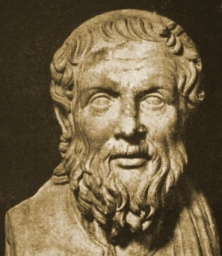

  
[Intangible Textual Heritage](../../../index)  [Classics](../../index) 
[Apollonius of Tyana](../index) 

------------------------------------------------------------------------

[Buy this Book at
Amazon.com](https://www.amazon.com/exec/obidos/ASIN/0674996143/internetsacredte)

------------------------------------------------------------------------

<table width="75%">
<colgroup>
<col style="width: 50%" />
<col style="width: 50%" />
</colgroup>
<tbody>
<tr class="odd">
<td width="50%" data-valign="TOP"> 
Apollonius of Tyana (Public Domain Image)</td>
<td width="50%" data-valign="CENTER"><h1 id="the-treatise-of-eusebius-against-the-life-of-apollonius-by-philostratus" data-align="CENTER">The Treatise of Eusebius Against the Life of Apollonius by Philostratus</h1>
<h2 id="by-eusebius" data-align="CENTER">by Eusebius</h2>
<h3 id="tr.-f.c-conybeare" data-align="CENTER">tr. F.C Conybeare</h3>
<h4 id="section" data-align="CENTER">[1912]</h4></td>
</tr>
</tbody>
</table>

------------------------------------------------------------------------

[Contents](#contents)    [Start Reading](toe00)    [Page
Index](pageidx)    [Text \[Zipped\]](toetxt.zip)

------------------------------------------------------------------------

[Philostratus](../laot/index) \|  [Epistles of
Apollonius](../eoa/index) \|  **Eusebius**

------------------------------------------------------------------------

|                                                                                                                           |
|---------------------------------------------------------------------------------------------------------------------------|
|  |

The early Christians saw Apollonius as a potential competitor. Eusebius
wrote this polemic against [the Life of Apollonius](../laot/index) of
Philostratus. His bottom line is that Apollonius was a sage of some
sort, and a human being, not immortal or a demi-god. He mocks
Apollonius' status as a great philosopher, claims that Apollonius used
evil magic, and ridicules the (admittedly far-fetched) details of the
account of his visit to India.

This text is one of the two extras in the second volume of the [Loeb
Philostratus](../laot/index).

------------------------------------------------------------------------

 [Title Page](toe00)  
[Chapters I to X](toe01)  
[Chapters XI to XX](toe02)  
[Chapters XXI to XXX](toe03)  
[Chapters XXXI to XL](toe04)  
[Chapters XLI to XLII](toe05)  
