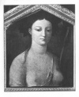

  
[Intangible Textual Heritage](../../index)  [Classics](../index) 
[Homer](../homer/index)  [Index](index)  [Next](aoto01) 

------------------------------------------------------------------------

[Buy this Book at
Amazon.com](https://www.amazon.com/exec/obidos/ASIN/1904675018/internetsacredte)

------------------------------------------------------------------------

  
*The Authoress of the Odyssey*, by Samuel Butler, \[1922\], at
Intangible Textual Heritage

------------------------------------------------------------------------

# The Authoress of the Odyssey

###### WHERE AND WHEN SHE WROTE, WHO SHE WAS, THE USE SHE MADE OF THE ILIAD, AND HOW THE POEM GREW UNDER HER HANDS

## By Samuel Butler

##### AUTHOR OF "EREWHON," "LIFE AND HABIT," "ALPS AND SANCTUARIES," "THE LIFE AND LETTERS OF DR SAMUEL BUTLER," ETC.

"There is no single fact to justify a conviction, said Mr. Cock: whereon
the Solicitor General replied that he did not rely upon any single fact,
but upon a chain of facts, which taken all together left no possible
means of escape."

Times, Leader, Nov 16 1894.  
(The prisoner was convicted).

#### London: Jonathan Cape

#### \[1922\]

Scanned, proofed and formatted at Intangible Textual Heritage by John
Bruno Hare, July 2008. This text is in the public domain in the US
because it was published prior to 1923.

AL PROFESSORE  
CAV. BIAGIO IGNROIA,  
PREZIOSO ALLEATO  
L’AUTORE RINCONOSCENTE

 
[  
Click to enlarge](img/front.jpg)  
Frontispiece  

------------------------------------------------------------------------

[Next: Preface](aoto01)
