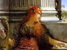

  
[Intangible Textual Heritage](../../index)  [Classics](../index.md) 
[Homer](../homer/index)  [Index](index)  [Previous](aoto21.md) 
[Next](aoto23.md) 

------------------------------------------------------------------------

[Buy this Book at
Amazon.com](https://www.amazon.com/exec/obidos/ASIN/1904675018/internetsacredte.md)

------------------------------------------------------------------------

  
*The Authoress of the Odyssey*, by Samuel Butler, \[1922\], at
Intangible Textual Heritage

------------------------------------------------------------------------

#### Book XVII

#### TELEMACHUS GOES TO THE TOWN, AND IS FOLLOWED BY EUMÆUS AND ULYSSES, WHO IS MALTREATED BY THE SUITORS.

When morning came Telemachus told Eumæus that he would now go to the
town and show himself to his mother, who would never be comforted till
she saw him with her own eyes. "As for this miserable stranger," he
continued, "take him to the town, that he may beg there and get what he
can; if this does not please him, so much the worse for him, but I like
to say what I mean."

16 Ulysses said
he should be glad to go, for a beggar could do much better in town than
country; but he must warm himself first, and wait till the sun had got
some heat in it; his clothes were very bad, and he should perish with
cold, for the town was some way off.

26 Telemachus
then left, and when he reached the house he set his spear against a
strong bearing post, crossed the stone pavement and went inside. He
found Euryclea putting the sheep skins on to the seats. She and all the
other maids ran up to him as soon as they saw him, and kissed him on the
head and shoulders. Then Penelope came weeping from her room, embraced
him, and told him to tell her all that he had seen.

45 Telemachus
bade her go back to her room and pray to Minerva that they might be
revenged on the suitors. "I must go," said he, "to the place of
assembly, to look after a guest whom I have brought with me, and whom I
have left with Piræus."

61 Penelope did
as her son had said, while Telemachus went to the place of assembly, and
his two dogs with him. The suitors, who had not yet gone to the house of
Ulysses for the day, gathered round him, and made him fair speeches, but

p. 71

he knew their falsehood and went to sit with his old friends Mentor,
Antiphus and Halitherses. Presently Piræus came up, bringing
Theoclymenus with him, and said, "I wish you would send some of your
women to my house to take away the presents that Menelaus gave you."

Telemachus said he did not know what might happen; if 77 the suitors killed
him, he had rather Piræus kept the presents than that the suitors should
have them. If, on the other hand, he killed the suitors he should be
much obliged if Piræus would let him have the presents.

Then he took Theoclymenus to his own house, where they 84 had a bath, and
refreshments were set before them. Penelope sat near them, spinning,
while they were at table, and then said she should go up stairs and lie
down on that couch which she had never ceased to water with her tears
from the day her husband left her. "But you had not the patience," she
added, "to tell me, before the suitors came, whether you had been able
to hear anything about your father."

Telemachus told her how good Nestor had been to him, and 107 how he had sent
him on to Menelaus, who had assured him that Ulysses was still alive,
but was detained by Calypso, from whom he could not get away for want of
a ship. Penelope was very much agitated, but Theoclymenus reassured her
by telling her about the omen which had greeted Telemachus on his return
to Ithaca.

While they were thus conversing, the suitors were playing 166 at quoits and
aiming javelins at a mark on the level ground in front of Ulysses’
house. But when it was near dinner time and the flocks were coming in
from all the country round with their shepherds as usual \[to be
milked\], Medon, who was a great favourite with the suitors, called them
to come in and set about getting their dinner ready. They therefore came
in and began to butcher some sheep, goats, pigs, and a heifer.

Meanwhile Eumæus told Ulysses that it was time to make 182 a start, for the
day was well up and if he waited till afternoon he would find the cold
more severe. "At any rate," said Ulysses, "let me have a staff if you
have one, for the path is rugged." Eumæus gave him one, and they set out
along the

p. 72

steep path leading to the town. When they were nearly there they came to
the fountain which Ithacus, Neritus, and Polyctor had made, and from
which the people drew their water; here they fell in with
Melantheus [\*](#fn_34.md) son of Dolius, who was
bringing goats for the suitors' dinner, he and his two under shepherds.

215 Melanthius
heaped all kinds of insult on Ulysses and Eumæus, and tried to kick
Ulysses off the path, but could not do so. Ulysses restrained himself,
and prayed to the nymphs, whereon Melanthius said he would put him on
board ship and sell him in some foreign country. He then hurried on,
leaving the swineherd and his master to follow at their own pace.

260 When they
got near the house they could hear the sound of Phemius's lyre, and his
voice as he sang to the suitors. They could also smell the savour of
roast meats. [†](#fn_35.md) Eumæus said that he
would go in first, but that Ulysses had better follow him soon, for if
he was seen standing about in the outer court people might throw things
at him.

290 As they
were thus talking the old hound Argus who was lying on the dunghill,
very full of fleas, caught sight of Ulysses, recognised him, wagged his
tail, and tried to come to him, but could not do so. Thereon Ulysses
wiped a tear from his eyes, and asked Eumæus whether the dog was of any
use, or whether he was kept only for his good looks. Eumæus said what a
noble hound Argus had been, but the dog, having seen his master, died
just as Eumæus went inside the house.

328 Telemachus
saw him enter and beckoned him to a seat at his own table. Ulysses
followed him shortly, and sat down on the floor of ash wood inside the
door way, leaning against a bearing-post of well-squared cypress wood.
Telemachus noted him and said to Eumæus, "Take the stranger this handful
of bread and meat, tell him also to go round and beg from the others,
for a beggar must not be shamefaced." Eumæus gave him both the message
and the bread and meat.

360 Then
Ulysses began to go round begging, for he wanted to exploit the suitors.
He went from left to right, and some took

p. 73

compassion on him while others began asking who he might be; Melanthius
then said that he had come with the swineherd. Antinous, therefore,
asked Eumæus what he meant by bringing such a man to plague them.

"I did not ask him to come," answered Eumæus. "Who 380 was likely to
ask a man of that sort? One would ask a divine, a physician, a
carpenter, or a bard. You are always hardest of all the suitors on
Ulysses’ servants, and especially upon me, but I do not care so long as
I have Penelope and Telemachus on my side."

"Hush," said Telemachus, "Antinous has the bitterest 392 tongue of them
all, and he makes the others worse." Then he turned towards Antinous and
said, "Give him something: I do not grudge it. Never mind my mother or
any of the servants—not you—but you are fonder of eating than of
giving."

Antinous said, "You are a swaggering upstart; if all the 405 suitors will
give him as much as I will, he will not come near the house again this
three months."

As he spoke he menaced Ulysses with the footstool from 409 under his table.
The other suitors all gave him something; and he was about to leave,
when he determined to again beg from Antinous and trumped him up a story
of the misfortunes that had befallen him in Egypt.

"Get out," said Antinous, "into the open part of the court, [\*](#fn_36.md) 445 and away from my table, or I will give
you Egypt over again."

Ulysses drew back, and said, "Your looks are better than 453 your
understanding. I can see that if you were in your own house you would
not spare a poor man so much as a pinch of salt."

Antinous scowled at him. "Take that," he cried, "and be 458 off out of the
court." As he spoke he threw a footstool at him which hit him on the
right shoulder, but Ulysses stood firm as a rock, and prayed that if
there was a god, or an avenger of beggars Antinous might be a corpse
before he was a bridegroom.

"Have a care," replied Antinous, "and hold your peace, or 477 we will flay you
alive."

p. 74

481 The others
reproved Antinous. "You did ill," they said, "to strike the man. Who
knows but he may be one of the gods who go about the world in disguise
to redress wrong, and chastise the insolence of mankind?"

492 Penelope
from her room upstairs heard what had been going on, and spoke with her
women bitterly about the suitors. The housekeeper Eurynome answered that
if her prayers were heard, not a single one of them would live till
morning. "Nurse," replied Penelope, "I hate them all, but Antinous is
the worst." Then she sent for Eumæus and said, "Tell the stranger that I
want to see him; he looks like a man who has travelled, and he may have
seen or heard something of Ulysses."

515 "He has
been three days and three nights at my hut, Madam," replied Eumæus, "and
the most accomplished bard could not have given me better entertainment.
He told me that Ulysses was among the Thesprotians and would return
shortly, bringing much treasure with him."

528  Then call
him to me," said Penelope, "and as for the others, let them dine at
their own expense for the future or how they best may, so long as they
leave off coming here."

541
Telemachus, who was down below, gave a great sneeze as she spoke, which
echoed over the whole house. Penelope explained to Eumæus that this was
a most favourable omen, and added that if she was satisfied of the truth
of what the stranger told her she would give him a shirt and cloak.

551 Eumæus
gave Penelope's message to Ulysses, but he feared the violence of the
suitors, and told him to say that she must wait till nightfall, when the
suitors would be gone. "Then," he said, "let her set me down in a warm
seat by the fire, and I will tell her about her husband; for my clothes
are in a very bad state; you know they are, for yours was the first
house I came to."

574 Penelope
was displeased at his delay, and asked Eumæus whether his fears were
reasonable, or whether it was only that he was shamefaced. Eumæus
explained that he was quite reasonable, whereon Penelope was satisfied;
he then went back to where the suitors were, and told Telemachus that he
would return to his pigs.

p. 75

Telemachus said that he had better get something to eat 598 first, and was
to come back to the town on the following morning, bringing the pigs
that were to be killed for dinner. It was now afternoon, and the suitors
had turned to their singing and dancing.

------------------------------------------------------------------------

### Footnotes

[72:\*](aoto22.htm#fr_34.md) In almost all other
places he is called Melanthius.

[72:†](aoto22.htm#fr_35.md) All this might very
well be, if the scene is laid in an open court, but hardly if it was in
a hall inside a house.

[73:\*](aoto22.htm#fr_36) ἐς μέσσον (line 447.md).

------------------------------------------------------------------------

[Next: Book XVIII. The Fight Between Ulysses and Irus](aoto23.md)
