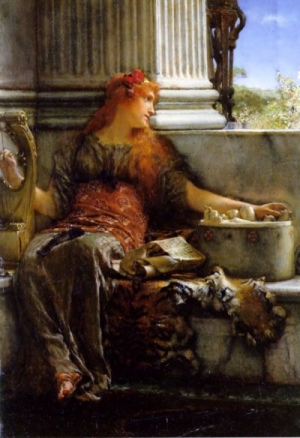

  
[Intangible Textual Heritage](../../index)  [Classics](../index.md) 
[Homer](../homer/index.md) 

------------------------------------------------------------------------

[Buy this Book at
Amazon.com](https://www.amazon.com/exec/obidos/ASIN/1904675018/internetsacredte.md)

------------------------------------------------------------------------

<table width="75%">
<colgroup>
<col style="width: 50%" />
<col style="width: 50%" />
</colgroup>
<tbody>
<tr class="odd">
<td width="50%" data-valign="TOP"> 
Poetry, by Alma-Tadema Lawrence [1879] (Public Domain Image)</td>
<td width="50%" data-valign="CENTER"><h1 id="the-authoress-of-the-odyssey" data-align="CENTER">The Authoress of the Odyssey</h1>
<h2 id="by-samuel-butler" data-align="CENTER">by Samuel Butler</h2>
<h4 id="section" data-align="CENTER">[1922]</h4></td>
</tr>
</tbody>
</table>

------------------------------------------------------------------------

[Contents](#contents)    [Start Reading](aoto00.md)    [Page
Index](pageidx)    [Text \[Zipped\]](aototxt.zip.md)

------------------------------------------------------------------------

|                                                                                                                           |
|---------------------------------------------------------------------------------------------------------------------------|
|  |

Today it is obvious to all but the most tradition-bound that women can
achieve anything that men can. This was not so obvious in the last
decade of the 19th century when Samuel Butler, a maverick classicist,
proposed this unique theory that the Odyssey was written by a woman.
This was, to say the least, a shocking proposal for his contemporaries.
Aside from the perceived diminution of the role of 'Homer,' this was too
far outside the box for most scholars. At the time Butler wrote, women
couldn't vote or own property in many industrialized countries, and some
female authors adopted male pseudonyms to get published. Biology was
considered a limiting factor for the female sex, and historic
contributions of women were ignored.

Based on textual analysis, geography, history and a bit of speculation,
Butler came to the conclusion that the Odyssey was a sequel written
several generations after the Iliad, by a woman residing in Sicily. Some
of his best evidence is simple literary criticism--Butler's observation
that women in the Odyssey are much better dimensionalized than the ones
in the Iliad.

Although his specific theory of who wrote the Odyssey is still
controversial (and probably unverifiable), today scholars are much more
open to the idea of a separate authorship of the two epics. Butler's
concept that the text of both epics was pieced together from
pre-existing bardic material about the Trojan war is also considered an
acceptable thesis. This is why this book is still read and discussed a
century later, as a milestone in the history of thought about classical
authorship, even though it was not completely vindicated.

It may seem a minor point, but it didn't help the establishment
perception of this book that Butler insisted on using Roman equivalents
for Greek deities (and the principal) throughout. Specifically, Mars =
Ares, Minerva = Athena, Aphrodite = Venus, Jupiter = Zeus, and Ulysses =
Odysseus.

Originally published in 1892 as a series of pamphlets, this etext is
based on the second edition, published in 1922. Of interest in this
edition is Butler's abridged (80 page) retelling of the story of the
Odyssey, ironically, a great resource if you have to brush up on your
'Homer.' Samuel Butler also wrote the dystopian fantasy
[Erewhon](../../utopia/ere/index.md), and, of course, his [translation of
the Iliad and Odyssey](../homer/index.md) is also available at this site.
NOTE: This etext uses Unicode extensively to present polytonic Greek, so
consult the [Unicode walkthrough](../../unicode.md) if you have trouble
viewing it.

--J.B. Hare, July 29, 2008,

------------------------------------------------------------------------

 [Title Page](aoto00.md)  
[Preface](aoto01.md)  
[Contents](aoto02.md)  
[List of Illustrations](aoto03.md)  
[Chapter I. Importance of the Enquiry](aoto04.md)  

### Chapter II: The Story of the Odyssey

[Introduction](aoto05.md)  
[Book I. The Council of the Gods](aoto06.md)  
[Book II. Assembly of the People of Ithaca](aoto07.md)  
[Book III. Telemachus at the House of Nestor](aoto08.md)  
[Book IV. Telemachus at the House of Menelaus](aoto09.md)  
[Book V. Ulysses in the Island of Calypso](aoto10.md)  
[Book VI. The Meeting Between Ulysses and Nausicaa](aoto11.md)  
[Book VII. The Splendours of the House of King Alcinous](aoto12.md)  
[Book VIII. The Phæacian Games](aoto13.md)  
[Book IX. The Voyages of Ulysses: Cicons, Lotus Eaters, and the
Cyclops](aoto14.md)  
[Book X. Æolus, Læstrygonians, Circe](aoto15.md)  
[Book XI. Ulysses in the House of Hades](aoto16.md)  
[Book XII. The Sirens, Scylla and Charybdis, The Cattle of the
Sun](aoto17.md)  
[Book XIII. Ulysses is Taken Back to Ithaca](aoto18.md)  
[Book XIV. Ulysses in the Hut of Eumæus](aoto19.md)  
[Book XV. Telemachus Returns](aoto20.md)  
[Book XVI. Ulysses and Telemachus Become Known to One Another](aoto21.md)  
[Book XVII. Ulysses Maltreated by the Suitors](aoto22.md)  
[Book XVIII. The Fight Between Ulysses and Irus](aoto23.md)  
[Book XIX. Ulysses Converses with Penelope](aoto24.md)  
[Book XX. Theoclymenus Foretells the Suitors' Doom](aoto25.md)  
[Book XXI. The Trial of the Bow and of the Axes](aoto26.md)  
[Book XXII. The Killing of the Suitors](aoto27.md)  
[Book XXIII. Penelope Recognizes Ulysses](aoto28.md)  
[Book XXIV. The Suitors in Hades, Ulysses Makes Peace with
Ithaca.](aoto29.md)  

 

[Chapter III. The Preponderance of Woman in the Odyssey](aoto30.md)  
[Chapter IV. Jealousy for the Honour and Dignity of Woman](aoto31.md)  
[Chapter V. Whether Penelope is Being Whitewashed](aoto32.md)  
[Chapter VI. The Character of Penelope, The Journey of
Telemachus](aoto33.md)  
[Chapter VII. Further Indications That the Writer Is a Young,
Headstrong, and Unmarried Woman](aoto34.md)  
[Chapter VIII. Ithaca and Scheria Are Drawn From Trapani](aoto35.md)  
[Chapter IX. The Voyages of Ulysses Shown to be a Sail Round
Sicily](aoto36.md)  
[Chapter X. Further Details Regarding the Voyages of Ulysses](aoto37.md)  
[Chapter XI. Who Was the Writer?](aoto38.md)  
[Chapter XII. The Date Of The Poem](aoto39.md)  
[Chapter XIII. Further Evidence in Support of an Early Ionian Settlement
at Trapani](aoto40.md)  
[Chapter XIV. That the Iliad Which the Writer of the Odyssey Knew Was
the Same As What We Now Have](aoto41.md)  
[Chapter XV. Relation to other Poems of the Trojan Cycle and its
Development by the Authoress](aoto42.md)  
[Chapter XVI. Conclusion](aoto43.md)  
[Index](aoto44.md)  
