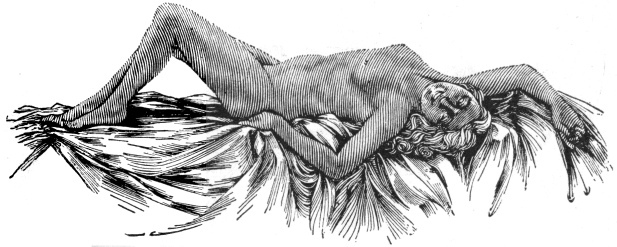
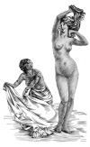
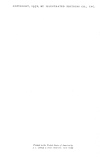

  
[Intangible Textual Heritage](../../index)  [Classics](../index) 
[Index](index)  [Next](aph01) 

------------------------------------------------------------------------

[Buy this Book at
Amazon.com](https://www.amazon.com/exec/obidos/ASIN/B000EP89M2/internetsacredte)

------------------------------------------------------------------------

  
*Aphrodite*, by Pierre Louys, \[1932\], at Intangible Textual Heritage

------------------------------------------------------------------------

<table data-border="0" width="50%">
<colgroup>
<col style="width: 100%" />
</colgroup>
<tbody>
<tr class="odd">
<td data-valign="top" width="655">One day, Denys brought him three courtesans and told him to choose the one who pleased him most. Aristippos kept all three, saying in excuse that Paris had been none the happier by preferring one woman above all others.

Afterwards, he conducted the girls to his door and dismissed them; with so much ease could he either indulge in love or cure himself of it.

DIOGENES LAERTIUS, 
(Life of Aristippos).
</td>
</tr>
</tbody>
</table>

 

 

 
[  
Click to enlarge](img/front.jpg)  
Frontispiece  

  [  
Click to enlarge](img/title.jpg)  
Title Page  

 
[  
Click to enlarge](img/verso.jpg)  
Verso  

## PIERRE LOUŸS

# APHRODITE

### \[ANCIENT MANNERS\]

##### IN THE ENGLISH VERSION, PREPARED BY WILLIS L. PARKER

###### WITH ILLUSTRATIONS BY FRANK J. BUTTERA

#### THREE SIRENS PRESS I04 FIFTH AVENUE NEW YORK

#### \[1932\]

Scanned, proofed and formatted by John Bruno Hare at Intangible Textual
Heritage, January 2008. This text is in the public domain in the US
because its copyright was not renewed in a timely fashion as required by
law at the time.

TO ALBERT BESNARD

*The homage of profound admiration  
and of respectful friendship*

------------------------------------------------------------------------

[Next: Author's Preface](aph01)
