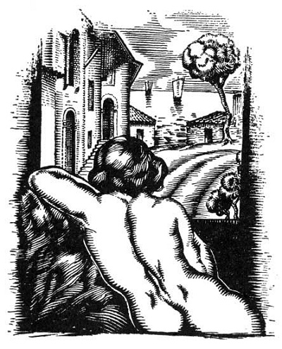

  
[Intangible Textual Heritage](../../index)  [Classics](../index.md) 
[Index](index)  [Previous](aph01)  [Next](aph03.md) 

------------------------------------------------------------------------

[Buy this Book at
Amazon.com](https://www.amazon.com/exec/obidos/ASIN/B000EP89M2/internetsacredte.md)

------------------------------------------------------------------------

  
*Aphrodite*, by Pierre Louys, \[1932\], at Intangible Textual Heritage

------------------------------------------------------------------------

p. 14 p. 15

# BOOK ONE

p. 16 p. 17

# APHRODITE

### Chapter One

### CHRYSIS

LYING upon her bosom, her elbows forward, her feet apart and her cheek
resting in her hand, she pierced little symmetrical holes in the pillow
of green linen with a long golden pin.

Since she had awakened, two hours after mid-day, and quite tired from
having slept too much, she had remained alone upon the disordered bed,
one side covered by a vast flood of hair.

This mass of hair was deep and dazzling, soft as a fur, longer than a
wing, supple, numberless, full of life and warmth. It half-covered her
back, spread itself under her body and glittered to her very knees in
thick and rounded ringlets. The young woman was rolled up in this
precious fleece whose golden brown, almost metallic, reflections had
caused the women of Alexandria to name her Chrysis.

It was not the smooth hair of the Syrians of the court, nor the tinted
hair of the Asiatics, nor the brown and black hair of the daughters of
Egypt. It was that of an Aryan race, of the Galilæans from beyond the
desert.

Chrysis. She loved that name. The young men who came to see her called
her Chrysé like Aphrodite in the verses which they left, with garlands
of roses, at her door in the mornings. She did not believe in Aphrodite
but she was pleased that they should

p. 18

compare her to the goddess, and she went sometimes to the temple to give
her, as to a friend, boxes of perfume and blue veils.

She was born on the banks of the lake of Gennesaret in a country of
shadow and of sun, over-run with rose-laurels. Het mother went in the
evenings to wait upon the road to Jerusalem for travelers and merchants,
in the midst of the pastoral silence. She was a woman much respected in
Galilee. The priests did not avoid her door for she was charitable and
pious; the lambs of the sacrifice were always paid for by her, the
benediction of the Eternal extended over her house. But when she became
enceinte, her condition was a matter of gossip—for she lived alone. A
man who was celebrated for the gift of prophecy said that she would bear
a daughter who would one day wear at her throat "the wealth and the
faith of a nation." She did not quite understand how that could be but
she named the child Sarah—this is to say *Princess*, in Hebrew. And this
silenced the scandals.

Of this Chrysis had never known, the diviner having told her mother how
dangerous it is to reveal to people prophecies of which they are the
objects. She knew nothing of her future; wherefore she often thought of
it. She recalled but little of her childhood and did not like to speak
of it. The only very clear sentiment which had remained with her was of
the fright and the. vexation which were caused every day by the anxious
surveillance of her mother who, the hour being come to go forth upon the
road, shut her up in their room for interminable hours. She recalled
also the round window through which she saw the waters of the lake, the
mist-blue fields, the transparent sky, the light air of the Galilæan
country. The house was surrounded by pink flax and tamarisks. Thorny
caper bushes raised their green heads

p. 19

at hazard over the fine mist of the blue-grass. Little girls bathed in a
limpid brook where red shells could be found under tufts of laurel
blossoms. And there were flowers on the water, flowers in all the meadow
and great lilies on the mountains.

She was twelve years old when she escaped to follow a troop of young
riders who were going to Tyre as merchants of ivory and whom she had
chanced to meet beside a well. They had adorned their long-tailed horses
with many-colored tufts. She recalled well how they carried her away,
pale with joy, on their mounts, and how they had halted later for the
night—a night so bright that not a star could be seen.

Neither had she forgotten their entry into Tyre, she at the head, on the
panniers of a pack horse, holding to the mane by her fists, flaunting
her bare calves to the townswomen, proud now to be a woman herself. The
same evening they departed for Egypt. She followed the sellers of ivory
to the market of Alexandria.

There they left her two months later, in a little white house with a
terrace and little columns, with her bronze mirror, soft rugs, new
cushions and a handsome Hindu slave-girl, skilled in dressing the hair.

As she dwelt in the extreme Eastern Quarter which the young Greeks of
Bruchion scorned to visit, she met for a long time only travelers and
merchants, as did her mother. She did not see again her passing callers;
she could please herself with them and then leave them quickly, before
loving them. However, she had inspired lasting passions. Masters of
caravans had been known to sell their merchandise at a beggarly price,
bankrupting themselves in order to remain near her a few days. With
these men's gifts

p. 20

she had bought jewels, bed-cushions, rare perfumes, flowered robes and
four slaves.

She had come to understand many foreign tongues and knew tales of all
countries. Assyrians had told her the love-story of Douzi and Ishtar,
Phœnician tales of Ashtaroth and Adonis. Greek girls of the isles had
told her the legend of Iphis, and she knew also the love-story of
Atalanta. Finally her Hindu slave-girl, patiently during seven years,
had taught her to the last detail the complex art of the priestesses of
Palibothra.

For love is an art, like music. It gives emotion of the same order, as
delicate, as vibrant, perhaps even more intense; and Chrysis, who knew
its every rhythm and subtlety, felt herself, and rightly, a greater
artist than Plango herself, who was a musician in the temple.

Seven years she lived thus, without dreaming of a life more happy or
more diversified than hers. But a little before her twentieth year, when
from a young girl she became a woman, ambition suddenly awoke in her
with maturity.

And one morning as she came out of a deep sleep, two hours past mid-day,
quite tired from having slept too much, she turned over on her breast
across the bed, her feet apart, rested her cheek in her hand and with a
long golden pin pierced with little symmetrical holes her pillow of
green linen.

She reflected profoundly.

There were at first four little points which made a square and a point
in the middle. Then four other points to make a larger square. Then she
tried to make a circle—but that was a little difficult.

p. 21

Then she pierced points at random and began to call, "Djala! Djala!"

Djala was her Hindu slave whose name was Djalantachtchandrapchapala,
which means: "Changeful-as-the-image-of-the-moon-upon-the-water."
Chrysis was too lazy to say the entire name.

The slave entered and stood near the door without quite shutting it.

"Djala, who came yesterday?"

"Dost thou not know?"

"No. I paid no attention to him. I was weary. I was drowsy the whole
time, and I remember nothing. Was he pleasing? When did he leave? Early?
What was it he brought me? Is it valuable? No—don't tell me. I don't
care. What did he say? Has no one come since his departure? Will he
return? Give me my bracelets."

The slave brought a casket but Chrysis did not even glance at it and,
raising her arms as high as she could, "Ah! Djala," she said, "Ah!
Djala! . . . I would like to have extraordinary adventures."

"Everything is extraordinary," said Djala, "or nothing. The days are
like each other."

"Not at all. Formerly it was not so. In every country in the world the
gods have come down upon earth and have loved mortal women. Ah! in what
manner must they be awaited, in what forests must they be sought, they
who are a little more than men? What prayers must be said that they
come, they who would teach one something or make me forget everything?
And if the gods will descend no more, if they are dead or if they are
too old, Djala, will I also die without having seen a man who will bring
tragic events into my life?"

p. 22

She turned over on her back and interlaced her fingers.

"If someone should adore me, it seems to me that I would find much
pleasure in making him suffer until he died of it. Those who come to me
are not worthy of being wept for—and then, it . is my fault too—it is I
who call them, why should they love me?"

"What bracelet today?"

"I will wear them all. But leave me. I need no one."

"Thou wilt not go out?"

"Yes, I will go out alone—I will dress myself alone. I will not come
back. Go!—Go!"

She let one foot drop on the rug and stretched herself erect. Djala had
gone out softly.

She walked very slowly through the room, her hands clasped behind her
neck, absorbed in the delight of applying her bare feet. moist with
perspiration, to the cool pavement. Then she entered her bath. To regard
herself through the water gave her great pleasure. She saw herself like
a great shell of pearl open upon a rock. Her skin became harmonious and
perfect; the lines of her body lengthened in a blue light; her whole
figure was more supple; she recognized her hands no longer. The
lightness of her body was such that she raised herself upon two fingers,
let herself float for an instant and fall back softly upon the marble
amidst a light stirring which lapped under her chin. The water flowed
into her ears like a kiss.

The hour of the bath was that where Chrysis commenced to adore herself.
The loveliness of her body became the object of tender contemplation and
admiration. With her hair and her hands she made a thousand charming
plays; now and then she laughed softly, like a child.

p. 23

The day drew to a close. She rose up in the basin, came out of the water
and walked toward the door. The marks of her feet glistened upon the
stones. Swaying and as though exhausted, she opened the door wide and
paused, her arm stretched out on the latch, then entered. Standing,
still wet, near her bed, she commanded the slave, "Dry me."

The Malabar woman took a large sponge in her hand and passed it into the
soft golden hair of Chrysis, which streamed backward laden with water;
she dried it, scattered it, shook it gently, and then, plunging the
sponge into a jar of oil, passed it gently over her mistress’s body
before rubbing her with a rough cloth, which made the pliant skin glow.

Chrysis buried herself shudderingly in the coolness of a marble seat and
murmured, "Dress my hair."

In the level rays of the evening, the hair, still damp and heavy, shone
like a shower luminous in the sun. The slave took it in handfuls and
twisted it; she made it turn upon itself like a great serpent of metal
which the pins of gold pierced like arrows. She rolled it about with a
green band, thrice crossed, in order to enhance the gloss by contrast
with the silk. Chrysis held at arm's length her polished copper mirror.
Idly she watched the dark hands of the slave move in the heavy hair,
round the clusters, gather in the straying locks and sculpture the
head-dress like a vase of moulded clay. When this was done Chrysis said
in a low voice, "Tint me."

A little box of rosewood, brought from the isle of Dioscoris, contained
tints of all colors. With a brush of camel's hair the slave took a
little black paste which she placed on the long finely curved lashes in
order that the eyes should appear more blue. Two decided

p. 24

strokes of a crayon lengthened them, softened them; a bluish powder
leadened the lids; two spots of bright vermilion accentuated the corners
of the tears. Then, to fix the tints, the face must be covered with
ointment. With a soft feather dipped in white pigment, Djala drew white
streaks along the arms and on the neck; with a little brush full of
carmine she ensanguined the mouth; her fingers spread over the cheeks a
light cloud of red powder. Then with a pad of tinted leather she colored
the elbows faintly and revived the luster of the ten nails. The toilette
was finished.

Then Chrysis began to smile, and said to the Hindu, "Sing to me."

She sat with arched back in her marble armchair. Her pins were like
golden rays behind her face. Her hands, resting upon her breast, spaced
between the shoulders the red necklace of her painted nails, and her
small white feet were reunited upon the stone.

Djala crouched near the wall and recalled love songs of old India:

"Chrysis . . ."

She sang in monotone:

"Chrysis, thy hair is like a bee-swarm, at rest upon a tree. The warm
south wind blows through it with the dew of love and the moist perfume
of the night flowers."

The young girl, with her slower and softer voice, took up the song:

"My hair is like an infinite river in the plain where the flaming
evening flows away."

And they sang, one after the other:

p. 25

"Thine eyes are like blue water-lilies, stemless and still on the
pools."

"Mine eyes in the shadow of my lashes are like deep lakes under dark
branches."

"Thy lips are two delicate dowers where the blood of the deer has
fallen."

"My lips are the burning edges of a wound."

"Thy tongue is the bloody dagger which has made the wound of thy mouth."

"My tongue is encrusted with precious stones. It is red from mirroring
my lips."

"Thine arms are rounded like two bars of ivory and thine armpits are two
mouths."

"My arms reach out like two lily stems whereon my fingers cling like
five petals."

"Thy limbs are the trunks of two white elephants which carry thy feet
like two rosy flowers."

"My feet are two water-lily petals upon a pool; my limbs are two swollen
water-lily buds."

"Thy bosom is a shield of silver."

"It is the moon—and the moon's gleam on the water."

A deep silence fell. The slave raised her hands and bowed forward.
Chrysis went on:

"I am a crimson blossom, full of sweet scents and honey. . . . I am like
the sea-hydra, soft, living dower of the night. . . . I am a well, in an
ever-warm shelter."

The prostrate one murmured very low:

"Thou art awesome as the face of Medusa."

p. 26

Chrysis placed her foot upon the slave's neck and said, trembling,
"Djala . . ."

Little by little the night had come, but the moon was so luminous that
the room was filled with blue radiance.

Chrysis, naked, gazed at the still gleaming of her skin, and on her body
where the deep shadows fell upon it.

She rose abruptly. "Djala, of what are we thinking? It is night and I
have not yet gone out. Only sleeping sailors will be on the
Heptastadion. Tell me, Djala, am I beautiful?

"Tell me, Djala, am I more beautiful this night than ever? I am the most
beautiful woman in Alexandria; dost thou know it? Will he not follow me
like a dog, he who will presently pass into the oblique regard of mine
eyes? Will I not make of him what pleases me—a slave if it is my
caprice; and can I not expect from the first who comes the most abject
obedience? Dress me, Djala."

Around her arms two silver serpents twined, upon her feet were fixed
sandals attached to her brown ankles by crossed leather thongs. She
herself buckled around her waist a young girl's girdle. In her ears she
placed great circular hoops, on her fingers rings and seals, on her neck
three necklaces of golden images, chiseled at Paphos by the hierodules.

She studied herself for some time, wearing only her jewels; then drawing
from a coffer where she had folded it a vast garment of sheer yellow
linen, she wrapped it around her, draping herself from head to foot. Its
diagonal folds furrowed that little of her figure which could be seen
through the light tissue; one of her elbows thrust out under the close
tunic, and the other arm, which she had left bare, carried a long train
so that it would not drag in the dust.

p. 27

She took in her hand her fan of plumes and went out nonchalantly.

Standing on the steps of the threshold, her hand resting against the
white wall, Djala alone watched her mistress depart.

She walked slowly along the houses in the deserted street where the
moonlight fell. A little dancing shadow frisked behind her steps.

 

------------------------------------------------------------------------

[Next: Chapter Two. On the Jetty](aph03.md)
