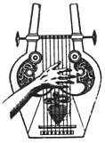

  
[Intangible Textual Heritage](../../index)  [Classics](../index.md) 
[Index](index)  [Previous](aph02)  [Next](aph04.md) 

------------------------------------------------------------------------

[Buy this Book at
Amazon.com](https://www.amazon.com/exec/obidos/ASIN/B000EP89M2/internetsacredte.md)

------------------------------------------------------------------------

  
*Aphrodite*, by Pierre Louys, \[1932\], at Intangible Textual Heritage

------------------------------------------------------------------------

p. 28

#### Chapter Two

#### ON THE JETTY

ON the jetty of Alexandria, a girl stood singing. Beside her, seated on
the white parapet, were two flute-players.

    "*Deep to the woods the satyrs drove  
          The oreads;  
    And helpless to the mountains fled  
          The water nymphs.  
    Hot forms, wet-eyed, with flying hair,  
          Were seized and bent  
    Grasswards, their bodies half-divine  
          Quivering, spent.  
Eros finds always on the lips of women,  
      Painful and sweet desire*."

The flute-players repeated: "Eros! Eros! . . ." and sighed into their
doubled reeds.

"*Cybèlë, seeking Attys, sped  
     Across the plains.  
Eros had pierced her heart with love  
     Which he disdained,  
For Eros ever matches scorn  
     Against desire.  
She drew the icy gentle breath  
     Of welcome death*. p. 29  
*Eros finds always on the lips of women,  
     Painful and sweet desire*."

"Eros! Eros! . . . " Shrill cries leaped from the flutes.

"*Syrinx ran weeping to the shore—  
     And then beyond . . .  
Cheating the Goat-Foot's lusty will.  
     Her trembling shade  
Whispered in reeds beside the stream.  
     So breaking these,  
Pan bound the dead soul in the pipes  
     and crying flute.  
Eros finds always on the lips of women,  
     Painful and sweet desire*."

While the flutes continued the slow refrain of the last stanza, the
singer held out her hand to the passers-by who stood in a circle around
her and received four oboli which she slid into her footgear.

Little by little, the crowd dispersed, curious to watch the passing of
its numberless self. The noise of steps and of voices covered even the
sound of the sea. Sailors drew, with bent shoulders, merchandise upon
the quay. Girls who sold fruit passed by, their full baskets in their
arms. Beggars besought with a trembling hand. Asses laden with full
leathern bottles trotted before the sticks of their drivers. But it was
the hour of sunset, and an idle throng, more numerous than the active
crowd, covered the jetty. Here and there groups formed, between which
women wandered. One heard well known silhouettes called by name. The
young looked at the philosophers who contemplated the women.

p. 30

These were of every order and of every condition: from the most
celebrated, dressed in light silks and shod with gilded leather, to the
most miserable who walked barefoot. The poor ones were not less
beautiful than the others but less fortunate only, and the attention of
the sages dwelt by preference on those whose grace was not altered by
the artifice of girdles and the encumberment of jewels. As it was the
eve of the festival of Aphrodite, these women had full license to choose
the garment which became them best and some of the youngest had even
risked wearing none at all. But they shocked no one, for they would not
have thus exposed themselves to the sun if any one of them had been
marked by the least defect which could lead to mockery.

 

"Tryphera! Tryphera!"

And a young woman of joyous aspect elbowed some passers-by to rejoin a
friend she had seen among the crowd.

"Tryphera! Art thou invited?"

"Where, Seso?"

"To Bacchis’s."

"Not yet. She gives a dinner?"

"A dinner? A banquet, my dear. She is freeing her handsomest slave,
Aphrodisia, on the second day of the festival."

"At last! She has perceived that they come to her no longer except for
her slave."

"I think she has seen nothing. It is a fancy of old Cheres, the ship
captain of the quay. He wanted to buy the girl for ten minæ; Bacchis
refused. Twenty minæ; she still refused."

"She is mad."

"What wouldst thou have her do? It was her ambition to have

p. 31

a freed slave. Besides, she was right to bargain. Cheres will give
thirty-five minæ and for that price the girl will be free."

"Thirty-five minæ? Three thousand, five hundred drachmæ? Three thousand,
five hundred drachmæ for a negress?"

"She is the daughter of a white."

"Yes, but her mother is black."

"Bacchis declared she would not give her for less and old Cheres is so
much in love that he has consented."

"Is he invited, he at least?"

"No! Aphrodisia will dance at the banquet as the last course after the
fruit and it is only the next day they must deliver her to Cheres, but I
am afraid she will be fatigued . . ."

"Don't pity her! With him she will have time to recover. I know him,
Seso. I have watched him sleep."

They laughed together at Cheres. Then they complimented each other.

"Thou hast a pretty dress," said Seso. "Didst thou have it embroidered
at home?"

Tryphera's robe was of a thin glaucous stuff entirely worked with large
iris flowers. A carbuncle mounted in gold gathered it in folds on the
left shoulder; the robe fell like a scarf as far as the metal girdle; a
narrow slit which opened and closed at each step alone revealed the
whiteness of the skin.

"Seso!" said another voice. "Seso and Tryphera, come, if you don't know
what to do. I am going to the Ceramic Wall to look for my name written
there."

"Mousarion! Whence comest thou, little one?"

"From the Pharos. There is no one down there."

p. 32

"What meanest thou? One needs but to throw in a line, it is so full."

"No turbots for me. So I am going to the wall. Come."

On the way, Seso recounted again the banquet project at the house of
Bacchis.

"Ah! At Bacchis’s!" cried Mousarion. "Thou rememberest the last dinner,
Tryphera: all the things they said about Chrysis?"

"Thou must not repeat it. Seso is her friend."

Mousarion bit her lip, but already Seso was uneasy.

"What? What did they say?"

"Oh! . . . Slanders."

"People can talk," declared Seso. "She is worth more than all three of
us. On the day she will be willing to leave her quarter and show herself
at Bruchion, I know some of our lovers who will return to us no more."

"Oh! Oh!"

"Certainly. I would commit follies for that woman. There is no one more
beautiful here, believe me."

The three young girls had arrived before the Ceramic Wall. From one end
to the other of the immense white rampart inscriptions written in black
succeeded each other. When a lover desired to present himself to a young
woman it was sufficient for him to write their two names with the gift
which he proposed; if the man and the gift were approved, the woman
remained standing under the writing until the author returned.

"Look, Seso," said Tryphera, laughing. "What nasty joker has written
that?"

And they read, in big letters:

p. 33

BACCHIS  
THERSITES  
TWO OBOLI

"To mock women so should not be permitted. As for me, were I the one
named I would already have made an inquiry." But farther on Seso paused
before a more serious inscription.

SESO OF KNIDOS  
TIMON SON OF LYSIAS  
ONE MINA

She paled slightly.

"I remain," she said.

And she backed against the wall under the envious looks of the passing
women.

Some steps farther, Mousarion found a demand which was acceptable if not
so generous. Tryphera returned alone to the jetty.

As the hour was advanced the crowd was less compact. However, the three
musicians continued to sing and to play the flute.

Becoming aware of an unknown whose stoutness and garments were a little
ridiculous, Tryphera tapped him on the shoulder.

"Well! little father! I wager thou art an Alexandrian, eh!"

"True, my daughter," replied the good man, "and thou hast guessed it.
Thou seest me quite surprised at the town and the people."

"Thou art from Bubastis?"

"No. From Cabira. I came here to sell grain and I will return tomorrow
richer by fifty-two minæ. Thanks be rendered to the gods, the year has
been good."

p. 34

Tryphera suddenly became full of interest in this merchant.

"My child," he continued timidly, "thou canst give me a great pleasure.
I would not like to return tomorrow to Cabira without being able to tell
my wife and my three daughters that I have seen-some celebrated men.
Thou must know some celebrated men?"

"Some few," she said, laughing.

"Good. Name them to me as they pass by. I am sure that I have met in the
street, within the last two days, the most illustrious philosophers and
the most influential functionaries. It is my despair not to know them."

"Thou shalt be satisfied. Here is Naucrates."

"Who is this Naucrates?"

"He is a philosopher."

"And what does he preach?"

"That one must be silent."

"By Zeus, there is a doctrine which does not demand a great genius and
this philosopher does not please me at all."

"Here is Phrasilas."

"Who is this Phrasilas?"

"He is a dunce."

"Then why dost thou not let him pass?"

"Because others consider him eminent."

"And what does he say?"

"He says everything with a smile, which permits him to let his mistakes
be understood as voluntary and his banalities as exquisites. He has all
the advantage. The world has allowed itself to be deceived."

"This is too much for me and I do not quite understand thee. Besides,
the face of this Phrasilas is marked with hypocrisy."

p. 35

"Here is Philodemos."

"The strategian?"

"No. A Latin poet who writes in Greek."

"Little one, he is an enemy. I wish I had not seen him."

Here the whole crowd made a movement; a murmur of voices pronounced the
same name:

"Demetrios . . Demetrios . . ."

Tryphera mounted upon a stone and in her turn she said to the merchant,
"Demetrios . . . there is Demetrios, thou who wanted to see some
celebrated men."

"Demetrios? The lover of the queen? Is it possible?"

"Yes, thou hast had luck. He never goes out. Since I have been at
Alexandria, this is the first time I have seen him on the jetty."

"Where is he?"

"There he is, leaning over to see the shipping."

"There are two leaning over.

"He is the one in blue."

"I do not see him well. He turns his back to us."

"Dost thou know he is the sculptor to whom the queen gave herself as
model for the Aphrodite of the temple."

"They say he is the royal lover. They say he is the master of Egypt."

"And he is handsome as Apollo."

"Ah! there he is turning around. I am glad I came. I will say that I
have seen him. I have heard many things about him. It appears that no
woman has ever resisted him. He has had many adventures, has he not? How
does it happen that the queen has not been informed of them?"

"The queen knows of them as well as we do. She loves him too

p. 36

much to speak to him about them. She is afraid lest he return to Rhodes,
to his master, Pherecrates. He is as powerful as she and it is she who
desired him."

"He does not appear happy. Why does he look so sad? It seems to me I
would be happy if I were he. I would like very much to be he, were it
but for one evening. . . ."

The sun had set. The woman looked at this man who was the dream of them
all. He, without appearing to be conscious of the stir which he
inspired, remained leaning on the parapet, listening to the
flute-players.

The little musicians made one more round: then they gently threw their
light flutes over their backs; the singer passed her arms around their
necks and all three returned toward the town.

As darkness had come, the other women re-entered, in little groups, the
immensity of Alexandria and the troop of men followed them; but as they
went all looked back toward Demetrios. The last one who passed softly
threw him her yellow flower and laughed. Silence fell upon the quays.

 

------------------------------------------------------------------------

[Next: Chapter Three. Demetrios](aph04.md)
