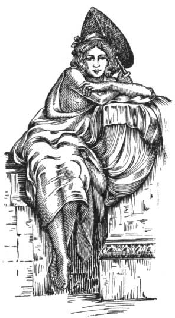

  
[Intangible Textual Heritage](../../index)  [Classics](../index) 
[Index](index)  [Previous](aph08)  [Next](aph10) 

------------------------------------------------------------------------

[Buy this Book at
Amazon.com](https://www.amazon.com/exec/obidos/ASIN/B000EP89M2/internetsacredte)

------------------------------------------------------------------------

  
*Aphrodite*, by Pierre Louys, \[1932\], at Intangible Textual Heritage

------------------------------------------------------------------------

p. 70 p. 71

# BOOK TWO

p. 72 p. 73

### Chapter One

### THE GARDENS OF THE GODDESS

THE temple of Aphrodite-Astarte was erected outside the gates of the
city in an immense park full of flowers and shadowy places where the
water of the Nile, brought through seven aqueducts, nourished at all
seasons a prodigious verdure.

This flowering forest at the edge of the sea, these deep brooks, these
lakes, these somber fields, had been created in the desert more than two
centuries before by the first of the Ptolemies. Since then, the
sycamores planted by his orders had become gigantic; under the influence
of the fecund waters the lawns had grown into meadows, the pools had
enlarged into lakes; from a park Nature had evolved a vast region.

The gardens were more than a valley, more than a region or country; they
were a complete world enclosed by boundaries of stone and ruled by a
goddess, the soul and center of this universe. All around rose a
circular terrace, eighty stadia long and thirty-two feet high. This was
not a wall, it was a colossal city made of fourteen hundred houses. An
equal number of priestess-courtesans inhabited this sacred city and
represented in this unique place severity different nationalities.

The plan of these sacred houses was uniform and as follows: the door, of
red copper—the metal dedicated to the goddess—

p. 74

bore a knocker and striking-plate shaped symbolically; and beneath was
engraved the name of the occupant with the initials of the usual phrase:

Ω. Ξ. Ε.  
ΚΟΧΛΙΣ  
Π. Π. Π

On each side of the door opened two rooms in the form of shops; that is
to say: without a wall on the side of the gardens. That on the right,
called "the exposed room" was the place where the bedecked priestess
reposed upon a high seat at the hour when the men arrived. That on the
left was at the disposition of visitors who wished to pass the night in
the open air without, however, sleeping on the grass.

Through the opened door a corridor gave access to a vast, marble-paved
court, the center of which was occupied by an oval pool. A peristyle
shaded this great spot from light and protected by a zone of coolness
the entrance to the seven rooms of the house. At the back rose the altar
which was of rose-granite.

Each woman had brought from her own land a little idol of the goddess,
and, placed upon the domestic altar, she adored it in her own tongue
without ever understanding the others. Lakmi, Ashtaroth, Venus, Ishtar,
Freia, Mylitta, Kypris; such were the religious names of their deified
Pleasure. Some venerated her under a symbolic form; a red boulder, a
conical stone, a great spiny shell. Most of them set up on a pedestal of
soft wood a coarse statuette with thin arms, heavy breasts and excessive
hips. They laid at its feet a branch of myrtle, strewed the altar with
rose leaves, and burned a grain of incense for each prayer that was
granted. It was

p. 75

the confidant of all their sorrows, witness of all their labors,
supposed source of all their pleasure. At their death it was put into
their fragile little coffins as a guardian of their entombment.

The handsomest of these girls came from the kingdoms of Asia. Every
year, vessels which brought to Alexandria the presents of tributaries or
of allies, disembarked, with the bales and the leathern bottles, an
hundred virgins chosen by the priests for the service of the sacred
garden. These were Mysians and Jewesses, Phrygians and Cretans, girls
from Ecbatana and from Babylon, from the shores of the Gulf of Pearls
and from the sacred banks of the Ganges. Some were white of skin, with
medallion-like faces and firm bosoms; others, brown as the earth under
the rain, wore golden circles in their nostrils and shook dark masses of
short hair upon their shoulders.

Some came from farther yet, little beings, slender and slow, whose
language no one knew and who resembled yellow monkeys. Their eyes
lengthened toward the temples; their straight black hair was
fantastically dressed. These girls remained all their lives timid as
lost animals. They knew the pretenses of love but refused to kiss.
Between visitors they might be seen playing together, and, seated upon
their little feet, amusing themselves childishly.

In a separate meadow the blond and rosy daughters of the North lived in
a troop, lying upon the grass. There were Sarmatians with triple plaits,
with robust limbs and square shoulders, who made themselves crowns with
branches of trees and wrestled to divert themselves; Scythians,
flat-nosed, full-breasted, hairy; gigantic Teutons who terrified the
Egyptians by their hair—pale as that of old men—and with flesh softer
than that of children;

p. 76

\[paragraph continues\] Gauls with hair
red as that of cattle, who laughed without cause; modest young Celts
with sea-green eyes.

Elsewhere, the brown-skinned Iberians met during the day. They had
masses of heavy hair that they dressed cleverly. Their firm skins and
strong physiques were much fancied by the Alexandrians. They were chosen
for dancers as often as for mistresses.

Under the wide shadow of the palms dwelt the daughters of Africa: the
Numidians veiled in white, the Carthaginians draped with black gauzes,
the Negresses enveloped in multicolored costumes.

There were fourteen hundred.

When a woman entered there she never went forth again until the first
day of her old age. She gave to the temple the half of her gains and the
rest sufficed for her repasts and her perfumes.

They were not slaves, and each one actually possessed one of the houses
of the terrace; but all were not equally popular, and the luckiest ones
often found means to buy neighboring houses which their inhabitants sold
in order to save themselves from starvation. These latter then
transported their statuettes into the park and sought an altar made of
flat stone, in a corner which they left no more. The poor merchants knew
this and preferred to visit those who dwelt thus exposed to the wind
upon the moss near their sanctuaries; but sometimes even these men did
not present themselves, and then these poor girls united their miseries
in couples—devoted friendships which became lasting love, households
where all was shared, to the last woolen rag, and where alternating
complaisances consoled for long chastities.

Those who had no woman-friends offered themselves as voluntary slaves to
their more fortunate comrades. It was forbidden that

p. 77

these should have in their service more than twelve of the poor girls;
but twenty-two courtesans were known who had attained the maximum and
had chosen a variegated household from among all races.

If by chance a woman had a son, he was brought up in the temple close to
the contemplation of the perfect form and to the service of his
divinity. If she were delivered of a daughter, the child was born for
the goddess. The first day of her life, her symbolic marriage with the
son of Dionysos was celebrated. Later she entered the Didascalion, the
great monument-school where the young priestesses learned, in seven
classes, the mysteries of the temple. The pupil chose at will the day of
her initiation because an order of the goddess must not be thwarted;
this day she was given one of the little houses on the Terrace, and some
of these young pupils were counted among the most indefatigable and the
most often visited.

The interior of the Didascalion, the seven class-rooms, the little
theater and the peristyle of the court were ornamented with ninety-two
frescoes which summed up the teachings of love. They were the work of a
man's entire life—Cleochares of Alexandria, disciple and natural son of
Apelles, had finished them, dying. Recently Berenice the queen, who was
much interested in the celebrated school and had sent her young sisters
there, had ordered from Demetrios a series of marble groups to complete
the decoration; but until now only one had been placed, in the
children's class.

At the end of each year, in the presence of all the assembled
courtesans, a great competition took place which excited an
extraordinary emulation in this crowd of women, for the twelve

p. 78

prizes awarded gave the right to the most supreme glory of which they
could dream: the entry into the Cotytteion.

This last monument was enveloped in so many mysteries that a detailed
description of it cannot now be given. We know only that it was included
in the garden and that it had the form of a triangle whose base was a
temple of the goddess Cotytto, in whose name fearful, unknown ceremonies
were performed. The other two sides of the monument were composed of
eighteen houses. Thirty-six courtesans dwelt there, so sought by rich
suitors that they would by no means accept less than two minæ; they were
the Baptes of Alexandria. Once a month, at the full moon, they gathered
in the close of the temple, maddened by exciting beverages and girt in
ritual costumes. The eldest of the thirty-six had to take a mortal dose
of the terrible philtre. The certainty of her speedy death made her
attempt without fear all the dangerous excesses before which the living
recoil. Her body, everywhere foaming, became the center and the model of
the whirling orgy; in the midst of long yells, cries, tears and dances
the other women embraced her, toweled her with their hair and joined
madly in the uninterrupted spasm of this furious agony. Three years
these women lived thus, and at the end of the thirty-sixth month such
was the intoxication of their end.

Other less venerated sanctuaries had been raised by the women in honor
of the other names of the many-formed Aphrodite. There was even an altar
consecrated to the Uranian, who received the chaste vows of sentimental
courtesans; another to the Epistrophia who brought forgetfulness of
unhappy loves; another to the Chryseia, who attracted rich lovers;
another to the Genetyllis, who protected young girls; another to the
Coliade, who approved

p. 79

strong passions, for all that touched love was piety for the goddess.
But the special altars had efficacy and virtue only in regard to small
desires. They were served from day to day, their favors were quotidian
and their commerce familiar. The successful suppliants placed simple
flowers upon them; those who were not gratified soiled them. They were
neither consecrated nor kept up by the priests and in consequence their
profanation was not punishable.

Quite otherwise was the discipline of the temple.

The Temple, the High Temple or the High Goddess, the holiest place in
all Egypt, the inviolable Astarteion, was a colossal edifice three
hundred and thirty-six feet in length, elevated upon seventeen steps at
the height of the gardens. Its golden doors were guarded by twelve
hermaphroditic hierodules, symbols of love and the twelve hours of the
night.

The entrance was not turned toward the East but in the direction of
Paphos, that is to say, toward the north-east; the rays of the sun never
penetrated directly into the sanctuary of the great nocturnal Immortal.
Eighty-six columns sustained the architrave; they were tinted with
crimson to half their height, and the upper parts disengaged themselves
from these red vestments with an ineffable whiteness like the torsos of
standing women.

Between the epistyle and the corona, the long girdling ornamental
zoöphoros unrolled its love myths of the fabulous beasts. Centaurs were
there with stallions, goats with thin satyrs, naiads, stags, Bacchantes,
tigers, lionesses, gryphons. The great multitude of beings hurtled thus
onward, passionate, divine, creative, awake to the first stirring of
life. The crowd of obscure couples ranged somewhat by chance about a few
immortal scenes: Europa with the Olympian bull, Leda with the swan.
Farther along, Glaucos

p. 80

expired in the arms of the siren; the god Pan embraced a hamadryad with
flying hair; the Sphinx approached the horse Pegasus —and, at the end of
the frieze, the sculptor himself was figured before the goddess
Aphrodite, modeling, from her own person, in soft wax the contours of a
perfect cteis, as though all his ideal of beauty, joy and virtue had
long since taken refuge in that precious and fragile jewel.

 

------------------------------------------------------------------------

[Next: Chapter Two. Melitta](aph10)
