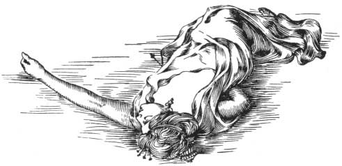

  
[Intangible Textual Heritage](../../index)  [Classics](../index) 
[Index](index)  [Previous](aph10)  [Next](aph12) 

------------------------------------------------------------------------

[Buy this Book at
Amazon.com](https://www.amazon.com/exec/obidos/ASIN/B000EP89M2/internetsacredte)

------------------------------------------------------------------------

  
*Aphrodite*, by Pierre Louys, \[1932\], at Intangible Textual Heritage

------------------------------------------------------------------------

p. 93

### Chapter Three

### LOVE AND DEATH

"THE blood of a woman. Then the blood of another woman. Last of all,
thine own, but a little later."

As he walked, Demetrios repeated these words and, in spite of all, a
belief in them oppressed him. He had never placed confidence in oracles
drawn from the bodies of victims or the movements of planets. Such
affinities seemed too problematic. But the complex lines of the hand
have, in themselves, the aspect of an exclusively individual horoscope
which he regarded uneasily. And so the prediction of the Chiromant
haunted his spirit.

In his turn, he considered the palm of his left hand where his life was
summed up in secret and ineffaceable signs.

He saw first, at the summit, a sort of regular crescent whose points
were turned toward the base of the fingers. Below, a quadruple line,
knotted and pink, was hollowed, marked in two places by bright red
points. Another more slender line descended, at first parallel, then
turned abruptly toward the wrist. Finally, a third, short and pure,
outlined the base of the thumb, which was entirely covered with lightly
traced lines. He saw all that; but not knowing how to read the hidden
symbol, he drew his hand over his eyes and changed the subject of his
meditation.

Chrysis, Chrysis, Chrysis. The name pulsed in him like a fever.

p. 94

\[paragraph continues\] To satisfy her,
conquer her, enclose her in his arms—fly with her, into Syria, into
Greece, to Rome, no matter where, if only it were a place where he
should have no mistresses and she no lovers: that was what must be done,
and immediately, immediately!

Of the three gifts which she had demanded, one was already secured. Two
others remained: the comb and the necklace.

"The comb first," he thought.

And he hastened his steps.

Every evening, after sunset, the wife of the High Priest sat upon a
marble bench, placed with its back to the forest, whence one could view
the whole sea. Demetrios knew this well, for this woman, like so many
others, had been in love with him, and she had once told him that on the
day he wished for her he could find her there.

Accordingly he went thither.

She was indeed there: but she did not see him approach; she sat with
closed eyes, her body reposing against the back of the bench, her arms
relaxed.

She was an Egyptian. Her name was Touni. She wore a light tunic of vivid
purple without buckles or girdle, and without other embroidery than two
black stars at the bosom. The thin stuff, ironed into folds, broke its
fall upon the delicate roundings of her knees, and little sandals of
blue leather gloved her slender, rounded feet. Her skin was quite brown,
her lips very full, her shoulders small, her fragile and pliant figure
seemed fatigued by the weight of her swelling bosom. She slept
open-mouthed, dreaming gently.

Demetrios noiselessly sat down on the bench at her side.

He slowly drew nearer and nearer, coolly observing the delicate

p. 95

young shoulder, smooth and dark, which melted gently into the breast
along the shaded muscles of the armpit.

Below it, the tunic of purple muslin lay long and loose. Gently,
Demetrios caressed the soft garment and the warm skin quivered through
the covering.

But Touni did not awaken.

Her dream changed gradually but did not dissolve. Her breath came more
rapidly through her partly opened lips and she murmured a long,
unintelligible phrase as her fevered head fell back.

With the same gentleness, Demetrios withdrew his hand and opened it to
the sweep of the breeze.

 

Beyond the obscure blue slopes, the eternal sea shuddered beneath the
immense scintillation of the night. Like another breast of another
priestess, it undulated beneath the stars, uplifted by the antique
dreams which still cause it to thrill beneath our tardy eyes and of
which the last beings will seek the mystery ere it is effaced at the end
of the ages. The moon inclined her great goblet of blood over the
waters. Far away, in the purest atmosphere which had ever united heaven
and earth, a slight red trail, shot with dark veins, trembled upon the
brightness of the sea beneath the rising moon like the quiver of a
nocturnal breast beneath a caress that remains after the touch has
passed.

Touni still slumbered, her head inclined, her body shadowed in its
tinted muslin.

The redness of the moon, yet on the horizon, came to her over the water.
Its shining, fateful glimmer bathed her in a flame which seemed
immobile; but slowly the reflection raised over the Egyptian; one by
one, her small black curls appeared, and finally,

p. 96

from the shadow, the Comb, the royal Comb desired by Chrysis, appeared
suddenly, its diadem of ivory struck by the crimson brilliance.

Then the sculptor took Touni's soft face between his hands and turned it
toward his own. Her eyes opened, widened. "Demetrios! . . . Demetrios! .
. . Thou!"

And she clasped him in her arms.

"Oh," she murmured, in a voice which sang with happiness, "Oh, thou hast
come, thou art here . . . Is it thou, Demetrios, in whose hands I
awaken? Is it thou, son of my goddess, god of my life?"

Demetrios started back. With one movement she was beside him.

"No," she cried. "What dost thou fear? For thee I am not she who is
surrounded by the omnipotence of the High Priest and from whom the
people draw away. Forget my name, Demetrios. Women in love have no name.
I am no longer she thou knewest. I am only a woman who loves thee—even
to the tips of her fingers."

Demetrios did not open his lips.

"Listen once more," she resumed. "I know who possesses thee; I do not
aspire to become, in any way, the rival of my queen. No, Demetrios,
regard me as a little slave whom one abandons and soon forgets. Regard
me as the lowest and poorest woman who waits at the roadside for the
charity of love. In fact, who am I but one of them? And what have the
Immortals given me, more than the most servile of all my slaves? Thou,
at least, thou hast the beauty which is dispensed like an emanation from
the gods."

p. 97

Demetrios, exceedingly grave, pierced her with his gaze: "And what,
thinkest thou, unfortunate one, what powers emanate from the gods except
. . ."

"Love . . ."

"Or death."

She started up.

"What meanest thou? . . . Death? . . . Yes, death . . . But it is so far
from me . . . in sixty years I may think of it. But why speak to me of
death, Demetrios?"

He said simply, "Death this night."

Terror-struck, she laughed shrilly. "Tonight . . . No, no . . . Who said
that? Why should I die? . . . Answer me . . . Speak . . . What horrible
jesting. . . ."

"Thou art condemned."

"By whom?"

"By thy destiny."

"How knowest thou?"

"I know because I am woven, Touni, with thy destiny. Thy destiny wills
that thou shalt die, by my hand, upon this bench." He seized her wrist.

"Demetrios," she stammered, terrified, "I will not cry out. I will not
call for aid. Let me speak . . ." And she wiped her perspiring forehead.
"If death . . . comes to me from thee . . . death . . . will be sweet to
me . . . I accept it, I desire it, but listen . . ."

Staggering from stone to stone, she dragged him into the darkness of the
wood.

"Since thou holdest within thy hands all that we receive from the gods .
. . the thrill which gives us life and that which

p. 98

snatches it away, open thy two hands upon mine eyes, Demetrios . . .
that of love . . . and that of death . . . do this and I will die
without regret."

There was no reply in the look he turned toward her, but she imagined
there the "yes" which he had not uttered.

Transfigured for a second time, she lifted a new face where newborn
desire, strong in despair, drove terror away.

She spoke no more, but already, between her lips which were never to
close again, each breath sang softly as though she were deep in love
even before receiving the embrace.

Nevertheless, she had gained that supreme victory.

Her young, delicate form quivered in a happiness too great to be less
than eternal, and her distracted companion neglected to plan her death
as he bestowed on her the last embrace of love.

"Ah . . ." she cried suddenly. "Let me die now, Demetrios; why dost thou
delay?"

Leaning over her, he looked once more at Touni, whose great eyes were
raised in ecstasy to his. Then, drawing out one of the long, golden pins
which glittered behind her ears, he drove it home under her left breast.

 

------------------------------------------------------------------------

[Next: Chapter Four. Moonlight](aph12)
