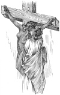

  
[Intangible Textual Heritage](../../index)  [Classics](../index.md) 
[Index](index)  [Previous](aph19)  [Next](aph21.md) 

------------------------------------------------------------------------

[Buy this Book at
Amazon.com](https://www.amazon.com/exec/obidos/ASIN/B000EP89M2/internetsacredte.md)

------------------------------------------------------------------------

  
*Aphrodite*, by Pierre Louys, \[1932\], at Intangible Textual Heritage

------------------------------------------------------------------------

p. 159

### Chapter Five

### THE CRUCIFIXION

ALL together they repeated: "Aphrodisia has taken it! Wretch! Wretch!
Filthy thief!" Their hatred for the favored sister was supplemented by
their personal fears. Arete kicked her repeatedly about the body.

"Where is it?" continued Bacchis. "Where hast thou put it?"

"She has given it to her lover."

"Who is he?"

"An Ophic sailor."

"Where is his ship?"

"It sailed this evening for Rome. Thou wilt never see thy mirror again.
She must be crucified, the thief, the bloody beast!"

"Ah! Gods! Gods!" wept Bacchis. Then her grief changed into a furious
anger.

Aphrodisia had recovered consciousness, but paralyzed with fright and
understanding nothing of what was happening, she remained mute and
tearless.

Bacchis grasped her by the hair, dragged her over the soiled floor, over
the flowers and pools of wine, and cried:

"To the cross! To the cross! Bring the nails! Bring the hammer!"

p. 160

"Oh!" said Seso to her neighbor, "I have never seen that. Let us follow
them."

All followed, hurrying. And Chrysis also followed—she who alone knew the
criminal and alone was the cause of all.

Bacchis went directly into the slaves' room, a square hall furnished
with three mattresses where they slept, two by two, after the nights
were over. At the back of the room, as an ever present menace, rose a
cross in the form of a T, which, until now, had never been used.

Amid the confused murmur of the young women and the men, four slaves
lifted the martyr to the level of the cross-beam.

Still not a sound had issued from her mouth, but when she felt the cold
of the rough wood against her naked back, her long eyes opened wide and
she was seized with a spasmodic groaning which lasted until the end.

They placed her astride a wooden peg fixed to the middle of the upright
which served to support the body and prevent the hands from tearing.

Then they spread out her arms.

Chrysis watched and was silent. What could she say? She could not
vindicate the slave except by accusing Demetrios who, she reflected, was
above all pursuit and would revenge himself cruelly. Beside, a slave was
an item of wealth, and Chrysis’s old rancor rejoiced to see her enemy
thus about to destroy, with her own hands, the value of three thousand
drachmæ as completely as though she had thrown the pieces of money into
the Eunostos. And then, was it worth while to bother with the life of a
servile being?

p. 161

Heliope held out to Bacchis the first nail with the hammer, and the
martyrdom commenced.

Drunkenness, spite, anger, all the passions at once, even that instinct
of cruelty which lurks in a woman's heart, shook the soul of Bacchis as
she struck; and she uttered a cry almost as piercing as that of
Aphrodisia as the nail tore into the open palm.

She nailed the other hand. She nailed the feet, one upon the other.
Then, excited by the springs of blood escaping from the three wounds,
she cried: "It is not enough! Wait! Thief! Sow! Sailor's trollop!"

One after another, she drew out the long pins from her hair and thrust
them violently into the girl's soft flesh. When she had no more weapons
in her hands, she buffeted the poor wretch and spat upon her skin. For
some time she considered her completed work of vengeance; then she
returned to the greater hall with all the guests.

Phrasilas and Timon, alone, did not follow her.

After an instant of meditation, Phrasilas coughed a little, placed his
right hand in his left, raised his head, lifted his eyebrows and
approached the crucified girl who was shaken uninterruptedly by a
horrible tremor.

"Although I am," he said to her, "in many circumstances opposed to
dogmatic theories, I cannot ignore the fact that thou shouldst profit,
in the conjuncture which has overtaken thee, by being familiarized in a
more serious manner with the Stoic maxims. Zeno, who, it seems, did not
have a spirit altogether exempt from error, has left us a few sophisms
without much general bearing yet from which thou canst draw benefit for
the special purpose of calming thy last moments. 'Pain,' he said, 'is a
word empty

p. 162

of meaning, since our will surpassed the imperfections of our perishable
body.' It is true that Zeno died at the age of ninety-eight without
having had, the biographers say, any illness however slight; yet one
cannot argue against him because of this for, from the fact that he knew
how to preserve an unchanging health, we cannot logically conclude that
he would have failed in character if he had become ill. Beside, it would
be an abuse to constrain philosophers to practice personally the rules
of life they propose and to cultivate unceasingly the virtues which they
judge superior. In short, and in order not to develop beyond measure a
discourse which would run the risk of lasting longer than thyself: force
thyself to lift thy soul, so far as thou art able, my dear, above thy
physical sufferings. However sadly, however cruelly thou mayest feel
them, I beg thee be sure that I take a veritable part in them. They
approach their end; be patient—forget. Behold the hour when thou canst
choose, from among the diverse doctrines which attribute immortality to
us, the one which will best soothe thy regret at disappearing. If they
speak truly, thou wilt then have illuminated even the terrors of the
transition. If they lie, what will it matter to thee? Thou wilt not even
know that thou wert deceived." Having spoken thus, Phrasilas readjusted
the fold of his garment upon the shoulder and stole away with a troubled
step.

Timon remained alone in the room with the dying girl upon the cross. The
memory of hours spent with this unfortunate creature haunted his memory,
mingled with the atrocious idea of the imminent decay into which the
beautiful figure would shortly crumble. He pressed his hand upon his
eyes to shut out the sight of the torture, but, unceasingly, he heard
the trembling of her body upon the cross. At length he looked. Great
meshes of bloody rivulets

p. 163

  [  
Click to enlarge](img/16300.jpg.md)

p. 164 p. 165

interlaced upon her skin, from the pins in her arms to the contracted
toes. Her head turned incessantly. Her hair hung along her left side,
drenched with blood, perfume and tears.

"Aphrodisia! Dost thou hear me? Dost thou know me? It is I, Timon;
Timon."

A glance, already nearly blind, touched him for an instant. But the head
turned always. The body trembled without pause. Softly, as though he
feared that the sound of his steps might give her pain, the young man
advanced to the foot of the cross. He stretched out his arms, took the
feeble, turning head gently between his two brotherly hands, piously put
aside along the cheeks the tear-matted hair, and placed upon the warm
lips an infinitely tender kiss.

Aphrodisia closed her eyes. Did she recognize him who had come to
enchant her horrible end by this movement of loving pity? An
inexpressible smile lengthened her blue eyelids and with a sigh she gave
up her spirit.

 

------------------------------------------------------------------------

[Next: Chapter Six. Enthusiasm](aph21.md)
