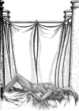

  
[Intangible Textual Heritage](../../index)  [Classics](../index) 
[Index](index)  [Previous](aph21)  [Next](aph23) 

------------------------------------------------------------------------

[Buy this Book at
Amazon.com](https://www.amazon.com/exec/obidos/ASIN/B000EP89M2/internetsacredte)

------------------------------------------------------------------------

  
*Aphrodite*, by Pierre Louys, \[1932\], at Intangible Textual Heritage

------------------------------------------------------------------------

p. 171

### Chapter Seven

### CLEOPATRA

QUEEN BERENICE had a young sister named Cleopatra. Many other princesses
of Egypt were called by this name, but this one was later the great
Cleopatra who slew her empire and killed herself upon its corpse.

She was then twelve years old and no one could say what her beauty would
be. Her long, thin build was disconcerting in a family where all the
women were plump. She ripened like a badly grafted crossed fruit of
foreign, obscure origin. Some of her features were violent as those of
the Macedonians; others seemed to come to her from the depths of gentle,
brown Nubia, for her mother had been a woman of inferior race and her
origin was still doubtful. One was astonished to see lips almost thick
under the curved, thin nose. Her young bosom alone marked her as a
daughter of the Nile.

The little princess dwelt in a spacious chamber open upon the expanse of
the sea and connected with that of the queen by a pillared vestibule.

There she passed the hours of the night upon a bed of blue-tinted silk
where the skin of her finely toned young limbs took a still more somber
hue.

Now in the night during which—far from her thoughts—the

p. 172

events just described took place, Cleopatra arose long before the dawn.,
She had slept but little and ill, uneasy from the extreme heat of the
air.

Without waking her guardian women, she placed her feet gently upon the
ground, slipped on her golden anklets, girdled her little brown body
with a strand of enormous pearls, dressed, and issued from the room.

In the monumental vestibule, the guards, also, slept, except one who
stood sentinel at the queen's door. This one fell upon his knees and
whispered, full of terror, as though he had never found himself caught
in such a conflict of duties and perils, "Princess Cleopatra, thy pardon
. . . I cannot let thee pass."

The girl drew herself up, frowned violently, struck the soldier's temple
with her fist, and exclaimed softly but ferociously, "Thou, if thou
touchest me, I will cry out and I will have thee quartered."

Then she silently entered the queen's chamber.

Berenice slept, her head upon her arm, her hand hanging down. A lamp,
suspended above the great crimson bed, mingled its feeble light with
that of the moon which reflected the whiteness of the walls. The
yielding outline of the young woman, vague and luminous, was bathed in a
slight shadow between the two lights. Slender and straight, Cleopatra
seated herself upon the edge of the bed. She took her sister's face
between her little hands and awakened her with gesture and voice,
saying, "Where is thy lover?"

With a start, Berenice opened her beautiful eyes. "Cleopatra . . . What
art thou doing here? . . . What dost thou wish?"

The little girl repeated insistently, "Where is thy lover?"

"He is not . . ."

"Certainly not, thou knowest."

p. 173

  [  
Click to enlarge](img/17300.jpg)

p. 174 p. 175

"It is true. He is never here . . . Oh, Cleopatra, how cruel thou art to
awaken me and tell me so!"

"And why is he never here?"

Berenice sighed mournfully. "I see him when he wishes . . . in the
daytime . . . an instant."

"Didst thou not see him yesterday?"

"Yes . . . I met him on the road . . . I was in my litter. He entered
it."

"Not as far as the Palace?"

"No . . . not quite; but almost at the door I still saw him. . ."

"And thou saidst to him . . ."

"Oh, I was furious . . . I said the most evil things . . . Yes, my
dear."

"Really?" said the young girl ironically.

"Too evil, doubtless, for he did not reply . . . At the moment when I
was quite red with anger, he told me a long fable and as I did not quite
understand it I did not know how to answer in my turn . . . He slipped
out of the litter although I thought I could keep him."

"Why didst thou not have him ordered back?"

"For fear of displeasing him."

Cleopatra, swelling with indignation, caught her sister by the shoulders
and spoke, looking into her eyes: "What! Thou art queen; thou art the
goddess of a people; thou possessest a half of the world; all that is
not Rome's is thine; thou reignest over the Nile and over all the sea;
thou reignest even over the heaven since thou speakest to the gods from
nearer than any other—and thou canst not reign over the man thou
lovest?"

p. 176

"Reign . . ." said Berenice, drooping her head, "that is easy to say,
but, seest thou, one does not reign over a lover as over a slave."

"And why not?"

"Because . . . but thou canst not understand . . . To love is to prefer
the happiness of another to that which one formerly wished for one's
self . . . If Demetrios is pleased, I will be also, even in tears and
far from him . . . I can no longer desire a joy which may not at the
same time be his, and I am happy with all that I give him."

"Thou dost not know how to love," said the child.

Berenice smiled sadly at her, then stretched sleepily and breathed
deeply.

"Ah! presumptuous little maiden!" she sighed. "When thou wilt have
swooned for the first time in a loving embrace, then thou wilt
understand why one is never the queen of the man in whose arms one has
been."

"One is when one wishes."

"But one can no longer wish."

"I can! Why canst not thou, who art older than I?"

Berenice smiled again. "And where, little girl, wilt thou exercise thy
power? Among thy dolls?"

"With him," said Cleopatra.

Then without waiting for the astonishment of her sister to find words
for expression, she continued with increasing exultation: "Yes, I have a
lover! Yes! I have a lover! Why should I not have a lover like everyone,
like thee, like my mother and my aunts, like the lowest of the
Egyptians! Why should I not have a lover, since thou givest me no
husband? I am a little girl no longer! . . .

p. 177

\[paragraph continues\] I know! I know! Be
silent; I know better than thyself . . . I am ashamed to have thee for a
sovereign, thou who art someone's slave!"

Little Cleopatra, erect, made herself as tall as possible and put her
hands to her head like an Asiatic queen placing a tiara.

Her elder sister, who had listened to her, seated upon the bed, her feet
drawn up, sank upon her knees to [approach](errata.htm#1) her and put
her hands upon her delicate shoulders. "Thou hast a lover?"

She spoke timidly now, almost with respect. The little girl responded
dryly, "If thou dost not believe me, look."

Berenice sighed. "And when dost thou see him?"

"Three times a day."

"Where?"

"Dost thou wish me to say?"

"Yes."

Cleopatra questioned in her turn: "How is it that thou dost not know?"

"I know nothing, not even what happens in the Palace. Demetrios is the
only subject with whom I allow myself to be interested. I have not
watched thee; it is my fault, my child."

"Watch me if thou wilt. The day when I can no longer have my will, I
will kill myself. Then it will be all the same to me."

Shaking her head, Berenice replied, "Thou art free . . . Besides, it is
too late for thee to be confined . . . But . . . tell me, dear . . .
Thou hast a lover . . . and thou holdest him?"

"I have my way of holding him."

"Who taught thee?"

"Oh! I alone. One knows that instinctively or one never knows it. At six
years, I already knew how I would later hold my lover."

p. 178

"And wilt thou not tell me?"

"Follow me."

Berenice rose slowly, put on a tunic and a mantle, aired her hair, damp
from warm sleeping, and the two left the room together.

First the young girl traversed the vestibule and went straight to the
bed she had lately left. There, from under the mattress of fresh, dry
byssos, she took a new, engraved key. Then, turning: "Follow me—it is
far," she said.

She ascended a staircase in the middle of the vestibule, followed a long
colonnade, opened doors, walked over rings, flagstones, pale marble and
twenty mosaics of twenty empty and silent halls. She descended a stone
stair, crossed dark thresholds, passed echoing doors. Now and again two
enormous guards stood upon mats, lance in hand. After a long time, she
crossed a court [illuminated](errata.htm#2) by the full moon and the
shadow of a palm tree caressed her hip. Berenice still followed,
enveloped in her blue mantle.

At length they arrived at a thick door banded with iron like a warrior's
torso. Cleopatra slipped the key into the lock, turned twice, pushed the
door; a man, gigantic in the shadow, rose to his full height at the back
of this prison.

Berenice looked, was shocked, and drooping her head, said very gently,
"It is thou, my child, who knowest not how to love . . . at least, not
yet . . . I was right in telling thee so."

"Love for love, I like mine better," said the little girl. "This love,
at least, gives only joy."

Then erect upon the threshold of the chamber and without taking a step
forward, she said to the man standing in the shadow: "Come—kiss my feet,
son of a dog."

And when he had done so, she kissed his lips.

------------------------------------------------------------------------

[Next: Chapter One. The Dream of Demetrios](aph23)
