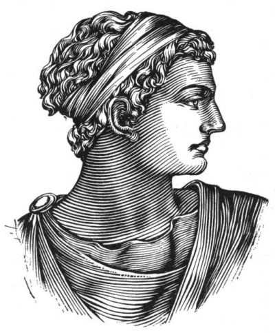

  
[Intangible Textual Heritage](../../index)  [Classics](../index.md) 
[Index](index)  [Previous](aph22)  [Next](aph24.md) 

------------------------------------------------------------------------

[Buy this Book at
Amazon.com](https://www.amazon.com/exec/obidos/ASIN/B000EP89M2/internetsacredte.md)

------------------------------------------------------------------------

  
*Aphrodite*, by Pierre Louys, \[1932\], at Intangible Textual Heritage

------------------------------------------------------------------------

p. 179

# BOOK FOUR

p. 180 p. 181

### Chapter One

### THE DREAM OF DEMETRIOS

NOW, having returned home with the mirror, the comb and the necklace,
Demetrios was visited by a dream, during his sleep; and this was the
dream:

 

He is going toward the jetty, among the crowd, through a strange night
without a moon, without stars, without clouds, which shines of itself.

Without his knowing why, nor what draws him, he is in haste to arrive,
to be *there* as soon as he can; but he walks with effort and the air
opposes an inexplicable resistance to his legs, as deep water might
hinder each step.

He trembles, he thinks that he will never arrive, that he will never
know toward whom he walks thus, panting and uneasy, through the luminous
obscurity.

At times the crowd disappears entirely, whether it be that it really
vanishes or that he ceases to feel its presence. Then it elbows him
afresh, more importunately, and all go, go, go, with a rapid and
sonorous step, forward, quicker than he . . .

Then the human mass closes in; Demetrios pales; a man pushes him with
his shoulder; a woman's brooch tears his tunic; a young girl, pressed by
the multitude, is so closely crowded against him

p. 182

that he senses the warmth of her skin, and she pushes away his face with
frightened hands.

Suddenly he is alone, the first, upon the jetty. And as he turns to look
back, he perceives in the distance a white swarm which is the whole
crowd, suddenly drawn back to the Agora.

And he understands that it will advance no farther.

 

The jetty extends before him with all the fascination of an unfinished
road which has undertaken the traverse of the sea.

He wishes to go to the Pharos, and he walks on. His legs have suddenly
become light. The wind which breathes over sandy wastes drags him
precipitately toward the undulating solitude into which the jetty
reaches. But as he advances, the Pharos recedes before him; the jetty
stretches out interminably. Soon. the high marble tower with its flaming
crimson pile touches the livid horizon, palpitates, lowers, diminishes,
and sets like another moon.

Demetrios still walks on.

Days and nights seem to have passed since he left in the distance the
great quay of Alexandria, and he dares not turn his head for fear of
seeing nothing more than the way already passed: a white line to the
infinite and the sea.

Nevertheless, he turns.

Behind him lies an island covered with great trees from which enormous
flowers droop.

Has he journeyed blindly, or did it rise at that very instant, becoming
mysteriously visible? He does not think of asking; he accepts the
impossible as a natural occurrence . . .

A woman is on the island. She stands before the door of the only house,
her eyes half closed and her face bending over the

p. 183

flower of a huge iris which grows to the height of her lips. She has
deep hair the color of dull gold and of a length which one might suppose
marvelous by the mass of the swollen knot which lies upon her drooping
neck. A black tunic covers this woman and a still blacker robe is draped
over the tunic, and the iris whose scent she inhales, closing her eyes,
is also tinted like the night.

On this apparel of mourning, Demetrios sees only the hair, like a golden
vase upon an ebony column. He recognizes Chrysis.

The memory of the mirror and of the comb and of the necklace returns to
him vaguely, but he does not believe in it, and in this singular dream
only the reality seems to him a dream . . .

"Come," she says. "Enter behind me."

He follows her. Slowly she ascends a staircase covered with white skins.
Her arm rests over the balustrade, her bare heels float under her skirt.

The house has but one story. Chrysis halts upon the last step. "There
are four rooms," she says. "When thou hast seen them, thou wilt never
again come forth. Wilt thou follow me? Darest thou?"

But he would follow her anywhere. She opens the first door and closes it
behind him.

The room is narrow and long. It is lighted by a single window which
frames the whole sea. To the right and to the left, two little tables
bear a dozen rolled volumes.

"Here are the books thou lovest," says Chrysis. "There are no others."

Demetrios opens them: they are the "Œneus" of Chæremon, the "Return" of
Alexis, the "Mirror of Lais" of Aristippos, the "Witch," the "Cyclops"
and the "Bucolics" of Theocritos, the

p. 184

\[paragraph continues\] "Œdipos at
Colonos," the "Odes" of Sappho and some other works. In the midst of
this ideal library, a young girl reclines, silent, upon some cushions.

"Now," murmurs Chrysis, drawing from a long golden case a manuscript of
a single leaf, "here is the page of antique verse which thou never
readest alone without weeping."

The young man reads at random:

«Οί μὲν ἄῤ ἐθρήνεον, ἐπὶ δὲ στενάχοντο γυναῖκες.  
Τῆσιν δ᾽ Ἀνδρομάχη λευκώλενος ἦρχε γόοιο,  
Εκτορος ἀνδροφόνοιο καρη μετά χερσιν ἔχουσα  
Ἀνερ, ἀπ᾽ αἰῶνος νέος ὤλερ, καδδέ με χήρην  
Αείπεις ἐν μεγάροισι: πάις δ᾽ ἔτι νήποις αὔτως,  
Ὂν τέκομεν σύ τ᾽ ἐγώ τε δυσάμμοροι. . . .»

He stops, casting at Chrysis a tender, surprised look. "Thou?" he says
to her, "thou showest me this?"

"Ah! thou hast not seen all. Follow me. Follow me, quickly!" They open
another door.

The second room is square. It is lighted by a single window which frames
all nature. In the center, a wooden stand bears a mass of red clay and
in the corner, on a curved chair, a young girl rests in silence.

"Here thou wilt model Andromeda, Zagreus, and the Horses of the Sun. As
thou wilt create them for thyself alone, thou wilt destroy them before
thy death."

"It is the House of Happiness," says Demetrios, under his breath.

And he rests his forehead in his hand.

But Chrysis opens another door.

p. 185

The third chamber is vast and round. It is lighted by a single window
which frames the whole blue sky. Its walls are bronze grilles,
reticulated in regular lozenges, through which steals the music of
flutes and citheri, played in a melancholy mode by invisible musicians.
And against the farthest wall, upon a throne of green marble, a young
girl sits in silence.

"Come! Come!" repeats Chrysis. They open another door. The fourth
chamber is low, somber, hermetically closed and of triangular form.
Heavy draperies and furs bedeck it so softly, from floor to ceiling,
that nudity does not astonish. When the door is closed, it is impossible
to tell where it is. There is no window. It is a tiny world, out of the
world. Here and there, hanging locks of black fir let tears of perfume
slip into the air. And this chamber is lighted by seven myrrhine panes
which color diversely the incomprehensible light of seven subterranean
lamps.

"Thou seest," the young woman explains, in a calm and affectionate
voice, "there are three different beds in the three corners of *our*
room . . ."

Demetrios makes no reply. And lee asks himself: "Is this indeed the end?
Is this truly the limit of human existence? Have I, then, traversed the
three other rooms but to stop in this one? And could I, could I leave it
if I sleep within it a whole night in the attitude which is the
outstretched posture of the tomb?"

But Chrysis speaks . . .

"Well-Beloved, thou hast commanded me, I have come. Look at me well . .
."

She raises her arms together, rests her hands upon her hair and, elbows
advanced, smiles. "Well-Beloved, I am thine . . . Oh, not so soon. I
promised thee to sing. I will sing first."

p. 186

And he thinks no more but of her as he lies down at her feet. She wears
little black sandals. Four threads of bluish pearls pass between the
slender toes whose every nail has been painted with a carmine crescent.

Her head inclined upon her shoulder, she strikes the palm of her left
hand with the finger tips of her right, slightly undulating her hips:

"*I sleep, but my heart waketh:  
 It is the voice of my beloved. that knocketh,  
 Saying, Open to me, my dove, my undefiled;  
 For my head is filled with dew,  
 And my locks with the drops of the night.  
 I opened to my beloved,  
 But my beloved had withdrawn himself,  
 And was gone.  
 My soul failed when he spake:  
 I sought him, but 1 could not find him;  
 I called him, but he gave me no answer.  
 I charge you, O ye daughters of Jerusalem,  
 If ye find my beloved,  
 That ye tell him that I am sick of love*. [1](#fn_0.md)

 

"Ah! It is the Song of Songs, Demetrios! It is the nuptial canticle of
the girls of my country.

"*The voice of my beloved!  
 Behold, he cometh,  
 Leaping upon the mountains,  
 Skipping upon the hills.  
 My beloved is like a roe or a young hart:  
 Behold! He standeth behind our wall;* p.
187  
 *He looketh forth at the windows,  
 Showing himself through the lattice.  
 My beloved spake, and said unto me,  
 Rise up, my love, my fair one, and come away.  
 For lo, the winter is past–  
 The rain is over and gone,  
 The flowers appear on the earth;  
 The time of the singing of the birds is come,  
 And the voice of the ring-dove is heard in our land.  
 The fig tree putteth forth her green figs,  
 And the vines, with the tender grape, give a good smell.  
 Arise, my love, my fair one, and come away.  
 O my dove, that art in the clefts of the rock,  
 In the secret places—  
 Let me see thy countenance,  
 Let me hear thy voice,  
 For sweet is thy voice, and thy countenance is comely.  
 Take us the foxes, the little foxes,  
 That spoil the vines:  
 For our vines have tender grapes.  
 My beloved is mine, and I am his:  
 He feedeth among the lilies.  
 Until the day break, and the shadows flee away,  
 Turn, my beloved,  
 And be thou like a roe or a young hart  
 Upon the mountains*." [2](#fn_1.md)

She throws her veil from her and stands in a narrow garment which clasps
her closely from knees to hips.

"*As the apple tree among the trees of the wood,  
 So is my beloved among the sons*. p. 188  
 *I sat down under his shadow with great delight,  
 And his fruit was sweet to my taste.  
 He brought me to the banqueting house,  
 And his banner over me was love.  
 —Thou hast ravished my heart, my spouse;  
 Thou hast ravished my heart with one of thine eyes,  
 With one chain of thy neck.  
 How much better is thy love than wine,  
 And the smell of thine ointments than all spices.  
 Thy lips drop as the honeycomb, O my spouse;  
 Honey and milk are under thy tongue,  
 And the smell of thy garments is like the smell of Lebanon.  
 A garden enclosed is my spouse,  
 A spring shut up,  
 A fountain sealed.  
 Thy plants are an orchard of pomegranates,  
 With pleasant fruits—Camphire, with spikenard,  
 And saffron; calamus and cinnamon,  
 With trees of frankincense, myrrh and aloes:  
 A fountain of gardens, a well of living waters,  
 And streams from Lebanon*." [3](#fn_2.md)

She throws back her head, closing her eyes.

"*Awake, O north wind; and come, thou south;  
 Blow upon my garden, that the spices thereof may flow out.  
 Let my beloved come into his garden,  
 And eat his pleasant fruits*." [4](#fn_3.md)

She curves her arms and offers her mouth.

"*I am my beloved's, and his desire is toward me.  
 Come, my beloved, let us go forth into the field*, p. 189  
 *Let us lodge in the villages.  
 Many waters cannot quench love, neither can the floods drown it:  
 If a man would give all the substance of his house for love, it would
utterly be contemned.  
 Thou that dwellest in the gardens,  
 The companions hearken to thy voice:  
 Cause me to hear it.  
 Make haste, my beloved,  
 And be thou like to a roe, or to a young hart,  
 Upon the mountains of spices*." [5](#fn_4.md)

Without moving her feet, without bending her closed knees, she slowly
turns her torso upon her motionless hips. Her face above her garments
seems like a great rosy flower in a vase of drapery.

She dances gravely, with her shoulders and her head and her beautiful
arms entwined. She seems to suffer in her encasements. Respiration
swells her bosom. Her mouth cannot close. Her eyelids cannot open. An
increasing fire reddens her cheeks.

Sometimes her ten fingers are interlaced before her face. Sometimes she
raises her arms, stretching deliciously. A long fugitive furrow
separates her raised shoulders. Finally, panting, covering her face with
her hair in a single quick gesture, as one rolls the wedding veil, she
stands silent in the center of the floor in all the mystery of her
grace.

 

Demetrios and Chrysis . . .

So harmonious, so immediately perfect, is their first embrace, that they
hold it, motionless, to taste to the full its many-faceted

p. 190

delight. Chrysis is crushed in the arms which embrace her so strongly.
Their lips cling in the glowing sweetness of a demanding affection that
will not be recklessly satisfied. Intoxicated with each other, their
very souls ache.

Nothing is observed so intimately as the face of a loved woman. Seen at
the excessive approach of the kiss Chrysis’s eyes seem enormous. When
she closes them, two parallel folds appear upon each lid and a uniformly
pallid tint extends from the brilliant eyebrows to the beginning of the
cheeks. When she opens them, a green ring, fine as a silken thread,
lightens with a corona of color the unfathomable black pupil which
enlarges beyond measure under the long, curved lashes. The little rosy
corner whence the tears flow has sudden palpitations.

This kiss will never finish. It seems as though it were not honey and
milk as is said in the Scripture, but something living, quick,
enchanted—more caressing than the hand, more expressive than the eyes, a
moving flower which Chrysis animates with all tenderness and all fancy.
. . . Caresses prolong and envelop. The tips of her fingers clasp him in
a network of ceaseless convulsive shudders. She is happy, but desire
terrifies her as though it were a suffering. She puts him aside with her
outstretched arms, her lips begging. Demetrios holds her by force.

No spectacle of nature—neither the flames of the western sun, nor the
tempest among the palms, nor thunder-bolts, nor mirage, nor the great
risings of the waters—seems worthy of astonishment to those who have
seen a woman transfigured in their arms. Chrysis’s eyes, lighted by
gratitude, gaze dizzily from the corners

p. 191

of the lids. Her cheeks are resplendent. Every muscular line is
admirable.

Demetrios contemplates, with a sort of religious fear, this power of the
goddess in the feminine nature, this transport of a whole being, this
superhuman ecstasy whose direct cause he is, which he exalts or
represses freely and which, for the thousandth time, confounds him.
Under his eyes, all the forces of life put forth effort and magnify
themselves to create. Already she seems to take on a maternal majesty.

 

------------------------------------------------------------------------

### Footnotes

[186:1](aph23.htm#fr_0.md) *Song of Solomon*, 5: 2,
6, 8.

[187:2](aph23.htm#fr_1.md) *Ibid*., 2: 8-17.

[188:3](aph23.htm#fr_2.md) *Ibid*., 2: 3-4; 3: 9-15.

[188:4](aph23.htm#fr_3.md) *Ibid*., 3: 16.

[189:5](aph23.htm#fr_4.md) *Ibid*., 7: 10-11; 8: 7,
13-14.

------------------------------------------------------------------------

[Next: Chapter Two. Terror](aph24.md)
