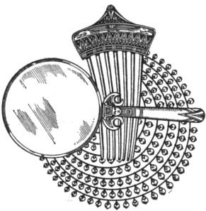

  
[Intangible Textual Heritage](../../index)  [Classics](../index) 
[Index](index)  [Previous](aph26)  [Next](aph28) 

------------------------------------------------------------------------

[Buy this Book at
Amazon.com](https://www.amazon.com/exec/obidos/ASIN/B000EP89M2/internetsacredte)

------------------------------------------------------------------------

  
*Aphrodite*, by Pierre Louys, \[1932\], at Intangible Textual Heritage

------------------------------------------------------------------------

p. 212

### Chapter Five

### THE GARDEN OF HERMANUBIS

CHRYSIS'S first movement was to shrug. She would not be so naïve as to
keep her oath!

The second was to go and see.

A growing curiosity impelled her toward the mysterious place where
Demetrios had hidden the three criminal spoils. She wished to take them,
touch them with her hand, make them shine in the sun, possess them an
instant. It seemed to her that victory would not be quite complete until
she had grasped the objects of her ambitions.

As for Demetrios, she would find a way to recapture him by some ulterior
maneuver. How could it be that he had detached himself from her forever?
The passion which she supposed in him was not of those which flicker out
without return in the heart of man. The women who have been much loved
form an elective household in the memory and a meeting with a former
mistress, even hated, even forgotten, awakens an insurmountable unquiet
whence a new love  may spring. Chrysis knew this. However ardent she
herself might be, however anxious to conquer this first man she had ever
loved, she was not mad enough to buy him at the price of her life when
she saw so many other ways of seducing him more simply.

p. 213

And yet . . . what a sublime end he had proposed for her!

Under the eyes of an innumerable crowd, to bear the antique mirror in
which Sappho had gazed, the comb which had gathered up the royal hair of
Nitocris, the necklace of sea pearls which had rolled in the shell of
the goddess Anadyomene . . . Then from the evening until morning to have
Demetrios with her, to know at last how the deepest love can make a
woman feel . . . and, toward the middle of the day, to die without
effort . . . What an incomparable destiny!

She closed her eyes . . .

 

But no; she would not let herself be tempted.

She ascended the street which led in a straight line across Rhacotis to
the Great Serapeion. This road, pierced by the Greeks, seemed somehow
incongruous in this quarter of angular alleys. The two populations
mingled grotesquely there, in a promiscuity still a little tinged with
hate. Among the Egyptians dressed in blue skirts, the unbleached tunics
of the Hellenes made splashes of white. Chrysis ascended rapidly,
without listening to the conversations where the people entertained each
other with the crimes committed for her.

Before the steps of the monument, she turned to the right, entered a
dark street, then another where the terraces of the houses nearly
touched, traversed a small star-shaped place where, near a spot of
sunlight, two very brown little girls were playing in a fountain, and
finally she stopped.

The garden of Hermes-Anubis was a little necropolis, abandoned long
since, a sort of forgotten territory where relatives no longer came
bringing libations to the dead, and which passers-by

p. 214

turned aside to avoid. In the midst of the crumbling tombs, Chrysis
advanced in the greatest silence, frightened by each stone which
crackled beneath her feet. The wind, always laden with fine sand, shook
the hair upon her temples and swelled out her veil of scarlet silk
toward the white leaves of the sycamores.

She discovered the statue between three funereal monuments which hid it
from all sides and enclosed it in a triangle. The place was well chosen
to bury a mortal secret.

Chrysis slipped as best she could into the narrow, stony passage. Seeing
the statue, she paled slightly.

The jackal-headed god was standing, the right leg advanced, the
head-dress falling and pierced with two holes whence issued the arms.
The head was bent from the height of the rigid body, following the
movement of the hands which made the gesture of the embalmer. The left
foot was detached.

With a slow and fearful look, Chrysis assured herself that she was quite
alone. A sound behind her made her shudder; but it was only a little
green lizard which disappeared into a fissure of the marble.

Then, at last, she dared lay hand upon the broken foot of the statue.
She raised it obliquely and not without some trouble, for it drew with
it a part of the hollowed socle which lay upon the pedestal. And
underneath the stone she beheld, suddenly, the gleam of the enormous
pearls.

She drew out the whole necklace. How heavy it was! she would not have
thought that pearls almost without settings would lie with such a weight
in the hand. The globes were all marvelously round and of an almost
lunar oriency. The seven strands succeeded each other, increasing like
ripples upon star-lit water.

p. 215

She laid it about her neck.

With one hand she arranged it, closing her eyes the better to feel the
cold of the pearls on her skin. She spaced the seven rows regularly
below her throat and let the last fall into the recess of her bosom.

Next she took the ivory comb, considered it for some time, caressed the
little white figure which was sculptured in the thin crown, and plunged
the jewel into her hair several times before fixing it as she wished.

Then she drew the silver mirror from the socle, looked into it and saw
there her triumph, her eyes illuminated with pride, her shoulders
adorned with the spoils of the gods . . .

And, enveloping herself even to the hair in her great scarlet cyclas,
she went out from the necropolis without putting off the terrible
jewels.

 

------------------------------------------------------------------------

[Next: Chapter Six. The Walls of Crimson](aph28)
