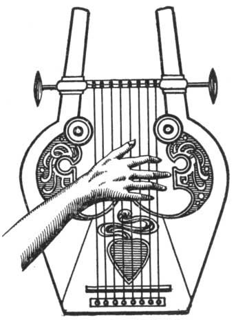

  
[Intangible Textual Heritage](../../index)  [Classics](../index.md) 
[Index](index)  [Previous](aph27)  [Next](aph29.md) 

------------------------------------------------------------------------

[Buy this Book at
Amazon.com](https://www.amazon.com/exec/obidos/ASIN/B000EP89M2/internetsacredte.md)

------------------------------------------------------------------------

  
*Aphrodite*, by Pierre Louys, \[1932\], at Intangible Textual Heritage

------------------------------------------------------------------------

p. 216

### Chapter Six

### THE WALLS OF CRIMSON

WHEN, from the mouths of the hierodules, the mob had learned for the
second time the certainty of the sacrilege, it flowed out slowly across
the gardens. The temple courtesans thronged by hundreds along the paths
of black olives. Some strewed ashes upon their heads. Others bowed their
foreheads into the dust or tore their hair or clutched their breasts, in
token of calamity. Many sobbed, their eyes hidden in their arms.

The crowd descended silently into the town, through the Drome and out
upon the quays. A universal mourning filled the streets with
consternation. The terrified shop-keepers had precipitately withdrawn
their many-colored wares, and wooden shutters fastened by bars succeeded
each other like a monotonous palisade along the ground floors of the
blind houses.

The life of the port was arrested. The sailors sat motionless upon the
stone parapets, their cheeks resting in their hands. The vessels ready
to depart had lifted their long oars and furled their pointed sails
along the masts which swayed in the wind. Those who wished to enter the
roadstead waited for signals in the offing and some of their passengers
who had relatives in the queen's palace, fearing a bloody revolution,
sacrificed to the gods of the underworld.

p. 217

At the corner of the island of the Pharos and of the jetty, Rhodis, in
the multitude, recognized Chrysis near leer.

"Ah! Chrysé! Protect me, I am afraid. Myrto is here, but the crowd is so
great . . . I am afraid they will separate us. Take our hands."

"Thou knowest," said Myrtocleia, "thou knowest what has happened? Do
they know the guilty one? Is he being tortured? Since Herostratos, no
one has seen anything like this. The Olympians abandon us. What will
become of us?"

Chrysis did not reply.

"We gave doves," said the little flute-player. "Will the goddess
remember that? The goddess is surely angry. And thou, and thou, my poor
Chrysé? Thou who wert to be, today, either very happy or very powerful .
. ."

"All is done," said the courtesan.

"What sayest thou!"

Chrysis took two steps backward and raised her right hand to her mouth.

"Look well, my Rhodis; look, Myrtocleia. What you will see, today, human
eyes have never seen since the day the goddess descended upon Ida. And
until the end of the world, it will never be seen again upon the earth."

The two friends recoiled in astonishment, believing her mad. But
Chrysis, lost in her dream, walked to the monstrous Pharos, the flaming
mountain of marble in eight hexagonal tiers. She pushed the bronze door
and, profiting by the public inattention, she closed it from the inside
by lowering the clanging bars.

Some moments passed.

p. 218

The crowd muttered continuously. The living surge added its rumble to
the regular beat of the waters.

Suddenly a cry arose, repeated by a hundred thousand throats.

"Aphrodite!!

—Aphrodite!!!"

A thunder of cries burst out. The joy, the enthusiasm of a whole people
sang in an indescribable tumult of gladness at the foot of the walls of
the Pharos.

The throng which covered the jetty swarmed violently into the island,
swept over the rocks, mounted upon the houses, on the signal masts, on
the fortified towers. The island was full, more than full, and the crowd
arrived, still more compact, like the sweep of a flooded river, throwing
back to the sea long human ranks from the height of the abrupt cliff.

The end of this inundation of men could not be seen. From the Palace of
the Ptolemies to the wall of the Canal, the banks of the Royal Gate,
from the Great Gate and from the Eunostos, vomited a serried mass fed
indefinitely by the tributary streets. Above this ocean, stirred by
immense eddies, foaming with arms and faces, the yellow-veiled litter of
the queen Berenice tossed like a bark in peril. And from moment to
moment, augmented by new mouths, the noise became formidable.

 

Neither Helen on the Skaian Gates, nor Phryne in the waters of Eleusis,
nor Thaïs inspiring the burning of Persepolis have known what triumph
is.

 

Chrysis had appeared through the door of the occident, upon the first
terrace of the red monument.

p. 219

She was nude like the goddess; she held in each hand a corner of her
scarlet veil which the wind tossed out against the evening sky, and with
her right hand the mirror reflecting the evening sun.

Slowly, with bowed head, moving with infinite grace and majesty, she
ascended the exterior slope which girdled like a spiral the tall scarlet
tower. Her veil flickered like a flame. The flaring twilight reddened
the pearl necklace like a rubescent river. She mounted, and in this
glory her dazzling skin bloomed forth in all the magnificence of flesh,
blood, fire, bluish carmine, velvety red, vivid rose, as, turning with
the great crimson walls, she ascended toward the heavens.

 

------------------------------------------------------------------------

[Next: Chapter One. The Supreme Night](aph29.md)
